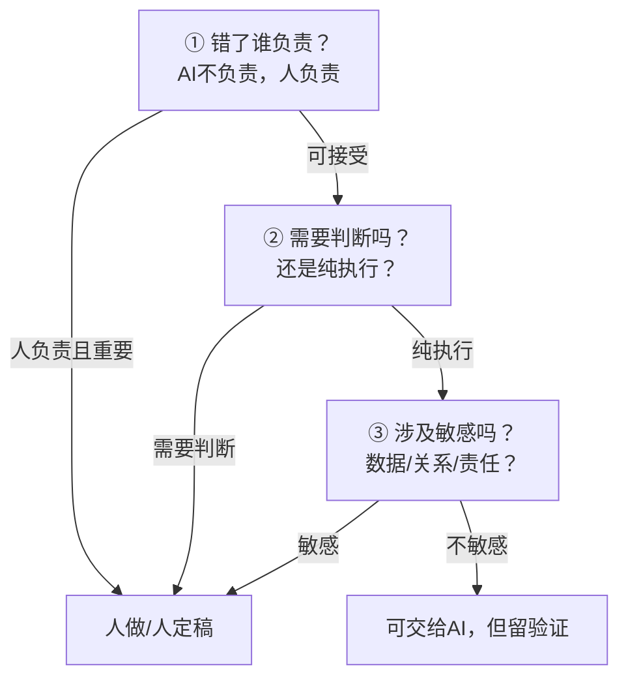
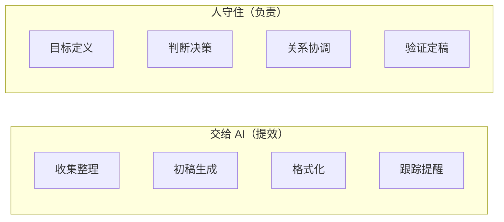

# 工作流重构的坑与边界

> [!abstract] 本文要练成的能力
> 避开工作流重构的常见坑，并知道**边界在哪**——什么该交给 AI、什么必须人做、什么时候该停。核心是：**重构不是"能自动化就自动化"，是"该自动化的自动化，该人做的守住"。**

---

## 一、重构的五大坑

| 坑 | 表现 | 后果 | 破解 |
|----|------|------|------|
| **过度自动化** | 什么都想交给 AI | 关键判断也交给 AI，出错 | 只自动化"执行"，守住"判断" |
| **全信 AI** | AI 输出直接采信 | 错误进交付物 | 每个 AI 输出都人验证 |
| **只重构不沉淀** | 重构完就完 | 下次重新来 | 沉淀成模板 |
| **忽略验证** | 省掉人验证环节 | 短期快，长期错 | 验证环节不能省 |
| **忽略数据边界** | 敏感数据喂 AI | 隐私合规风险 | 先过边界判断 |

> 一句话：**重构的坑，几乎都来自"把 AI 当万能 + 把验证当多余"。** 记住：AI 是"快"，人是"准"。

---

## 二、边界在哪：什么不该交给 AI

> 重构不是"能交给 AI 就交"，有些东西**必须人做**。

| 必须人做的 | 为什么 | 例子 |
|-----------|--------|------|
| **最终决策** | 要承担责任，AI 不负责 | 项目要不要砍、方案选哪个 |
| **价值判断** | 涉及价值观、立场 | 什么是对的、什么是好的 |
| **关系处理** | 涉及人、信任、情感 | 协调冲突、激励团队 |
| **责任归属** | 出问题要有人负责 | 对外承诺、法律文件 |
| **真实经验** | AI 没有真实经历 | 行业直觉、人情世故 |

> 一句话边界：**"要负责的、要判断的、要关系的、要经验的"——人守住；"要快的、要整理的、要初稿的"——交给 AI。**

---

## 三、判断边界的三问

> 遇到"要不要把 X 交给 AI"，过三问：



| 问 | 判断什么 | 结果 |
|----|---------|------|
| **① 错了谁负责** | 这个环节出错，后果谁承担 | 重要且人负责 → 人做 |
| **② 需要判断吗** | 是纯执行还是需要判断 | 需要判断 → 人做 |
| **③ 涉及敏感吗** | 数据/关系/责任敏感吗 | 敏感 → 人做/脱敏 |

> 一句话规则：**"错了人负责 + 需要判断 + 涉及敏感"的，守住；"纯执行 + 不敏感"的，交给 AI。**

---

## 四、边界判断模板（填完即用）

```
【环节】____
【① 错了谁负责】____（后果严重吗？谁承担？）
【② 需要判断吗】____（纯执行还是需要判断？）
【③ 涉及敏感吗】____（数据/关系/责任敏感吗？）
【边界结论】____（人做 / AI做+人验证 / 脱敏后AI做）
【验证点】____（如果交给 AI，人验证什么）
```

> [!warning] 深度洞察·坑
> 反例：重构时只盯着"快不快"，不看"边界在哪"。**最快的重构，可能是最危险的重构**——把该人做的判断也自动化了。边界判断不是"保守"，是"把 AI 用在刀刃上"。

---

## 五、避坑清单（重构前过一遍）

| 检查项 | 是否通过 |
|--------|---------|
| 我只自动化了"执行"，守住了"判断"？ | ☐ |
| 每个 AI 输出都有"人验证"环节？ | ☐ |
| 重构有效的新工作流沉淀成模板了？ | ☐ |
| 涉及敏感数据/关系的环节，过了边界判断？ | ☐ |
| 我知道"错了谁负责"？ | ☐ |

> 判断标准：**重构后，你应该是"更轻松地做判断"，不是"更轻松地不判断"。** 如果重构让你"不用思考了"，那大概率越界了。

---

## 六、重构的边界地图（一页记住）



> 记忆口诀：**"执行交给 AI，判断守住人；快是 AI 的，准是人的。"**

---

## 七、资源与练习

### 练什么（可自测）
- [ ] 用"边界三问"检查你最近一次重构的每个环节
- [ ] 找出 1 个"过度自动化"的环节，改回人做
- [ ] 用"避坑清单"过一遍你的重构

### 过关判据
> - [ ] 能说出五大坑，且知道怎么破
> - [ ] 能说出"什么必须人做"（决策/判断/关系/责任/经验）
> - [ ] 会用边界三问判断"要不要交给 AI"

---

## 练什么（可自测）

- 我的重构，有没有"过度自动化"？
- 我有没有把"该人做的判断"也交给 AI？
- 重构后，我是"更轻松地判断"还是"不用思考了"？

若达标，工作流重构库闭环完成。回到中枢看整体：[[05-产品与开发/AI时代工作流重构/00_MOC_AI时代工作流重构中枢]]

---

- 回到 [[05-产品与开发/AI时代工作流重构/00_MOC_AI时代工作流重构中枢]]
- 伦理边界（数据/责任）：[[05-产品与开发/个人AI使用边界与伦理自律/03_个人AI伦理决策框架]]
