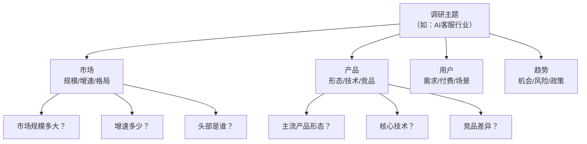
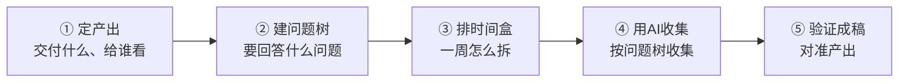

# 调研框架先行

> [!abstract] 本文要练成的能力
> 在收集任何信息之前，**先定调研框架**——用"问题树"明确要回答什么问题，用"产出定义"明确最终交付什么。核心是：**框架先行，才不会被信息淹没。**

---

## 一、为什么"框架先行"是调研成败的关键

| 不先定框架 | 先定框架 |
|-----------|---------|
| 收集一堆，用不上 | 收集的都是要的 |
| 不知道什么时候算"调研完" | 问题树答完就算完 |
| 产出跑偏，不是决策要的 | 产出对准决策需求 |
| 被信息淹没，越收越乱 | 有结构，越收越清晰 |

> 关键认知：**调研不是"收集信息"，是"回答问题"。** 先定义要回答的问题（问题树），收集才有方向，结束才有标准。

---

## 二、问题树：把调研主题拆成可回答的问题

### 问题树结构



> 问题树原则：**每个分支拆到"能直接回答"为止**（一个问题对应一个可查证的事实或判断），不要停留在"市场规模"这种大问题。

### 问题树模板（填完即用）

```
【调研主题】____
【分支1 市场】____
  问题1.1：____
  问题1.2：____
【分支2 产品】____
  问题2.1：____
  问题2.2：____
【分支3 用户】____
  问题3.1：____
  问题3.2：____
【分支4 趋势】____
  问题4.1：____
  问题4.2：____
```

---

## 三、产出定义：先想清楚"交付什么"

> 调研的产出不是"一堆笔记"，是**对准决策的结构化交付**。先定义产出，再倒推要收集什么。

| 产出类型 | 是什么 | 例子 |
|---------|--------|------|
| **决策建议** | 给一个明确判断/建议 | "该不该进入这个行业" |
| **行业全景** | 结构化描述行业 | 规模/格局/趋势/机会 |
| **竞品对比** | 多对象横向对比 | 头部玩家对比表 |
| **机会清单** | 可行动的机会点 | 3 个值得做的方向 |

### 产出定义模板（填完即用）

```
【最终交付物】____（简报/报告/决策建议？）
【读者是谁】____（给谁看，ta 要做什么决策）
【核心结论】____（调研完要能回答的 1-3 个判断）
【产出结构】____（简报的章节框架）
【不需要的】____（明确不调研什么，防跑偏）
```

> [!warning] 深度洞察·坑
> 反例：调研前不定义产出，收集完才发现"不是决策要的"。**产出定义要写"读者 + 核心结论 + 不需要的"**——明确"不需要什么"和"需要什么"同样重要，能防跑偏。

---

## 四、框架先行的顺序（不能反）



> 一句话规则：**先定"要什么"（产出），再定"问什么"（问题树），最后才"怎么收"（AI 收集）。** 顺序反了，就会收集一堆用不上的。

---

## 五、资源与练习

### 看什么
- 关键词：调研框架 / 问题树 / 金字塔原理
- 关键词：行业研究 方法 / 市场调研 框架

### 练什么（可自测）
- [ ] 为你的调研主题建一棵问题树（拆到能直接回答）
- [ ] 写产出定义（交付物 + 读者 + 核心结论 + 不需要的）
- [ ] 检查：问题树的每个问题，都能对应到产出结构吗？

### 过关判据
> - [ ] 有完整的问题树，每个分支拆到"能直接回答"
> - [ ] 有明确的产出定义（交付物 + 读者 + 核心结论）
> - [ ] 知道"不需要调研什么"，能防跑偏

---

## 练什么（可自测）

- 我的问题树，每个问题都能直接回答吗？
- 我的产出，对准了读者的决策需求吗？
- 我明确"不调研什么"了吗？

若达标，进入 AI 辅助分工：[[05-产品与开发/AI时代工作流重构/案例-行业调研/03_AI辅助调研：分工与正确姿势]]

---

- 回到 [[05-产品与开发/AI时代工作流重构/00_MOC_AI时代工作流重构中枢]]
- 需求定义方法：[[05-产品与开发/AI产品经理方法论/02_AI产品的需求定义：从「功能」到「能力」]]
