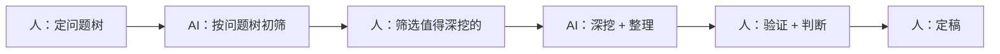

# AI辅助调研：分工与正确姿势

> [!abstract] 本文要练成的能力
> 用 AI 把一周调研提速，同时**不让 AI 的错误毁掉调研可信度**——明确"AI 做什么、人做什么"，知道 AI 会错在哪、怎么防。核心是：**AI 做初筛整理，人做判断验证。**

---

## 一、AI 在调研里的正确分工

| 环节 | AI 做什么 | 人做什么 |
|------|----------|---------|
| 定框架 | 帮生成问题树初稿 | 判断问题树对不对、补自己的问题 |
| 收集 | 初筛、汇总、整理信息 | 筛选、判断哪些值得深挖 |
| 分析 | 帮归纳、找模式、生成初稿 | 判断结论对不对、补行业经验 |
| 成稿 | 帮组织语言、生成简报初稿 | 校对、补自己的判断和案例 |

> 一句话分工：**AI 是"初筛 + 整理 + 初稿"，人是"判断 + 验证 + 定稿"。** AI 提效率，人保可信。

---

## 二、AI 会错在哪（必须知道的坑）

| AI 的坑 | 表现 | 后果 |
|---------|------|------|
| **幻觉** | 编造不存在的事实/数据/来源 | 调研结论不可信 |
| **信息过时** | 训练数据旧，不知道最新动态 | 结论落后 |
| **来源不可靠** | 引用不存在的链接/文章 | 无法核验 |
| **过度自信** | 语气笃定地说错 | 误导判断 |
| **同质化** | 给出泛泛的"正确废话" | 没洞察 |

> 关键认知：**AI 的坑不是"偶尔出错"，是"以笃定的语气出错"。** 所以调研里 AI 输出必须经过"人验证"环节，不能直接采信。

---

## 三、AI 调研的正确姿势（提示词 + 流程）

### 提示词模板（让 AI 干活更可靠）

```
【角色】你是一个行业调研助手。
【任务】帮我调研【主题】，按问题树逐项回答。
【要求】
  1. 区分"事实"和"推断"，事实给出来源，推断标明"推断"
  2. 不确定的信息明确说"不确定"，不要编造
  3. 数据给出来源和日期，标注是否可能过时
  4. 每个问题给"要点 + 来源 + 置信度"
【问题树】____
```

### 使用流程（人机配合）



> 流程原则：**每个 AI 输出，人都要过一道"验证"**（见 04）。AI 负责"快"，人负责"准"。

---

## 四、AI 调研的防坑清单

| 防坑动作 | 具体做法 |
|---------|---------|
| **要来源** | 让 AI 给出来源，不要裸结论 |
| **要置信度** | 让 AI 标"确定/不确定/推断" |
| **交叉验证** | 关键结论用多个来源/多种方式验证 |
| **问边界** | 问 AI"这个信息可能过时吗" |
| **不信笃定** | 语气越笃定越要验证 |

> [!warning] 深度洞察·坑
> 反例：把 AI 当"搜索引擎"，问一句拿答案就走。**AI 不是搜索引擎，是"会编的助手"。** 正确用法是"让 AI 给线索 + 来源，人去核验"，而不是"让 AI 给答案，人直接抄"。

---

## 五、资源与练习

### 看什么
- 关键词：AI 调研 / AI 幻觉 / 提示词工程
- 关键词：AI 辅助研究 / 信息检索

### 练什么（可自测）
- [ ] 用"提示词模板"让 AI 按问题树初筛一轮
- [ ] 对 AI 输出做一次"来源 + 置信度"检查
- [ ] 找出 1 个 AI 可能编造的结论，交叉验证

### 过关判据
> - [ ] 能说清 AI 在调研里的分工（AI 初筛，人判断）
> - [ ] 知道 AI 的 5 个坑，且会防（要来源/要置信度/交叉验证）
> - [ ] 不会把 AI 当搜索引擎直接采信答案

---

## 练什么（可自测）

- 我的 AI 用法，是"让 AI 给答案"还是"让 AI 给线索 + 来源"？
- 我验证过 AI 的关键结论吗？
- 我知道 AI 会"笃定地说错"吗？

若达标，进入信息验证：[[05-产品与开发/AI时代工作流重构/案例-行业调研/04_信息验证与来源管理]]

---

- 回到 [[05-产品与开发/AI时代工作流重构/00_MOC_AI时代工作流重构中枢]]
- 幻觉与兜底（产品视角）：[[05-产品与开发/AI产品经理学习路径/02-技术底座/04_幻觉、可信度与产品兜底]]
