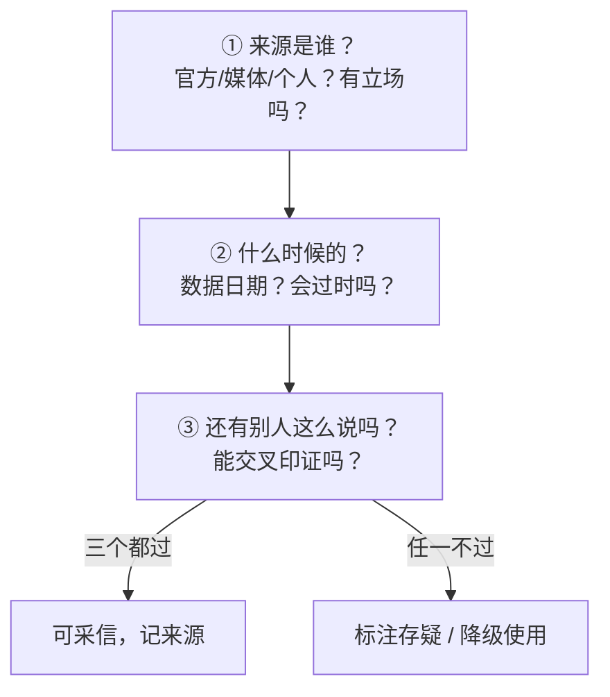

# 信息验证与来源管理

> [!abstract] 本文要练成的能力
> 让调研结论**经得起追问**——知道一条信息"凭什么可信"，会交叉验证、会评估来源、会防过时。核心是：**关键结论必须多源验证，来源必须可追溯、可回查。**

---

## 一、为什么必须验证（AI 时代的信源危机）

| 信源类型 | 可信度 | 风险 |
|---------|--------|------|
| AI 生成 | 低 | 幻觉、编造来源、笃定地说错 |
| 二手转述（自媒体/营销稿） | 中低 | 夸大、断章取义、过时 |
| 一手来源（官方/财报/研报原文） | 高 | 需判断立场与时效 |
| 多方交叉印证 | 高 | 仍有系统性偏差可能 |

> 关键认知：**调研里最危险的不是"没信息"，是"把不可信的信息当成可信"。** AI 时代信息泛滥，验证能力本身就是调研的核心竞争力。

---

## 二、信息验证三问（每条关键信息都过一遍）



| 验证问 | 具体做法 | 反例 |
|--------|---------|------|
| **来源是谁** | 查发布主体、查原始出处，警惕营销稿 | 把自媒体"行业白皮书"当权威数据 |
| **什么时候的** | 记数据日期，判断时效，AI 训练数据会过时 | 用 2023 年数据讲 2026 年市场 |
| **别人也这么说吗** | 关键结论至少 2-3 个独立来源印证 | 单一来源就下结论 |

> [!warning] 深度洞察·坑
> 反例：AI 说"据 XX 咨询报告，市场规模 500 亿"，你直接引用。**先问：这份报告存在吗？是哪一年的？** 很多 AI 引用的"权威来源"是编造的。验证动作是"回查来源是否存在"，不是"看 AI 说得像不像真的"。

---

## 三、来源管理：让每条结论可回查

### 来源记录模板（调研时随手记）

```
【结论】____
【来源】标题 + 发布方 + 链接
【日期】数据/发布年月
【类型】一手 / 二手 / AI生成
【置信度】高 / 中 / 低（附理由）
```

### 来源分级使用规则

| 结论重要性 | 最低来源要求 |
|-----------|-------------|
| 核心结论（写进简报的） | 至少 2 个独立来源 + 一手来源优先 |
| 支撑细节 | 至少 1 个可回查来源 |
| 背景铺垫 | 可标注"推断/待验证" |

> 一句话规则：**写进简报的每个数字，都要能回答"从哪来的、什么时候的、谁说的"。** 答不上来就不写，或明确标注存疑。

---

## 四、防过时与防幻觉清单

| 防坑动作 | 具体做法 |
|---------|---------|
| **查时效** | 数据标注日期，判断是否过时 |
| **回查来源** | 链接点开验证存在，不存在的删掉 |
| **交叉验证** | 关键结论 2-3 源印证，且来源相互独立 |
| **标置信度** | 每结论标"高/中/低"，低置信度不写进核心结论 |
| **留存疑** | 验证不了的，明确写"存疑"，不硬编 |

> 判断标准：**一条信息，你能说出"来源 + 日期 + 为什么信"，才算验证过。** 说不出，就降级为"待验证"。

---

## 五、资源与练习

### 看什么
- 关键词：信息素养 / 事实核查 / 信源评估
- 关键词：AI 幻觉 / 数据时效

### 练什么（可自测）
- [ ] 对 AI 给的 3 个"权威数据"，逐一回查来源是否存在
- [ ] 给 3 条结论标"来源 + 日期 + 置信度"
- [ ] 找 1 个过时数据，用最新来源替换

### 过关判据
> - [ ] 能说清验证三问（来源/时效/交叉印证）
> - [ ] 每条核心结论都能回查来源
> - [ ] 不会把"AI 说得笃定"当成"可信"

---

## 练什么（可自测）

- 我写进简报的数字，都能回答"从哪来、什么时候、谁说的"吗？
- 我验证过 AI 给的来源链接吗？
- 我知道哪些结论是"存疑"的？

若达标，进入简报模板：[[05-产品与开发/AI时代工作流重构/案例-行业调研/05_调研简报模板]]

---

- 回到 [[05-产品与开发/AI时代工作流重构/00_MOC_AI时代工作流重构中枢]]
- AI 分工与防坑：[[05-产品与开发/AI时代工作流重构/案例-行业调研/03_AI辅助调研：分工与正确姿势]]
