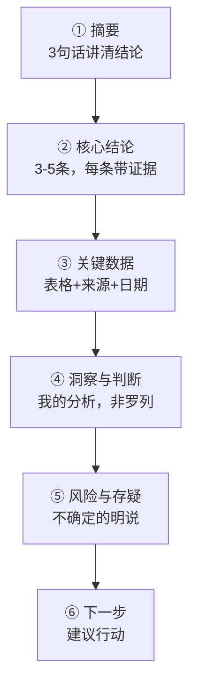

# 调研简报模板

> [!abstract] 本文要练成的能力
> 把一周调研结果**组织成一份能直接交付、经得起追问的简报**——结构清晰、结论有据、读者 3 分钟能抓住重点。核心是：**结论先行 + 证据支撑 + 存疑标注。**

---

## 一、简报结构总览（一页能讲清）



| 模块 | 作用 | 篇幅 |
|------|------|------|
| **摘要** | 读者只看这段也能懂 | 3 句话 |
| **核心结论** | 调研的答案，每条带证据 | 3-5 条 |
| **关键数据** | 支撑结论的数字表 | 1-2 张表 |
| **洞察与判断** | 我的分析，不是信息堆砌 | 1 段/结论 |
| **风险与存疑** | 可信度边界，主动交代 | 1 段 |
| **下一步** | 基于结论的行动建议 | 3 条 |

> 一句话规则：**简报是"给结论 + 给证据"，不是"给信息"。** 读者要的是"所以呢"，不是"我查了很多"。

---

## 二、简报模板（填完即用）

```
# 【行业/主题】调研简报

> 调研时间：____ | 调研人：____ | 数据截止：____

## 一、摘要
- 结论1：____
- 结论2：____
- 结论3：____

## 二、核心结论（每条带证据）
### 结论1：____
- 证据：____（来源 + 日期）
- 我的判断：____

## 三、关键数据表
| 指标 | 数据 | 来源 | 日期 | 置信度 |
|------|------|------|------|--------|
| ____ | ____ | ____ | ____ | ____ |

## 四、洞察与判断
- 数据背后说明什么：____
- 与直觉相反/值得注意的：____

## 五、风险与存疑
- 存疑项：____（为什么存疑）
- 时效风险：____

## 六、下一步建议
- [ ] ____
- [ ] ____
- [ ] ____
```

---

## 三、写好简报的三个关键

| 关键 | 做法 | 反例 |
|------|------|------|
| **结论先行** | 每段第一句给结论，再给证据 | 先铺一堆数据，最后才说结论 |
| **证据可查** | 每个数字带"来源 + 日期" | 裸数据，无法回查 |
| **存疑标注** | 不确定的明说，不硬编 | 把推断写成事实 |

> [!warning] 深度洞察·坑
> 反例：简报写"市场规模 500 亿，增长 30%"，没有来源、没有日期、没有置信度。**读者无法判断这数字是真是假。** 好的简报是"500 亿（XX咨询 2025 年报，高置信度）"，让读者能自己判断。

---

## 四、交付前自检清单

| 自检项 | 是否通过 |
|--------|---------|
| 摘要 3 句话能讲清结论？ | ☐ |
| 每条核心结论都有证据？ | ☐ |
| 每个数字都有来源 + 日期？ | ☐ |
| 存疑项都标注了吗？ | ☐ |
| 有"所以呢"的行动建议？ | ☐ |

> 判断标准：**把简报给一个不了解背景的人，他能 3 分钟看懂、且不追问"这数据哪来的"。** 做不到就回去补。

---

## 五、资源与练习

### 看什么
- 关键词：行业研究报告 / 咨询报告结构 / 一页纸报告

### 练什么（可自测）
- [ ] 用模板把一次调研整理成简报
- [ ] 把简报压缩成 3 句话摘要
- [ ] 找 1 个"无来源数据"，补上来源

### 过关判据
> - [ ] 能按模板 30 分钟出一份简报
> - [ ] 每个数字都能回查来源
> - [ ] 读者 3 分钟能抓住重点

---

## 练什么（可自测）

- 我的简报是"给结论"还是"给信息"？
- 每个数字都有来源和日期吗？
- 存疑项我主动交代了吗？

若达标，回到中枢复盘：[[05-产品与开发/AI时代工作流重构/00_MOC_AI时代工作流重构中枢]]

---

- 回到 [[05-产品与开发/AI时代工作流重构/00_MOC_AI时代工作流重构中枢]]
- 信息验证：[[05-产品与开发/AI时代工作流重构/案例-行业调研/04_信息验证与来源管理]]
