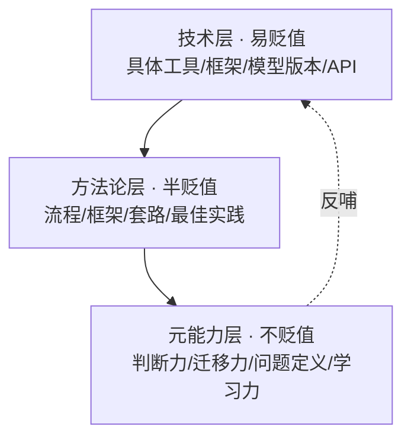
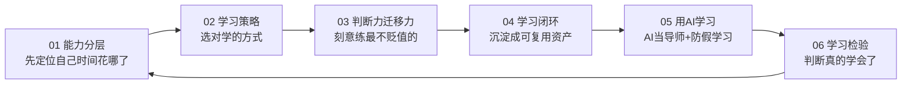
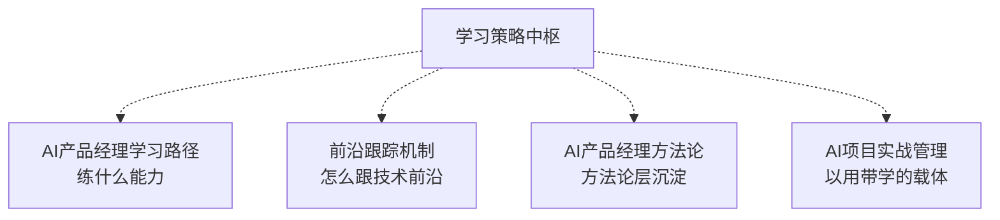

# AI时代的学习策略与能力底座中枢

> [!abstract] 知识库定位
> 回答**"AI 时代学什么不贬值、怎么学"**——技术迭代太快，追技术永远追不完（学了等于没学）。本库的核心判断是：**技术知识是"易贬值资产"，真正不贬值的是判断力、方法论、迁移能力等元能力**。"学的越慢，学的越快"不是反讽，而是策略——慢下来学底层不变的，快追表层易变的。
>
> 与 [[05-产品与开发/AI产品经理学习路径/00_MOC_AI产品经理学习路径中枢]]（讲"AI PM 怎么一步步练成"）互补：学习路径是"练什么能力"，本库是"**用什么策略学，让学习不贬值**"。

---

## 一、核心模型：能力分层（什么在贬值，什么不贬值）

> 把学习对象分成三层，判断"该花多少时间"。**时间花在越底层，回报越持久。**

| 层 | 例子 | 贬值速度 | 该花多少时间 |
|----|------|---------|-------------|
| 技术层 | 某个框架的 API、某个模型的最新版本、某个工具的操作 | 快（半年到一年就过时） | **少量**，够用即学，用时再查 |
| 方法论层 | 需求定义流程、评测驱动迭代、STAR 讲项目 | 慢（几年才变） | **中等**，学透并沉淀成模板 |
| 元能力层 | 判断"该不该用 AI"、把 A 场景经验迁移到 B 场景、定义真问题 | 几乎不贬值 | **大量**，刻意练习 |

> 一句话规则：**技术层"用时再学"，方法论层"学透沉淀"，元能力层"刻意练习"。**

---

## 二、文档导航

| 文档 | 核心问题 | 关键标签 |
|------|----------|----------|
| [[05-产品与开发/AI时代的学习策略与能力底座/01_能力分层模型：什么在贬值，什么不贬值]] | 我的学习时间到底花在哪层？怎么自测？ | #能力分层 #贬值 #时间分配 |
| [[05-产品与开发/AI时代的学习策略与能力底座/02_学习策略：慢学习法、以用带学、项目驱动]] | 具体怎么学才不贬值？ | #慢学习 #以用带学 #项目驱动 |
| [[05-产品与开发/AI时代的学习策略与能力底座/03_判断力与迁移能力的训练]] | 最不贬值的两种能力怎么练？ | #判断力 #迁移能力 #刻意练习 |
| [[05-产品与开发/AI时代的学习策略与能力底座/04_学习闭环与知识管理]] | 学到的怎么沉淀成"不贬值资产"？ | #学习闭环 #知识管理 #沉淀 |
| [[05-产品与开发/AI时代的学习策略与能力底座/05_用AI学习：AI导师、AI陪练与防假学习]] | 怎么用 AI 当学习伙伴，又不变成"假学习"？ | #AI学习 #AI导师 #防假学习 |
| [[05-产品与开发/AI时代的学习策略与能力底座/06_学习效果的检验：怎么判断真的学会了]] | 怎么判断"我真的学会了"？ | #学习检验 #费曼检验 #迁移检验 |

---

## 三、学习节奏（怎么用这个库）

> 建议顺序：先读 01 做一次"时间审计"（你的学习时间是不是都花在技术层了？），再按 02 调整策略，03 是长期刻意练习，04 是日常沉淀动作，05 是 AI 时代特有的学习方式（用 AI 当导师，但要防假学习），06 是检验标准（怎么判断真的学会了）。

---

## 四、与已有知识库的衔接

- **上游（学什么）**：[[05-产品与开发/AI产品经理学习路径/00_MOC_AI产品经理学习路径中枢]] 定义了"AI PM 要练哪些能力"，本库回答"用什么策略练、时间怎么分配"。
- **下游（怎么跟前沿）**：技术层"用时再学"不等于不跟前沿，跟法见 [[05-产品与开发/AI产品经理学习路径/05-进阶出口/02_前沿跟踪机制]]。
- **落地载体**：以用带学的最好载体是真实项目，见 [[05-产品与开发/AI项目实战管理/00_MOC_AI项目实战管理中枢]]。

---

## 五、我的学习时间审计（闭环）

> [!todo] 每周花 5 分钟自检
> - [ ] 本周学习时间：技术层 ____ 小时 / 方法论层 ____ 小时 / 元能力层 ____ 小时
> - [ ] 技术层占比是否过高？（>60% 说明在追易贬值资产）
> - [ ] 本周有没有"把学到的方法论沉淀成模板/清单"？
> - [ ] 本周有没有一次"跨场景迁移"或"边界判断"的刻意练习？

> 本轮水位：____ / 当前卡在哪：____ / 下一步练什么：____

---

## 版本历史

| 版本 | 日期 | 更新内容 |
|------|------|----------|
| v1.0 | 2026-08-23 | 初始中枢（能力分层 + 导航 + 时间审计） |
