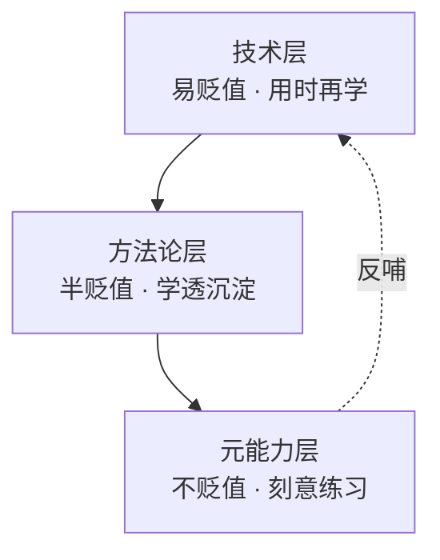

# 能力分层模型：什么在贬值，什么不贬值

> [!abstract] 本文要练成的能力
> 一眼看出"我学的这个东西会不会贬值"，并把学习时间从"追易贬值资产"挪到"建不贬值资产"。这是整个学习策略库的地基——**先分清学什么，再谈怎么学**。

---

## 一、为什么"学了等于没学"？

AI 时代学习焦虑的根源：**技术知识的半衰期极短**。今天学的框架，明天出替代品；今天背的 API，下个版本就改。于是出现"学了和没学一样"的挫败感。

> 关键认知：**不是学习没用，是学错了对象。** 把时间花在"易贬值资产"上，当然学了等于没学；花在"不贬值资产"上，越学越值钱。

---

## 二、三层能力模型

| 层 | 定义 | 具体例子 | 贬值速度 | 学习策略 |
|----|------|---------|---------|---------|
| **技术层** | 具体工具、框架、模型版本、API、操作 | 某个框架的写法、某模型最新能力、某工具的快捷键 | 快（半年~1年） | **用时再学**，够用即学，不提前囤 |
| **方法论层** | 可复用的流程、框架、套路、最佳实践 | 需求定义流程、评测驱动迭代、STAR 讲项目、时间盒管理 | 慢（几年） | **学透 + 沉淀成模板** |
| **元能力层** | 跨领域通用的底层能力 | 判断力（该不该用 AI）、迁移能力（A 场景经验搬到 B）、问题定义、学习力 | 几乎不贬值 | **刻意练习**，大量投入 |

### 三层的关系

> 技术层是"素材"，方法论层是"加工方式"，元能力层是"加工者"。**素材会过时，加工方式会更新，但加工者的能力永远值钱。**

---

## 三、自测：我的学习时间花在哪层？

> 用一周记录你的学习时间，按三层归类，算占比。**技术层 > 60% 就是危险信号**——你在追易贬值资产。

| 学习活动 | 属于哪层 | 我的每周时长 |
|---------|---------|------------|
| 刷某模型最新发布、追新框架教程 | 技术层 | ____ |
| 学某个工具的操作教程 | 技术层 | ____ |
| 学"需求怎么定义""评测怎么设计"这类方法论 | 方法论层 | ____ |
| 把学到的方法沉淀成模板/清单 | 方法论层 | ____ |
| 做"该不该用 AI"的判断练习 | 元能力层 | ____ |
| 把一个项目经验迁移到新场景 | 元能力层 | ____ |

**审计结果**：技术层 ____% / 方法论层 ____% / 元能力层 ____%

> [!warning] 深度洞察·坑
> 反例：每天刷 2 小时"最新 AI 资讯 + 新工具测评"，感觉在紧跟时代，其实全在技术层——资讯过时就归零。正确做法是**把资讯当"信号"而非"资产"**：扫一眼知道趋势，不投入学习时间；真正投入的是方法论和元能力。

---

## 四、三层各自的"正确投入法"

| 层 | 投入原则 | 具体动作 | 判断标准 |
|----|---------|---------|---------|
| 技术层 | 够用即学，用时再查 | 遇到具体任务才查文档/教程，学完即用 | 能不能解决当下任务 |
| 方法论层 | 学透 + 沉淀 | 学一个方法论，立刻改写成自己的模板，放进知识库 | 有没有产出可复用模板 |
| 元能力层 | 刻意练习 | 每周做边界判断/迁移练习，找真实案例练 | 有没有真实练习记录 |

> 一句话规则：**技术层"用时再学"，方法论层"学透沉淀"，元能力层"刻意练习"。**

---

## 五、为什么技术层贬值快（认知科学解释）

> 不是"感觉上"贬值快，是有认知科学依据的。理解原理，才能真的把时间挪走。

| 原理 | 解释 | 对学习的启示 |
|------|------|-------------|
| **记忆半衰期** | 记忆会随时间遗忘，不复习就衰减 | 技术细节不常用 → 忘得快 → 用时再查 |
| **技能半衰期** | 技能会因工具更新而过时 | 技术层技能绑定工具 → 工具换代就归零 |
| **迁移广度** | 越具体越难迁移，越抽象越能迁移 | 技术层最具体 → 迁移价值最低 |
| **生成效应** | 主动回忆比被动接收记得牢 | 元能力靠"做"练，不是靠"看"学 |

> 一句话：**技术层贬值快，是因为它"不常用 + 绑定工具 + 难迁移"；元能力不贬值，是因为它"常用 + 不绑定 + 可迁移"。** 理解了原理，就不会再为"追不上新技术"焦虑——那本来就是该贬值的。

---

## 六、怎么识别"元能力短板"

> 元能力不贬值，但很多人不知道自己的元能力短板在哪。用"任务卡壳点"来识别：

| 卡壳信号 | 对应的元能力短板 | 怎么补 |
|---------|----------------|--------|
| 遇到新问题不知道从哪下手 | 问题定义弱 | 练"把模糊问题拆成可回答的子问题" |
| 该不该用 AI 拿不准 | 判断力弱 | 练"边界判断"（见 03） |
| 换个场景就不会了 | 迁移能力弱 | 练"提炼本质 + 适配"（见 03） |
| 学完就忘，用不出来 | 学习力弱 | 练"学习闭环 + 检验"（见 04/06） |

> 识别方法：**记录你最近 3 次"卡壳"的任务，看卡在哪类能力上。** 卡壳点就是元能力短板，就是该投入的地方。

---

## 七、资源与练习

### 看什么
- 关键词：AI时代 学习策略 / 元能力 / 半衰期 知识
- 关键词：费曼学习法 / 刻意练习 / 迁移学习

### 练什么（可自测）
- [ ] 做一次一周"学习时间审计"，算出三层占比
- [ ] 如果技术层 > 60%，列出 3 个可以"用时再学"的项
- [ ] 选一个你最近学的方法论，改写成自己的模板

### 过关判据
> - [ ] 能说出三层模型，并给每层举 2 个自己的例子
> - [ ] 知道自己时间花在哪层，并明确要调整的一项
> - [ ] 能把"资讯"和"资产"分开，不再把刷资讯当学习

---

## 练什么（可自测）

- 我最近一周的学习，三层各占多少？合理吗？
- 我有没有把"刷资讯"误当成"学习"？
- 我最近沉淀过几个可复用的模板？

若达标，进入具体学法：[[05-产品与开发/AI时代的学习策略与能力底座/02_学习策略：慢学习法、以用带学、项目驱动]]

---

- 回到 [[05-产品与开发/AI时代的学习策略与能力底座/00_MOC_AI时代学习策略中枢]]
- 上游能力定义：[[05-产品与开发/AI产品经理学习路径/00_MOC_AI产品经理学习路径中枢]]
