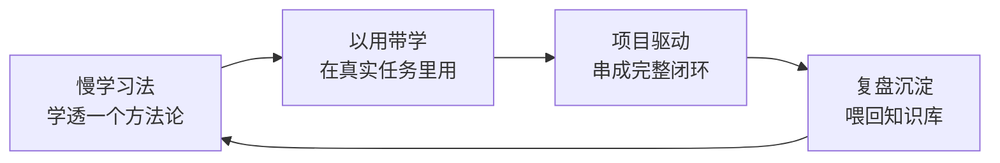

# 学习策略：慢学习法、以用带学、项目驱动

> [!abstract] 本文要练成的能力
> 把"怎么学"从"追着技术跑"改成"三种不贬值的学法"：**慢学习法**（学底层不变的）、**以用带学**（学完即用）、**项目驱动**（用真实项目当载体）。核心是让每次学习都产出"不贬值资产"。

---

## 一、"学的越慢，学的越快"到底在说什么

> 这不是让你故意慢，而是**调整学习对象和节奏**：
> - 追技术前沿 = 快，但学的都是易贬值资产，等于白学 → 感觉"学了和没学一样"
> - 学底层方法论和元能力 = 慢，但积累的是不贬值资产 → 越学越快，因为后面的新东西都能用旧框架快速理解

> 关键认知：**"慢"是慢在表层，"快"是快在底层。** 慢下来把方法论学透，新东西来了用旧框架套，反而学得快。

---

## 二、三种不贬值的学法

### 1. 慢学习法（学底层不变的）

| 要点 | 具体做法 | 反例 |
|------|---------|------|
| 选对对象 | 学"几年不变"的东西：判断框架、底层原理、方法论 | 学"下个月就过时"的工具细节 |
| 学透一层 | 一个方法论学透、能讲、能改写成自己的，再学下一个 | 浅尝辄止，学一堆半吊子 |
| 追根溯源 | 遇到新概念，问"它解决什么问题、本质是什么" | 只记名词，不问为什么 |

> 慢学习法的时间分配：**一个方法论至少投入"学 + 改写模板 + 用一次"三个动作**，才算学透。

### 2. 以用带学（学完即用）

| 要点 | 具体做法 | 反例 |
|------|---------|------|
| 带着问题学 | 先有真实任务/问题，再查资料解决 | 无目的地刷教程 |
| 学完即用 | 学到一个方法，立刻在真实场景用一次 | 学完存收藏夹，从不用 |
| 用后复盘 | 用完之后记录"哪里有效、哪里要改" | 用完就忘，不沉淀 |

> 以用带学的核心：**学习 = 解决真实问题的副产品**。没有真实问题驱动，学的东西留不住。

### 3. 项目驱动（用真实项目当载体）

| 要点 | 具体做法 | 反例 |
|------|---------|------|
| 项目当载体 | 用真实项目串起"学→做→测→反思" | 只学不做，纸上谈兵 |
| 闭环交付 | 项目做到"能用 + 有结果"，不半途而废 | 做一半就换新项目 |
| 复盘沉淀 | 项目结束沉淀方法论，喂回知识库 | 做完就丢，不提炼 |

> 项目驱动是"以用带学"的升级版：**以用带学是单点，项目驱动是闭环**。一个完整项目 = 一次完整的能力训练。

---

## 三、三种学法的组合节奏

> 一个方法论的标准流程：**慢学习法学透 → 以用带学用一次 → 项目驱动串成闭环 → 复盘沉淀成模板**。四个动作走完，这个方法论才真正属于你。

---

## 四、慢学习为什么有效（认知科学原理）

> "学的越慢，学的越快"不是鸡汤，有认知科学依据。理解原理，才能坚持慢下来。

| 原理 | 解释 | 为什么"慢"反而"快" |
|------|------|-------------------|
| **主动回忆** | 提取记忆比重读记得牢 | 慢学习逼你"回忆"而不是"重读" |
| **生成效应** | 自己生成的知识记得牢 | 慢学习逼你"改写模板"而不是"抄笔记" |
| **加工深度** | 理解越深记得越牢 | 慢学习逼你"追本质"而不是"记名词" |
| **间隔重复** | 分次复习比一次猛学有效 | 慢学习天然是"间隔"的，不是"突击"的 |

> 一句话：**"慢"不是效率低，是"加工深"——深加工的知识记得牢、能迁移、不贬值。** 快学的"浅加工"知识，过几天就忘，等于白学。这就是"学的越慢，学的越快"的真相。

---

## 五、时间分配建议（一周示例）

| 时间块 | 学什么 | 用哪种学法 |
|--------|--------|-----------|
| 每天 30 分钟 | 一个方法论（如"需求定义"） | 慢学习法 |
| 每周 2 小时 | 解决手头真实任务 | 以用带学 |
| 每月一个项目 | 完整做一个小项目 | 项目驱动 |
| 每周 30 分钟 | 复盘 + 沉淀模板 | 复盘沉淀 |

> 关键：**技术层资讯不占固定学习时间**，只在遇到任务时"用时再查"。

---

## 六、资源与练习

### 看什么
- 关键词：费曼学习法 / 刻意练习 / 项目式学习 PBL
- 关键词：知识半衰期 / 学习迁移

### 练什么（可自测）
- [ ] 选一个你最近想学的方法论，用"慢学习法"学透并改写成模板
- [ ] 找出一个手头真实任务，用"以用带学"解决并复盘
- [ ] 规划一个 1 个月能闭环的小项目，作为"项目驱动"载体

### 过关判据
> - [ ] 能说出三种学法各自的适用场景
> - [ ] 手头至少有一个"正在用项目驱动"的真实项目
> - [ ] 最近一次学习有"用 + 复盘"动作，不是只学不用

---

## 练什么（可自测）

- 我最近的学习，是"追技术"还是"学方法论"？
- 我有没有一个正在推进的真实项目当学习载体？
- 我学的东西，有多少沉淀成了可复用模板？

若达标，进入最不贬值能力的训练：[[05-产品与开发/AI时代的学习策略与能力底座/03_判断力与迁移能力的训练]]

---

- 回到 [[05-产品与开发/AI时代的学习策略与能力底座/00_MOC_AI时代学习策略中枢]]
- 项目驱动载体：[[05-产品与开发/AI项目实战管理/00_MOC_AI项目实战管理中枢]]
