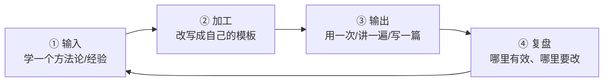

# 学习闭环与知识管理

> [!abstract] 本文要练成的能力
> 把"学到的"沉淀成"不贬值资产"——用**输入→加工→输出→复盘**的闭环，让每次学习都留下可复用的模板、清单、框架，而不是散落的笔记。核心是：**知识不沉淀，等于没学。**

---

## 一、学习闭环：输入→加工→输出→复盘



| 环节 | 做什么 | 产出物 | 不做会怎样 |
|------|--------|--------|-----------|
| ① 输入 | 学一个方法论/经验 | 理解 | 只输入不加工 = 收藏夹吃灰 |
| ② 加工 | 改写成自己的模板/清单/框架 | 可复用模板 | 只加工不输出 = 纸上谈兵 |
| ③ 输出 | 用一次、讲一遍、写一篇 | 真实应用/作品 | 只输出不复盘 = 重复犯错 |
| ④ 复盘 | 记录有效/无效、改进点 | 更新后的模板 | 不复盘 = 闭环断裂 |

> 关键认知：**学习的产出物不是"笔记"，是"可复用的模板/清单/框架"。** 笔记是过程，模板才是资产。

---

## 二、知识沉淀的三种形态

| 形态 | 是什么 | 例子 | 贬值速度 |
|------|--------|------|---------|
| **模板** | 填完即用的框架 | 需求定义模板、调研计划模板、复盘模板 | 慢，可复用 |
| **清单** | 检查项列表 | 面试检查清单、合规自查清单 | 慢，可复用 |
| **决策记录** | 当时怎么判断、为什么 | 项目决策记录 ADR | 慢，是判断力素材 |

> 沉淀原则：**每个方法论，至少沉淀成一种形态**（模板/清单/决策记录），放进知识库，下次直接复用。

---

## 三、知识库怎么组织（沉淀到哪）

> 用"主题库 + 中枢导航"组织，让沉淀的知识能被找到、被复用。

| 层级 | 是什么 | 例子 |
|------|--------|------|
| **主题库** | 按主题分库 | AI产品经理学习路径、AI项目实战管理 |
| **中枢 MOC** | 每个库的导航 + 主线 | 00_MOC_xxx中枢 |
| **内容文档** | 每篇一个主题，含模板 | 01_xxx.md |
| **模板/清单** | 填完即用的可复用资产 | 内嵌在内容文档中 |

> 沉淀动作：**学到一个方法论 → 写成一篇内容文档（含模板）→ 挂到对应中枢 → 交叉引用相关文档**。这样知识库越用越厚，且每篇都能被找到。

---

## 四、让沉淀能被找到、被复用

> 沉淀的最终目的不是"存起来"，是"**下次能找得到、用得上**"。存了找不到，等于没存。

### 检索三要素（每篇沉淀都要有）

| 要素 | 是什么 | 为什么重要 |
|------|--------|-----------|
| **清晰标题** | 标题说清"这篇讲什么" | 搜索时能命中 |
| **关键词标签** | 打上场景/主题标签 | 归类时能找到 |
| **一句话摘要** | 开头写"这篇解决什么问题" | 扫一眼知道要不要看 |

### 复用三动作（沉淀后要能用）

| 动作 | 具体做法 |
|------|---------|
| **挂中枢** | 挂到对应 MOC，导航能找到 |
| **交叉引用** | 和相关文档互相链接，顺藤摸瓜 |
| **定期回访** | 用的时候回访，更新过时的 |

> [!warning] 深度洞察·坑
> 反例：沉淀了一堆模板，但标题模糊、没有标签、没有摘要，下次想用根本找不到。**知识库的价值不在"存了多少"，在"能找到多少"。** 沉淀时花 1 分钟写"标题 + 标签 + 摘要"，下次能省 10 分钟找。

---

## 五、复盘：让闭环转起来

### 复盘模板（填完即用）

```
【这次学了/做了什么】____
【有效的地方】____（下次保留）
【无效/要改的地方】____（下次调整）
【沉淀】____（产出什么模板/清单，放哪）
【下一步】____（这个方法论还差哪个动作没走完）
```

> [!warning] 深度洞察·坑
> 反例：复盘只写"学到了很多""很有收获"这种空话。**复盘的价值在"可操作"**——必须写出"下次保留什么、改什么、沉淀什么"，否则复盘等于没做。

---

## 六、资源与练习

### 看什么
- 关键词：费曼学习法 / 知识管理 / 第二大脑
- 关键词：卡片笔记法 / 复盘方法论

### 练什么（可自测）
- [ ] 选一个最近学的方法论，走完"输入→加工→输出→复盘"四步
- [ ] 把它沉淀成一篇含模板的内容文档，挂到对应中枢
- [ ] 做一次真实复盘，写出"保留/改/沉淀"三项

### 过关判据
> - [ ] 最近一次学习有完整的四步闭环，不是只输入
> - [ ] 知识库里有我沉淀的可复用模板，且能被找到
> - [ ] 复盘能写出"保留/改/沉淀"，不是空话

---

## 练什么（可自测）

- 我最近学的东西，沉淀成模板了吗？还是散落成笔记？
- 我的知识库，能让我"找到上次的模板"吗？
- 我复盘时，能写出"下次改什么"吗？

若达标，学习策略库闭环完成。回到中枢看整体：[[05-产品与开发/AI时代的学习策略与能力底座/00_MOC_AI时代学习策略中枢]]

---

- 回到 [[05-产品与开发/AI时代的学习策略与能力底座/00_MOC_AI时代学习策略中枢]]
- 知识库组织参考：[[05-产品与开发/AI产品经理学习路径/00_MOC_AI产品经理学习路径中枢]]
