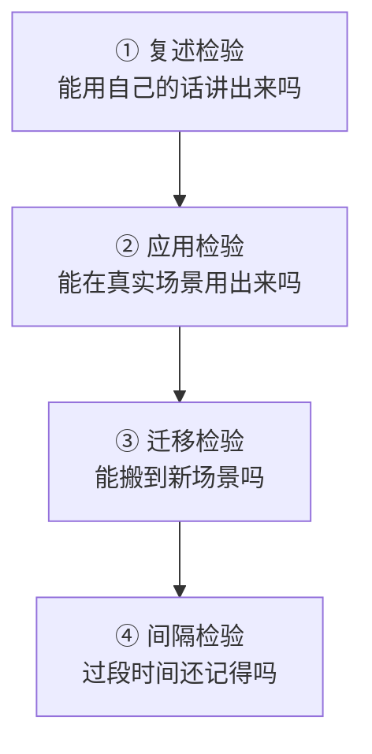
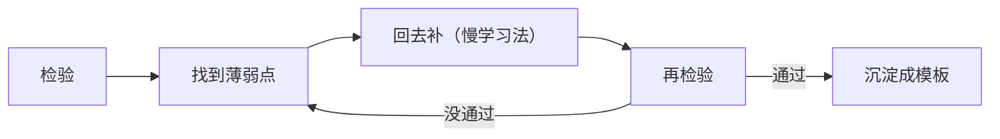

# 学习效果的检验：怎么判断真的学会了

> [!abstract] 本文要练成的能力
> 用**四种检验**判断"我真的学会了"——复述检验（能讲出来）、应用检验（能用出来）、迁移检验（能搬过去）、间隔检验（过段时间还记得）。核心是：**"以为会了"是学习最大的幻觉，检验是打破幻觉的唯一方法。**

---

## 一、为什么必须检验

> 学习最大的坑不是"没学"，是"**以为会了其实不会**"。AI 时代这个坑更大——AI 讲得顺，你"听懂了"，但那是 AI 懂，不是你懂。

| 状态 | 表现 | 真相 |
|------|------|------|
| 真会 | 能讲、能用、能迁移 | 知识内化了 |
| 假会 | 看着眼熟、听懂了 | 只是"见过"，没内化 |
| 不会 | 讲不出、用不了 | 需要补 |

> 关键认知：**"眼熟"不等于"会"。** 检验的作用，就是把"假会"揪出来，逼你补到"真会"。

---

## 二、四种检验方法

> 四种检验从"浅"到"深"，**检验越深，越能证明"真会"**。



| 检验 | 检验什么 | 怎么做 | 通过标准 |
|------|---------|--------|---------|
| **① 复述** | 是否理解 | 用自己的话讲一遍，不看书 | 能讲清"是什么、为什么、怎么用" |
| **② 应用** | 是否会做 | 在真实任务里用一次 | 能独立完成，不看教程 |
| **③ 迁移** | 是否掌握本质 | 搬到新场景，适配使用 | 能提炼本质，改造成新形态 |
| **④ 间隔** | 是否内化 | 过 1 周/1 月再复述、再用 | 还记得，且能用 |

> 一句话：**复述证明"懂"，应用证明"会"，迁移证明"透"，间隔证明"内化"。** 四关都过，才算真会。

---

## 三、四种检验的具体做法

### ① 复述检验（费曼检验）

```
【学的内容】____
【我的复述】____（用自己的话讲，不看资料）
【卡住的地方】____（讲不出来 = 没懂，回去补）
【AI 检查】____（让 AI 找漏洞，见 05 的 AI 考官）
```

> 复述检验的要点：**讲给"完全不懂的人"听**（或让 AI 当那个不懂的人），能讲明白 = 真懂；讲不明白 = 有漏洞。

### ② 应用检验

```
【学的内容】____
【真实任务】____（找一个真实场景用一次）
【独立完成】____（不看教程，能独立做吗）
【结果】____（做成了吗？哪里卡住）
```

> 应用检验的要点：**在真实任务里用，不看教程。** 卡住的地方，就是没学会的地方。

### ③ 迁移检验

```
【学的内容】____
【方法本质】____（它解决什么问题、核心机制）
【新场景】____（哪里也有同样的问题本质）
【适配】____（在新场景要改什么）
【验证】____（在新场景用了吗）
```

> 迁移检验的要点：**能提炼本质 + 搬到新场景 = 真掌握。** 只会"照搬原场景" = 只是记住了步骤，没懂本质。

### ④ 间隔检验

```
【学的内容】____
【1周后】____（还记得吗？能复述吗）
【1月后】____（还能用吗？）
【遗忘点】____（忘了什么 = 没内化，回去补）
```

> 间隔检验的要点：**学完过段时间再检验。** 忘了 = 没内化，需要间隔重复（1 天、1 周、1 月各复习一次）。

---

## 四、检验结果怎么处理

> 检验不是为了"打分"，是为了**找到薄弱点 → 回去补 → 再检验**。



| 检验结果 | 说明 | 处理 |
|---------|------|------|
| 四关都过 | 真会了 | 沉淀成模板，进知识库 |
| 复述不过 | 没理解 | 回去补概念，用 AI 导师 |
| 应用不过 | 不会做 | 回去练，用 AI 陪练 |
| 迁移不过 | 没懂本质 | 提炼本质，找新场景练 |
| 间隔忘了 | 没内化 | 间隔重复，定期复习 |

> 一句话：**检验的终点不是"通过"，是"知道差在哪，然后补上"。** 检验 → 补 → 再检验，才是完整的学习闭环。

---

## 五、检验清单（学完过一遍）

| 检验项 | 是否通过 |
|--------|---------|
| 我能用自己的话讲出来吗？（复述） | ☐ |
| 我能在真实任务里独立用出来吗？（应用） | ☐ |
| 我能把它搬到新场景吗？（迁移） | ☐ |
| 我过段时间还记得吗？（间隔） | ☐ |

> 判断标准：**四关都过 = 真会；只过前两关 = 会做但没透；一关都过不了 = 没学会，回去补。**

---

## 六、资源与练习

### 看什么
- 关键词：费曼学习法 / 主动回忆 / 间隔重复
- 关键词：学习科学 / 元认知 / 测试效应

### 练什么（可自测）
- [ ] 学完一个方法论，用"复述检验"讲一遍
- [ ] 找一个真实任务，用"应用检验"独立做一次
- [ ] 用"迁移检验"把方法搬到新场景，用"间隔检验"过段时间复查

### 过关判据
> - [ ] 知道四种检验，且能说出各自检验什么
> - [ ] 学完会用"复述 + 应用"检验自己
> - [ ] 检验后能找到薄弱点，并回去补

---

## 练什么（可自测）

- 我最近学的东西，过"复述检验"了吗？
- 我有没有"以为会了其实不会"的东西？
- 我检验后，会回去补吗？还是检验完就完？

若达标，学习策略库闭环完成。回到中枢看整体：[[05-产品与开发/AI时代的学习策略与能力底座/00_MOC_AI时代学习策略中枢]]

---

- 回到 [[05-产品与开发/AI时代的学习策略与能力底座/00_MOC_AI时代学习策略中枢]]
- 用 AI 检验（AI 考官）：[[05-产品与开发/AI时代的学习策略与能力底座/05_用AI学习：AI导师、AI陪练与防假学习]]
