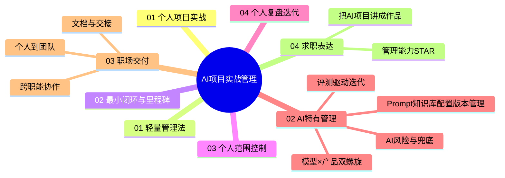
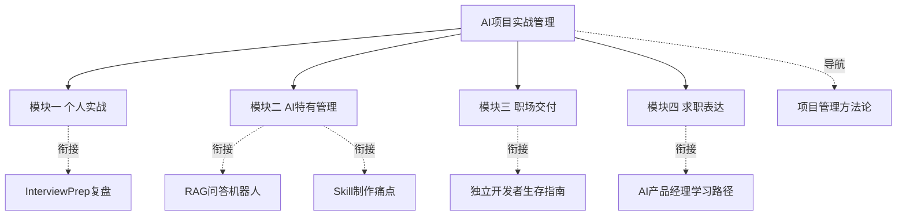

# AI项目实战管理中枢

> [!abstract] 知识库定位
> 这个知识库解决"**怎么把 AI 项目真正管完、管好**"。以**个体/小团队实战**为主轴，聚焦 AI 产品特有的管理问题，并把项目管理能力讲成求职/职场可交付的证据。
> 区别于 [[05-产品与开发/项目管理方法论/00_MOC_项目管理方法论中枢]]（通用理论），本库强调**操作/模板/案例**。

---

## 一、四大模块总览

### 模块导航

| 模块 | 文档 | 一句话 | 优先级 |
|------|------|--------|:---:|
| 01 | [[05-产品与开发/AI项目实战管理/01-个人项目实战篇/01_个人项目的轻量管理法]] | 一人怎么管完项目 | P0 |
| 01 | [[05-产品与开发/AI项目实战管理/01-个人项目实战篇/02_最小闭环与里程碑]] | 先转起来再管细节 | P0 |
| 01 | [[05-产品与开发/AI项目实战管理/01-个人项目实战篇/03_个人需求与范围控制]] | 遏制个人项目范围蔓延 | P0 |
| 01 | [[05-产品与开发/AI项目实战管理/01-个人项目实战篇/04_个人复盘与迭代]] | 让每个项目增值 | P0 |
| 02 | [[05-产品与开发/AI项目实战管理/02-AI特有管理篇/01_模型迭代×产品迭代：双螺旋怎么管]] | 两个节奏怎么协调 | P0 |
| 02 | [[05-产品与开发/AI项目实战管理/02-AI特有管理篇/02_评测驱动迭代]] | 用数据不是感觉 | P0 |
| 02 | [[05-产品与开发/AI项目实战管理/02-AI特有管理篇/03_Prompt-知识库-配置版本管理]] | 让AI资产可回退 | P0 |
| 02 | [[05-产品与开发/AI项目实战管理/02-AI特有管理篇/04_AI项目的风险与兜底管理]] | 预见AI项目风险 | P0 |
| 03 | [[05-产品与开发/AI项目实战管理/03-职场交付篇/01_从个人到团队：交付标准升级]] | 个人工具→团队工具 | P1 |
| 03 | [[05-产品与开发/AI项目实战管理/03-职场交付篇/02_跨职能协作与干系人表达]] | 和算法工程业务对齐 | P1 |
| 03 | [[05-产品与开发/AI项目实战管理/03-职场交付篇/03_用文档与交接让别人接得住]] | 防"只有我会" | P1 |
| 04 | [[05-产品与开发/AI项目实战管理/04-求职表达篇/01_项目管理能力面试框架]] | 把管理讲成交付 | P0 |
| 04 | [[05-产品与开发/AI项目实战管理/04-求职表达篇/02_个人AI项目讲成能交付的作品]] | 项目故事化 | P0 |

---

## 二、能力主线：看/练/判据（成体系主线）

> 全库不是四块并列的知识，而是一条**能力递进线**：先能一个人管完项目（模块一）→ 再会管 AI 特有的难题（模块二）→ 然后能交付给团队/职场（模块三）→ 最后讲成求职证据（模块四）。每层都要练成"能力"而非"知道概念"。

| 模块 | 要练成的能力 | 看什么（资源类型） | 练什么（可检验练习） | 怎么算会（判据） | 过关入口 |
|------|------------|------------------|--------------------|----------------|---------|
| **01 个人实战** | 一个人把项目从想法管到上线 | 独立开发者复盘、轻量任务管理、精益创业 | 给项目填"三件套"、画闭环线、建需求池 | 5分钟说清目标/里程碑/进度，能对功能做"做/缓/砍" | 进模块二 |
| **02 AI特有管理** | 管住模型×产品双节奏、用数据迭代 | AI产品评测、版本管理、风险案例 | 建评测集、做版本对齐表、写风险清单 | 每轮只改一处、AI资产可回退、风险有兜底 | 进模块三 |
| **03 职场交付** | 把个人工具升级成团队可用的资产 | 团队协作、文档规范、交接实践 | 做交付清单、写交接文档、练干系人表达 | 别人能接手你的项目、跨职能对齐无歧义 | 进模块四 |
| **04 求职表达** | 把管理能力讲成可量化的交付证据 | 面试方法论、STAR案例、作品集样本 | 写STAR模板、改项目故事、练追问答题 | 有完整STAR+项目故事+量化结果 | 长期复用 |

---

## 三、核心方法论速记

| 概念 | 一句话 | 出处 |
|------|--------|------|
| 轻量计划+周检 | 个人阶段不用复杂甘特图，靠里程碑+每周自检 | 模块一 |
| 最小闭环 | 先让"需求→AI→价值"闭环转起来，P0先行 | 模块一 |
| 双螺旋 | 模型迭代与产品迭代两个节奏要协调对齐 | 模块二 |
| 评测驱动 | 建评测集、每轮只改一处、用数据说话 | 模块二 |
| 版本管理 | Prompt/知识库/配置作为可回退资产 | 模块二 |
| 个人→团队三级跳 | 降门槛+留文档+定标准 | 模块三 |
| STAR讲项目 | 情境/任务/行动/结果，讲成可交付 | 模块四 |

---

## 四、与已有知识库衔接

---

## 五、进度追踪

> [!todo] 当前状态
> - [x] 模块一 个人项目实战（4篇，已按 D1-D4 深化重写）
> - [x] 模块二 AI特有管理（4篇）
> - [x] 模块三 职场交付（3篇）
> - [x] 模块四 求职表达（2篇）

---

## 版本历史

| 版本 | 日期 | 更新内容 |
|------|------|----------|
| v0.1 | 2026-08-20 | 初始中枢 |
| **v1.0** | 2026-08-20 | **深化：新增"能力主线：看/练/判据"总表；模块一 4 篇按 D1-D4 标准重写（填完即用模板+深度权衡+资源练习+达标判据）** |