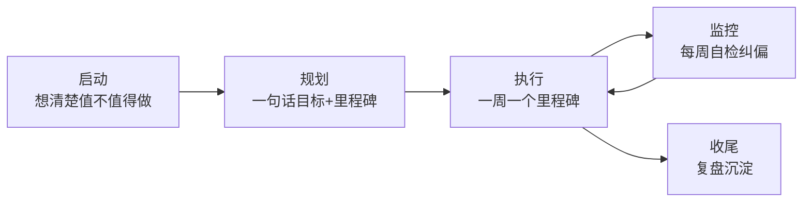

# 个人项目的轻量管理法：从想法到上线的节奏

> [!abstract] 本层要练成的能力
> 一个人做项目，**不需要也不应该用复杂的甘特图、站会、Sprint 看板**。个人项目真正的管理难题不是"工具"，而是"**没有外部约束时，怎么保持推进直至上线**"。本层要练成的能力是：**给任意一个想法，5 分钟内定出一套"一句话目标 + 里程碑 + 周自检"的极轻量推进机制，并靠它把项目管到上线。**
> 这是模块一的第一块基石：先有"推进节奏"，后面谈最小闭环、范围控制、复盘才有载体。

---

## 一、深度讲透：为什么"个人的管理"和"团队的管理"不一样

| 维度 | 团队项目 | 个人项目 |
|------|---------|---------|
| 进度约束 | 依赖他人，需对齐 | 只有自己，靠自律 |
| 会议 | 必须 | 不需要 |
| 工具 | 项目管理软件 | 极简清单/看板即可 |
| 最大风险 | 沟通/范围 | **半途而废/方向漂移** |

> 结论：个人项目管理的核心不是"管理"，而是"**维持推进动力 + 防止跑偏**"。

### 因为…所以…：为什么复杂工具在个人项目里必然失效

- **因为**团队用甘特图/看板是为了"对齐他人"，**所以**个人项目没有"他人"可对齐，工具就退化成"填表仪式"——装一堆工具却不用，比不装更消耗心力。
- **因为**个人项目的瓶颈是"注意力与意志力"，不是"信息同步"，**所以**任何需要"额外维护"的机制都会在两周内被放弃。机制越重，越坚持不下去。
- **因为**AI 项目的不确定性天然高（模型表现、成本、效果都要实测），**所以**计划做得越细，被推翻得越多，反而制造挫败感。

> [!warning] 反例坑：三种"伪管理"
> 1. **工具崇拜**：装 Notion/看板/甘特图，花一周搭结构，然后一次都没打开。工具是手段，不是管理本身。
> 2. **过度计划**：把"计划"当"推进"，花 80% 时间规划、20% 时间执行。个人项目的计划应该是"够用就停"。
> 3. **把烂尾归因于意志力**：以为"再自律一点就能坚持"，其实是没有机制。自律会耗尽，机制不会。

---

## 二、填完即用：个人项目轻量管理三件套模板

> 不用背复杂框架，复制下面模板，填完即可用。三件套 = **一句话目标 + 里程碑清单 + 每周自检**。

### 模板 1：一句话目标

```
这个项目做完，[谁] 的 [什么痛点] 被解决，产出 [什么]。
例（InterviewPrep）：让求职者提前知道自己会被问什么，并能针对性练习。
我的项目：____________________________________________________
```

> 一句话目标的作用是"纠偏锚点"：任何时候觉得跑偏，回来读一遍这句话。

### 模板 2：里程碑清单（代替甘特图，4-6 个可验收节点）

```
M1 [需求与闭环确定] → 产出：一页产品定义
M2 [MVP 跑通闭环]   → 产出：最小可用版本
M3 [核心功能完整]   → 产出：可演示/可用
M4 [上线与首批反馈] → 产出：真实用户 + 数据
```
> 规则：每个里程碑必须是"**完成的成果物**"，不是"在做 XXX"。写不出来成果物，说明这个里程碑还没想清楚。

### 模板 3：每周 15 分钟自检卡

```
本周完成了哪个里程碑？：________
有没有跑偏（对照一句话目标）？：________
下周的一个小目标是什么？：________
本周卡住我的一个点是什么？：________
```

> [!tip] 为什么是"15 分钟"而不是"1 小时"
> 因为**因为**频率比时长重要：每周一次雷打不动，胜过每月一次长篇大论。15 分钟刚好够"回顾+纠偏+定下周"，再长就会变成负担而中断。

---

## 三、个人版"生命周期"（对应方法论四大过程组）



> 个人版的关键差异在第④步监控：**没有别人盯你，周自检就是你的螺丝**。团队靠会议对齐，个人靠自检纠偏。

---

## 四、看什么（D4 资源）

| 资源类型 | 具体看什么 | 搜索关键词 |
|---------|-----------|-----------|
| 独立开发者复盘 | 看别人"从想法到上线"的真实节奏，学他们怎么设里程碑 | 独立开发者 复盘 / 从0到1 上线 |
| 轻量任务管理 | GTD / 个人看板方法论，理解"清空大脑"的原理 | GTD 方法论 / 个人看板 |
| 个人 OKR | 用"目标-关键结果"给个人项目定方向 | 个人 OKR 模板 |
| 你的存量项目 | 复盘 InterviewPrep / Skill四连发当时是怎么推进的 | -- |

---

## 五、练什么（D4 练习，可自测）

1. **三件套填空**：用上面的模板，给 InterviewPrep（或一个新想法）填一遍"一句话目标 + 4 个里程碑 + 本周自检卡"。
2. **纠偏演练**：假设项目做到一半，你冒出"加一个社区功能"的念头，用一句话目标判断该不该加（对照 [[05-产品与开发/AI项目实战管理/01-个人项目实战篇/03_个人需求与范围控制]]）。
3. **节奏审计**：回顾你最近一个项目，找出它"烂尾/拖延"是因为缺三件套里的哪一件。

---

## 六、怎么算会（D3 判据）

- [ ] 能 5 分钟说清：这个项目的一句话目标 + 当前里程碑 + 本周进度
- [ ] 能说出个人管理与团队管理的 3 处本质差异，并解释"为什么复杂工具会失效"
- [ ] 连续 3 周执行"每周 15 分钟自检"，且每周都有明确的下周小目标

> 达标后进入下一层：[[05-产品与开发/AI项目实战管理/01-个人项目实战篇/02_最小闭环与里程碑]]（先转起来，再谈闭环）。
> 回到 [[05-产品与开发/AI项目实战管理/00_MOC_AI项目实战管理中枢]]
