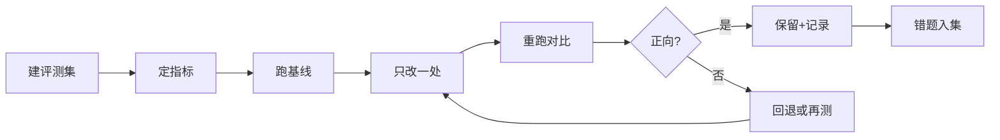

# 评测驱动迭代：用数据而不是感觉

> [!abstract] 一句话解决
> AI 产品迭代最容易"凭感觉"——"好像回答更准了"、"感觉这个 Prompt 更好了"。但感觉不可复用、不可对比、不可解释。本文给出**建立评测集 + 选对指标 + 每轮只改一处的棘轮式迭代**，让你的每次改动都有可回退、可复现的数据证据。

---

## 一、为什么 AI 迭代必须"用数据说话"

### 1.1 三个反例，都是"感觉"害的

- ❌ **直觉优化**："感觉新 Prompt 更好" → 上线后用户说变差了，但说不清差在哪。
- ❌ **反复横跳**：这周换一个模型觉得好，下周又换回，因为没有衡量，来回打转。
- ❌ **一改改一堆**：同时改了 Prompt + 检索阈值 + 换模型，出了问题根本不知道是哪一处导致的（变量混淆）。

> 核心认知：**AI 输出的质量是概率性的，单个样例的"好"无法代表整体。** 只有固定一批样例、固定指标、逐轮对比，才能把"玄学"变成"科学"。

### 1.2 "评测集"能回答的三个问题

```
改了 A 之后，结果到底变好还是变差？→ 对比同一评测集的得分
变好/变差体现在哪里？           → 分维度指标看，而非总分
下次要不要保留这个改动？        → 变量是否正向 + 记录与否
```

---

## 二、怎么建评测集（核心）

> 评测集 = **固定的输入样例 + 期望/参考答案**。它是完善项目的"错题本"，越大越稳，但起步不必大。

### 2.1 三个来源

| 来源 | 说明 | 例子（知微RAG） |
|------|------|----------------|
| 真实问题 | 线上/用户问过的题，最有价值 | 用户真实提问截图入库 |
| 错题集 | 回答错/不理想的题目，是增长点 | "引用张冠李戴"类问题 |
| 边界题 | 故意设计的刁钻/空值/GAR问题 | "只有一句话的问题、无答案问题" |

### 2.2 起步规模建议

> 不必一上来几十上百条。**30~60 条、分到几个场景，就够开始。** 关键不是多，而是**固定、可复跑**。

### 2.3 一个重要工具：错题集驱动扩充

> 每次迭代后，把"仍出错的题目"沉淀进评测集。这正是你在知微 RAG 机器人"周复盘 + 错题集"的底层逻辑——**错题不是负面，是被评测集捕获、可被下一次迭代消除的东西**。系统化后就从"随手记录"变成"正式评测资产"。

---

## 三、评什么指标（分类 + 取舍）

> 指标不是越多越好，分成"结果质量"和"内部过程"两层，各选 1~3 个可解释的。

### 3.1 结果质量层（用户在意的）

| 指标 | 定义 | 适用 |
|------|------|------|
| 准确率/正确率 | 回答与期望一致的比例 | 有标准答案的问答 |
| 覆盖率/命中率 | 该给出的关键点是否给出 | 结构化/摘要类 |
| 相关度/相关性评分 | 是否切题（主观打分） | 开放问答 |
| 引用准确率 | RAG引用出处是否正确 | RAG 专用（防张冠李戴） |

### 3.2 内部过程层（帮定位问题）

| 指标 | 定义 |
|------|------|
| 检索命中率 | top_k 里有没有正确文档 |
| 检索排序质量 | 正确文档是否排在前列 |
| 生成忠实度 | 生成有没有脱离检索内容胡编 |
| 成本/延迟 | 每次调用的 token 与耗时 |

> 取舍原则：**结果层用来判断"好不好"，过程层用来判断"为什么"。** 都不要多，挑最能解释"下一步怎么改"的。

---

## 四、棘轮式迭代：每轮只改一处

> 来自"棘轮"机制：**只前进、不后退打转，每步验证方向后再加深。**

| 原则 | 做法 |
|------|------|
| 一次一动 | 一轮只改一个变量（Prompt / 阈值 / 模型等） |
| 先验证方向 | 先小改看方向对否，再加大力度 |
| 固定评测集 | 跑同一批题，保证横向可比 |
| 记录结果 | 每轮结果入表，可回退可对比 |

> 典型错误是一轮改三处——**改好了不知道谁的功劳，改差了不知道谁的锅。** 一次一动，让因果清晰。

---

## 五、评测记录表（模板，每轮一行）

> 每轮迭代填一行，形成完整的迭代史，既能横向比较，又能支撑版本管理。

| 列项 | 说明 | 示例 |
|------|------|------|
| 迭代轮次/日期 | 第几轮 + 日期 | R7 / 2026-08-20 |
| 改动内容 | 这一轮只改了啥 | Prompt v6→v7 |
| 评测集 | 用哪套固定集（版本） | 错题集 v3 |
| 各项得分 | 结果层关键指标 | 准确82% / 引用91% |
| 过程指标 | 检索/成本 | 命中88% / tok 1.1k |
| 对比基线 | 和上一轮比 | 准确 +4%，引用 -2% |
| 结论/是否保留 | 判断 | 保留，引用待查 |
| 备注/下一轮 | 记录线索 | 下一轮调引用阈值 |

> 使用要点：**结论列务必写明"是否保留 + 为什么"**，这既给下一轮指示，也是后续版本管理（第3篇）的输入。

---

## 六、完整工作流（可执行）

```
1. 建评测集（真实题+错题+边界题，30+条，固定）
2. 定指标（结果层2~3个 + 过程层1~2个）
3. 跑当前基线 → 记录一列分数
4. 本轮只改一处（一变量）
5. 重跑同一评测集 → 填评测记录表
6. 对比基线定去留：正向保留/负向回退/不明再测
7. 把仍错的题加进错题集 → 扩充评测集
8. 周复盘时看趋势：整体是否单调向上？有无反复横跳？
```

> 可视化节奏：


---

## 七、实战案例：知微 RAG 机器人周复盘

> 结合"周复盘 + 错题集"的抽象示例，可对照你的真实操作改写：

```
R6 只改 §评分Prompt：
  评测集：错题集 v3（52条，含12条政策条款题）
  结果：准确78%→81%（+3） 引用86%→84%（-2）
  结论：准确提升但引用下滑，方向部分正向，保留，引用待查。
  →下一轮R7：单改"检索重排阈值"验证引用。

R7 只改 检索阈值：
  评测集：同一错题集 v3
  结果：准确持平 引用84%→91%（+7）
  结论：正向，保留，建模为基线。
  →错题集补充2条例外题，升为v4。
```

> 结果：每轮因果清晰，改动可回退，整体单调向上——这就是"评测驱动迭代"的威力。它和言辞中的"周复盘机制"是同一套逻辑的正式化。

---

## 八、行动清单

- [ ] 从真实问题+错题+边界题建立 30+ 条的固定评测集
- [ ] 选定 2~3 个结果层 + 1~2 个过程层指标
- [ ] 坚持"一轮只改一处"，重跑同一评测集并填表
- [ ] 每轮记录"是否保留+原因"，错题入集扩充评测集
- [ ] 周复盘看趋势，防反复横跳，沉淀迭代基线

---

- 下一步：[[05-产品与开发/AI项目实战管理/02-AI特有管理篇/03_Prompt-知识库-配置版本管理]]
- 回到 [[05-产品与开发/AI项目实战管理/00_MOC_AI项目实战管理中枢]]