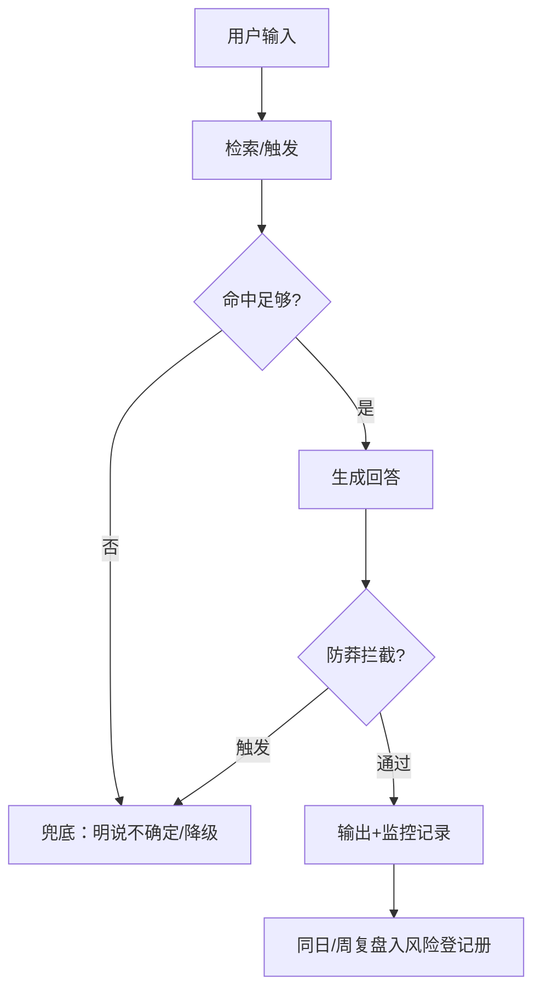

# AI 项目的风险与兜底管理：预见 AI 特有的失控点

> [!abstract] 一句话解决
> AI 项目不只承受传统项目的进度/范围风险，还叠加四类 AI 特有风险：**幻觉、检索不准、评测偏差、成本失控**。这些风险"平时看不见、爆发很致命"。本文给出一张可用的**风险登记册 + 分级应对策略 + 兜底设计**，让 AI 产品"即使出错也不至于崩"。

---

## 一、为什么 AI 风险管理"不一样"

| 维度 | 传统风险 | AI 特有风险 |
|------|---------|------------|
| 触发点 | 明确可枚举 | 概率性、依赖输入与模型 |
| 可见性 | 往往可预见 | 平时隐形，爆发突然 |
| 根因 | 人/流程 | 模型行为 + 数据 + 评测 |
| 兜底 | 流程修复/回滚 | 需"降级、兜底答案、边界处理" |

> 核心认知：**传统项目防"做错"，AI 项目要防"输错且不自知"。** 所以兜底设计不止是"回滚"，而是"让错误可被拦截、被兜住、被解释"。

---

## 二、四类 AI 特有风险详解

### 2.1 幻觉（模型胡编）

- 表现：回答流畅但内容不实、无出处
- 根因：模型能力边界 / 知识库缺答 / 生成忠实度不足
- 兜底：**约束引用来源、加"不确定就明说"指令、对高价值问题强制检索后回答**

### 2.2 检索不准（RAG 命中失败）

- 表现：答非所问、引用张冠李戴、信息碎片化
- 根因：切片策略 / 嵌入模型 / 阈值设定不匹配
- 兜底：**检索命中率监控（见评测驱动篇）、子任务模型分流、阈值可调**

### 2.3 评测偏差（用错指标的空转）

- 表现：得分高但真实体验差 / 评测无法反映真实需求
- 根因：评测集失真、指标单一、样例过少
- 兜底：**评测集源真实化 + 多维度指标 + 人工抽查兜底（人机结合）**

### 2.4 成本失控（token/调用失控）

- 表现：账单远超预期、跑量成本不可持续
- 根因：长上下文滥用、无预算上限、重模型全量使用
- 兜底：**设置调用上限/预算告警、轻重模型分流、缓存复用、降级到便宜模型**

---

## 三、风险登记册（模板）

> 一张表管理所有 AI 特有风险。与传统风险登记册同构，但每类风险多记"兜底方案"。

| 风险名称 | 触发场景 | 影响 | 概率 | 严重度 | 优先级 | 缓解/兜底 | 状态 |
|---------|---------|------|:---:|:---:|:---:|----------|------|
| 幻觉-政策条款 | 知识库无答案时胡编 | 误导用户 | 中 | 高 | P0 | 强制引用+不确定明说 | 缓解中 |
| 检索不准-出处错误 | 多源文档冲突 | 引用张冠李戴 | 中 | 高 | P0 | 命中率监控+分流 | 待办 |
| 评测偏差 | 评测集偏离真实 | 优化空转 | 低 | 中 | P1 | 评测集真实化+人工抽查 | 待办 |
| 成本失控 | 长文档全量入上下文 | 账单超支 | 高 | 中 | P0 | 上限告警+模型分流 | 缓解中 |

> 用法：
> - 概率 × 严重度 = 优先级，先处理 P0。
> - **每类风险必须有一栏兜底**——没有兜底的风险，等于"赌它不爆"。
> - 状态随时间演化，周复盘时检一遍。

---

## 四、分级应对策略（兜底设计）

> 不追求"零风险"（AI 做不到），而追求"每类风险都有可落地的兜底层"。

| 分级 | 策略 | 例子 |
|------|------|------|
| 拦截层 | 输出前过滤/校验 | 强制引用来源、格式校验、越权词拦截 |
| 降级层 | 出问题时退到低成本/低风险路径 | 检索失败回退到通用答案、语气降级 |
| 兜底层 | 明确"不知道"也不制造错误 | 标"该问题超出知识范围"、给人工入口 |
| 观测层 | 用评测/监控捕捉隐患 | 命中率、幻觉频度告警，错题入错题集 |
| 回退层 | 有问题快速恢复旧版 | 复用第3篇版本回退机制 |

> 设计原则：**兜底不是"事后补"，而是"产品设计时就内置降级路径"。** 例如 RAG 在检索无结果时，不给 "假装答案"，而是明说"我没检索到，请换个问法"。

---

## 五、一个可执行的预估流程图



> 关键：**输出不是终点，复盘才是闭环。** 每次风险爆发都要回流到风险登记册，更新概率/缓解。

---

## 六、实战案例：知微 RAG 机器人的幻觉兜底

> 结合你知识玮/HR场景的抽象示例改写：

```
风险：知识库没政策答案时，机器人"瞎编"了一段条款。
第一反应：改 Prompt 加"引用来源、不确定就明说"。
登记：入《风险登记册》：幻觉-政策条款，P0，兜底=强制引用+不确定明说。

演化：一次用户问"没有收录的新政策"，机器人依旧尝试生成 → 命中兜底，
      输出"该政策暂不在知识库，建议核实官网"并附入口。
复盘：错题入错题集 → 进评测集；周复查看幻觉频次，确认下降。

联动：触发时需要"出处"，正是 RAG 引用率指标监控的兜底顶点；
      回退/分流用第3篇版本管理与第1篇版本对齐表支撑。
```

> 结果：从"会瞎编"到"让机器有边界地不知道"，风险被登记、被兜住、被观测、被复盘，可对用户负责也可解释。

---

## 七、行动清单

- [ ] 列出自己 AI 项目的四类隐患（幻觉/检索/评测/成本）各排最相关一项
- [ ] 建《风险登记册》，每类风险标注兜底方案与优先级
- [ ] 为每个兜底设计落地一层"可执行降级路径"（拦截/降级/明说/回退）
- [ ] 设成本监控（上限/告警/模型分流），防账单失控
- [ ] 每周复盘扫一遍登记册，更新概率与缓解状态，错题入错题集

---

- 上一篇：[[05-产品与开发/AI项目实战管理/02-AI特有管理篇/03_Prompt-知识库-配置版本管理]]
- 回到 [[05-产品与开发/AI项目实战管理/00_MOC_AI项目实战管理中枢]]