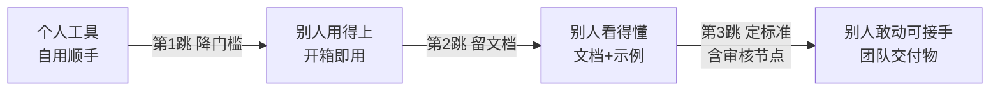

# 从个人到团队：交付标准升级

> [!abstract] 一句话解决
> 你自己用得很顺手的工具/Agent/Skill，**直接甩给团队就是灾难**——门槛太高别人上不了手、没有文档别人看不懂、没有标准别人不敢动。本文讲透"个人 → 团队三级跳"（**降门槛、留文档、定标准**）+ 三层审核节点，把"只有我能用"的个人资产，升级成"谁都能接得住"的团队交付物。

---

## 一、为什么"自用顺手"≠"交付合格"

> 个人阶段的成功标准是"**我自己能用、用起来爽**"；团队阶段的标准是"**别人不靠你也能学会、敢用、能接手**"。两者是两套完全不同的验收逻辑。

| 维度 | 个人工具（自用） | 团队交付物 |
|------|----------------|-----------|
| 用户 | 只有自己 | 多种角色（算法/工程/业务/新人） |
| 容错 | 出错了你知道怎么修 | 出错别人只会卡住或报警 |
| 知识存储 | 在你脑子里 | 必须在文档/示例/规范里显性化 |
| 变更 | 想改就改 | 有审核、有记录、可追溯 |
| 失败后果 | 自己返工 | 团队阻塞 + 信任下降 |

> **关键认知切换**：个人→团队，变化的不只是"用过的人变多"，而是**信任结构变了**。团队愿意用你的东西，是因为相信"它稳定、它说明白、它出了问题有兜底"。这一篇要做的就是**把个人信任变成组织信任**。

---

## 二、"个人→团队三级跳"：三级标准逐级升级

> 单向、不可回头。每一级都补上个人阶段缺失的东西。

### 第1跳：降门槛（让别人"用得上"）

先解决"别人根本用不起来"的问题：

- **一句话启动说明**：3 句内说清"这是什么、能解决什么、怎么跑起来"。
- **默认配置开箱即用**：个人阶段常留一堆"我懂的操作"，团队要的是**环境一键就绪**（依赖清单、启动脚本、示例数据跑通）。
- **傻瓜化入口**：把复杂参数收敛成"默认值 + 少量可调项"，而不是把所有开关都平铺给人。

> 个人 → 团队的第一动作：**写一份"给新同桌的 3 分钟上手说明"**。写不出来，说明门槛还没降够。

### 第2跳：留文档（让别人"看得懂"）

门槛降下来后，补上"理解"：

- **README 三层**：给使用者看的"怎么用" + 给维护者看的"怎么改" + 给决策者看的"为什么做/值不值得"。
- **数据/配置说明**：每个字段、每个参数"是什么、默认多少、调它会怎样"。
- **运行示例**：给一段**可复制、可复现、有预期输出**的示例，比十页说明好用。
- **常见坑 FAQ**：把你踩过的坑、以及你"一眼就知道"但别人会卡住的点，写成条目。

> 个人 → 团队的第二动作：**把"我一眼就懂"的东西，翻译成"别人看文档就懂"**。翻译得动，才叫留文档。

### 第3跳：定标准（让别人"敢动/可接手"）

最后解决"别人不敢碰、接手就慌":

- **约定与规范**：命名、目录、接口、错误码、版本号规则——有一份显式的"我们这么写"。
- **审核节点**：什么变更需要谁确认、什么时候能上（见下节）。
- **责任与边界**：谁负责维护、谁能改哪块、出了事找谁——**让"接手"对副校长的人来说是安全的**。

> 个人 → 团队的第三动作：**定义"什么样的交付才算合格"的验收单**。有了验收单，"接得住"才不是靠默契而是靠制度。



---

## 三、三层审核节点：什么时候"必须停下来被确认"

> 团队交付最怕"我偷偷把东西改了/上了"。审核节点就是**强制刹车**，让变更透明、可追溯。

| 审核层 | 触发时机 | 谁审 | 盯着什么 | 怎样算通过 |
|--------|---------|------|---------|-----------|
| L1 自己审（预检） | 每次改动前 | 自己 | 有没有测过 / 有没有改坏别的 | 自检清单逐项勾完 |
| L2 对接口审（Peer） | 改动会影响别人数据/功能/接口 | 相邻角色（算法/工程） | 接口、配置、行为是否兼容 | 对方确认可用 |
| L3 对需求审（Owner） | 上线前 / 交付给业务前 | 负责人/业务 | 是否满足需求、是否可发布 | 验收单签字 |

> 使用原则：**"越低层的改动自己决定，越高层、越对外、越影响别人的改动越要审。"** 个人阶段所有的"直接改"→团队阶段 80% 要走 L1+，影响面大的走 L2/L3。

### 审核节点的坑（反例）

- **反例1·只审结果不审过程**：只在上线前看"能用吗"，中间没人管，问题憋到最后一起爆。→ 应把审核**前移到变更发起点**。
- **反例2·审核变成走形式**：验收单永远秒签，"确认"没有实际后果。→ 根因是**没有把它和"回退/责任"绑定**，审核就没了威慑力。
- **反例3·一人既做又审**：自己写自己审自己通过，等于没有审核。→ 至少 L2 要有一个**独立于作者的人**。

---

## 四、实战案例：Skill 四连发里"从个人工具到团队工具"的三级跳

> 把你的 Skill 四连发（SquareSkill/误解消解/KOTH战绩/复盘 系列工具）从"自己做着爽"升级为"团队/跨部门可用"的真实历程，就是这个三级跳的活样本。

```
背景：你把个人跑过 N 次的 Skill 沉淀成可复用工具，一开始只有自己能顺畅用。
第1跳·降门槛：
  Step1 写"3分钟上手"：一句话能做什么 + 怎么装 + 怎么跑通一条示例。
  Step2 收敛输入：把散落的参数整理成"默认值+少量必填"，新人照模板填就能跑。
第2跳·留文档：
  Step3 补 README：使用层(怎么用) + 维护层(怎么改逻辑) + 决策层(这个Skill为什么值得做)。
  Step4 放"可运行示例 + 预期输出"：别人照着跑一遍，确认自己环境正常、看懂机制。
  Step5 沉淀 FAQ：把你自己"一眼知道"的边界情况写进坑清单。
第3跳·定标准：
  Step6 定变更审核：Skill 输出格式改动走"提交前先说明改了什么会影响谁"。
  Step7 定维护责任：明确"这块谁负责、谁可以改、坏了找谁"，让别人敢接。
```

> 结果：从"只有我会调这个Skill"变成"有人接手、有人敢改、有据可查的团队资产"。三级跳的本质，是**把你脑子里不可见的经验，逐级物化成别人看得见、接得住的交付物**。

---

## 五、可直接用的「团队交付验收单」

> 判断一个个人工具够不够格升级成团队交付物，逐项勾选。

- [ ] **可复用**：换一个人、换一台机器，照文档能独立跑通同一条示例
- [ ] **可理解**：每个参数/字段有"是什么、默认多少、调它会怎样"
- [ ] **可复现**：给一段输入，有明确预期输出/验收标准
- [ ] **可追踪**：关键变更有记录，能说清"上一版是什么、这版改了啥"
- [ ] **可回退**：改坏了能退回稳定版（衔接 II 模块的版本对齐表）
- [ ] **可接手**：明确维护者、改动边界、出事的联系人与兜底
- [ ] **已审核**：L2/L3 影响的改动走过了独立于作者的确认

---

## 六、行动清单

- [ ] 挑一个你自用最顺手的工具/Skill，跑一遍"3分钟上手说明"，写不出来的先降门槛
- [ ] 给它补 README 三层 + 一段"可运行示例 + 预期输出"
- [ ] 定一份"变更走哪层审核"的规则，并绑上回退/责任
- [ ] 用上面的「团队交付验收单」给自己现有资产打个分，找 Gap
- [ ] 把这个"三级跳"流程沉淀成你下一次团队交付的默认动作

---

- 下一步：[[05-产品与开发/AI项目实战管理/03-职场交付篇/02_跨职能协作与干系人表达]]
- 相关：[[05-产品与开发/项目管理方法论/06_干系人管理：把关键人变成同盟]]
- 回到 [[05-产品与开发/AI项目实战管理/00_MOC_AI项目实战管理中枢]]