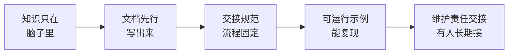

# 用文档与交接让别人接得住

> [!abstract] 一句话解决
> 个人 AI 项目最大的隐患是"**只有我会**"——你一旦离开/休整/转做别的，项目立刻熄火，而 AI 项目的 Prompt、知识库、配置散落在脑子里和本地，"接得住"更难。本文给出**文档先行、交接规范、可运行示例、维护责任交接**四件套 + 可直接套用的交接清单模板，让任何人不靠你也能把项目续起来。

---

## 一、"只有我会"为什么在 AI 项目里尤其危险

> 传统代码交接难，但 AI 项目更难——**因为"会的"很大一部分不是代码，而是你脑子里的隐性决策**。

| 隐性资产 | 表现形式 | 不交接的后果 |
|---------|---------|-------------|
| Prompt 试错经验 | 为什么这句提示词这么写、哪些写法无效 | 别人接手后"一顿乱改"，效果反变差 |
| 评测标准 | 什么样算好、哪些错题卡在哪个分 | 新人测半天，标准不同还在"打转" |
| 模型/配置选择 | 为什么用这个模型、这个参数、这个知识库切片 | 换一个底层配置整体崩，说不清哪一环 |
| 踩坑经验 | 哪些边界情况会翻车、怎么兜底 | 别人反复踩你踩过的坑 |
| 隐式流程 | 先调啥再调啥、哪些顺序不能乱 | 别人凭感觉执行，流程错乱 |

> **关键词：Bus Factor（巴士系数）**——"如果只剩你知道，这项目会怎样"。个人项目 Bus Factor = 1（你自己），这是最危险的等级。**文档与交接，就是把 Bus Factor 从 1 往上涨，让项目不依赖某一个人。**



---

## 二、四件套详解

### 第一件：文档先行（先写文档，再做/改东西）

> 原则：**能写下来的，就不要只留在脑子里；先有文档，后来的东西才有锚。**

- **README 三层**：使用层（怎么用）／维护层（怎么改）／决策层（为什么这么设计）。
- **决策记录（Decision Log）**：每做一个关键取舍（选模型、调参数、定结构），记一行"当时为何这么选/代价/可调整点"。这比结果更重要——**别人接手最缺的就是"为什么"**。
- **配置与数据字典**：所有 Prompt/知识库/参数的"是什么、默认多少、改它会怎样"，衔接 II 模块的版本管理。

> 坑·反例：**"先跑起来，文档以后再补"**——个人项目最常说。结果功能做好了，文档永远没补，交接时才知道代价全是此刻欠的账。

### 第二件：交接规范（把接手流程固定下来）

> 交接不能靠"我讲一遍你记住"，要固化成一串可勾选的流程。

- **默认前提**：交接方在**不现场求助**的情况下，能不能独立跑通一遍？不能就不算交接成功。
- **规范化交接内容**：环境、依赖、启动、示例、验收、坑、待办。
- **设置"人对人"环节**：先让接方**独立复现**，再让接方**复述/试讲**一遍给你听，验证他真的懂了（两个人共同的check）。

> 坑·反例：**"交接=口头讲一遍+丢个链接"**。听的人当时点头，三天后全忘。规范化的意义是让"懂"字有检验标准，而不是点头。

### 第三件：可运行示例（能复现的才是可信的）

> 文档说一千遍，不如一段"**可复制、可复现、有预期输出**"的示例。

- **最小可运行用例**：给一段输入 → 跑一条命令 → 得一个预期输出，配套能判定的验收点。
- **错误兜底示例**：给"如果输出不对可能是哪三个原因"的排查路径。
- **AI 项目特别加"版本对齐"**：能复现的前提是**能固定到同一个模型/配置/知识库快照**上（衔接 II 模块版本对齐表）。

### 第四件：维护责任交接（让人长期接，而不只接一次）

> 交接不是"一次性的点交"，而是"长期的有人接"。

- **明确 owner**：谁负责维护、谁能改哪块、改动边界在哪。
- **约定变更与回退**：改之前走什么确认、改坏了怎么退。
- **双周轻检**：交接后头几周，让接方独立跑/改一小块，你在旁边兜底，把"能接"坐实。

> 坑·反例：**"他接手了，就不关我的事了"**——结果对方遇到"我一看就懂的坑"卡半天。交接应带一段"护航期"，Q&A 到对方真的能独挡一面。

---

## 三、可直接用的「交接清单模板」

> 交接时把这份表填满，并在"人对人"环节让接方独立复现一遍才算过。

```
【项目快照】项目名/一句话目标/当前版本/跑在哪个模型+配置(版本对齐表)
【环境】依赖清单/版本 / 启动脚本 / 数据来源 / 环境变量(含坑)
【启动】3步跑起来 + 预期看到的输出
【可复现示例】输入→命令→预期输出→验收点(至少1个)
【核心决策记录】3-5条：当时为何这么选/代价/可调整点
【常见坑】踩过的坑+原因+怎么绕(含"我一眼知道"的边界)
【尚未完成】待办/已知问题/下一步建议
【变更与责任】owner是谁/谁能改哪块/改前须&改后记/如何回退
【兜底】出事的联系人/联系方式 / 备份在哪
【护航期】接手后头N周：接方独立跑&改的小任务 + 你的Q&A窗口
```

> 使用要点：**"人对人"验证 = 让接方不看你演示，自己照清单复现一遍 + 复述"为什么这么选"**。这个动作把"交接成功"从口头上变成可验证的事实。

---

## 四、实战案例：把 RAG 机器人 / Skill 交接给不熟 AI 配置的人

> 以你知微 RAG 机器人与 Skill 类隐性知识项目的交接为原型：

```
背景：你希望项目不依赖你一个人，把它交给另一位同事（AI 配置不熟）。
Step1·文档先行：
  写下 README 三层 + 决策记录(为何用这个模型/这个切片/这些Prompt) + 配置字典。
Step2·可运行示例：
  给一段标准问题 → 一条启动/调用命令 → 预期回答 + "命中该在哪个范围"的判断点。
Step3·交接规范(人对人)：
  Step3a 让接方不看你演示，仅照文档独立复现一遍 → 你在旁记录他卡在哪、补文档。
  Step3b 让接方用你自己的话复述"为什么用这个模型/配置/兜底" → 验证真懂，不只是照抄。
Step4·维护责任交接：
  明确 owner、谁能改Prompt、改前登记&回退路径；签上"先登记后改动"。
Step5·护航期：
  头4周每周给接方一个小任务(调一个参数/加一个评测样例)你兜底，
  直到他能独自处理一次真实变更。
结果：Bus Factor从1→2+，你休假/转岗项目仍有人能接、敢改、坏了知道退。
```

---

## 五、文档与交接的三条红线（反例警示）

- ❌ **"文档我肯定写，但先把功能做完"** → 功能做完后文档永远欠账。**先文档，后实现**。
- ❌ **"交接就是我把话说清楚"** → 没有让接方独立复现+复述，就不算交接成功。
- ❌ **"A 接手了，就跟我无关了"** → 没有护航期，接方一遇隐性坑就卡死，最后还是找你。**带一段护航，才算真交接完。**

> 一句话底线：**判断交接是否成功，标准不是"我说清楚了"，而是"我不在的时候，她能不能独立跑通+改通"。**

---

## 六、行动清单

- [ ] 算一下手头 AI 项目的 Bus Factor，标出"只有我知道"的隐性资产（Prompt/评测/配置/坑）
- [ ] 写一份「决策记录」，把 3-5 个关键取舍的"为什么"落盘
- [ ] 做一条"可运行示例+预期输出"，能复现在固定模型/配置上
- [ ] 用上面的「交接清单模板」跑一次完整交接，并设"人对人·独立复现"验收
- [ ] 约定 owner + 责任人 + 变更回退 + 护航期，把 Bus Factor 从 1 抬上去

---

- 下一步：参见 [[05-产品与开发/AI项目实战管理/04-求职表达篇/01_项目管理能力面试框架]]
- 相关：[[05-产品与开发/独立开发者生存指南/00_MOC_独立开发者生存指南中枢]]、[[05-产品与开发/AI项目实战管理/02-AI特有管理篇/03_Prompt-知识库-配置版本管理]]
- 回到 [[05-产品与开发/AI项目实战管理/00_MOC_AI项目实战管理中枢]]