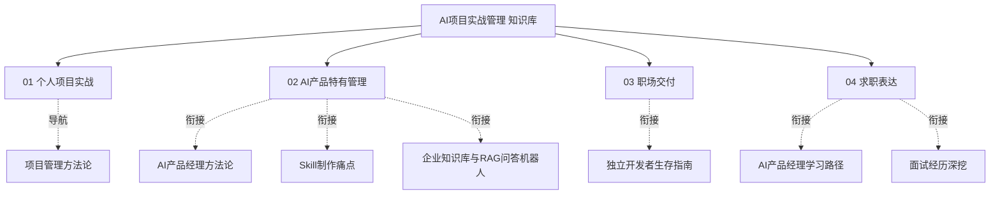

# "AI项目实战管理"知识库建设方案

> **文档类型**：建设方案（审阅版）
> **状态**：待审阅
> **主题**：以"把 AI 项目真正管完、管好"为目标，聚焦**个体/小团队的 AI 项目实战管理**
> **定位**：区别于已有一篇 [[05-产品与开发/项目管理方法论/00_MOC_项目管理方法论中枢]]（讲通用理论 + AI 对项目管理的宏观影响），本知识库聚焦「**实战操作**」——一人或小团队怎么把 AI 项目从想法管到上线、AI 产品特有的管理问题怎么处理、求职时项目管理能力怎么表达。

---

## 一、为什么需要这个知识库

### 1.1 现状：有理论，缺"个体实战"抓手

已有《项目管理方法论》覆盖了 PMBOK、敏捷/Scrum、需求、风险、干系人、复盘、AI 时代变革，质量很高，但它是**面向"组织级/团队级"的通用理论**。对你而言（一人独立开发、HR+AI 场景、求职 AI PM），有三类真实缺口：

1. **个体怎么管项目**：没有专职 PM、没有团队会议，靠什么机制把个人 AI 项目管到上线？方法论库不回答这个问题。
2. **AI 产品特有的管理问题**：模型迭代与产品迭代的双螺旋、Prompt/知识库/配置的版本管理、评测驱动迭代……这些在通用方法论里没有，却是 AI 项目成败关键。
3. **求职表达缺口**：面试/复盘中，怎么把你的项目管理能力讲成"能管事、能交付"的证据？你已有项目素材（InterviewPrep、知微机器人、Skill四连发），缺把它们"项目管理化表达"的方法。

### 1.2 本知识库定位

**把"AI 项目怎么管完、管好"做成一套可实操、可复用、可讲的实战知识库**：

- **个体优先**：以"一人/小团队"为主视角，兼顾向团队/职场交付
- **AI 产品特色**：重点解决模型/产品双迭代、评测驱动、版本管理等 AI 特有管理题
- **落地为准**：每个模块给"模板 + 清单 + 案例"，学了就能用
- **复用存量**：通用理论导航到方法论库，不重复建设
- **补求职出口**：专设"项目管理能力表达"，衔接面试

---

## 二、知识库整体架构

### 2.1 架构总览

```
AI项目实战管理知识库
│
├── 01-个人项目实战篇：一人怎么把项目管完（4篇）
│   ├── 01_个人项目的轻量管理法：从想法到上线的节奏
│   ├── 02_最小闭环与里程碑：先转起来再管细节
│   ├── 03_个人需求与范围控制：克制与取舍
│   └── 04_个人复盘与迭代：每个项目都要增值
│
├── 02-AI产品特有管理篇：AI项目难在哪（4篇）
│   ├── 01_模型迭代×产品迭代：双螺旋怎么管
│   ├── 02_评测驱动迭代：用数据而不是感觉
│   ├── 03_Prompt/知识库/配置版本管理
│   └── 04_AI项目的风险与兜底管理
│
├── 03-职场交付篇：向团队/组织交付项目（3篇）
│   ├── 01_从个人到团队：交付标准的升级
│   ├── 02_跨职能协作与干系人表达
│   └── 03_用文档与交接让别人接得住
│
└── 04-求职表达篇：把管理能力讲成证据（2篇）
    ├── 01_项目管理能力面试框架与STAR
    └── 02_个人AI项目如何讲成"能交付"的作品
```

### 2.2 设计原则

**原则一：个体视角为主轴，职场/求职为出口。** 先解决"一个人怎么管完"，再谈团队与面试表达。

**原则二：AI 特色是护城河。** 双螺旋、评测驱动、版本管理这4个专题，是方法论库没有、AI PM 求职者稀缺的能力点。

**原则三：每个模块带模板与案例。** 每个专题至少给 1 个模板 + 1 个案例（尽量用你 InterviewPrep / 知微 / Skill 的真实经历）。

**原则四：充分复用存量。** 通用方法论导航到《项目管理方法论》，独立开发的商业/技术内容导航到《独立开发者生存指南》，避免重复。

---

## 三、各模块详细规划

### 模块一：个人项目实战篇（4篇）

| 文档 | 核心内容 | 复用/衔接 |
|------|---------|----------|
| 01_个人项目的轻量管理法 | 没有PM、没有会议，靠"轻量计划+周检+里程碑清单"管项目；个人版"启动→规划→执行→收尾" | 衔接方法论01 |
| 02_最小闭环与里程碑 | "先让闭环转起来"的优先级逻辑；里程碑是可验收的成果物 | 衔接 InterviewPrep选题 |
| 03_个人需求与范围控制 | 一人项目的范围蔓延更隐蔽；如何靠"砍掉它闭环还转吗"克制 | 衔接方法论04 |
| 04_个人复盘与迭代 | 个人版复盘模板；错题集/经验沉淀机制 | 衔接方法论07 |

### 模块二：AI产品特有管理篇（4篇，核心，护城河）

| 文档 | 核心内容 | 复用/衔接 |
|------|---------|----------|
| 01_模型迭代×产品迭代：双螺旋怎么管 | 模型升级与产品迭代两个节奏如何协调；模型版本 vs 产品版本 | 衔接方法论AI PM迭代04 |
| 02_评测驱动迭代 | 建立评测集、用数据说话、棘轮式迭代（每轮只改一处） | 衔接知微"周复盘+错题集" |
| 03_Prompt/知识库/配置版本管理 | Skill/Prompt/知识库/Agent配置如何版本化、可回退可对比 | 衔接Skill深化路线图 |
| 04_AI项目的风险与兜底管理 | 幻觉、检索不准、评测偏差、成本失控；风险登记+兜底设计 | 衔接技术底座幻觉篇 |

### 模块三：职场交付篇（3篇）

| 文档 | 核心内容 | 复用/衔接 |
|------|---------|----------|
| 01_从个人到团队：交付标准升级 | 个人工具→团队工具的三级跳（门槛/文档/标准） | 衔接Skill四连发 |
| 02_跨职能协作与干系人表达 | 和算法/工程/业务怎么对齐；把"管理语言"讲清 | 衔接方法论06 |
| 03_用文档与交接让别人接得住 | 文档先行、交接规范、防"只有我会" | 衔接独立开发者生存指南 |

### 模块四：求职表达篇（2篇）

| 文档 | 核心内容 | 复用/衔接 |
|------|---------|----------|
| 01_项目管理能力面试框架 | 用STAR把"项目管理"讲成可量化交付；面试追问弹药 | 衔接求职面试库 |
| 02_个人AI项目讲成"能交付"作品 | 把InterviewPrep/知微/Skill改写成"从启动到收尾"的项目故事 | 衔接工作总结库 |

---

## 四、落地顺序与优先级

| 顺序 | 模块 | 建议动作 | 优先级 |
|------|------|---------|--------|
| 第1步 | 模块二 | AI特有管理（护城河，先建） | P0 |
| 第2步 | 模块一 | 个人项目实战（个体视角主轴） | P0 |
| 第3步 | 模块四 | 求职表达（衔接现有求职主线） | P0 |
| 第4步 | 模块三 | 职场交付（增值） | P1 |

> 求职配套使用：模块二+模块四与 [[05-产品与开发/AI产品经理学习路径/00_MOC_AI产品经理学习路径中枢]] 的"作品集/面试"直接对接。

---

## 五、与已有知识库的衔接关系



> 结论：本库**新建为主、导航存量**。核心工作量集中在新模块二（AI 特有管理 4 篇），这是差异化价值所在；模块一/三/四与已有库交叉引用。

---

## 六、待确认事项

1. **建设范围**：是否按上述 4 模块 12-13 篇全量建设，还是先建 P0 的模块二+模块一？
2. **素材来源**：AI特有管理与求职表达篇，是否重点以你 InterviewPrep / 知微 / Skill 三个真实项目为案例？（建议是）
3. **目录归属**：计划放 `05-产品与开发\AI项目实战管理\`，与《项目管理方法论》并列
4. **要不要补一篇案例向文档**："用 AI 跑一个 AI 项目"的完整样板（从需求到上线的实战复盘）

---

## 七、版本历史

| 版本 | 日期 | 更新内容 |
|------|------|----------|
| v0.1 | 2026-08-20 | 初稿：4模块12-13篇规划 |