# AI驱动Web应用开发知识库

> 回答两个问题：把想法做成 Web 应用时，每一步该做什么；长期使用哪些文档，才能让 AI 在跨会话、跨版本的开发中始终清晰、不跑偏。与超长项目AI跑（方法论）和 Vibe Coder（入门实战）互补，本库是"标准流水线 + 工程化文档体系"。

---

## 模块速览

```mermaid
flowchart TD
    START[AI驱动Web应用开发] --> A[流程篇]
    START --> B[文档体系篇]
    START --> C[上下文篇]
    START --> D[规范与自动化篇]
    START --> E[工具篇]
    START --> F[实战篇]

    A --> A1[["01-流程篇/01_想法验证 ⭐先看"]]
    A --> A2[["01-流程篇/02_需求定义"]]
    A --> A3[["01-流程篇/03_技术选型与项目脚手架"]]
    A --> A4[["01-流程篇/04_Spec驱动开发 ⭐核心"]]
    A --> A5[["01-流程篇/05_测试部署与持续迭代"]]

    B --> B1[["02-文档体系篇/01_文档全景图 ⭐必读"]]
    B --> B2[["02-文档体系篇/02_项目记忆文档"]]
    B --> B3[["02-文档体系篇/03_需求文档"]]
    B --> B4[["02-文档体系篇/04_技术设计文档"]]
    B --> B5[["02-文档体系篇/05_决策记录ADR"]]
    B --> B6[["02-文档体系篇/06_进度与状态文档"]]
    B --> B7[["02-文档体系篇/07_会话交接与变更日志"]]

    C --> C1[["03-上下文篇/01_AGENTS.md编写规范 ⭐标准"]]
    C --> C2[["03-上下文篇/02_CLAUDE.md编写规范"]]
    C --> C3[["03-上下文篇/03_Cursor规则与Copilot指令"]]
    C --> C4[["03-上下文篇/04_跨工具统一策略"]]

    D --> D1[["04-规范与自动化篇/01_项目目录结构规范"]]
    D --> D2[["04-规范与自动化篇/02_Spec与文档状态管理"]]
    D --> D3[["04-规范与自动化篇/03_命名编号与格式约定"]]
    D --> D4[["04-规范与自动化篇/04_Docs-as-Code"]]

    E --> E1[["05-工具篇/01_主流AI编程工具的记忆机制对比"]]
    E --> E2[["05-工具篇/02_主流AI编程工具的选型矩阵"]]
    E --> E3[["05-工具篇/03_多工具并行开发策略"]]

    F --> F1[["06-实战篇/01_完整项目文档集示例 ⭐拿来即用"]]
    F --> F2[["06-实战篇/02_会话启动协议"]]
    F --> F3[["06-实战篇/03_会话结束协议"]]
    F --> F4[["06-实战篇/04_文档驱动的变更与防退化流程"]]
    F --> F5[["06-实战篇/05_疑难杂症"]]
```

| 模块 | 笔记数 | 核心定位 | 建设进度 |
|------|--------|---------|---------|
| 流程篇 | 5 篇 | 想法→Web应用的完整流水线，每阶段人机分工与产出物 | 🔨 建设中 |
| 文档体系篇 | 7 篇 | 七类长期文档：职责、模板、更新时机 | 🔨 建设中 |
| 上下文篇 | 4 篇 | CLAUDE.md/AGENTS.md 等指令文件编写规范 | ⏳ 待建 |
| 规范与自动化篇 | 4 篇 | 目录结构、状态管理、命名约定、docs-as-code | ⏳ 待建 |
| 工具篇 | 3 篇 | 主流工具记忆机制对比与选型 | ⏳ 待建 |
| 实战篇 | 5 篇 | 完整文档集示例、会话协议、防退化、疑难杂症 | ⏳ 待建 |

---

## 使用指南

| 你的状态 | 打开什么 |
|---------|---------|
| 有一个想法，不知道从哪开始 | 流程篇 → [[01-流程篇/01_想法验证]] → [[01-流程篇/02_需求定义]] |
| 不知道项目里该维护哪些文档 | 文档体系篇 → [[02-文档体系篇/01_文档全景图]] |
| 想立刻拿到全套文档模板 | 实战篇 → [[06-实战篇/01_完整项目文档集示例]] |
| 新会话的 AI 不记得你的项目 | 上下文篇 → CLAUDE.md/AGENTS.md + 实战篇 → [[06-实战篇/02_会话启动协议]] |
| AI 总是跑偏、乱改需求 | 流程篇 → [[01-流程篇/04_Spec驱动开发]] + 文档体系篇 → Spec/ADR |
| 想换工具或同时用多个工具 | 工具篇 → [[05-工具篇/01_主流AI编程工具的记忆机制对比]] |
| 文档越来越多，怕腐烂 | 规范与自动化篇 → [[04-规范与自动化篇/04_Docs-as-Code]] |

---

## 关键原则

> [!tip] 让 AI 长期不乱跑的六条法则
> 1. **文档是 AI 的长期记忆** — LLM 没有跨会话记忆，连续性全靠版本控制下的 Markdown 文件承载
> 2. **Spec 锁需求，ADR 锁决策，进度锁状态** — 约束 AI 的不是提示词，是这些"合同文件"
> 3. **先写 Spec，后写代码** — 需求变更先改 Spec 再改代码，防止需求漂移
> 4. **渐进式披露** — 常驻文件保持精简（≤200 行），细节放独立文件按需读取
> 5. **每会话必读、每会话必更新** — 进度文档和会话交接是接力棒，漏了它 AI 就会"失忆"
> 6. **文档也是代码** — 有目录规范、有状态管理、有质量检查，文档才不会腐烂

---

## 关联知识库

- [[01-AI技术/超长项目AI跑/00_MOC_超长项目AI跑中枢]] — 长项目方法论（记忆体系、Spec锚点、会话传承）
- [[05-产品与开发/Vibe Coder/Vibe Coder 常见问题全景图]] — 入门实战（开发工作流、防退化、技术栈）
- [[05-产品与开发/AI产品经理方法论/00_MOC_AI产品经理方法论中枢]] — 需求层（PRD 定义，PRD→Spec 衔接）
- [[05-产品与开发/独立开发者生存指南/00_MOC_独立开发者生存指南中枢]] — 产品化背景（Idea验证、MVP）
- [[07-学习成长/知识管理体系/00_MOC_知识管理体系中枢]] — 规范层（命名、MOC 结构、链接规范）
- [[01-AI技术/AI Agent开发实战/00_MOC_AI Agent开发实战中枢]] — Agent 工具层（记忆机制）