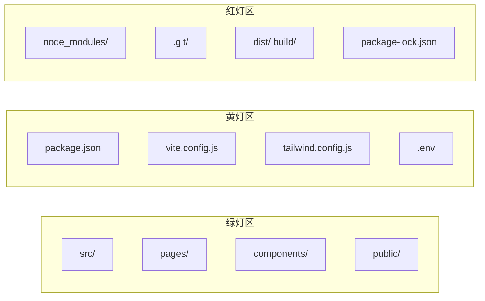

# 文件结构认知指南 — 哪些文件能改，哪些是禁区

> [!abstract] 这篇解决什么问题
> 打开项目，20 多个文件和文件夹，完全不知道哪些能动哪些不能动。这篇用 ==红绿灯速记法==，让你一眼看出每个文件/文件夹的角色。
>
> 前置阅读：[[05-产品与开发/Vibe Coder/Vibe Coder 常见问题全景图#2.4 不知道哪些文件重要]]

---

## 一、红绿灯速记法



| 颜色 | 含义 | 规则 |
|---|---|---|
| 🟢 绿灯 | ==你的代码== | 放心改，AI 生成代码主要在这里 |
| 🟡 黄灯 | ==配置文件== | 偶尔需要改，让 AI 指导 |
| 🔴 红灯 | ==禁区== | ==永远不要手动碰== |
| ⚪ 白灯 | ==自动生成== | 不用管 |

---

## 二、绿灯区：你的代码（放心改）

### `src/` — 源代码（最重要的文件夹）

| 子文件夹 | 放什么 | 典型文件 |
|---|---|---|
| `src/components/` | 可复用组件（按钮、卡片、导航栏） | `Button.jsx`、`Header.jsx` |
| `src/pages/` | 页面组件（首页、关于页、设置页） | `Home.jsx`、`About.jsx` |
| `src/App.jsx` | 主入口组件，组装所有页面 | `App.jsx` |
| `src/main.jsx` | 程序入口，挂载到 HTML | `main.jsx` |
| `src/index.css` | 全局样式 | `index.css` |

### `public/` — 静态资源

| 文件 | 作用 |
|---|---|
| `public/favicon.ico` | 网站图标 |
| `public/images/` | 图片资源 |

### `pages/`（Next.js 专属）

| 文件 | 作用 |
|---|---|
| `pages/index.js` | 首页 |
| `pages/about.js` | 关于页 |
| `pages/api/` | 后端 API 接口 |

---

## 三、黄灯区：配置文件（需要改时让 AI 指导）

### `package.json` — 项目说明书

记录项目名称、用什么依赖、有什么脚本命令。==你需要改依赖时，直接让 AI 帮你改。==

```json
{
  "name": "my-app",
  "scripts": {
    "dev": "vite",      // npm run dev 执行这个
    "build": "vite build", // npm run build 执行这个
    "preview": "vite preview"
  },
  "dependencies": {
    "react": "^18.2.0"  // 项目依赖
  }
}
```

### `vite.config.js` — 构建配置

定义构建行为（如路径别名、代理配置）。==需要改时让 AI 来。==

### `tailwind.config.js` — Tailwind CSS 配置

定义自定义颜色、字体、间距等。==让 AI 帮你改。==

### `.env` — 环境变量

存放 API Key 等敏感信息。==绝对不能上传到 GitHub。==

---

## 四、红灯区：禁区（永远不要手动碰）

| 文件/文件夹 | 是什么 | 为什么不能碰 |
|---|---|---|
| `node_modules/` | 依赖包仓库 | 几万个文件，手动改一个就崩 |
| `.git/` | Git 版本历史 | 改了就会丢失所有存档 |
| `dist/` / `build/` | 构建产物 | 每次 `npm run build` 自动生成，不要手动改 |
| `package-lock.json` | 依赖版本锁定 | 自动生成，不要手动改 |

> [!danger] 如果 `node_modules` 出了问题
> 不要手动修！删掉整个文件夹，然后 `npm install` 重新生成。

---

## 五、白灯区：自动生成（不用管）

| 文件/文件夹 | 是什么 |
|---|---|
| `.next/` | Next.js 构建缓存 |
| `node_modules/.cache/` | 构建缓存 |
| `.vscode/` | VS Code 编辑器配置 |

---

## 六、典型项目结构一览

### Vite + React 项目

```
my-app/
├── node_modules/     🔴 禁区
├── public/           🟢 静态资源
├── src/              🟢 你的代码
│   ├── components/   🟢 组件
│   ├── pages/        🟢 页面
│   ├── App.jsx       🟢 主组件
│   ├── main.jsx      🟢 入口
│   └── index.css     🟢 全局样式
├── .gitignore        🟡 告诉 Git 忽略什么
├── index.html        🟡 入口 HTML
├── package.json      🟡 项目说明书
├── vite.config.js    🟡 构建配置
└── .git/             🔴 Git 版本历史
```

### Next.js 项目

```
my-app/
├── node_modules/     🔴
├── pages/            🟢 页面 + API
│   ├── index.js      🟢 首页
│   ├── about.js      🟢 关于页
│   └── api/          🟢 后端 API
├── components/       🟢 组件
├── public/           🟢 静态资源
├── styles/           🟢 样式
├── package.json      🟡
├── next.config.js    🟡
└── .next/            ⚪ 构建缓存
```

---

## 七、常见操作指引

| 你想做什么 | 怎么做 |
|---|---|
| 加一个新页面 | 在 `src/pages/` 或 `pages/` 新建文件 |
| 加一个新组件 | 在 `src/components/` 新建文件 |
| 改网站标题 | 修改 `index.html` 中的 `<title>` |
| 加一个新依赖 | 让 AI 帮你 `npm install xxx` |
| 改构建配置 | 让 AI 帮你改 `vite.config.js` |
| 部署到线上 | 参考 [[05-产品与开发/Vibe Coder/03-交付与安全/部署懒人包]] |

---

## 八、一句话总结

> [!tip] 记住红绿灯
> ==🟢 src/ 和 pages/ 是你的地盘，🟡 配置文件让 AI 改，🔴 node_modules 和 .git 永远别碰。==

---

## 关联笔记

- [[05-产品与开发/Vibe Coder/Vibe Coder 常见问题全景图]] — 回到总索引
- [[05-产品与开发/Vibe Coder/Vibe Coding 软件瘦身指南]] — build 之后产物在 dist/
- [[05-产品与开发/Vibe Coder/02-开发实战/Git 极简生存指南]] — .git 文件夹是 Git 存档
- [[05-产品与开发/Vibe Coder/03-交付与安全/安全实践指南]] — .env 文件的安全处理