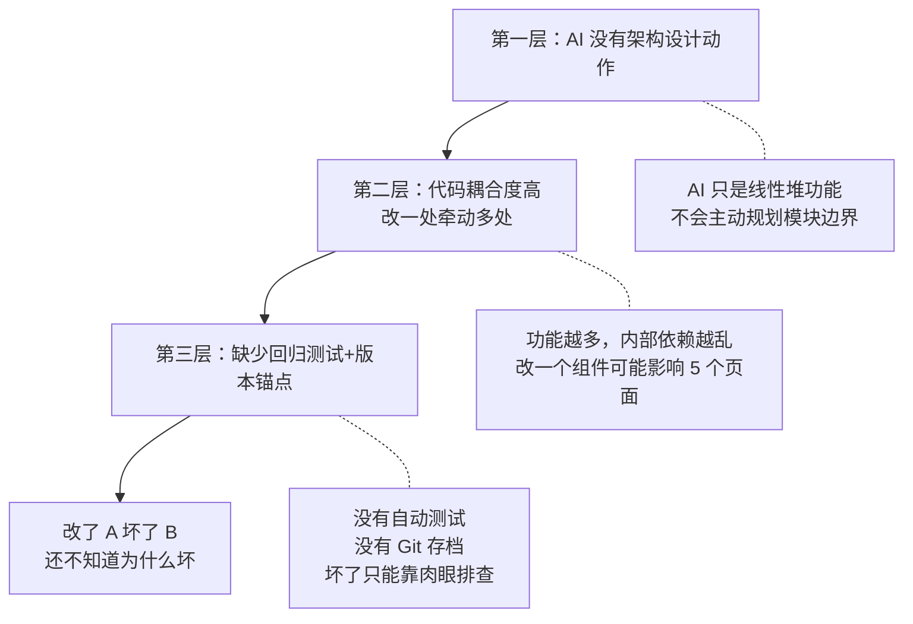
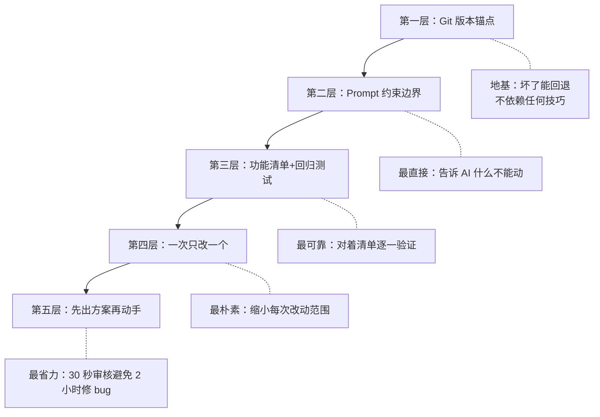
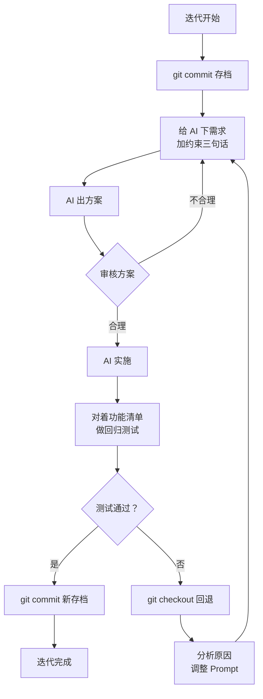

# Vibe Coding 迭代防退化指南 — 加了新功能，旧功能不崩

> [!abstract] 这篇解决什么问题
> 用 AI 做产品，加第三个功能时第一个功能崩了——这是 Vibe Coder 最高频的痛点。这篇从 ==根因分析 → 五层防御体系 → 实战 SOP==，系统性地解决「迭代退化」问题。
>
> 前置阅读：[[05-产品与开发/Vibe Coder/Vibe Coder 常见问题全景图#2.3 改了 A 坏了 B——迭代地狱 ♻️]]

---

## 一、根本原因：不是「架构没设计好」这么简单

很多人说「迭代退化是因为架构没设计好」。这个说法只对了一半。真正的根因是 ==三层叠加==：



| 层级 | 问题 | 谁的责任 | 能解决吗 |
|---|---|---|---|
| 架构设计缺失 | AI 不会主动设计架构，只会堆功能 | AI 的天然缺陷 | ==可以，通过 Prompt 引导== |
| 代码耦合 | 模块之间互相依赖，改一处牵动多处 | AI + 架构缺失 | ==可以，通过架构约束== |
| 无测试无版本 | 没有回归测试，没有 Git 存档 | 你的工程习惯 | ==完全可以，而且最可控== |

> [!important] 关键认知
> 说「全是架构的锅」是甩锅给 AI。==测试和版本控制这两道防线，比架构更可控，也更立竿见影。== 架构再好，没有测试一样会漏 bug。

---

## 二、五层防御体系



---

## 三、第一层：Git 版本锚点（地基）

### 3.1 你只需要两条命令

```bash
# 存档（每次稳定版本都执行）
git add . && git commit -m "v1.2 稳定版：XX功能完成"

# 读档（AI 改坏了就回退）
git checkout .
```

> [!tip] 不需要学复杂 Git 操作
> 就把这两条命令当「游戏存档」和「读档」按钮用。每次迭代前存一次，坏了就回到上一个存档点。

### 3.2 新手 Git 初始化（5 分钟搞定）

```bash
# 1. 进入项目文件夹
cd 你的项目文件夹

# 2. 初始化 Git（只需一次）
git init

# 3. 创建 .gitignore（告诉 Git 忽略 node_modules 等）
# 让 AI 帮你生成：「帮我创建一个 .gitignore 文件，忽略 node_modules 和 .env」

# 4. 首次存档
git add .
git commit -m "初始版本"
```

### 3.3 迭代节奏

```
迭代前：git commit -m "v1.2 稳定"
   ↓
让 AI 加功能
   ↓
测试通过 → git commit -m "v1.3 新增XX功能"
测试失败 → git checkout .  （秒回退到 v1.2）
```

> [!danger] 血的教训
> 没有 Git 存档 = 没有后悔药。AI 改坏了你只能手动回忆改了哪些文件，甚至可能把整个项目搞废。

---

## 四、第二层：Prompt 约束边界（最直接有效）

### 4.1 每次迭代加这三句话

```
1. "在保持以下现有功能完全不变的前提下，添加 XX 功能：
   [列出 3-5 个核心功能]"

2. "优先通过新增代码实现，尽量避免修改已有文件。
   如果必须修改已有文件，请先列出修改清单和原因，等我确认。"

3. "改完后，帮我列出所有被修改的文件，以及每个修改
   可能影响哪些已有功能。"
```

### 4.2 为什么三句话分别解决什么问题

| 句子 | 解决的问题 | AI 的默认行为 | 加了之后 |
|---|---|---|---|
| 第 1 句 | AI 不知道边界，可能改了不该改的 | 为了加新功能随意改旧代码 | 明确知道哪些是禁区 |
| 第 2 句 | AI 喜欢改已有文件而不是新建文件 | 直接在旧文件里加逻辑 | 优先新增文件，减少影响面 |
| 第 3 句 | AI 不会做影响面分析 | 改完就完了，不告诉你改了哪 | 被迫做影响面评估 |

### 4.3 让 AI 在迭代前做架构评估

在项目开始时或大版本迭代前，加这一句：

> "在开始写代码之前，先帮我做一个架构设计：这个项目应该分成哪几个模块？每个模块负责什么？模块之间怎么通信？"

在每次迭代时加这一句：

> "在加这个新功能之前，先评估一下：当前架构能不能很好地支持这个功能？还是需要先重构？如果需要重构，先告诉我方案。"

---

## 五、第三层：功能清单 + 回归测试（最可靠）

### 5.1 让 AI 生成功能清单

```
"帮我列出当前项目中所有已实现的功能，每个功能一行，
作为回归测试清单。格式：
- [ ] 功能名称：一句话描述 + 测试方法"
```

产出示例：
```
- [ ] 用户注册：填写用户名+密码，点击注册，跳转到登录页
- [ ] 用户登录：输入用户名+密码，点击登录，进入首页
- [ ] 添加笔记：点击新建按钮，输入内容，保存后在列表显示
- [ ] 删除笔记：点击删除按钮，确认后笔记从列表消失
- [ ] 搜索笔记：输入关键词，列表实时筛选
```

### 5.2 每次迭代后做回归测试

对着清单快速过一遍，每条功能花 10 秒验证。20 个功能 = 3 分钟。

或者让 AI 帮你做回归自查：

```
"我刚刚加了 XX 功能，请帮我检查：以下功能是否仍然正常工作？
[贴入功能清单]"
```

### 5.3 功能清单的维护

| 时机 | 操作 |
|---|---|
| 每次加新功能后 | 在清单中添加一行 |
| 每次删功能后 | 在清单中删除一行 |
| 每次迭代后 | 全量过一遍清单 |

---

## 六、第四层：一次只改一个（最朴素）

### 6.1 错误姿势 vs 正确姿势

| ❌ 错误姿势 | ✅ 正确姿势 |
|---|---|
| "加搜索功能、优化 UI、修登录 bug" | 一次只改一件事 |
| 改了 8 个文件 | 每次改 1-2 个文件 |
| 不知道哪个改动导致的问题 | 出问题立刻知道是哪一步 |
| 一次性测试所有改动 | 每步测试，坏了立刻停 |

### 6.2 迭代节奏

```
加功能 A → 测试 → commit → 加功能 B → 测试 → commit → 加功能 C → 测试 → commit
```

> [!tip] 口诀
> 加一个功能，测一下。坏了立刻修，别攒着。

---

## 七、第五层：先出方案再动手（最省力）

### 7.1 审核模板

```
"我要加 XX 功能，先不要改代码。请告诉我：
1. 你打算修改哪些文件？
2. 每个文件改什么？为什么？
3. 这些改动可能影响哪些已有功能？
4. 有没有不需要修改文件就能实现的方式？
等我确认后再动手。"
```

### 7.2 审核检查项

| 检查项 | 红灯信号 |
|---|---|
| 修改文件数 | 超过 3 个文件 → 问 AI 能不能减少 |
| 修改原因 | 说不清楚「为什么改」→ 可能是没必要的改动 |
| 影响面 | 说「没有影响」→ 大概率是没认真评估 |
| 替代方案 | 有没有新增文件就能实现的方式？ |

> [!tip] 这 30 秒的审核，能避免 80% 的「改了 A 坏了 B」。

---

## 八、实战 SOP：完整迭代流程



---

## 九、常见问题

### Q：Git 学了但总是忘记存档怎么办？

> 把「每次迭代前 commit」当作固定的仪式，就像保存 Word 文档一样。在 TODO.md 里把「git commit」作为迭代任务的第一步。

### Q：功能清单太长了，回归测试太花时间怎么办？

> 优先级分三层：P0（核心流程，每次必测）、P1（常用功能，每次必测）、P2（边缘功能，隔几次测一次）。P0+P1 通常不超过 10 条，3 分钟搞定。

### Q：AI 说「不会影响已有功能」，但实际还是影响了，怎么办？

> 这是 AI 的常见问题——它不会故意骗你，而是真的没意识到。解决方案：不要只问「会不会影响」，==让 AI 具体列出每个文件的修改点和可能的影响链==。如果它说「没有影响」，追问「你确定吗？请逐一检查每个已修改文件。」

### Q：架构设计到底要多深入？

> 对 Vibe Coder 来说，不需要 UML 图或设计模式。只需要 AI 回答三个问题：这个项目分几个模块？每个模块负责什么？模块之间怎么通信？——三段话的架构设计就够用。

---

## 十、一句话总结

> [!tip] 迭代防退化 = Git 存档 + Prompt 约束 + 回归测试
> ==每次迭代前存档，每次 Prompt 加约束，每次迭代后对着清单测一遍。== 三层防线缺一不可，但 Git 是第一道也是最关键的一道。

---

## 关联笔记

- [[05-产品与开发/Vibe Coder/Vibe Coder 常见问题全景图]] — 回到总索引
- [[05-产品与开发/Vibe Coder/02-开发实战/Git 极简生存指南]] — 只学 5 分钟就能用的 Git
- [[05-产品与开发/Vibe Coder/02-开发实战/Prompt 工程速查（vibe coding 专用）]] — 迭代 Prompt 模板合集
- [[05-产品与开发/Vibe Coder/02-开发实战/报错自救手册]] — 出 bug 了怎么排查
- [[05-产品与开发/Vibe Coder/AI生成产品的经验法则]] — 经验 6：做一步，验证一步
- [[05-产品与开发/Vibe Coder/Vibe Coding 产品经理法则]] — 你描述需求，AI 决定方案