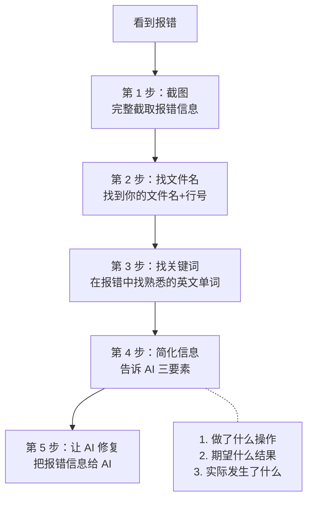

# 报错自救手册 — 零基础看懂报错 + 排查 + 修复

> [!abstract] 这篇解决什么问题
> 终端一片红字，浏览器一片白屏——零基础 Vibe Coder 最慌的时刻。这篇教你 ==怎么看报错、怎么定位问题、怎么给 AI 有效信息==，从「看到报错就慌」到「看到报错就知道该做什么」。
>
> 前置阅读：[[05-产品与开发/Vibe Coder/Vibe Coder 常见问题全景图#2.2 报错完全看不懂]]

---

## 一、报错不是敌人，是线索

> [!important] 心态第一
> 报错不是你做错了什么——它是 ==AI 诊断问题的最佳线索==。红色报错信息 = 电脑在告诉你「我在哪里遇到了什么问题」。你不需要看懂全部，只需要找到关键信息，截图丢给 AI。

---

## 二、报错信息的结构：找「你的文件名+行号」

### 典型报错示例

```
ERROR in ./src/App.tsx:12:5
Module not found: Error: Can't resolve './components/Header'
```

| 部分 | 含义 | 你的操作 |
|---|---|---|
| `ERROR` | 错误类型 | 不用管 |
| `./src/App.tsx` | ==你的文件名== | 记住这个文件 |
| `:12:5` | ==第 12 行第 5 列== | 问题在这附近 |
| `Module not found` | 找不到某个模块 | 关键词 |
| `./components/Header` | 缺少的文件名 | 可能是路径错了 |

> [!tip] 核心技巧
> 在报错堆里找 ==「你认识的文件名」==（如 `App.tsx`、`index.js`），后面跟着的数字就是行号。这就是问题所在的位置。

---

## 三、最常见的 10 种报错 + 大白话解释 + 对策

| # | 报错关键词 | 大白话 | 最可能原因 | 对策 |
|---|---|---|---|---|
| 1 | `Cannot find module 'xxx'` | 少装了东西 | 没装依赖或路径写错 | `npm install xxx` 或检查路径 |
| 2 | `xxx is not defined` | 用了一个不存在的东西 | 变量/函数没定义，或拼写错误 | 检查变量名是否拼错 |
| 3 | `Unexpected token` | 语法写错了 | 少括号、少逗号、少分号 | 让 AI 检查对应行 |
| 4 | `Port 3000 already in use` | 上次启动的没关 | 上次 `npm run dev` 还开着 | 关掉上一个终端窗口 |
| 5 | `npm ERR!` | npm 出了问题 | 网络问题或依赖冲突 | 删 `node_modules` 重装 |
| 6 | `TypeError: xxx is not a function` | 把一个不是函数的东西当函数调了 | 变量名冲突或导入错误 | 让 AI 检查对应行 |
| 7 | `Cannot read property 'xxx' of undefined` | 想读一个不存在的东西的属性 | 数据还没加载就用了 | 让 AI 加空值判断 |
| 8 | `CORS error` / `blocked by CORS` | 跨域请求被拦 | 前端请求了不同域名的接口 | 让 AI 配置代理或后端 CORS |
| 9 | `ECONNREFUSED` / `ETIMEDOUT` | 网络不通 | 后端没启动或地址写错 | 确认后端是否在运行 |
| 10 | `Out of Memory` | 内存不够 | 项目太大或循环引用 | 让 AI 排查内存泄漏 |

---

## 四、排查流程：从报错到修复的 5 步法



### 第 4 步：给 AI 的三要素

```
1. 我做了什么操作：[如「点击了搜索按钮」]
2. 期望什么结果：[如「页面下方显示搜索结果」]
3. 实际发生了什么：[如「页面刷新了，没有搜索结果」]
4. 报错信息：[粘贴完整报错或截图]
```

### 第 5 步：让 AI 修复的话术

```
"运行时出了这个错：[粘贴报错]
1. 这个报错是什么意思？用大白话解释
2. 最可能的原因是什么？
3. 怎么解决？给出具体的操作步骤
4. 只改出问题的部分，不要动其他代码"
```

---

## 五、浏览器报错（F12 控制台）

### 5.1 怎么打开

| 浏览器 | 快捷键 |
|---|---|
| Chrome / Edge | `F12` 或 `Ctrl+Shift+I` |
| 切换到 Console 标签 | 看到红色报错信息 |

### 5.2 浏览器报错 vs 终端报错

| | 终端报错 | 浏览器报错 |
|---|---|---|
| 在哪看到 | 命令行黑色窗口 | 浏览器 F12 → Console |
| 什么时候出现 | 启动项目时、编译时 | 页面运行时 |
| 典型报错 | `Module not found`、`npm ERR!` | `Uncaught TypeError`、`404 Not Found` |
| 怎么处理 | 截图 → 丢给 AI | 截图 → 丢给 AI |

### 5.3 浏览器报错常见场景

| 场景 | 表现 | 对策 |
|---|---|---|
| 页面白屏 | Console 有红色报错 | 截图报错给 AI |
| 按钮点了没反应 | Console 可能有报错 | 先看 Console 有没有红字 |
| 样式全丢了 | Console 404 报错 | 资源路径错了，让 AI 改成相对路径 |
| 接口请求失败 | Network 标签有红色请求 | 截图给 AI，检查后端地址 |

---

## 六、白屏排查（没有报错信息时）

白屏但 Console 没有报错，是最难排查的情况。按以下顺序排查：

| 步骤 | 操作 | 说明 |
|---|---|---|
| 1 | 检查 `npm run dev` 是否在运行 | 终端没关、没报错 = 在运行 |
| 2 | 检查浏览器地址栏 | 是不是 `http://localhost:3000`？ |
| 3 | 检查 `dist/` 产物 | 如果是 build 后的页面，检查资源路径 |
| 4 | 让 AI 检查 | "页面白屏，控制台没有报错，帮我加一些 console.log 排查" |
| 5 | 回到上一个稳定版本 | `git checkout .` 回退 |

---

## 七、依赖问题排查

### 症状：`npm install` 报错或项目跑不起来

```bash
# 万能修复三步法
# 1. 删除 node_modules 和 package-lock.json
rm -rf node_modules package-lock.json   # Mac/Linux
# 或 Windows PowerShell：
Remove-Item -Recurse -Force node_modules, package-lock.json

# 2. 清除 npm 缓存
npm cache clean --force

# 3. 重新安装
npm install
```

> [!tip] 这个「删了重装」能解决 70% 的依赖问题。

---

## 八、端口占用问题

### 症状：`Port 3000 already in use`

```
# 方法 1：关掉所有终端窗口，重新打开
# 方法 2：换一个端口
# 对 AI 说："帮我改成用 3001 端口启动"
# 方法 3：Windows 上强制关闭占用端口的进程
netstat -ano | findstr :3000
taskkill /PID [PID号] /F
```

---

## 九、一句话总结

> [!tip] 报错 = 文件名 + 行号 + 关键词
> ==找到报错中的文件名和行号，截图完整信息，丢给 AI 让它解释+修复。== 报错不是你的失败，是 AI 获取信息的渠道。

---

## 关联笔记

- [[05-产品与开发/Vibe Coder/Vibe Coder 常见问题全景图]] — 回到总索引
- [[05-产品与开发/Vibe Coder/02-开发实战/Vibe Coding 迭代防退化指南]] — 出 bug 了别慌，先回退
- [[05-产品与开发/Vibe Coder/02-开发实战/Git 极简生存指南]] — 回退到上一个稳定版本
- [[05-产品与开发/Vibe Coder/02-开发实战/Prompt 工程速查（vibe coding 专用）]] — 报错排查 Prompt 模板
- [[05-产品与开发/Vibe Coder/AI生成产品的经验法则]] — 经验 8：遇到报错不要慌