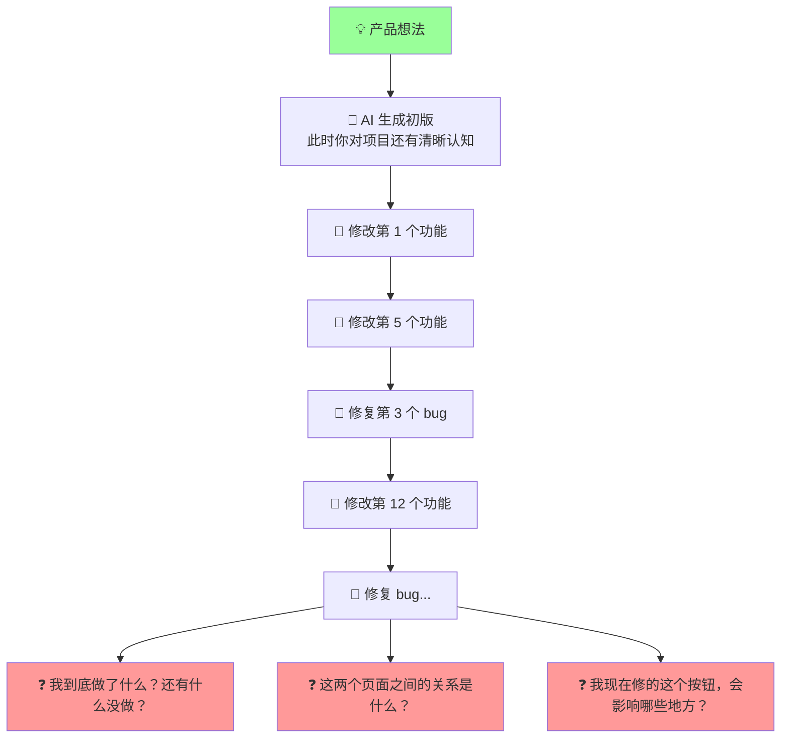
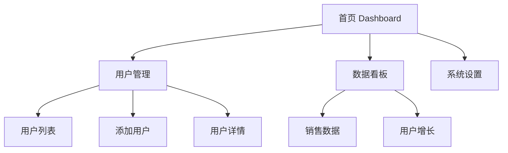
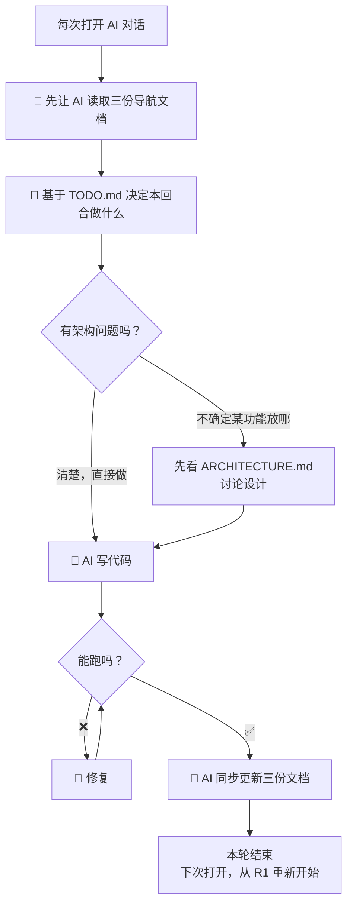

# AI 产品开发的导航系统（专业版）

> [!abstract] 解决什么问题
> 用 AI 生成产品时，越到后期越容易陷入「无尽调试循环」——只看得见当前这个 bug、这个文件、这一行代码，丢失了产品的**全局视野**。PRD 和 README 是静态的，不会随着开发自动更新；项目的逻辑架构图更是从头到尾都没出现过。
>
> 本质问题：==你缺少一套与 AI 协作的「导航系统」——三份始终保持最新的活文档，让你在任何时候都能从高空俯视整个产品。==

---

## 一、诊断：为什么会迷失？



| 症状 | 根因 |
|---|---|
| 「越到后面越不知道该干什么」 | 没有实时更新的 **TODO 清单**，做完的功能没有标记，待做的功能散落在记忆里 |
| 「无休止的测试」 | 没有**功能验收标准**，测到哪算哪，不知道什么时候算「测完了」 |
| 「只能以点观面」 | 没有**实时架构图**，不知道页面之间、数据之间、组件之间的关系 |
| 「README/PRD 不会自动更新」 | 把 PRD 当一次性产物，没有把它变成**活文档**的机制 |

---

## 二、解法：三份「活文档」构成导航系统

> [!important] 核心理念
> 不是做完项目再补文档——而是 **==让 AI 在每个开发回合同时维护这三份文档==**。它们是你的 GPS，让你永远看得见全局。

```mermaid
graph TD
    subgraph 导航系统
        A["📋 TODO.md<br/>实时任务清单"]
        B["🏗️ ARCHITECTURE.md<br/>项目逻辑架构图"]
        C["📄 README.md<br/>产品说明+启动指南"]
    end

    A -->|知道还剩下什么| D[👤 你——产品经理视角]
    B -->|知道每个部分的关系| D
    C -->|知道项目是什么、怎么用| D
    
    D -->|基于导航信息下达指令| E[🤖 AI——工程师执行]
    E -->|每次修改后同步更新| A
    E -->|每次修改后同步更新| B
    E -->|每次修改后同步更新| C
```



### 文档一：`TODO.md` — 实时任务清单

**作用**：让你永远知道「做完了什么、正在做什么、还剩什么」。

**格式**：
```markdown
# 项目 TODO

## ✅ 已完成
- [x] 首页布局 + 导航栏
- [x] 用户登录功能
- [x] 数据看板基础图表

## 🔨 进行中
- [ ] 导出 Excel 功能（正在做，后端接口已通，前端还没接）

## 📋 待做
- [ ] 用户权限管理
- [ ] 移动端适配
- [ ] 暗黑模式
- [ ] 数据看板新增「环比增长率」图表
```

> [!tip] 关键规则
> ==每次让 AI 改完代码后，加一句：「同步更新 TODO.md，标记已完成的功能，如果有新增的待做项也加上。」==

---

### 文档二：`ARCHITECTURE.md` — 项目逻辑架构图

**作用**：让你随时看到「这个产品由哪些部分组成、它们之间怎么关联」。

**格式示例**（用 Mermaid，AI 可以自动生成和更新）：

````markdown
# 项目架构

## 页面结构

````

> [!tip] 关键规则
> ==每新增一个页面或功能模块，让 AI 同步更新 ARCHITECTURE.md 中的 mermaid 图和组件关系描述。==
>
> Mermaid 在 Obsidian 中可以原生渲染，你看到的是可视化图表，不是枯燥的代码。

---

### 文档三：`README.md` — 产品说明 + 启动指南

**作用**：任何时间点打开项目，都能立刻知道「这是什么、怎么跑起来、怎么打包」。

> [!tip] 关键规则
> ==每完成一个里程碑功能，让 AI 更新 README.md 中的功能列表和使用说明。==
>
> 不要等到项目结束再补——那时候你已经忘了大半。

---

## 三、实战工作流：每个回合都更新导航



> [!important] 工作流铁律
> **每回合最后一步，一定是「更新导航文档」——不是可选的，是强制步骤。**
>
> 具体指令：「同步更新 TODO.md、ARCHITECTURE.md、README.md，反映本轮所有改动。」

---

## 四、具体指令模板（直接复制用）

### 项目初始化时

```
请创建三份文件：

1. TODO.md — 实时任务清单。列出我们要做的所有功能，标记为「待做」。
   格式使用 checkbox：- [ ] 功能名称

2. ARCHITECTURE.md — 项目架构文档。用 mermaid 图表画出：
   - 页面之间的跳转关系
   - 核心数据流向
   - 主要组件树

3. README.md — 产品说明，用中文写：
   - 这个项目做什么
   - 怎么启动（npm run dev）
   - 怎么打包（npm run build）
   - 项目目录结构（src/、pages/、components/ 各自放什么）

这三份文件是我们开发过程中的「导航地图」，之后每次改代码都要同步更新。
```

### 每个开发回合结束时

```
本轮完成了以下改动：[简述]。请同步更新三份导航文档：
- TODO.md：已完成项打 ✅，把不再需要的待做项删掉
- ARCHITECTURE.md：如有新增/修改的页面或组件关系，更新 mermaid 图
- README.md：如有新功能上线，更新功能列表和使用说明
```

### 迷失时（不知道做到哪了）

```
请帮我读取 TODO.md、ARCHITECTURE.md、README.md 三份文件，然后告诉我：
1. 当前项目的整体状态——做完了哪些，还剩哪些
2. 根据 TODO.md，建议接下来优先做哪三个功能及其理由
3. 有没有哪些已完成的功能可能需要 review 或修复
```

---

## 五、面试视角：如何向面试官描述这套体系

> [!example] 面试问题：「你如何管理 AI 辅助开发的项目，确保不失控？」

> 我建立了一套「活文档导航系统」来管理 AI 辅助开发项目的复杂度。
>
> 核心思路是：==不只是让 AI 写代码，还让 AI 在每次改动后同步维护三份「活文档」==——TODO.md（实时任务清单）、ARCHITECTURE.md（Mermaid 项目架构图）和 README.md（产品说明）。
>
> 这解决了三个关键问题：
> 1. **优先级管理**——TODO.md 让团队成员任何时候打开项目都知道进度，不需要翻聊天记录
> 2. **架构可见性**——ARCHITECTURE.md 的 Mermaid 图让非技术人员也能直观理解项目结构，不用看代码
> 3. **知识留存**——每一轮改动的信息都被记录，即使三个月后回来接盘，读这三份文档就能重建全局认知
>
> 关键是把它变成**强制性流程**——每轮 AI 对话的最后一步必须是更新导航文档，就像 Git commit 一样不可跳过。

---

## 六、关联笔记

- [[05-产品与开发/Vibe Coder/Vibe Coding 产品经理法则]] — 你是 PM，不是工程师。导航系统是 PM 的核心工具
- [[05-产品与开发/Vibe Coder/AI生成产品的经验法则]] — 其中的「最小可用起步」「做一步验一步」与本篇配合使用
- [[05-产品与开发/Vibe Coder/AI生成产品的经验法则]] — 大众版
- [[05-产品与开发/Vibe Coder/AI产品开发导航系统]] — 本篇的大众阅读版
