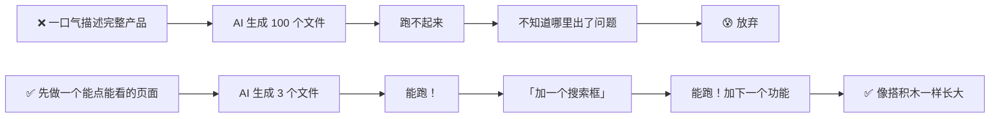
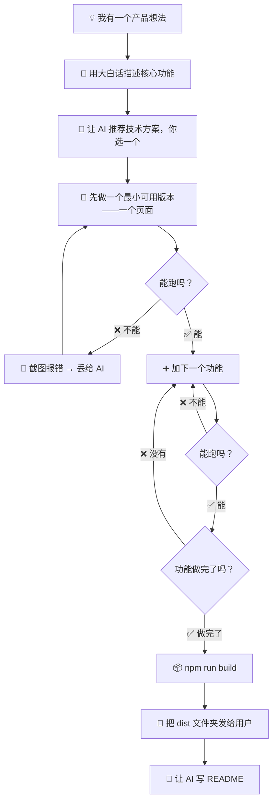

# AI 生成产品的经验法则（专业版）

> [!abstract] 适用场景
> 面向产品经理岗位、面试准备、团队内部分享。如果你需要快速出产品 MVP 验证想法，或面试中被问到「如何用 AI 提效产品研发」，这篇笔记提供完整的经验框架和可复用的回答素材。
>
> 📱 大众阅读版请见：[[05-产品与开发/Vibe Coder/AI生成产品的经验法则]]

---

## 一、心态第一：你不是在写代码，你是在做产品

> [!important] 最重要的认知
> 用 AI 生成产品和你用 Word 写文档没有本质区别——==你不需要知道 Word 的底层怎么渲染文字，你只需要知道你要写什么。==

| 传统的做法 | 你的做法 |
|---|---|
| 学编程 6 个月 | 跳过 |
| 搭开发环境 | 让 AI 帮你搞定 |
| 写代码 2 周 | 对 AI 说「我要一个记账软件」 |
| 调试 1 周 | 把报错截图丢给 AI |

> 你不是在「学编程」，你是在「做产品」。==工具层面的问题都交给 AI，你聚焦在「这个产品到底要解决什么问题」上。== 详见 [[05-产品与开发/Vibe Coder/Vibe Coding 产品经理法则]]。

---

## 二、经验 1：从「最小可用」开始，别一步到位

> [!bug] 新人最常见的错误
> 「我要一个类似淘宝的电商平台，有首页、搜索、购物车、支付、物流追踪、评价系统、直播带货……」

> [!success] 正确的做法
> 「先做一个页面：一个商品列表，每个商品有图片、名称、价格，点进去能看到详情。」

> [!tip] 核心原则
> ==先让最简单的版本跑起来，再一层一层加功能。== 每加一层就测试一下，坏了立刻知道是哪一步搞坏的。

---

## 三、经验 2：描述功能时，像教一个很聪明但不了解你行业的实习生

> [!example] 好的描述 vs 坏的描述
>
> | ❌ 坏的描述 | ✅ 好的描述 |
> |---|---|
> | 「做一个用户管理系统」 | 「做一个页面：上面是搜索框，下面是表格，每一行显示姓名、手机号、注册时间。搜索框打字后表格自动筛选。顶部有个「添加用户」按钮。」 |
> | 「风格要现代一点」 | 「用蓝色和白色做主色，按钮圆角，卡片有轻微阴影，像 Apple 官网那种简洁风格。」 |
> | 「要能导出数据」 | 「每行前面加一个勾选框，表格上方加「批量导出」按钮，选中后点击可下载 Excel。」 |

> [!tip] 描述公式
> ==「在哪里 + 什么东西 + 什么样子 + 什么交互」==
>
> 越具体，AI 越不容易跑偏。你不需要懂技术词汇，你只需要描述「用户看到什么、能做什么」。

---

## 四、经验 3：让 AI 先出方案，别替它选技术

> [!warning] 这是你之前学到的最关键一条经验
> 详见 [[05-产品与开发/Vibe Coder/Vibe Coding 产品经理法则]]——==你是产品经理，AI 是工程师。==

| 你说的话 | 后果 |
|---|---|
| 「帮我用 React 做……」 | AI 被迫用 React，即使 Vue 可能更适合你 |
| 「帮我用 MySQL 存数据」 | AI 可能用关系型数据库硬存非关系型数据 |
| 「帮我做一个用户登录功能，你推荐用什么方式？」 | AI 评估你的场景，给你 2-3 个方案让你选 |

> [!tip] 万能句式
> 「我需要 [功能]，你推荐用什么方式实现？给我 2-3 个方案，说明优缺点，我来选。」

---

## 五、经验 4：把 AI 当成一个「失忆但极其高效的搭档」

> [!bug] AI 的天然弱点
> - ==会忘==：聊了 30 轮之后，它忘了你最开始说的需求
> - ==会瞎编==：遇到不懂的，它会编一个看起来很对的答案，而不是说「我不知道」
> - ==不会主动说「这有问题」==：它会按你的要求做，即使你的要求本身有矛盾

> [!tip] 对策
>
> | AI 的问题 | 你的对策 |
> |---|---|
> | 会忘 | 每轮开头重申核心需求：==「回顾一下，我们要做的是 XX，当前进度是 YY」== |
> | 会瞎编 | 关键信息让它给出处：「这个方案是哪个官方文档里写的？给我链接。」 |
> | 不主动质疑 | 加一句：==「检查一下我说的需求有没有矛盾的地方，有的话提醒我。」== |

---

## 六、经验 5：文件结构不用全懂，但要知道「禁区」

> [!tip] 你只需要记住这些（[[05-产品与开发/Vibe Coder/Vibe Coder 常见问题全景图|全景图]]里也讲过）

| 文件夹 | 规则 |
|---|---|
| 🟢 `src/`、`pages/`、`components/` | ==你的代码在这里==，AI 改的时候主要动这里 |
| 🟡 `package.json`、`vite.config.js` | ==配置文件==，偶尔需要改，让 AI 指导 |
| 🔴 `node_modules/` | ==永远不要手动碰==，这是 AI 的食材仓库 |
| 🔴 `.git/` | ==版本历史的存档==，不要手动改 |
| ⚪ `dist/`、`build/` | ==最终产物==，发给用户用的 |

---

## 七、经验 6：做一步，验证一步，别攒到最后

> [!bug] 错误姿势
> 让 AI 一口气生成 10 个功能 → 一次性跑 → 报了几十个错 → 不知道哪个功能引起的。

> [!success] 正确姿势
> 1. 生成功能 A → 跑起来看看 → ✅ 能用
> 2. 生成功能 B → 跑起来看看 → ✅ 能用
> 3. 生成功能 C → 跑起来看看 → ❌ 坏了！→ 让 AI 立刻修 C

> [!tip] 口诀
> ==加一个功能，测一下。坏了立刻修，别攒着。==

---

## 八、经验 7：交付出 `dist/`，别把整个项目打包

> [!danger] 新人最容易踩的交付坑
> 把整个项目文件夹（含 `node_modules`，几百 MB）打成 zip 发给别人——==对方打不开，打开也用不了==。

> [!success] 正确做法
> 详见 [[05-产品与开发/Vibe Coder/Vibe Coding 软件瘦身指南]]。
> 一句话：==`npm run build` 之后，只把 `dist/` 文件夹发给用户==。几 MB 到几十 MB，双击 `index.html` 就能用。

---

## 九、经验 8：遇到报错不要慌，截图丢给 AI

> [!tip] 报错不是你的失败，是 AI 获取信息的渠道
> 红色报错信息 = AI 诊断问题的最佳依据。==完整截图 → 丢给 AI → 问「这是什么问题？怎么解决？」==

| 常见报错关键词 | 大概意思 |
|---|---|
| `Cannot find module` | 少了某个工具包 |
| `is not defined` | 用了一个不存在的东西 |
| `Unexpected token` | 语法写错了（少括号、少逗号） |
| `Port already in use` | 上一次启动的还没关 |

---

## 十、经验 9：记得写 README，下次回来你能看懂

> [!bug] 典型场景
> 三周后想加功能，打开项目——「这是 AI 写的，我不记得逻辑了。」

> [!success] 对策
> 每做完一个项目，对 AI 说一句：
> 「帮我写一份 README.md，用中文，说明：这个项目做什么、怎么启动、怎么打包、每个文件夹放什么。」

> [!tip] 这 30 秒会为你省下未来 3 小时的回忆时间。

---

## 十一、经验 10：密钥绝对不能写进代码里

> [!danger] 血的教训
> 如果你的产品需要调用 AI 接口（比如接 ChatGPT、文心一言等），会有一个「钥匙」（API Key）。
> ==这把钥匙写在代码里 → 上传到 GitHub → 被别人看到 → 别人用你的额度狂刷 → 一夜欠几千块。==

> [!success] 正确做法
> 让 AI 帮你创建 `.env` 文件来放密钥，并加上 `.gitignore` 防止上传。每次涉及密钥时问 AI：「帮我确认密钥没有被放进代码里。」

---

## 十二、完整流程图

---

## 十三、一句话总结

> [!tip] 记住这五条就够了
> 1. ==先做最小可用版，一步一步加功能==
> 2. ==描述「用户看到什么、能做什么」，不说「用什么技术」==
> 3. ==每加一个功能就测一下==
> 4. ==交付出 dist，不发 node_modules==
> 5. ==密钥绝不写代码里==

---

## 关联笔记

- [[05-产品与开发/Vibe Coder/Vibe Coding 产品经理法则]] — 你描述需求，AI 决定方案
- [[05-产品与开发/Vibe Coder/Vibe Coding 软件瘦身指南]] — 交付给用户的正确姿势
- [[05-产品与开发/Vibe Coder/Vibe Coder 常见问题全景图]] — 从起步到维护的全阶段踩坑指南
- [[01-AI技术/AI Agent 工具/AI_Agent_工具全景对比]] — 选哪个工具给你生成产品
