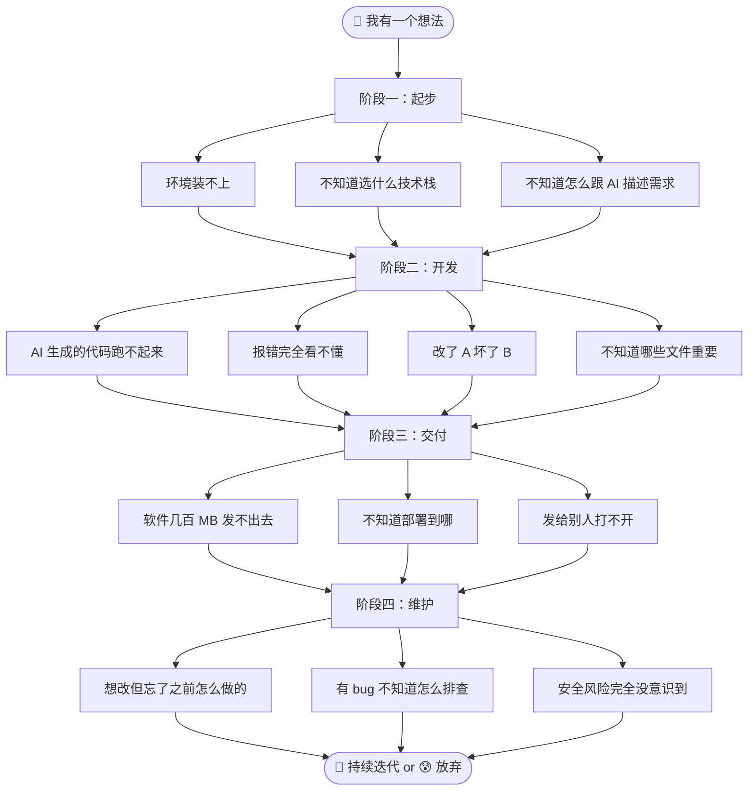

# Vibe Coder 常见问题全景图

> [!abstract] 这篇笔记讲什么
> 作为零代码基础的 Vibe Coder，在让 AI 帮你写软件的全流程中，你会遇到哪些「卡住」的时刻？这篇文章按阶段帮你提前预判，并逐步建设 [[05-产品与开发/Vibe Coder/Vibe Coder 常见问题全景图]]。

---

## 全景概览



---

## 阶段一：起步 🚀

### 1.1 环境装不上

> [!note]- 先搞清楚：什么是「环境」？
> 「装环境」就是在你电脑上安装编程需要的工具软件（比如 Node.js），就像你想做饭先得有锅和灶台一样。很多时候装环境是零基础遇到的第一道坎——不是你的问题，是这些工具本来就不是给普通人设计的。

> [!bug] 典型场景
> 跟着教程装 Node.js，装完在终端输入 `node -v` 显示「不是内部或外部命令」；装 Python 装了三个版本，pip 不知道连的哪个。

| 常见症状 | 根因 |
|---|---|
| `'npm' 不是内部或外部命令` | 电脑的「地址簿」（环境变量）没配好——软件装上了，但电脑不知道它在哪 |
| `python` 和 `python3` 指向不同版本 | 多个 Python 混装 |
| `npm install` 卡住不动 | 网络代理 / 没换国内镜像（从国内源下载，速度快很多） |

> [!tip] 解法
> 让 AI 帮你诊断：「帮我检查一下我的 Node.js 装好了没有，如果没有，给我一步步的安装指引。」
>
> 📖 详细展开 → [[05-产品与开发/Vibe Coder/01-入门准备/环境安装指南]]

---

### 1.2 不知道选什么技术栈

> [!bug] 典型场景
> AI 问：「你要用 React 还是 Vue？Vite 还是 Webpack？Tailwind 还是纯 CSS？」你：==「？？？」==

> [!tip] 解法
> 告诉 AI 你的目标，让它帮你选：「我是零基础，想做一个简单的个人博客网站，帮我选最适合新手的技术栈，并解释为什么选这个。」

**零基础常用推荐**：

| 场景 | 推荐技术栈 | 理由 |
|---|---|---|
| 个人博客 / 简单网页 | HTML + CSS + JS（或 Astro） | 最纯，概念最少 |
| 稍复杂的单页面应用 | Vite + React | 生态最大，教程最多 |
| 追求上手速度 | Vite + Vue | 模板语法更直觉 |

> 📖 详细展开 → [[05-产品与开发/Vibe Coder/01-入门准备/技术栈选择指南]]

---

### 1.3 不知道怎么跟 AI 描述需求

> [!bug] 典型场景
> 「帮我做一个软件」→ AI 生成完全不是你想要的。Prompt 太笼统，AI 只能瞎猜。

> [!example] 好的 Prompt vs 差的 Prompt
>
> | ❌ 差的 Prompt | ✅ 好的 Prompt |
> |---|---|
> | 「帮我做一个记账软件」 | 「帮我做一个网页版记账软件，能添加收入和支出，显示本月余额。页面要简洁，不需要登录功能。我零基础，每一步请解释。」 |
> | 「加个功能」 | 「在首页右上角加一个『导出 Excel』按钮，点击后把当前月账单下载为 .xlsx。」 |
> | 「修一下 bug」 | 「点击搜索按钮后页面刷新了，应该是不刷新、直接在下面显示搜索结果。」 |

> [!tip] 万能 Prompt 公式
> ==【做什么】【在哪做】【期望效果】【技术限制（可选）】【我零基础（可选）】==
>
> > [!warning] 更进一步
> > 还有一个更深层的陷阱：==不要告诉 AI「用什么技术」==，只描述需求。
> > 详见 [[05-产品与开发/Vibe Coder/Vibe Coding 产品经理法则]]。

> 📖 详细展开 → [[05-产品与开发/Vibe Coder/02-开发实战/Prompt 工程速查（vibe coding 专用）]]

---

## 阶段二：开发 🔨

### 2.1 AI 生成的代码跑不起来

> [!bug] 典型场景
> 复制 AI 代码 → `npm run dev` → 一片红字。

| 原因 | 大概占比 | 表现 |
|---|---|---|
| 缺少某个依赖 | 40% | `Cannot find module 'xxx'` |
| Node.js 版本不兼容 | 20% | `xxx is not supported` |
| AI 少复制了一部分代码 | 20% | `xxx is not defined` |
| 端口被占用 | 15% | `Port 3000 already in use` |
| 文件路径问题 | 5% | 找不到某文件 |

> [!tip] 解法
> ==全部报错截图/复制丢回给 AI==：「这句报错什么意思？怎么解决？」——AI 最擅长读报错。

---

### 2.2 报错完全看不懂

> [!bug] 典型场景
> 终端蹦出一大段红色英文：
> ```
> ERROR in ./src/App.tsx 12:5-23
> Module not found: Error: Can't resolve './components/Header'
> ```
> 你只看懂了 `ERROR`，其他全懵。

> [!tip] 核心技巧
> ==在堆栈里找「你自己的文件名」==——上例中 `./src/App.tsx:12:5` 就是你的文件第12行第5列，问题就在那。然后把报错原样丢给 AI。

> 📖 详细展开 → [[05-产品与开发/Vibe Coder/02-开发实战/报错自救手册]]（含 2.1 和 2.2 的完整解决方案）

> [!note]- 常见报错速查表
>
> | 报错关键词 | 大白话含义 |
> |---|---|
> | `Cannot find module` | 少装了东西 / 路径写错了 |
> | `is not defined` | 用了一个不存在的变量 |
> | `Unexpected token` | 语法写错了（少括号、少逗号） |
> | `Port already in use` | 上次启动的没关，端口被占 |
> | `permission denied` | 权限不够 |
> | `ETIMEDOUT` / `ECONNREFUSED` | 网络不通 |

---

### 2.3 改了 A 坏了 B——迭代地狱 ♻️

> [!bug] 典型场景
> 让 AI 改按钮颜色 → AI 改了一段 → 整个页面崩了。你不知道为什么，也不知道怎么回退。

> [!tip] 对策
> - **每次改前，先让 AI 告诉你：「你要改哪个文件？改什么内容？为什么？」**——确认后再动手
> - ==强烈建议学 5 分钟 Git==：让 AI 帮你「保存当前版本，备注：改按钮颜色前」，出问题一招回退
> - 每次只让 AI 改 ==一件事==，不要一把梭

> 📖 详细展开 → [[05-产品与开发/Vibe Coder/02-开发实战/Vibe Coding 迭代防退化指南]] | [[05-产品与开发/Vibe Coder/02-开发实战/Git 极简生存指南]]

---

### 2.4 不知道哪些文件重要

> [!bug] 典型场景
> 打开项目，20 来个文件和文件夹，完全不知道哪些能动哪些不能动。

> [!tip] 文件分类速记
>
> | 类型 | 示例 | 规则 |
> |---|---|---|
> | 🟢 你的代码 | `src/`、`pages/`、`components/` | 放心改，这就是你写的 |
> | 🟡 配置文件 | `package.json`、`vite.config.js` | 偶尔改，让 AI 指导 |
> | 🔴 禁区 | `node_modules/`、`.git/`、`dist/` | ==永远不要手动改== |
> | ⚪ 自动生成 | `package-lock.json`、`.next/` | 不用管 |

> 📖 详细展开 → [[05-产品与开发/Vibe Coder/01-入门准备/文件结构认知指南]]

---

## 阶段三：交付 📦

### 3.1 软件几百 MB 发不出去

> [!bug] 典型场景
> 把整个项目文件夹（含 `node_modules`）打包 → 800MB → 微信传不了 → 对方打不开。

> [!success] 解法
> ==`npm run build`== → 只发 `dist/` 产物。详见 [[05-产品与开发/Vibe Coder/Vibe Coding 软件瘦身指南]]。

---

### 3.2 不知道怎么部署上线

> [!bug] 典型场景
> 「网页在自己电脑上能看，怎么让别人也能访问？」

| 你的项目类型 | 最简单的部署方式 | 费用 |
|---|---|---|
| 纯静态网页 | **GitHub Pages** 或 Vercel 拖拽 | 免费 |
| 前端 SPA（React/Vue） | **Vercel**（绑 GitHub 自动部署） | 免费 |
| 带后端的全栈项目 | **Railway / Fly.io** | 有免费额度 |
| 桌面应用 | 打包成 exe，网盘分享 | 免费 |

> [!tip] 解法
> 「这是一个 [React/纯HTML] 项目，帮我部署到 Vercel，告诉我每一步怎么操作。」

> 📖 详细展开 → [[05-产品与开发/Vibe Coder/03-交付与安全/部署懒人包]]

---

### 3.3 发给别人打不开

> [!bug] 典型场景
> 你发了 `dist/` → 对方双击 `index.html` → 白屏 / 报错 / 样式全丢。

| 常见原因 | 解法 |
|---|---|
| 资源路径用了 `/static/` 而不是 `./static/` | 让 AI 在 build 配置里加 `base: './'` |
| 对方用 IE / 古董浏览器 | 提醒用 Chrome/Edge |
| API 请求指向了 `http://localhost:3000` | build 时没换成生产地址 |

> [!tip] 解法
> 「Build 后的网页本地打开白屏，帮我把所有资源路径改成相对路径。」

---

## 阶段四：维护 🔄

### 4.1 想改但忘了之前怎么做的

> [!bug] 典型场景
> 三周后想加功能，看文件结构一脸懵——「这是 AI 写的，我不记得逻辑了。」

> [!tip] 对策
> ==每做完一个项目，让 AI 写一份 README==：
> 「帮我写项目的 README.md，用中文，说明：项目结构、怎么启动、怎么 build、主要文件是干什么的。」
>
> 下次回来先读这个。详见项目中的 `README.md`。

> 📖 详细展开 → [[05-产品与开发/Vibe Coder/04-维护收尾/项目交接与记忆]]

---

### 4.2 有 bug 不知道怎么排查

> [!bug] 典型场景
> 用户反馈「点按钮没反应」「页面加载不出来」，你不知道从哪开始查。

> [!tip] 给 AI 的四要素
> 把以下信息一起丢给 AI：
> 1. ==做了什么操作==（「点击首页的添加按钮」）
> 2. ==期望什么结果==（「应该弹出输入框」）
> 3. ==实际发生了什么==（「什么都没发生」）
> 4. ==浏览器控制台有没有红色报错==（==按 F12 → Console 标签==，截图）

---

### 4.3 安全问题——最容易忽略但最危险 #安全

> [!danger] 零基础 Vibe Coder 最常见的安全漏洞

| 危险操作 | 后果 | 怎么避免 |
|---|---|---|
| API Key 写在代码里，上传 GitHub | 别人盗用，一夜欠几千 | 用 `.env` 文件（专门放密码的文件），加 `.gitignore`（告诉系统「这个文件不要传上网」） |
| `.env` 打包进产物发给别人 | 同上 | build 时排查产物是否含敏感文件 |
| eval('用户输入') | 黑客可执行任意代码 | 让 AI 检查代码安全性 |
| 没开 HTTPS | 用户密码明文暴露 | 部署平台通常自动处理 |
| 表单没做校验 | 空字符、SQL 注入（黑客通过输入框填特殊文字来盗取数据） | 让 AI 加上前后端校验 |

> [!warning] 铁律
> ==任何看起来像密码、Key、Secret、Token 的东西，永远不要写在代码里，永远不要发给任何人。==

> 📖 详细展开 → [[05-产品与开发/Vibe Coder/03-交付与安全/安全实践指南]]

---

## 五、心态篇：Vibe Coder 的正确预期 🧠

> [!important] 最重要的一节
> 很多零基础用户放弃，不是因为技术，而是因为预期不对。

### 你不需要学的东西（先放掉）

| 不用急着学 | 为什么 |
|---|---|
| 算法与数据结构 | AI 会处理 |
| 底层原理（闭包、原型链等） | 你暂时用不到 |
| 手写 CSS 布局 | Tailwind 或 AI 处理 |
| 数据库设计范式 | AI 帮你设计 |

### 你需要学的东西（ROI 最高）

| 值得花时间的 | 大概耗时 |
|---|---|
| ==看懂报错==（找文件名+行号） | 10 分钟 |
| ==Git 基本三连==（保存、回退、看历史） | 30 分钟 |
| ==写清楚 Prompt== | 持续练习 |
| ==npm 基本命令==（`dev`、`build`、`install`） | 10 分钟 |
| ==看懂项目文件结构== | 每做项目积累 |
| ==知道什么是 API Key / 密钥==，不能泄露 | 5 分钟 |

### 什么时候你算「出师了」？

> [!tip] 三个标志
> 1. 你想做一个东西，能写出一段清晰的 Prompt → AI 生成 → ==能跑起来==
> 2. 每次报错，你不再恐慌，==先看文件名和行号==
> 3. 做完后知道要 ==`npm run build`==，能发给别人用

---

## 六、关联笔记

- [[05-产品与开发/Vibe Coder/Vibe Coding 软件瘦身指南]] — 解决交付时体积过大的问题
- [[05-产品与开发/Vibe Coder/Vibe Coding 产品经理法则]] — 为什么不要指挥 AI「怎么做」
- [[01-AI技术/AI Agent 工具/AI_Agent_工具全景对比]] — Codex/Claude Code/Hermes/QClaw/WorkBuddy/Marvis/Coze 七大工具横评
- [[05-产品与开发/Vibe Coder/02-开发实战/Vibe Coding 迭代防退化指南]] — 迭代地狱的完整解决方案
- [[05-产品与开发/Vibe Coder/02-开发实战/Git 极简生存指南]] — 5 分钟学会版本回退
- [[05-产品与开发/Vibe Coder/02-开发实战/Prompt 工程速查（vibe coding 专用）]] — 拿来即用的 Prompt 模板
- [[05-产品与开发/Vibe Coder/02-开发实战/报错自救手册]] — 零基础看懂报错+排查+修复
- [[05-产品与开发/Vibe Coder/03-交付与安全/部署懒人包]] — 三步发布到互联网
- [[05-产品与开发/Vibe Coder/01-入门准备/环境安装指南]] — 从零搭建开发环境
- [[05-产品与开发/Vibe Coder/01-入门准备/技术栈选择指南]] — 选对技术不走弯路
- [[05-产品与开发/Vibe Coder/01-入门准备/文件结构认知指南]] — 看懂项目文件，知道哪些能动
- [[05-产品与开发/Vibe Coder/03-交付与安全/安全实践指南]] — 密钥管理、防泄露
- [[05-产品与开发/Vibe Coder/04-维护收尾/项目交接与记忆]] — README 写法、项目文档规范

---

## 七、一句话总结

> [!warning] 记住这五点就够了
> 1. ==报错截图丢给 AI==
> 2. ==每次改动前先问 AI 要改什么==
> 3. ==交付出 `dist/`，不发 `node_modules`==
> 4. ==做完写 README==
> 5. ==密钥绝对不能写代码里==
