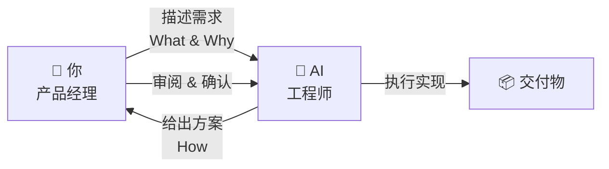
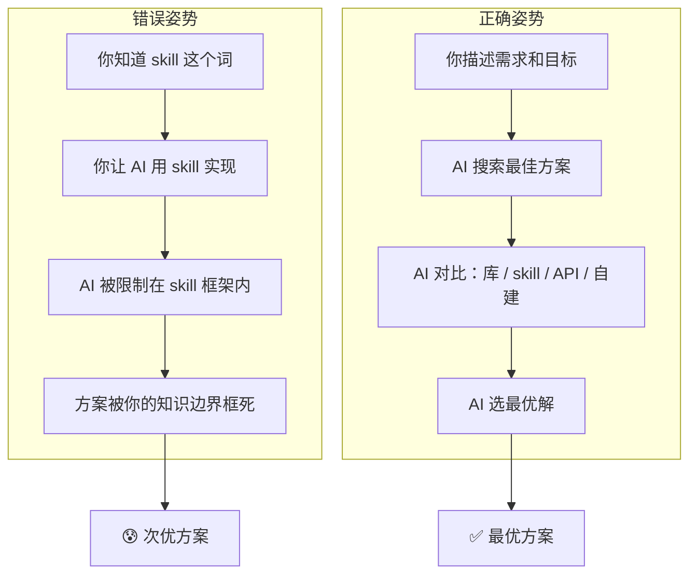
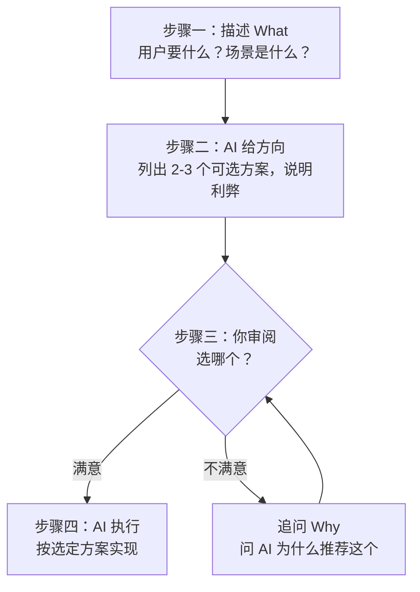

# Vibe Coding 产品经理法则

> [!abstract] 这篇笔记的核心观点
> ==AI 的输出质量，上限不是 AI 的能力，而是你的知识边界。==
> 当你用错误的知识去「指挥」AI 怎么做，你实际上是在给 AI 戴上手铐。
> 正确的姿势是：像产品经理一样**描述需求**，像 CEO 一样**审阅方案**，把决策权留给 AI。

---

## 一、一个真实的场景

> [!example] 假设你要做一个「模型供应商模块」
>
> **你的第一反应**：「帮我用一个 skill 来实现模型供应商模块。」
>
> （因为你之前见过 AI 用 skill 做了别的功能，你以为 skill 是万能的）

> [!failure] 结果
> AI 硬着头皮用 skill 给你糊了一个——代码又臭又长，维护困难，三天两头出 bug。

> [!success] 正确的说法
> 「我需要一个模型供应商模块，功能是让用户可以选择不同的 AI 模型（比如 GPT-4、Claude、文心一言等）。帮我设计一个方案，告诉我用什么方式实现最合适。」
>
> AI 可能会说：==「建议用 adapter 模式 + 一个模型供应商库，而不是用 skill。」== ——这才是最优解。

---

## 二、核心定律：产品经理 vs 工程师

> [!important] 角色类比
> 你和 AI 之间，最理想的关系不是「师傅带徒弟」，而是：



| 角色 | 谁 | 做什么 | 怎么做类比 |
|---|---|---|---|
| 🎯 **产品经理** | ==你== | 描述问题、定义需求、验收结果 | 「用户需要什么？」「这个好不好用？」 |
| 🔧 **工程师** | ==AI== | 选技术方案、写代码、做架构 | 「用什么技术？」「怎么写最优？」 |

> [!warning] 最危险的姿势
> 你一个不懂代码的「产品经理」，跑去抢「工程师」的活——告诉 AI 用什么技术、用什么库、用什么模式。
> ==你越「懂行」地下指导，结果越差。==

---

## 三、为什么「瞎指挥」比「不懂」更可怕？

### 3.1 你的知识边界 = AI 的天花板



### 3.2 更具体的例子：你知道的名词越多，陷阱越多

| 你说的话 | AI 被迫做的事 | 可能的更优解 |
|---|---|---|
| 「帮我用 ==skill== 实现模型供应商」 | 用 skill 硬套 | 应该用 **adapter 模式 + 第三方库** |
| 「帮我用 ==Webpack== 打包」 | 用 Webpack | 你的项目可能用 **Vite** 好得多 |
| 「帮我写一个 ==Redux== 状态管理」 | 引入 Redux 全家桶 | 小项目 **useState + Context** 就够了 |
| 「帮我用 ==MySQL== 做数据库」 | 装 MySQL | 你的数据可能是文档型的，**MongoDB** 更合适 |
| 「帮我部署到 ==阿里云==」 | 折腾服务器 | 静态网页直接 **Vercel** 免费还省事 |

> [!important] 核心矛盾
> 你的每一个技术词汇，都是一把双刃剑——
> 它让你「看起来懂」，但也让 AI 只能在你画的圈里跳舞。

---

## 四、正确的沟通模型：三步法



### 实操模板

> [!example] 需求描述模板（直接复制用）
>
> ```
> 我要做 [功能名称]，背景是 [一两句话说明场景]。
> 
> 核心功能：
> 1. [功能点 1]
> 2. [功能点 2]
> 3. [功能点 3]
> 
> 约束条件：
> - [比如：不需要登录 / 数据量很小 / 纯前端 / 要能离线用]
> 
> 请你：
> 1. 先给我 2-3 个可选的技术方案，说明各自优缺点
> 2. 推荐你认为是最好的一种，并解释原因
> 3. 我确认后再开始写代码
> ```

---

## 五、你该说 vs 不该说的话

### ❌ 不该说的（越界指挥）

> 「帮我用 ___ 实现 ___」
> 「为什么不用 ___？」
> 「我看到别人用 ___ 做的，我们也用这个」
> 「帮我配一下 ___」

### ✅ 应该说的（描述需求）

> 「用户需要 ___ 的功能」
> 「我希望这个功能能做到 ___」
> 「这个功能的边界是 ___」（什么不需要）
> 「你推荐什么方案？为什么？」
> 「给我几个选项，我来选」

---

## 六、唯一需要掌握的「技术词汇」

| 你最该懂的概念 | 为什么 |
|---|---|
| ==**库 / Library**== | 别人写好的代码包，你引进来用（像买现成调料包） |
| ==**框架 / Framework**== | 更大的库，规定了你怎么组织代码（像连锁加盟店的 SOP） |
| ==**API**== | 调用外部服务的方式（像打客服电话，按格式说就能得到结果） |
| ==**前后端**== | 前端是用户看到的界面，后端是服务器上跑的逻辑 |
| ==**数据库**== | 存数据的地方 |

> [!tip] 和 AI 对比方案时
> 你只需要会问一句话：
> **「方案 A 和方案 B，对我这个场景来说，哪个更简单、维护成本更低？」**
> AI 会给你解释——然后你==信它==。

---

## 七、边界情况：什么时候你可以「指挥」？

> [!note] 以下情况你可以直接说怎么做
>
> | 情况 | 例子 |
> |---|---|
> | 你==确定==某个方案是最优的 | 「用 Vite 而不是 Webpack」（你已经调研过了） |
> | 样式 / UI 调整 | 「这个按钮改成蓝色，字号加大」——这不涉及技术选型 |
> | 纯功能增删 | 「删除搜索框的自动补全功能」 |
> | 你有明确的公司/团队规范 | 「我们团队规定必须用 Nuxt.js」 |

> [!warning] 规则判定
> 如果一句话里包含了 ==**具体技术名词**（库、框架、工具、协议）==，先问自己：
> ==「我真的确定这是最优解吗？还是因为我只知道这个？」==
>
> 如果不确定——==把怎么做的决定权还给 AI==。

---

## 八、一句话总结

> [!tip] 产品经理法则
> **你是产品经理，不是工程师。**
> 你的价值在于 ==知道用户要什么==，不在于 ==知道代码怎么写==。
> 
> 需求描述越清晰，AI 方案越优秀。
> 技术指导越具体，AI 产出越平庸。

---

## 关联笔记

- [[05-产品与开发/Vibe Coder/Vibe Coder 常见问题全景图]] — 看看「不知道怎么写 Prompt」属于哪个阶段
- [[05-产品与开发/Vibe Coder/Vibe Coder 常见问题全景图]] — 回到知识地图
- 待补充：[[05-产品与开发/Vibe Coder/02-开发实战/Prompt 工程速查（vibe coding 专用）]]
- [[05-产品与开发/Vibe Coder/AI生成产品的经验法则]] — 学了方法论，下一步是动手做
