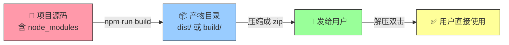
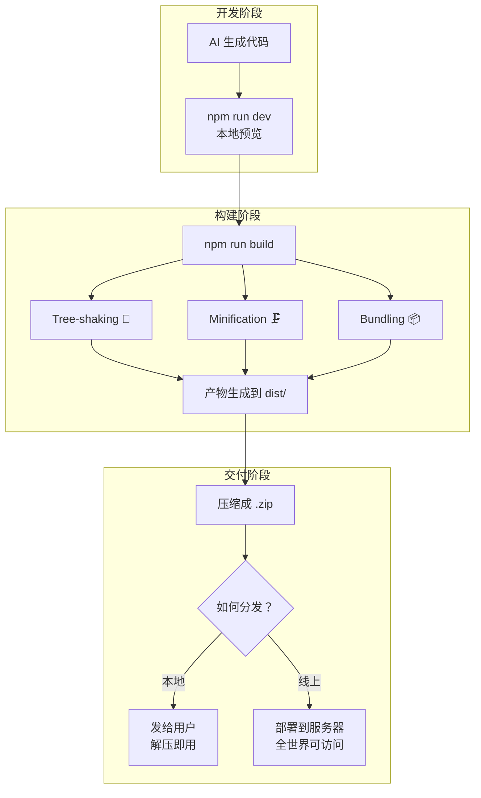

# Vibe Coding 软件瘦身指南

> [!abstract] 这篇笔记讲什么
> 写给零代码基础的 Vibe Coder：为什么 AI 生成的项目动辄几百 MB，以及如何把它变成用户能用的「小体积」软件。

---

## 一、先搞清楚：为什么 `node_modules` 这么大？

想象你开了一家餐厅：

- **`node_modules`** = 你的 ==食材仓库==。你只想做一道西红柿炒鸡蛋，但仓库里却堆满了整个超市的食材。因为你的菜谱引用了「中式调料包」，调料包又引用了「万能基础调料」，层层嵌套，仓库就爆炸了。
- 你写的代码（比如 100 行）引用了 3 个库，这 3 个库各自又引用了 50 个子库……最终 `node_modules` 可能有 ==几万甚至几十万个文件==，轻松上百 MB。

> [!important] 关键认知
> **这只在开发阶段需要**——相当于你在厨房试菜时需要各种备用食材。但端给客人（用户）时，你只需要 ==炒好的那盘菜==。

> [!note]- 其他语言也有类似的东西
> 同样的道理，Python 项目中有 `venv/` 或 `.venv/` 虚拟环境、Java 项目中有 `target/` 或 `build/`，它们都是「开发态才需要」的东西。

---

## 二、核心概念：开发态 vs 交付态

| 维度 | 开发态（你电脑上） | 交付态（给用户） |
|---|---|---|
| 🍳 类比 | 厨房 + 食材仓库 | 打包好的外卖 |
| 📦 包含什么 | 源码、`node_modules`、配置文件 | 最终可运行的最小文件集 |
| 📏 大小 | 几百 MB ~ 上 GB | 几 MB ~ 几十 MB |
| 👤 用户需要什么 | ❌ 不需要给用户 | ✅ 双击 / 浏览器打开就能用 |
| ⚙️ 用户需要装环境吗 | — | 最好不需要 |

> [!tip] 核心思想
> 开发时用 `node_modules`（食材仓库），交付时只给「用到的代码内嵌后」的最终产物（做好的菜）。

---

## 三、不同项目类型 → 不同瘦身方式

### 3.1 前端 Web 项目 #前端 #web

> 最常见的情况。你只需一条命令：

```bash
npm run build
```

这条命令会做三件事：

| 步骤 | 专业术语 | 做了什么 |
|---|---|---|
| ① 摇掉没用到的代码 | **Tree-shaking** 🌳 | 只保留你真正 `import` 了的部分，没用的一律扔掉 |
| ② 压缩代码 | **Minification** 🗜️ | 变量名缩短、删空格和换行、代码变成一行 |
| ③ 合并成少量文件 | **Bundling** 📦 | 所有需要的代码打成几个小文件（HTML + JS + CSS） |

> [!question] 产物在哪？
>
> | 框架 / 工具 | `npm run build` 后的产物目录 |
> |---|---|
> | Vite + React/Vue | `dist/` |
> | Create React App | `build/` |
> | Next.js | `.next/` |
> | Nuxt.js | `.output/` |

> [!success] 交付方式
> 把产物文件夹给用户即可——它已经是一个 ==不再需要 `node_modules` 的独立版==。



---

### 3.2 桌面应用（Electron 等） #桌面应用 #electron

如果你做的是桌面软件，需要使用专门的打包工具：

| 工具 | 说明 |
|---|---|
| **electron-builder** | 把整个 Electron 应用打包成 `.exe` / `.dmg` / `.AppImage` |
| **electron-forge** | 同上，另一种工具链 |

> [!success] 交付方式
> 用户安装后就像普通 Windows / Mac 软件一样使用，==不需要安装 Node.js==。

---

### 3.3 Node.js 命令行工具 / 后端 #cli #nodejs

如果想打包成一个独立的可执行文件：

| 工具 | 一句话说明 |
|---|---|
| **pkg** | 把 Node.js 项目打包成单个 `.exe` |
| **nexe** | 同上，另一种选择 |
| **Bun compile** | 用 Bun 运行时打包，速度最快 |

用户拿到一个 `.exe` 文件，双击就能跑。

---

### 3.4 Python 项目 #python

Python 项目类似，`venv/` 就是它的「食材仓库」：

| 工具 | 一句话说明 |
|---|---|
| **PyInstaller** | 把 Python 项目打包成单个 `.exe`，内置 Python 解释器 |
| **Nuitka** | 同上，编译成原生代码，更快 |

---

## 四、一个具体的交付流程（前端为例）



> [!note]- 纯静态 HTML 项目更简单
> 如果是纯静态 HTML 项目（没有框架），甚至不需要 build——直接把 HTML 文件复制出来就行，那些 `node_modules` 本来就没用到。

---

## 五、给 Vibe Coder 的 AI 提问模板 #ai提示词

当你让 AI 生成完项目后，直接问这几句话：

> [!example] AI 提问四连
> 1. 「帮我 ==build== 这个项目，生成可以给用户直接用的最终文件」
> 2. 「输出的产物在哪？用户需要怎么运行？」
> 3. 「如果用户没有安装 Node.js，能不能打包成一个 ==exe==？」
> 4. 「帮我检查一下，哪些文件/文件夹不需要给用户（比如 node_modules），帮我列出来」

---

## 六、常见术语速查表

| 术语 | 大白话 |
|---|---|
| **node_modules** | 食材仓库，开发时要、交付时不要 |
| **Build / 构建** | 把食材炒成菜的过程 |
| **Dist / 产物** | 炒好的菜，直接给用户 |
| **Bundling / 打包** | 把分散的代码合并成少数文件 |
| **Tree-shaking** | 只保留你真正用到的代码，没用的全扔掉 🌳 |
| **Minification** | 把代码压成一行，尽量缩小体积 |
| **Dependency** | 你引用的第三方库（别人的轮子） |
| **Deploy / 部署** | 把最终产物放到服务器上，让全世界能访问 |

---

## 七、一句话记住

> [!warning] 铁律
> **`node_modules` 是给开发者的，`dist/` 是给用户的。==永远不要把 `node_modules` 发给用户==。**

---

## 关联笔记

- [[05-产品与开发/Vibe Coder/AI生成产品的经验法则|专业版：AI 生成产品的经验法则]] — PM 面试视角，如何用 AI 高效出产品
- [[05-产品与开发/Vibe Coder/AI生成产品的经验法则]] — 零基础用 AI 做产品的 10 个坑
- [[05-产品与开发/Vibe Coder/Vibe Coder 常见问题全景图]] — 全阶段踩坑指南
