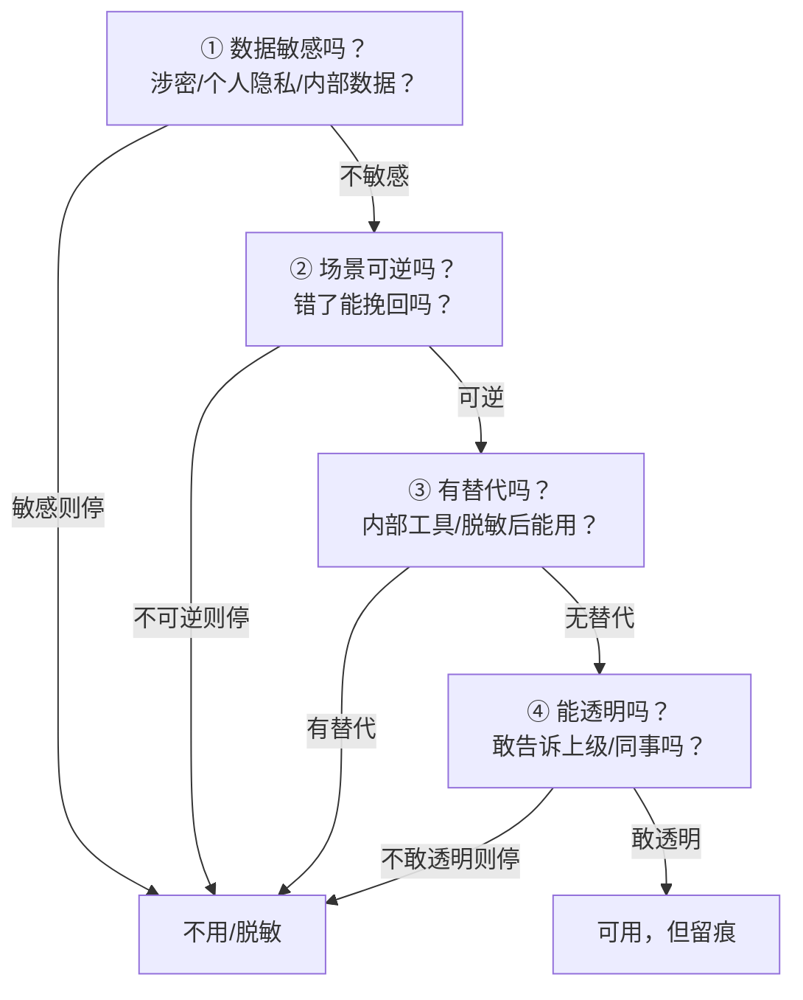
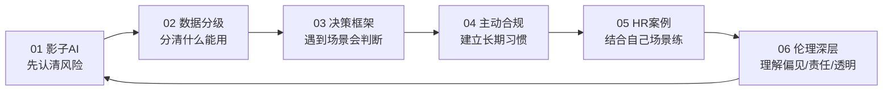
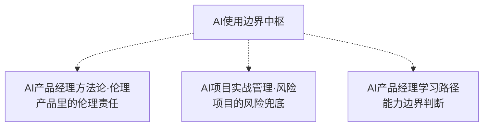

# 个人AI使用边界与伦理自律中枢

> [!abstract] 知识库定位
> 回答**"个人在组织里用 AI，边界在哪、怎么不越界"**——企业里普遍存在"影子 AI"（员工因效率用外部 AI，造成隐私合规风险）。本库的核心判断是：**这不是"用不用 AI"的二选一，而是"什么数据、什么场景、什么方式能用 AI"的边界决策**。个人要做的不是等公司管，而是**主动建立边界意识 + 主动合规 + 透明化**。
>
> 与 [[05-产品与开发/AI产品经理方法论/07_AI产品的伦理与责任]]（讲"AI PM 在产品里的伦理责任"）互补：方法论讲"做产品时怎么负责"，本库讲"**个人日常用 AI 时怎么自律**"。

---

## 一、核心模型：边界判断四问

> 面对任何"要不要把 X 交给 AI"的决策，先过四问。**四问都通过才用，任一不过就降级或不用。**

| 问 | 判断什么 | 不过怎么办 |
|----|---------|-----------|
| ① 数据敏感吗 | 涉密/个人隐私/内部数据 | 不用，或脱敏后用 |
| ② 场景可逆吗 | 错了能不能挽回 | 不可逆则不用 |
| ③ 有替代吗 | 内部工具/脱敏方案 | 有替代就用替代 |
| ④ 能透明吗 | 敢不敢告诉上级/同事 | 不敢透明则不用 |

> 一句话规则：**"敢透明"是底线——不敢让上级知道的 AI 用法，大概率越界了。**

---

## 二、文档导航

| 文档 | 核心问题 | 关键标签 |
|------|----------|----------|
| [[05-产品与开发/个人AI使用边界与伦理自律/01_影子AI现象与风险]] | 影子 AI 为什么普遍？风险到底多大？ | #影子AI #风险矩阵 #成因 |
| [[05-产品与开发/个人AI使用边界与伦理自律/02_数据敏感度分级与场景判断]] | 什么数据能喂给 AI？什么场景能用？ | #数据分级 #场景风险 #脱敏 |
| [[05-产品与开发/个人AI使用边界与伦理自律/03_个人AI伦理决策框架]] | 遇到具体场景，怎么快速决策？ | #边界四问 #决策流程 #降级 |
| [[05-产品与开发/个人AI使用边界与伦理自律/04_主动合规与透明化]] | 怎么主动管理风险，而不是等公司管？ | #主动合规 #透明化 #向上沟通 |
| [[05-产品与开发/个人AI使用边界与伦理自律/05_案例_HR场景的AI使用边界]] | HR 工作里哪些 AI 用法越界？怎么判断？ | #案例 #HR场景 #招聘 #绩效 |
| [[05-产品与开发/个人AI使用边界与伦理自律/06_AI伦理深层问题：偏见、责任与透明度]] | 除了数据安全，AI 伦理还有哪些深层问题？ | #AI偏见 #责任归属 #透明度 |

---

## 三、使用节奏（怎么用这个库）

> 建议顺序：先读 01 认清影子 AI 的风险（为什么不能无脑用），再读 02 建立数据敏感度直觉，03 是日常决策工具，04 是长期习惯，05 是结合 HR 场景的实战案例（最贴近你的工作），06 是 AI 伦理的深层问题（从"数据安全"上升到"伦理判断"）。

---

## 四、与已有知识库的衔接

- **产品视角**：[[05-产品与开发/AI产品经理方法论/07_AI产品的伦理与责任]] 讲"做产品时怎么负责"，本库讲"个人用 AI 时怎么自律"，两者互补。
- **项目视角**：[[05-产品与开发/AI项目实战管理/02-AI特有管理篇/04_AI项目的风险与兜底管理]] 讲"项目的风险兜底"，本库讲"个人的使用边界"。
- **能力视角**：边界判断四问是 [[05-产品与开发/AI产品经理学习路径/02-技术底座/03_能力边界判断：一个需求该不该用AI]] 在"个人使用"场景的延伸。

---

## 五、我的边界自检（闭环）

> [!todo] 每月自检一次
> - [ ] 我最近有没有"不敢让上级知道"的 AI 用法？
> - [ ] 我喂给外部 AI 的数据，有没有涉密/个人隐私/内部数据？
> - [ ] 我有没有把敏感数据脱敏后再用？
> - [ ] 我有没有主动了解过公司的 AI 使用政策？

> 本轮水位：____ / 当前风险点：____ / 下一步改进：____

---

## 版本历史

| 版本 | 日期 | 更新内容 |
|------|------|----------|
| v1.0 | 2026-08-23 | 初始中枢（边界四问 + 导航 + 自检） |
