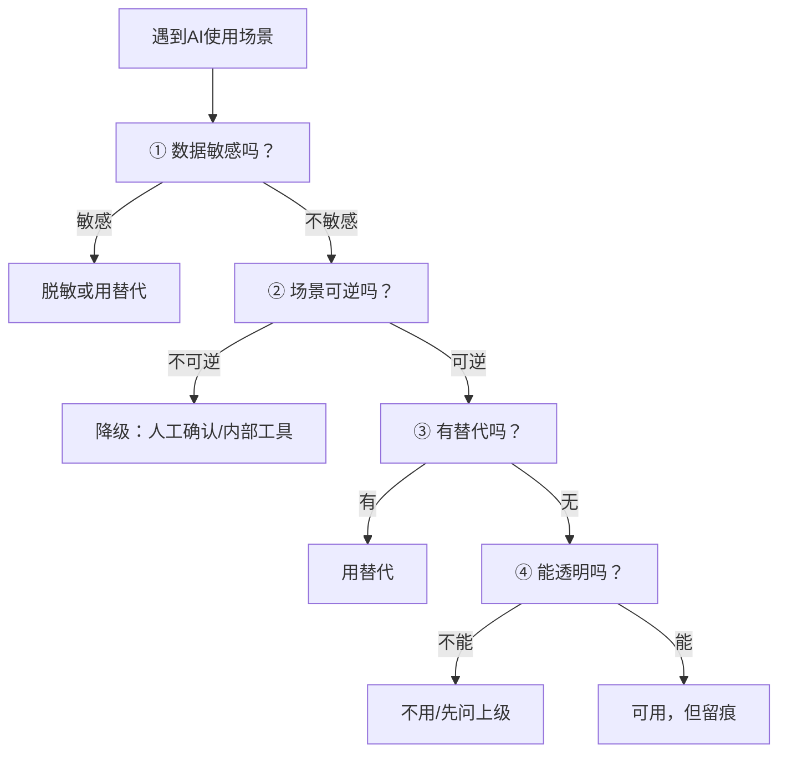

# 个人AI伦理决策框架

> [!abstract] 本文要练成的能力
> 遇到任何"要不要把 X 交给 AI"的场景，能**快速、有依据地给出决策**——用"边界四问"判断，用"降级阶梯"给出替代方案。核心是：**不是"用不用"，是"怎么用才不越界"。**

---

## 一、边界四问（决策核心）

> 面对任何 AI 使用场景，依次过四问。**任一不过，就降级或不用。**

| 问 | 判断什么 | 怎么判断 | 不过怎么办 |
|----|---------|---------|-----------|
| **① 数据敏感吗** | 数据属于哪一级（L1-L4） | 用组织标准分级 | L3/L4 不用或脱敏 |
| **② 场景可逆吗** | 错了能不能发现、挽回 | 输出会直接对外吗 | 不可逆则降级 |
| **③ 有替代吗** | 内部工具/脱敏方案/人工 | 有没有更安全的选项 | 有替代就用替代 |
| **④ 能透明吗** | 敢不敢告诉上级/同事 | 会不会被问住 | 不敢透明则不用 |

> 一句话规则：**"敢透明"是底线——不敢让上级知道的 AI 用法，大概率越界了。**

---

## 二、决策流程（填完即用）



```
【场景】____
【① 数据敏感吗】____（L几级？）
【② 场景可逆吗】____（错了能挽回吗？）
【③ 有替代吗】____（内部工具/脱敏/人工？）
【④ 能透明吗】____（敢告诉上级吗？）
【决策】____（用 / 脱敏用 / 降级 / 不用）
【留痕】____（怎么记录这次使用）
```

---

## 三、降级阶梯（不能直接用时怎么办）

> 四问不过，不代表"放弃用 AI"，而是**降级到更安全的用法**。从"直接用"到"不用"，有五个台阶：

| 台阶 | 用法 | 适用 |
|:---:|------|------|
| 5 | 直接用外部 AI | 数据不敏感 + 场景可逆 |
| 4 | 脱敏后用外部 AI | 数据敏感但可脱敏 |
| 3 | 用内部/企业级 AI 工具 | 有官方工具 |
| 2 | AI 辅助 + 人工确认 | 场景不可逆，人审兜底 |
| 1 | 不用 AI，人工处理 | 涉密数据 / 高风险场景 |

> 降级原则：**能上台阶就上，不能就下台阶。** 目标是"在安全前提下尽量用 AI"，不是"一刀切禁用"。

---

## 四、常见场景决策速查

| 场景 | 数据级别 | 可逆性 | 建议 |
|------|:---:|:---:|------|
| 用外部 AI 润色公开文章 | L1 | 可逆 | ✅ 直接用 |
| 用外部 AI 处理内部制度文档 | L2 | 可逆 | ⚠️ 脱敏后用 |
| 用外部 AI 生成员工绩效评语 | L3 | 不可逆 | ❌ 用内部工具或人工 |
| 用外部 AI 分析客户数据 | L3 | 不可逆 | ❌ 不用，走合规流程 |
| 用外部 AI 起草对外合同 | L4 | 不可逆 | ❌ 绝对不用 |

> [!warning] 深度洞察·坑
> 反例：觉得"我就问个问题，不算处理数据"。**你把问题打进去，数据就已经出境了。** 判断标准是"数据有没有离开你的设备/组织"，不是"我有没有保存结果"。

---

## 五、决策后的复盘：让边界判断越来越准

> 边界判断不是"一次学会"，是"**每次决策后复盘，越判越准**"。用决策记录提升判断力。

### 决策复盘模板（填完即用）

```
【场景】____
【我的决策】____（用 / 脱敏用 / 降级 / 不用）
【依据】____（四问怎么过的）
【结果】____（后来怎样了）
【复盘】____（决策对吗？哪里可以更准？）
```

### 复盘要看的三个信号

| 信号 | 说明 | 处理 |
|------|------|------|
| **过度保守** | 啥都不敢用，效率吃亏 | 检查是否低估了"可逆 + 脱敏"方案 |
| **过度激进** | 啥都敢用，风险失控 | 检查是否漏了"数据级别/可逆性"判断 |
| **边界模糊** | 同一场景时用时不用 | 定一个明确规则，不再纠结 |

> 一句话：**边界判断力 = 决策次数 × 复盘质量。** 每次决策后花 1 分钟复盘，比看十篇教程都管用。

---

## 六、资源与练习

### 看什么
- 关键词：AI使用 伦理决策 / AI合规 员工 / 数据安全 意识
- 关键词：AI治理 框架 / 负责任AI

### 练什么（可自测）
- [ ] 用"边界四问"过一遍你最近 3 次 AI 使用
- [ ] 对每个场景，标出它落在"降级阶梯"的哪一级
- [ ] 找出 1 个你之前"直接用了"但应该降级的场景

### 过关判据
> - [ ] 遇到场景，能在 1 分钟内过完四问给出决策
> - [ ] 知道降级阶梯的 5 个台阶，且能对号入座
> - [ ] 能说清"数据出境"的判断标准（不是看有没有保存）

---

## 练什么（可自测）

- 我最近用 AI 的场景，四问都过了吗？
- 我有没有"不敢透明"的用法？
- 我遇到敏感场景，知道怎么降级吗？

若达标，进入主动合规：[[05-产品与开发/个人AI使用边界与伦理自律/04_主动合规与透明化]]

---

- 回到 [[05-产品与开发/个人AI使用边界与伦理自律/00_MOC_个人AI使用边界中枢]]
- 能力边界判断（产品视角）：[[05-产品与开发/AI产品经理学习路径/02-技术底座/03_能力边界判断：一个需求该不该用AI]]
