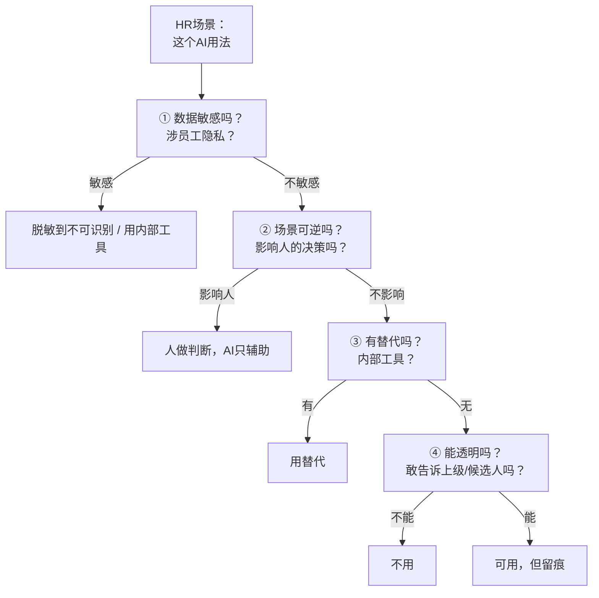

# 案例：HR场景的AI使用边界

> [!abstract] 本文要练成的能力
> 把"边界四问"用到**HR 工作**——招聘、面试、绩效、员工数据，知道哪些 AI 用法越界、哪些能用、怎么用。核心是：**HR 场景数据敏感度高（员工隐私），边界判断比一般场景更严格。**

---

## 一、HR 场景为什么边界更严

> HR 处理的是"人"的数据——**个人隐私 + 决策影响重大**，一旦越界，后果比一般场景严重。

| 特点 | 说明 | 后果 |
|------|------|------|
| **数据敏感度高** | 简历、薪资、绩效都是 L3/L4 | 泄露 = 法律风险 |
| **决策影响大** | AI 影响招聘/晋升/薪酬 | 出错 = 影响人的职业 |
| **合规要求严** | 个保法、劳动法、招聘合规 | 违规 = 处罚 |
| **公平要求高** | 招聘/晋升必须公平 | AI 偏见 = 歧视风险 |

> 一句话：**HR 用 AI，边界不是"能不能用"，是"用在哪、怎么用、谁负责"。** 处理"人"的决策，人必须负责。

---

## 二、HR 高频场景的边界速查

| HR 场景 | 数据级别 | 可逆性 | 边界建议 |
|---------|:---:|:---:|---------|
| 用 AI 写招聘 JD | L2 | 可逆 | ⚠️ 脱敏后用（不写真实薪资细节） |
| 用 AI 初筛简历 | L3 | 可逆 | ⚠️ 脱敏后用于"初筛"，人做最终判断 |
| 用 AI 生成面试问题 | L2 | 可逆 | ✅ 可用（通用问题，不涉隐私） |
| 用 AI 记录/总结面试 | L3 | 不可逆 | ❌ 用内部工具，或人记录 |
| 用 AI 生成面试反馈 | L3 | 不可逆 | ❌ 人写，AI 只帮润色措辞 |
| 用 AI 生成绩效评语 | L3 | 不可逆 | ❌ 人写，AI 只帮组织语言 |
| 用 AI 分析员工数据 | L3/L4 | 不可逆 | ❌ 脱敏到不可识别，或内部工具 |
| 用 AI 起草员工沟通 | L2/L3 | 可逆 | ⚠️ 脱敏后用，人把关 |

> 关键认知：**HR 场景里，"生成评语/反馈"这类最危险——因为不可逆 + 影响人。** AI 可以帮你"组织语言"，但"评价内容"必须人写。

---

## 三、HR 特有敏感数据清单

> HR 场景里，很多数据你"习以为常"，但属于高敏感。**判断敏感度用组织标准，不是个人感觉。**

| 数据 | 级别 | 为什么敏感 | 能不能喂外部 AI |
|------|:---:|-----------|:---:|
| 简历（含联系方式） | L3 | 个人隐私 | ❌ 脱敏到不可识别 |
| 薪资/薪酬结构 | L4 | 商业机密 | ❌ 绝对不用 |
| 绩效/考核结果 | L3 | 个人隐私 | ❌ 脱敏到不可识别 |
| 员工名单/组织架构 | L3 | 内部敏感 | ❌ 脱敏后用 |
| 面试记录/评价 | L3 | 个人隐私 | ❌ 不用 |
| 离职原因/背景调查 | L3 | 个人隐私 | ❌ 不用 |
| 招聘数据（漏斗/转化） | L2 | 内部数据 | ⚠️ 脱敏后用（去掉个人信息） |

> [!warning] 深度洞察·坑
> 反例：觉得"我就让 AI 帮我改一下面试反馈的措辞，不算泄露"。**你把候选人的评价打进去，数据就出境了。** HR 场景尤其要记住：**"评价内容"和"措辞润色"是两回事——评价内容人写，措辞可以 AI 帮。**

---

## 四、HR 场景的边界判断流程

> 遇到任何 HR 场景，用"边界四问"过一遍（见 03），再加一道"HR 特问"。



> HR 特问：**"这个 AI 用法，敢让候选人/员工知道吗？"** 不敢，就是越界——因为涉及"人"的决策，必须透明、可解释。

---

## 五、HR 场景决策模板（填完即用）

```
【HR场景】____（招聘/面试/绩效/员工数据？）
【数据】____（涉及什么数据，哪一级？）
【可逆性】____（影响人的决策吗？错了能挽回吗？）
【边界四问】
  ① 数据敏感吗？____
  ② 场景可逆吗？____
  ③ 有替代吗？____
  ④ 能透明吗？____
【HR特问】敢让候选人/员工知道吗？____
【决策】____（用 / 脱敏用 / 人做AI辅助 / 不用）
【留痕】____（怎么记录）
```

> 一句话规则：**HR 场景，人负责"评价和决策"，AI 负责"提效和润色"。** 涉及"人"的判断，永远人做。

---

## 六、资源与练习

### 看什么
- 关键词：HR AI / 招聘AI 合规 / 员工数据 隐私
- 关键词：个保法 / 招聘歧视 / AI公平

### 练什么（可自测）
- [ ] 列出你工作中 5 个 AI 用法，标出数据级别
- [ ] 用"HR 场景决策模板"过一遍你最近的一次 AI 使用
- [ ] 找出 1 个你可能越界的用法，想好替代方案

### 过关判据
> - [ ] 能说清 HR 场景为什么边界更严（隐私 + 影响人）
> - [ ] 知道 HR 高频场景的边界（哪些能用、哪些不能）
> - [ ] 会用"HR 特问"（敢让候选人知道吗）判断

---

## 练什么（可自测）

- 我有没有把"简历/绩效/面试记录"喂给过外部 AI？
- 我写的"面试反馈/绩效评语"，是 AI 生成还是人写？
- 我的 AI 用法，敢让候选人/员工知道吗？

若达标，进入伦理深层：[[05-产品与开发/个人AI使用边界与伦理自律/06_AI伦理深层问题：偏见、责任与透明度]]

---

- 回到 [[05-产品与开发/个人AI使用边界与伦理自律/00_MOC_个人AI使用边界中枢]]
- 招聘与面试体系：[[03-HR人事/招聘与面试体系/00_MOC_招聘与面试体系中枢]]
