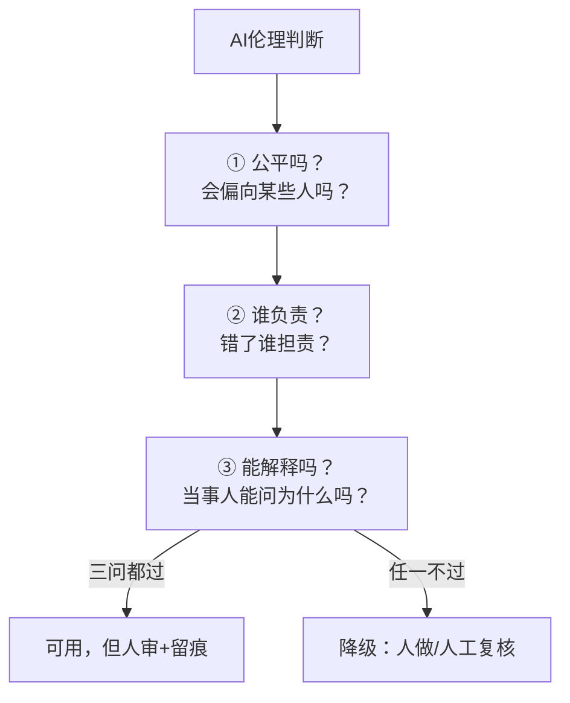

# AI伦理深层问题：偏见、责任与透明度

> [!abstract] 本文要练成的能力
> 从"数据安全"上升到"**伦理判断**"——理解 AI 伦理的三大深层问题（偏见、责任、透明度），知道它们怎么影响你的工作，个人怎么应对。核心是：**AI 伦理不只是"数据别泄露"，更是"AI 的判断公不公平、错了谁负责、能不能解释"。**

---

## 一、AI 伦理不只是数据安全

> 前面几篇讲的"数据分级、脱敏"是**数据安全**——这只是 AI 伦理的第一层。更深层的伦理问题，是 AI 的**判断本身**：

| 层次 | 问题 | 例子 |
|------|------|------|
| **数据安全** | 数据会不会泄露 | 员工数据被喂给外部 AI |
| **算法偏见** | AI 的判断公不公平 | AI 筛简历偏向某些群体 |
| **责任归属** | AI 错了谁负责 | AI 生成绩效评语出错，谁担责 |
| **透明度** | AI 的判断能不能解释 | 候选人被 AI 淘汰，能问为什么吗 |

> 关键认知：**AI 伦理的核心不是"AI 会不会犯错"，是"AI 犯错时，人有没有尽到责任"。** 数据安全是"防泄露"，伦理判断是"防不公、防甩锅、防黑箱"。

---

## 二、偏见（Bias）：AI 的判断可能不公平

### 偏见从哪来

| 来源 | 解释 | 例子 |
|------|------|------|
| **训练数据偏见** | 数据本身有偏见，AI 学进去了 | 历史招聘数据偏向男性 → AI 筛简历也偏向 |
| **提示词偏见** | 你的问法带偏见 | "筛出名校的" → 歧视非名校 |
| **输出偏见** | AI 生成内容带刻板印象 | AI 写岗位描述默认性别 |

### 个人怎么应对偏见

| 应对 | 具体做法 |
|------|---------|
| **警惕"看似中立"** | AI 输出看着中立，可能藏着偏见 |
| **检查影响** | 这个 AI 判断影响"人"吗？影响就要查偏见 |
| **人审兜底** | 影响人的决策，人必须审，不能全信 AI |
| **问 AI 依据** | 让 AI 说明"为什么这么判断"，暴露偏见 |

> [!warning] 深度洞察·坑
> 反例：觉得"AI 是客观的，比人公平"。**AI 不是客观的，它是"训练数据的平均值"——数据有偏见，AI 就有偏见。** 尤其 HR 场景，AI 筛简历的偏见可能构成歧视，人必须审。

---

## 三、责任归属（Accountability）：AI 错了谁负责

> AI 不负责，**人负责**。这是 AI 伦理最核心的一条——用 AI 的人，对 AI 的输出负责。

| 场景 | AI 做了什么 | 谁负责 | 为什么 |
|------|-----------|--------|--------|
| AI 生成绩效评语出错 | 生成错误评价 | 用人的人 | 你用了，你负责 |
| AI 筛简历漏掉优秀者 | 初筛有偏 | 用人的人 | 你决定用它筛 |
| AI 写合同有漏洞 | 生成有误 | 用人的人 | 你审核后发出 |
| AI 分析数据结论错 | 分析有误 | 用人的人 | 你采信并汇报 |

> 一句话：**"AI 做的"不等于"AI 负责的"——你用了 AI 的输出，你就对输出负责。** 这是为什么"人验证"环节不能省。

---

## 四、透明度（Transparency）：AI 的判断能不能解释

> 影响"人"的 AI 决策，必须**可解释**——当事人有权知道"为什么"。

| 维度 | 是什么 | 个人怎么做到 |
|------|--------|-------------|
| **可解释** | 能说清 AI 为什么这么判断 | 用 AI 时，保留"依据"（来源/标准） |
| **可追溯** | 能查到 AI 判断的依据 | 留痕：用了什么 AI、喂了什么、结果 |
| **可申诉** | 当事人能质疑 | 影响人的决策，保留人工复核通道 |

> 一句话：**AI 决策越影响人，越要透明。** 个人层面，做到"留痕 + 可解释"——你用的每个 AI 判断，都要能说清"为什么"。

---

## 五、个人 AI 伦理判断框架（超越数据安全）

> 遇到"要不要用 AI 做 X"，在"边界四问"（数据/可逆/替代/透明）基础上，加三道"伦理问"：



| 伦理问 | 判断什么 | 不过怎么办 |
|--------|---------|-----------|
| **① 公平吗** | 会影响某些人吗？有偏见吗？ | 人审，查偏见 |
| **② 谁负责** | 错了谁担责？ | 人负责，AI 只辅助 |
| **③ 能解释吗** | 当事人能问为什么吗？ | 留痕，保留人工复核 |

> 一句话规则：**"影响人的 AI 决策，必须公平、有人负责、可解释。"** 三问任一不过，就降级——人做或人工复核。

---

## 六、伦理判断模板（填完即用）

```
【AI用法】____（用 AI 做什么）
【数据安全】____（数据哪一级？脱敏了吗？）
【伦理三问】
  ① 公平吗？____（会偏向谁？）
  ② 谁负责？____（错了谁担责？）
  ③ 能解释吗？____（当事人能问为什么吗？）
【决策】____（用 / 人审后 / 人做 / 不用）
【留痕】____（用了什么 AI、喂了什么、结果）
```

---

## 七、资源与练习

### 看什么
- 关键词：AI伦理 / 算法偏见 / AI问责
- 关键词：负责任AI / AI透明度 / 可解释AI

### 练什么（可自测）
- [ ] 用"伦理三问"检查你最近 3 次 AI 使用
- [ ] 找出 1 个"影响人"的 AI 用法，检查偏见和负责
- [ ] 为你的关键 AI 使用建立"留痕"习惯

### 过关判据
> - [ ] 能说清 AI 伦理的三大深层问题（偏见/责任/透明）
> - [ ] 知道"AI 不负责，人负责"
> - [ ] 会用"伦理三问"判断影响人的 AI 决策

---

## 练什么（可自测）

- 我的 AI 用法，有没有"影响人"的？公平吗？
- 我用的 AI 输出，错了谁负责？我留痕了吗？
- 我的 AI 判断，能向当事人解释"为什么"吗？

若达标，个人 AI 使用边界库闭环完成。回到中枢看整体：[[05-产品与开发/个人AI使用边界与伦理自律/00_MOC_个人AI使用边界中枢]]

---

- 回到 [[05-产品与开发/个人AI使用边界与伦理自律/00_MOC_个人AI使用边界中枢]]
- 产品里的伦理责任：[[05-产品与开发/AI产品经理方法论/07_AI产品的伦理与责任]]
