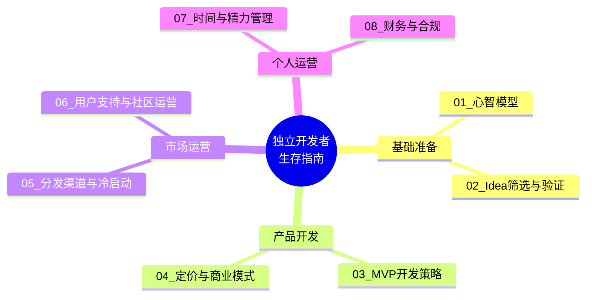
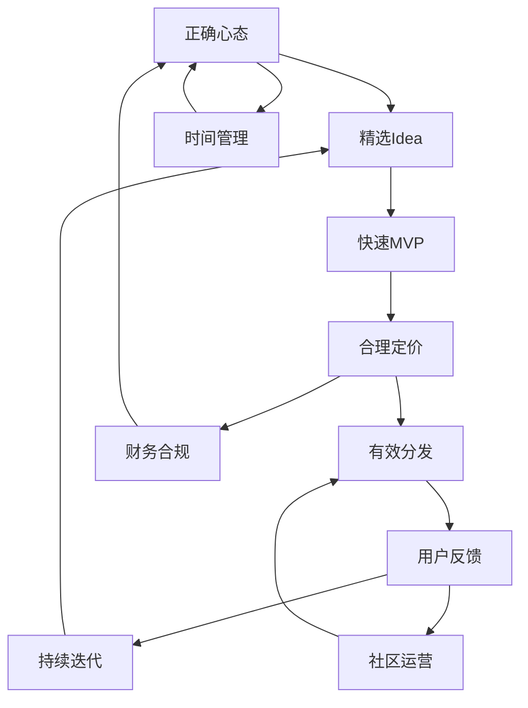

# 独立开发者生存指南中枢 — 全景导航图

> [!key] 核心命题
> 独立开发者是AI时代最受益的群体——AI大幅降低了个人创业的技术门槛和运营成本。但独立开发者的成功不只需要技术，更需要**商业思维、产品意识、运营能力和心理韧性**的系统组合。本知识库全面覆盖了从心态准备到商业运营的完整路径。

---

## 知识库全景图



---

## 文档索引

| 编号 | 文档标题 | 核心主题 | 难度 |
|------|---------|---------|------|
| 01 | [[05-产品与开发/独立开发者生存指南/01_独立开发者的心智模型：从副业到主业的转型]] | 心态、风险、时间管理 | 入门 |
| 02 | [[05-产品与开发/独立开发者生存指南/02_Idea筛选与验证：做什么比怎么做更重要]] | 需求验证、竞品分析 | 核心 |
| 03 | [[05-产品与开发/独立开发者生存指南/03_MVP开发策略：最小可行产品的最优路径]] | MVP设计、迭代策略 | 核心 |
| 04 | [[05-产品与开发/独立开发者生存指南/04_定价与商业模式：独立开发者如何赚钱]] | 定价策略、收入模式 | 进阶 |
| 05 | [[05-产品与开发/独立开发者生存指南/05_分发渠道与冷启动：产品做出来没人知道怎么办]] | 获客、SEO、社交传播 | 进阶 |
| 06 | [[05-产品与开发/独立开发者生存指南/06_用户支持与社区运营：小团队的大服务]] | 用户反馈、社区建设 | 进阶 |
| 07 | [[05-产品与开发/独立开发者生存指南/07_时间与精力管理：独立开发者的一人公司运营]] | 效率、专注、健康 | 入门 |
| 08 | [[05-产品与开发/独立开发者生存指南/08_财务与合规：从银行开户到税务申报]] | 公司注册、税务、知识产权 | 必读 |

---

## 核心框架：独立开发成功飞轮



---

## 独立开发者能力雷达图

```mermaid
radar
    title 独立开发者能力模型
    axis 技术开发, 产品思维, 商业运营, 市场营销, 用户支持, 财务管理
    series 入门水平 [6, 3, 2, 2, 1, 1]
    series 成长水平 [7, 6, 5, 5, 4, 4]
    series 成熟水平 [8, 8, 7, 7, 6, 7]
```

---

## 跨知识库链接

本知识库与以下知识库深度关联：

- **[[03-HR人事/AI时代领导力与管理/00_MOC_AI时代领导力与管理中枢]]** — 独立开发者就是自己的CEO，需要 [[03-HR人事/AI时代领导力与管理/06_管理者AI素养：从会用到善用]] 中的AI素养
- **[[01-AI技术/Prompt Engineering深度/00_MOC_Prompt Engineering深度中枢]]** — AI是独立开发者最强大的队友，[[01-AI技术/Prompt Engineering深度/01_Prompt的本质与设计原则]] 是必备技能
- **[[03-HR人事/AI时代领导力与管理/03_混合团队管理：如何带领人+AI的团队]]** — 独立开发者本质上是"一人+AI"的混合团队

---

## 使用指南

> [!tip] 阅读路径建议
> - **新手路径**: 01 → 02 → 03 → 04 → 05 → 06 → 07 → 08
> - **快速启动**: 01 → 02 → 03 → 05 → 08
> - **商业转型**: 04 → 05 → 06 → 07 → 08

> [!warning] 重要提醒
> 独立开发是马拉松，不是短跑。不要急于追求"一夜暴富"，而是建立可持续的增长模式。定期回顾 [[05-产品与开发/独立开发者生存指南/07_时间与精力管理：独立开发者的一人公司运营]] 中的健康管理策略。

---

*最后更新: 2026-07-31*