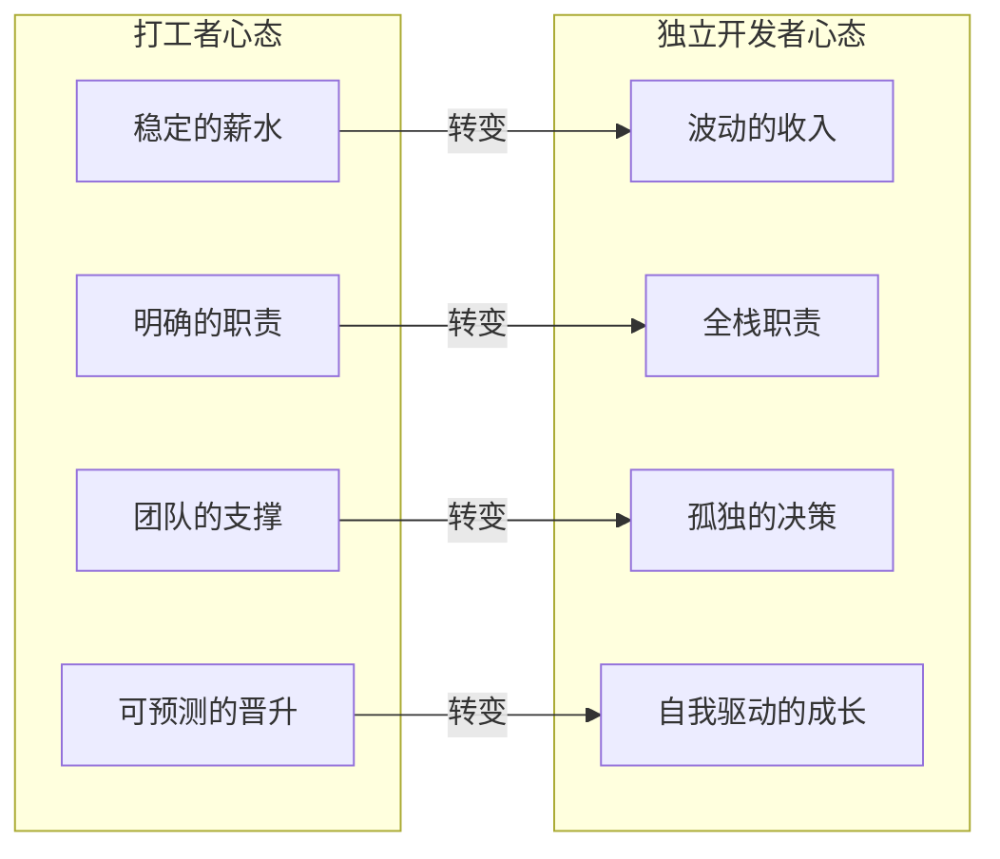
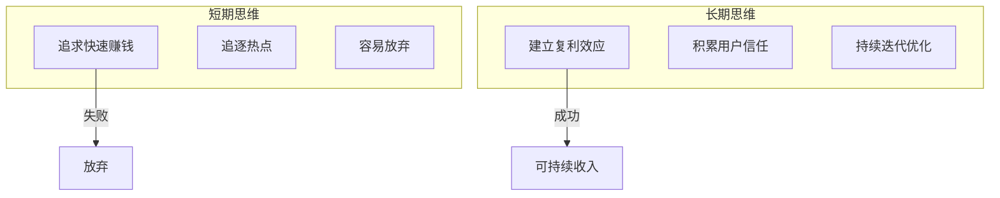

# 独立开发者的心智模型：从副业到主业的转型

## 独立开发不是"自由"，而是"自律"

> [!key] 核心洞察
> 大多数人想象中的独立开发是"自由自在、想做什么就做什么"。现实是——独立开发者需要面对**收入不稳定、孤独感、决策疲劳和不确定性**。成功转型的关键不是技术能力，而是**心智模型的彻底重塑**。



---

## 独立开发者的五个心智模型

### 1. 创业者心态（而非自由职业者心态）

自由职业者"卖时间"，创业者"建系统"。独立开发者需要建立产品思维，而非接单思维。

> [!tip] 心态自测
> 问自己：如果我不工作一个月，我的收入会不会降到0？
> - 会 → 你还在卖时间
> - 不会 → 你在建系统

### 2. 成长型思维

独立开发者面临的最大挑战是"未知的未知"。每天都需要学习新东西——从[[01-AI技术/Prompt Engineering深度/01_Prompt的本质与设计原则]]到[[05-产品与开发/独立开发者生存指南/04_定价与商业模式：独立开发者如何赚钱]]。

### 3. 风险对冲思维

| 风险类型 | 应对策略 | 具体行动 |
|---------|---------|---------|
| 收入波动 | 建立现金流缓冲 | 储备6个月生活费 |
| 项目失败 | 多项目组合 | 同时运行2-3个项目 |
| 健康风险 | 保险+规律作息 | 购买商业保险 |
| 市场变化 | 持续学习 | 每月关注行业趋势 |

### 4. 实验心态

把每个产品当作实验，而非"一生一次的机会"。这能帮助你：
- 降低失败的心理打击
- 快速从[[05-产品与开发/独立开发者生存指南/02_Idea筛选与验证：做什么比怎么做更重要]]中学习
- 保持对市场的敏感度

### 5. 长期主义

独立开发的成功通常需要18-24个月才能看到显著成果。短期没有结果不代表错误。



---

## 从副业到主业的转型路线图

### 第一阶段：副业探索期（3-6个月）

- 保持全职工作
- 每周投入10-15小时
- 目标：验证Idea、建立最小收入来源

### 第二阶段：收入验证期（3-6个月）

- 月收入达到全职收入的30-50%
- 建立稳定的用户基础
- 完善自动化运营流程

### 第三阶段：过渡期（3个月）

- 逐步减少全职工作时间
- 建立收入稳定性
- 参考[[05-产品与开发/独立开发者生存指南/08_财务与合规：从银行开户到税务申报]]安排财务

### 第四阶段：全职独立开发

- 月收入稳定覆盖生活成本
- 建立可持续的工作节奏
- 开始考虑团队扩张

> [!warning] 转型信号
> 在以下情况下，**不要**贸然转型：
> - 没有3-6个月的生活费储备
> - 产品月收入不及生活成本的30%
> - 还没有建立任何用户获取渠道
> - 家庭或健康正处于不稳定期

---

## 每日心理管理

独立开发者最大的敌人不是竞争对手，而是**自己的大脑**：

| 常见心理陷阱 | 表现 | 应对方法 |
|------------|------|---------|
| 冒名顶替综合症 | "我不够好" | 记录成就清单 |
| 决策瘫痪 | "不知道做什么" | 设定每日最小行动 |
| 孤独感 | "没有人理解" | 加入独立开发者社区 |
| 比较焦虑 | "别人都比我成功" | 关闭社交媒体通知 |
| 倦怠 | "什么都不想做" | 定期休息+运动 |

> [!example] 独立开发者日常心态管理
> ```
> 早上：写下今天最重要的3件事
> 中午：离开电脑散步15分钟
> 下午：记录今天学到的新东西
> 晚上：复盘今日成就（哪怕很小）
> ```

---

## 跨知识库联动

- [[05-产品与开发/独立开发者生存指南/07_时间与精力管理：独立开发者的一人公司运营]] 提供了时间管理的具体策略
- [[03-HR人事/AI时代领导力与管理/01_领导力范式转移：从管理到赋能]] 中的赋能理念适用于自我管理
- [[01-AI技术/Prompt Engineering深度/01_Prompt的本质与设计原则]] 是独立开发者必备的AI技能

---

*最后更新: 2026-07-31*