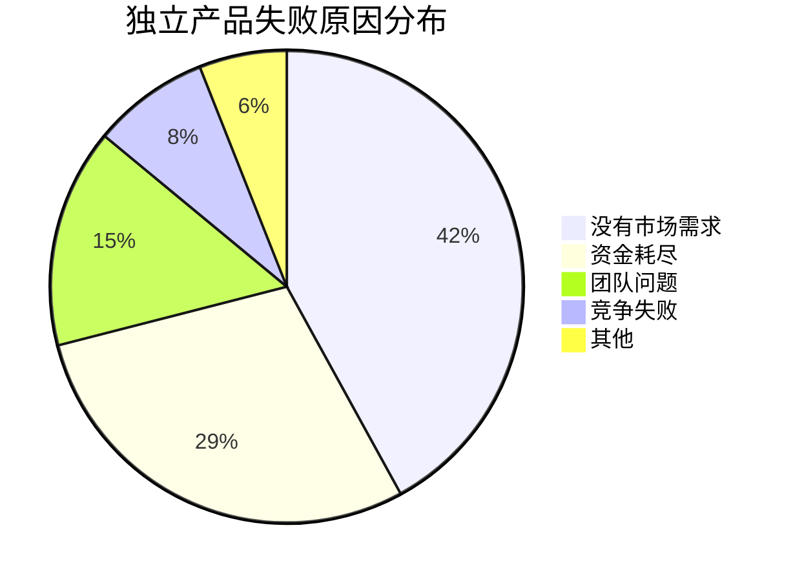
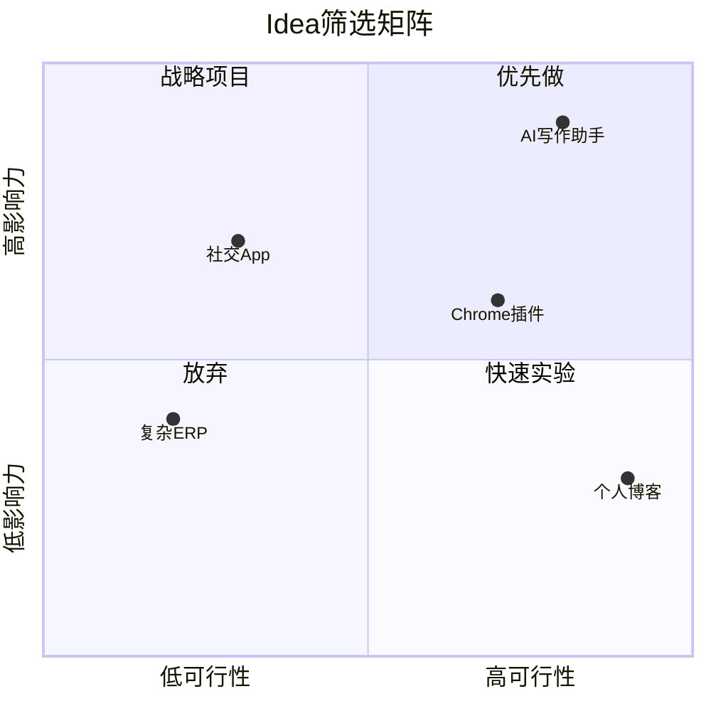
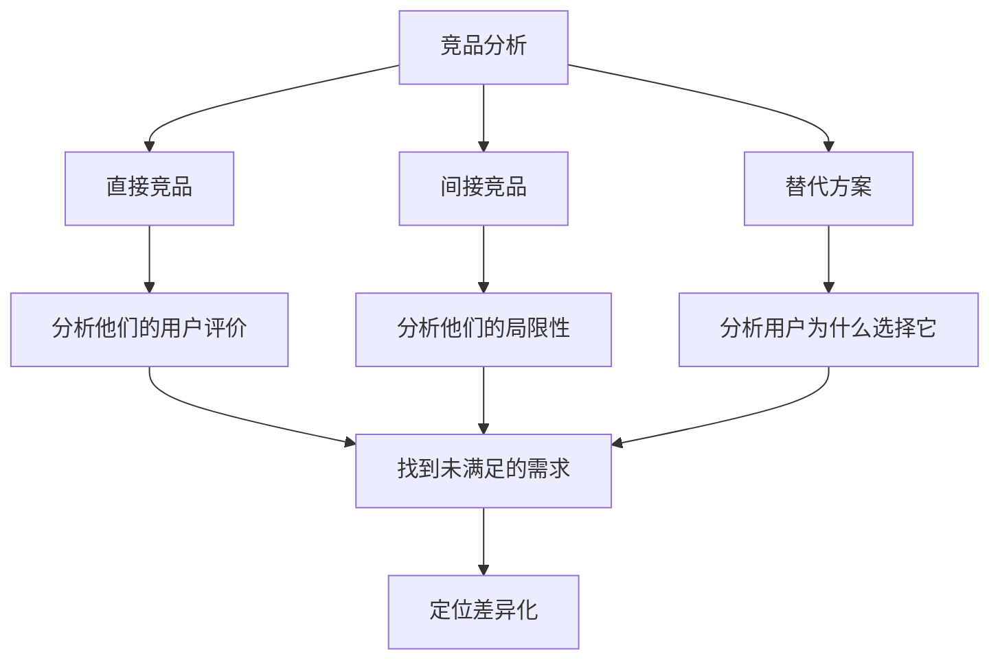

# Idea筛选与验证：做什么比怎么做更重要

## 大多数失败不是因为做得不好，而是因为做错了东西

> [!key] 核心洞察
> 独立开发者最容易犯的错误是：花6个月做一个没人需要的产品。**Idea验证不是一次性的动作，而是贯穿产品开发全过程的持续对话**。你的目标不是"证明我的想法是对的"，而是"发现市场真正需要什么"。



---

## Idea筛选的ICE框架

### I — Impact（影响）
- 这个产品能解决多大的问题？
- 用户愿意为这个问题付多少钱？
- 解决问题的紧迫程度如何？

### C — Confidence（信心）
- 你有多确定用户需要这个？
- 是否有数据或案例支持？
- 你自己会用这个产品吗？

### E — Ease（可行性）
- 以你的技能和资源，能否在4-6周内做出MVP？
- 开发和运营成本是否可控？
- 是否有现成的工具或AI可以加速？（参见[[01-AI技术/Prompt Engineering深度/01_Prompt的本质与设计原则]]）



---

## Idea验证四步法

### 第一步：问题定义（1周）

不要从"我想做什么"开始，而从"人们有什么问题"开始：

> [!example] 问题定义模板
> ```
> 目标用户：______
> 他们的痛点：______
> 现有解决方案：______
> 现有方案的不足：______
> 我的差异化假设：______
> ```

### 第二步：用户验证（2-3周）

**验证方法优先级**（从高到低）：

1. **付费预购**：创建Landing Page，看多少人愿意付定金 → 最有力的验证
2. **用户访谈**：和20个目标用户深度交流 → 发现真实需求
3. **等待列表**：收集邮箱注册 → 验证兴趣度
4. **社交媒体测试**：发帖看互动 → 快速验证反应

> [!tip] 用户访谈技巧
> 不要问"如果有一个XX产品你会用吗？"（人们总是说"会"）
> 要问"你目前在用什么解决这个问题？"（了解真实行为）
> 要问"你为这个方案花了多少钱？"（了解付费意愿）

### 第三步：竞品分析（1周）



### 第四步：可行性评估（1周）

- 技术可行性：需要什么技术栈？AI能做什么？（参考[[05-产品与开发/独立开发者生存指南/03_MVP开发策略：最小可行产品的最优路径]]）
- 商业可行性：收入模型、定价策略（参考[[05-产品与开发/独立开发者生存指南/04_定价与商业模式：独立开发者如何赚钱]]）
- 运营可行性：获客渠道、运营成本

---

## AI辅助Idea验证

AI可以大幅加速Idea验证过程：

| 验证环节 | 传统方法 | AI辅助方法 |
|---------|---------|-----------|
| 市场研究 | 手动搜索报告 | AI聚合和分析行业报告 |
| 用户访谈分析 | 手动整理访谈记录 | AI自动提取关键洞察 |
| 竞品分析 | 手动浏览竞品页面 | AI爬取并分析竞品信息 |
| 定价研究 | 调查问卷 | AI模拟定价模型 |
| 需求验证 | 手动创建Landing Page | AI生成Landing Page内容 |

> [!example] 用AI验证Idea
> 你可以用[[01-AI技术/Prompt Engineering深度/02_角色扮演：让AI成为特定专家的艺术]]让AI扮演目标用户，模拟用户访谈：
> ```
> 提示词：你是一位[目标用户角色]，我正在考虑开发一个[产品描述]。
> 请以用户的身份，回答以下问题：
> 1. 你目前如何解决这个问题？
> 2. 你最大的痛点是什么？
> 3. 对于一个解决方案，你愿意付多少钱？
> ```

---

## Idea验证检查清单

验证一个Idea需要至少满足以下条件中的3个：

- [ ] 有至少20个潜在用户表达了强烈兴趣
- [ ] 至少5人愿意付费或预购
- [ ] 竞品存在但用户满意度不高
- [ ] 你能在4-6周内做出MVP
- [ ] 市场规模足够大（至少1000个潜在付费用户）
- [ ] 你自己是目标用户，并且愿意付费

> [!warning] 常见误区
> - "这个功能我自己很想要" ≠ "市场需要"
> - "我的朋友说不错" ≠ "用户愿意付费"
> - "没有竞品" 可能意味着 "没有市场"
> - "很多人在搜索这个" ≠ "愿意为解决方案付费"

---

## 跨知识库联动

- [[05-产品与开发/独立开发者生存指南/03_MVP开发策略：最小可行产品的最优路径]] 将验证过的Idea转化为产品
- [[03-HR人事/AI时代领导力与管理/02_决策模式变革：数据驱动与人性判断的平衡]] 中的决策框架适用于Idea筛选
- [[01-AI技术/Prompt Engineering深度/04_Few-shot与上下文工程：用示例教会AI]] 中的示例设计方法可用于创建产品原型

---

*最后更新: 2026-07-31*