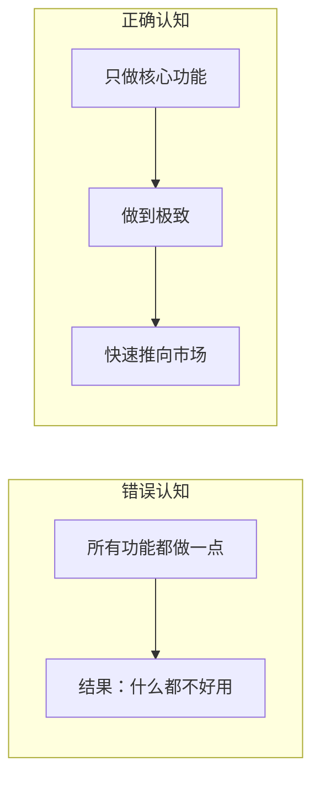
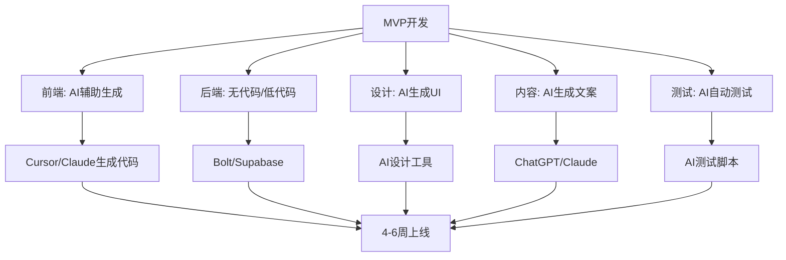

# MVP开发策略：最小可行产品的最优路径

## MVP不是"粗制滥造"，而是"精确聚焦"

> [!key] 核心洞察
> 很多独立开发者把MVP误解为"半成品"。真正的MVP是**一个能交付核心价值、让用户愿意付费的最小功能集合**。在AI时代，MVP的构建速度可以比传统方法快3-5倍，因为AI可以承担大量开发工作。



---

## MVP设计的减法法则

### 什么是核心功能？

核心功能 = 用户愿意付费的最小功能集合

**判断标准**：
- 移除这个功能，用户还会不会用？
- 移除这个功能，用户还愿不愿意付钱？
- 这个功能是否解决了核心痛点？

### 常见的MVP功能陷阱

| 陷阱 | 表现 | 后果 |
|------|------|------|
| 功能蔓延 | 不断添加"顺便做一下"的功能 | 开发周期无限延长 |
| 完美主义 | 追求UI完美、性能极致 | 错过市场窗口 |
| 技术迷信 | 使用最酷的技术栈 | 运维成本过高 |
| 过度设计 | 为未来可能性做架构 | 增加了不必要的复杂性 |

---

## AI时代的MVP开发栈

AI让独立开发者可以用更快的速度构建MVP：



### 推荐工具链

| 环节 | 工具 | AI能力 | 成本 |
|------|------|--------|------|
| 原型设计 | Figma + AI插件 | 从描述生成UI | 免费 |
| 前端开发 | Cursor/GitHub Copilot | AI辅助编码 | 低 |
| 后端 | Supabase/Firebase | AI辅助数据库设计 | 免费起步 |
| 部署 | Vercel/Railway | 自动部署 | 免费起步 |
| 支付 | Stripe/LemonSqueezy | 开箱即用 | 按交易收费 |

---

## MVP迭代的核心循环

```mermaid
graph TD
    A[发布MVP] --> B[收集用户反馈]
    B --> C{反馈分析}
    C -->|用户想要| D[验证需求强度]
    C -->|用户不需要| E[放弃/调整]
    C -->|用户遇到问题| F[修复痛点]
    D --> G[加入路线图]
    F --> G
    G --> H[选择下一个功能]
    H --> I[开发迭代]
    I --> A
    
    B --> J[参考[[独立开发者生存指南/06_用户支持与社区运营]]]
```

### 迭代节奏

| 阶段 | 周期 | 目标 | 交付物 |
|------|------|------|--------|
| MVP v1 | 4-6周 | 验证核心假设 | 可用产品 |
| v1.1 | 1-2周 | 修复关键问题 | 稳定的v1 |
| v1.2 | 2-3周 | 添加最需要的新功能 | 扩展功能 |
| v2.0 | 2-3月 | 基于用户反馈重构 | 成熟产品 |

---

## MVP量化指标

在MVP阶段，关注以下指标：

> [!tip] 核心指标
> - **激活率**：注册用户中完成核心流程的比例（目标>40%）
> - **留存率**：次日留存>30%，周留存>20%
> - **付费转化率**：免费用户转付费的比例（目标>3%）
> - **NPS**：用户推荐意愿（目标>30）
> - **反馈率**：主动提供反馈的用户比例（目标>5%）

---

## 常见MVP失败模式

> [!warning] 失败模式
> 1. **功能太多**：MVP变成了"最小可行产品集"
> 2. **太晚发布**：开发了6个月才上线，发现没人需要
> 3. **忽略体验**：虽然功能可用，但体验太差导致用户流失
> 4. **没有定价**：免费发布，无法验证付费意愿
> 5. **不收集反馈**：发布后没有建立反馈渠道

---

## 案例：从Idea到MVP的4周冲刺

> [!example] 真实案例
> **产品**：一个AI辅助写作工具
> 
> **第1周**：验证Idea → 创建Landing Page → 收集100个邮箱（参考[[05-产品与开发/独立开发者生存指南/02_Idea筛选与验证：做什么比怎么做更重要]]）
> 
> **第2周**：用AI构建核心功能 → 文本编辑+AI改写
> 
> **第3周**：部署上线 → 邀请等待列表用户使用
> 
> **第4周**：收集反馈 → 修复关键bug → 设定定价（参考[[05-产品与开发/独立开发者生存指南/04_定价与商业模式：独立开发者如何赚钱]]）
> 
> **结果**：4周获得50个付费用户，MRR $1,000

---

## 跨知识库联动

- [[05-产品与开发/独立开发者生存指南/02_Idea筛选与验证：做什么比怎么做更重要]] 提供了MVP前的Idea验证方法
- [[05-产品与开发/独立开发者生存指南/04_定价与商业模式：独立开发者如何赚钱]] 讨论了MVP的定价策略
- [[03-HR人事/AI时代领导力与管理/03_混合团队管理：如何带领人+AI的团队]] 中的"AI放大器模式"可以加速MVP开发

---

*最后更新: 2026-07-31*