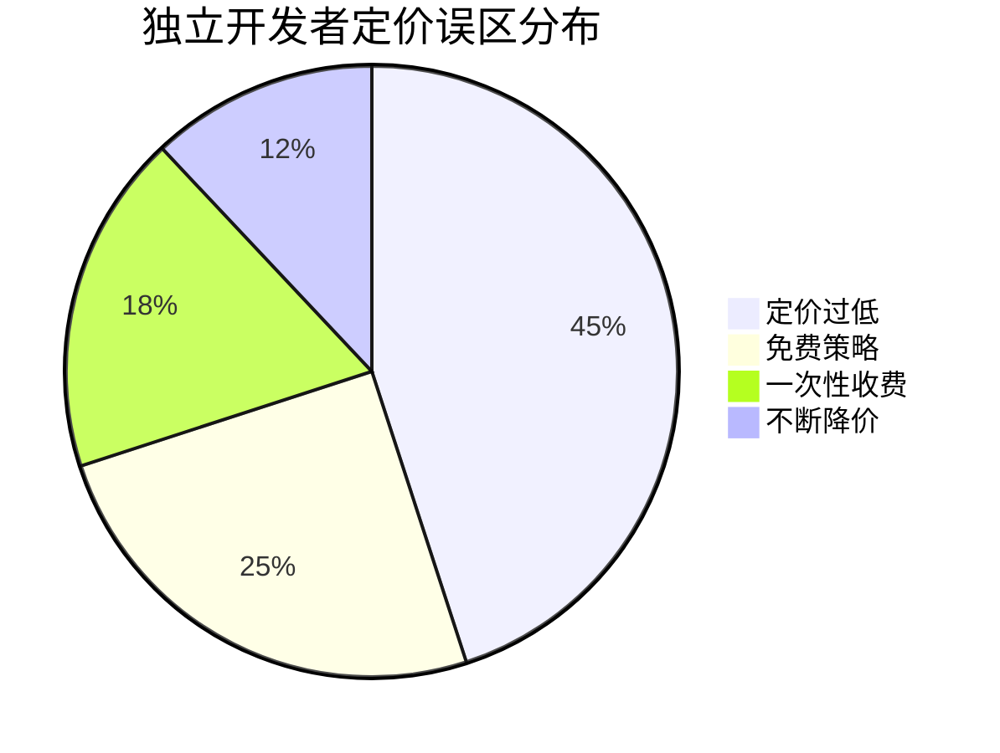
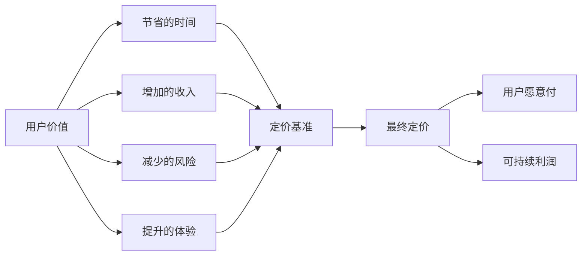
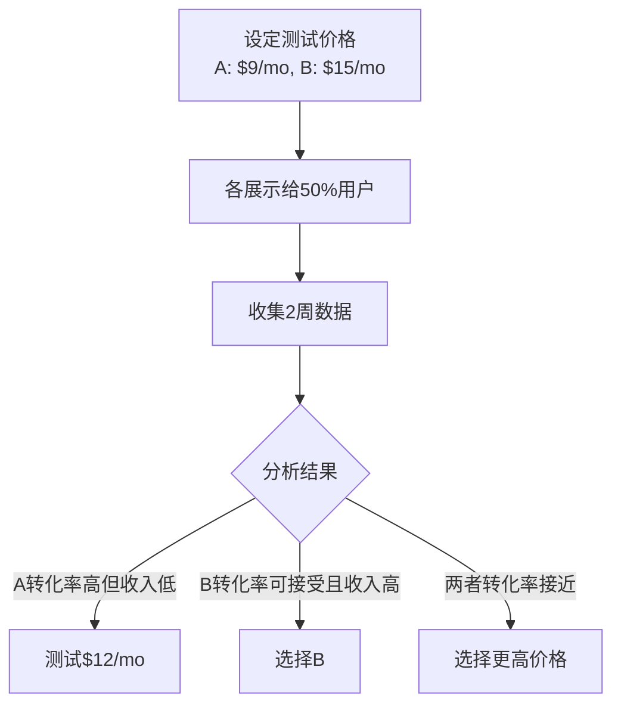

# 定价与商业模式：独立开发者如何赚钱

## 定价是产品策略的一部分，而非事后决定

> [!key] 核心洞察
> 独立开发者最常见的错误是：**把定价放到最后考虑**，或者**定价过低**。定价不是"定一个价格"，而是**设计一整套价值捕获机制**。好的定价可以放大产品价值，差的定价可以摧毁最好的产品。

---

## 独立开发者常用的收入模式

### 1. SaaS订阅制（推荐）

**适合**：持续提供价值的工具类产品

| 模式 | 月费 | 年费（折扣） | 代表产品 |
|------|------|------------|---------|
| 个人版 | $5-15/mo | 年付8折 | Notion |
| 专业版 | $15-49/mo | 年付8折 | Figma |
| 团队版 | $49-199/mo | 年付8折 | Slack |

**优点**：可预测的MRR、用户生命周期价值高
**缺点**：需要持续维护、用户流失风险

### 2. 一次性付费 + 增值服务

**适合**：工具类、模板类产品

- 基础版：$19-49（一次性）
- 专业版：$79-199（一次性）
- 增值服务：$9-29/mo（可选）

### 3. 免费增值（Freemium）

**适合**：需要网络效应的产品

> [!warning] 免费策略的风险
> 免费用户可能消耗大量资源而从不付费。建议：
> - 免费版功能限制明确
> - 免费版有时间限制（试用）
> - 免费转为付费的转化率目标>5%

### 4. 按使用量付费

**适合**：API、AI tokens等消耗型产品

---

## 定价策略框架

### 价值定价法

不要按成本定价，而按**用户感知的价值**定价：

### 定价锚定

利用心理学原理：

| 策略 | 方法 | 效果 |
|------|------|------|
| 锚定效应 | 先展示最高价方案 | 中间方案看起来更合理 |
| 价格对比 | 同时展示月付和年付 | 年付看起来更划算 |
| 分层定价 | 3个以上价格层级 | 给用户选择感 |

---

## 独立开发者的定价陷阱

> [!tip] 定价黄金法则
> 你的定价应该让你感到"有点贵"——大多数独立开发者定价过低，因为他们低估了自己产品的价值。

### 常见的定价错误

1. **参照工资定价**：按"我一个月工资多少"来定产品价格
2. **竞品低价竞争**：看到竞品低价就跟着降价
3. **一次性收费**：忽略了持续维护的成本
4. **过早免费**：在没有验证付费意愿前就免费开放

---

## 定价实验方法

### 步骤1：确定价格区间

通过用户访谈了解目标用户的付费意愿（参考[[05-产品与开发/独立开发者生存指南/02_Idea筛选与验证：做什么比怎么做更重要]]）

### 步骤2：A/B测试

### 步骤3：持续优化

每3-6个月重新评估定价，考虑：
- 产品功能是否增加
- 用户数量是否增长
- 竞品定价是否变化

---

## 商业化路径规划

| 阶段 | 定价策略 | 月收入目标 | 用户数 |
|------|---------|-----------|-------|
| MVP期 | 免费/低价 | $0-1,000 | 50-200 |
| 验证期 | 单人定价 | $1,000-5,000 | 200-1,000 |
| 增长期 | 分层定价 | $5,000-20,000 | 1,000-5,000 |
| 成熟期 | 企业定价 | $20,000+ | 5,000+ |

---

## 案例：从$0到$5,000 MRR的定价演进

> [!example] 定价演进案例
> **产品**：AI会议笔记工具
> 
> **阶段1**（第1-3月）：免费 → 获取1000用户
> 
> **阶段2**（第4-6月）：$9/mo → 5%转化率 → MRR $450
> 
> **阶段3**（第7-9月）：分层定价 $9/$19/$49 → 转化率4% → MRR $2,000
> 
> **阶段4**（第10-12月）：优化定价 $15/$29/$79 → 转化率5% → MRR $5,000

---

## 跨知识库联动

- [[05-产品与开发/独立开发者生存指南/03_MVP开发策略：最小可行产品的最优路径]] 讨论了MVP阶段的定价策略
- [[05-产品与开发/独立开发者生存指南/05_分发渠道与冷启动：产品做出来没人知道怎么办]] 中的获客策略与定价直接相关
- [[03-HR人事/AI时代领导力与管理/04_AI时代的授权与信任：从控制到信任]] 中的信任原则也适用于建立用户对定价的信任

---

*最后更新: 2026-07-31*