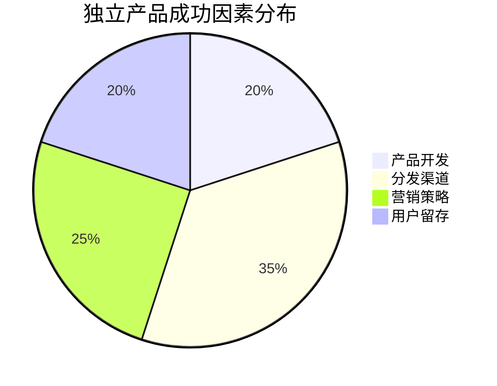
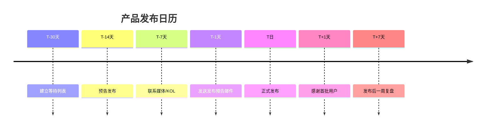
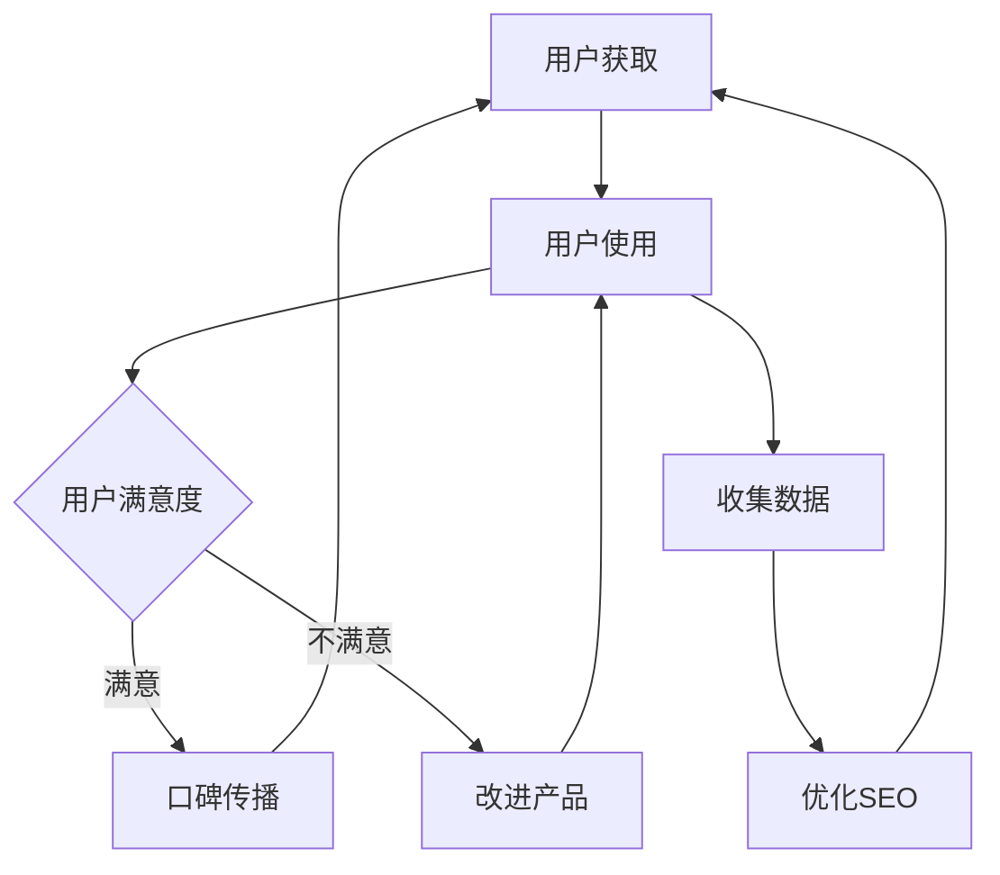

# 分发渠道与冷启动：产品做出来没人知道怎么办

## 好产品不会自己传播

> [!key] 核心洞察
> "Build it and they will come"是独立开发者最大的谎言。**产品开发只占成功因素的20%，分发和获客占80%**。冷启动阶段的策略决定了产品的生死。独立开发者需要从开发第一天就开始思考分发。

---

## 独立开发者的分发渠道矩阵

### 自有渠道（高控制权，低初始流量）

| 渠道 | 投入时间 | 效果 | 适用阶段 |
|------|---------|------|---------|
| 产品SEO | 高（长期） | 长期稳定 | 增长期 |
| 博客/内容 | 中 | 持续积累 | 验证期+ |
| 邮件列表 | 中 | 高转化 | 所有阶段 |
| 个人网站 | 低 | 低流量 | 所有阶段 |

### 社交渠道（中等控制权，中等流量）

| 渠道 | 优势 | 内容类型 | 最佳发布时间 |
|------|------|---------|------------|
| Twitter/X | 快速传播 | 技术分享、产品更新 | 日常 |
| 小红书 | 精准用户 | 使用教程、案例 | 1-2次/周 |
| 知乎/掘金 | 深度用户 | 深度文章、经验分享 | 1-2次/周 |
| LinkedIn | 专业用户 | 行业洞察 | 2-3次/周 |

### 外部渠道（低控制权，高流量）

| 渠道 | 方式 | 适合场景 |
|------|------|---------|
| Product Hunt | 产品发布 | 首次曝光 |
| Hacker News | 项目展示 | 技术产品 |
| 独立开发者社区 | 分享交流 | 获取早期用户 |
| 媒体/博客 | 被报道 | PR曝光 |

---

## 冷启动"三步走"策略

### 第一步：种子用户获取（产品上线前）

**目标**：在正式上线前获得100-500个潜在用户

> [!example] 种子用户获取渠道
> 1. **你的社交网络**：在朋友圈/Twitter发布"我正在开发..."
> 2. **目标社区**：在用户所在的社区分享你的Idea
> 3. **Landing Page**：创建等待列表（参考[[05-产品与开发/独立开发者生存指南/02_Idea筛选与验证：做什么比怎么做更重要]]）
> 4. **一对一邀请**：主动联系潜在用户

### 第二步：产品发布（上线日）

**发布时间线**：

### 第三步：增长飞轮（上线后）

---

## SEO：独立开发者最被低估的获客渠道

### 独立开发者SEO策略

| 策略 | 投入 | 周期 | 效果 |
|------|------|------|------|
| 长尾关键词 | 低 | 1-3个月 | 稳定流量 |
| 产品页面SEO | 中 | 1-2个月 | 直接转化 |
| 内容营销 | 高 | 3-6个月 | 长期价值 |
| 反向链接 | 中 | 3-12个月 | 权威提升 |

> [!tip] 快速SEO技巧
> - 找到10个长尾关键词，每个写一篇深度文章
> - 使用AI辅助内容生成（参考[[01-AI技术/Prompt Engineering深度/01_Prompt的本质与设计原则]]）
> - 在相关博客和论坛留下有价值的评论（带链接）
> - 创建"xx工具对比"类文章，通常会获得高流量

---

## 社区驱动的增长

与[[05-产品与开发/独立开发者生存指南/06_用户支持与社区运营：小团队的大服务]]中的社区策略相辅相成：

### 1. 成为社区贡献者

- 在相关社区回答问题时带产品链接
- 分享你的开发经验和教训
- 建立"专家"形象

### 2. 利用AI辅助内容分发

AI可以帮助你：
- 将一篇博客文章改写为不同平台的版本
- 自动生成社交媒体帖子
- 分析最佳发布时间
- 跟踪内容效果

---

## 冷启动的量化指标

| 阶段 | 核心指标 | 健康值 |
|------|---------|--------|
| 种子期 | 等待列表用户数 | >200 |
| 发布期 | 首日注册量 | >100 |
| 验证期 | 周活跃用户 | >30%注册用户 |
| 增长期 | 自然增长比例 | >40% |

> [!warning] 冷启动常见误区
> - 等到产品完美才发布 → 永远没有完美的产品
> - 试图覆盖所有渠道 → 精力分散，效果不佳
> - 忽略已有用户的维护 → 新用户还没来，老用户已流失
> - 过早投放广告 → 没有验证产品价值前，广告是浪费

---

## 跨知识库联动

- [[05-产品与开发/独立开发者生存指南/04_定价与商业模式：独立开发者如何赚钱]] 讨论了定价如何影响获客
- [[05-产品与开发/独立开发者生存指南/06_用户支持与社区运营：小团队的大服务]] 中的社区策略是长期获客的关键
- [[03-HR人事/AI时代领导力与管理/05_远程+AI协作文化]] 中的分布式协作理念适用于远程获客团队

---

*最后更新: 2026-07-31*