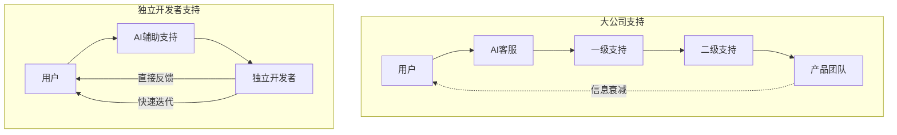
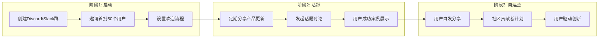

# 用户支持与社区运营：小团队的大服务

## 客户支持是你的竞争壁垒

> [!key] 核心洞察
> 独立开发者最大的优势不是技术，而是**与用户之间的近距离**。大公司需要多层客服体系，而你可以直接和用户对话。这种"创始人与用户"的直接连接，是建立产品忠诚度和口碑的最强武器。AI可以帮你规模化这种连接，而不是替代它。



---

## 用户支持的分级策略

### Level 1：AI自助支持（80%的问题）

AI可以处理绝大多数常见问题：

| 支持类型 | AI怎么处理 | 人类介入时机 |
|---------|-----------|------------|
| 常见问题FAQ | AI自动回答 | 用户不满意时 |
| 使用教程 | AI生成个性化教程 | 复杂场景 |
| 故障排查 | AI引导排除 | 无法解决时 |
| 功能咨询 | AI介绍功能 | 付费决策时 |

> [!tip] AI支持提示词设计
> 参考[[01-AI技术/Prompt Engineering深度/02_角色扮演：让AI成为特定专家的艺术]]，为AI支持设定角色：
> ```
> 你是一位友好的产品支持专家。
> 你了解产品所有功能。
> 如果用户问题超出你的能力范围，请礼貌地转接给人类支持。
> ```

### Level 2：异步人工支持（15%的问题）

- 邮件/工单支持
- 社区论坛回复
- 目标：24小时内回复

### Level 3：实时支持（5%的问题）

- 关键用户或关键问题
- 付费用户优先
- 通过即时通讯工具

---

## 社区运营的"独立开发者方式"

### 为什么社区对独立开发者重要？

1. **降低支持成本**：用户之间互相帮助
2. **提高留存率**：社区归属感让用户不易流失
3. **获取产品反馈**：参考[[05-产品与开发/独立开发者生存指南/03_MVP开发策略：最小可行产品的最优路径]]
4. **口碑传播**：活跃的社区是最好的营销渠道

### 社区建设的三个阶段



---

## AI辅助用户支持的工具链

| 工具 | 功能 | 适用阶段 |
|------|------|---------|
| Intercom/Crisp | AI聊天机器人+工单 | 所有阶段 |
| Zendesk AI | 自动分类+回复 | 增长期+ |
| Notion AI | 知识库自动生成 | 所有阶段 |
| GitHub Issues | 技术问题追踪 | 技术产品 |
| Discord/Slack | 社区讨论 | 所有阶段 |

---

## 用户反馈的闭环管理

> [!example] 反馈闭环流程
> 1. **收集**：通过AI自动收集用户反馈（社区、邮件、应用内）
> 2. **分类**：AI自动分类为"bug/需求/建议/咨询"
> 3. **优先级**：根据影响范围和频率排序
> 4. **回应**：告知用户已收到（AI自动回复）
> 5. **处理**：开发者处理
> 6. **反馈**：告知用户已处理
> 7. **感谢**：感谢用户贡献

---

## 社区运营的量化指标

| 指标 | 计算方式 | 健康值 |
|------|---------|--------|
| 社区活跃度 | 日活跃用户/总用户 | >10% |
| 回复率 | 用户问题被回答的比例 | >90% |
| 平均回复时间 | 用户提问到得到回复 | <4小时 |
| 用户满意度 | 支持后的满意度评分 | >4.5/5 |
| 社区贡献者 | 主动帮助他人的用户 | >5% |

---

## 小团队的服务哲学

> [!warning] 独立开发者的服务陷阱
> - **过度承诺**：24/7支持 → 把自己累垮
> - **个人化过度**：每个用户都要求创始人亲自回复 → 无法规模化
> - **忽视文档**：重复回答同样的问题 → 浪费时间
> - **缺乏边界**：免费用户也要求即时支持 → 精力分散

### 正确做法

1. **设定清晰的支持时间**：如"工作日10:00-18:00"
2. **建立完善的知识库**：让AI和文档回答80%的问题
3. **区分用户层级**：付费用户优先支持
4. **利用异步沟通**：不要求即时回复
5. **定期复盘**：每周分析支持数据，优化流程

---

## 跨知识库联动

- [[05-产品与开发/独立开发者生存指南/05_分发渠道与冷启动：产品做出来没人知道怎么办]] 中的获客策略与社区运营相辅相成
- [[05-产品与开发/独立开发者生存指南/07_时间与精力管理：独立开发者的一人公司运营]] 提供了时间管理的策略，帮助平衡支持工作
- [[03-HR人事/AI时代领导力与管理/06_管理者AI素养：从会用到善用]] 中的AI素养框架可以帮助你更有效地使用AI支持工具

---

*最后更新: 2026-07-31*