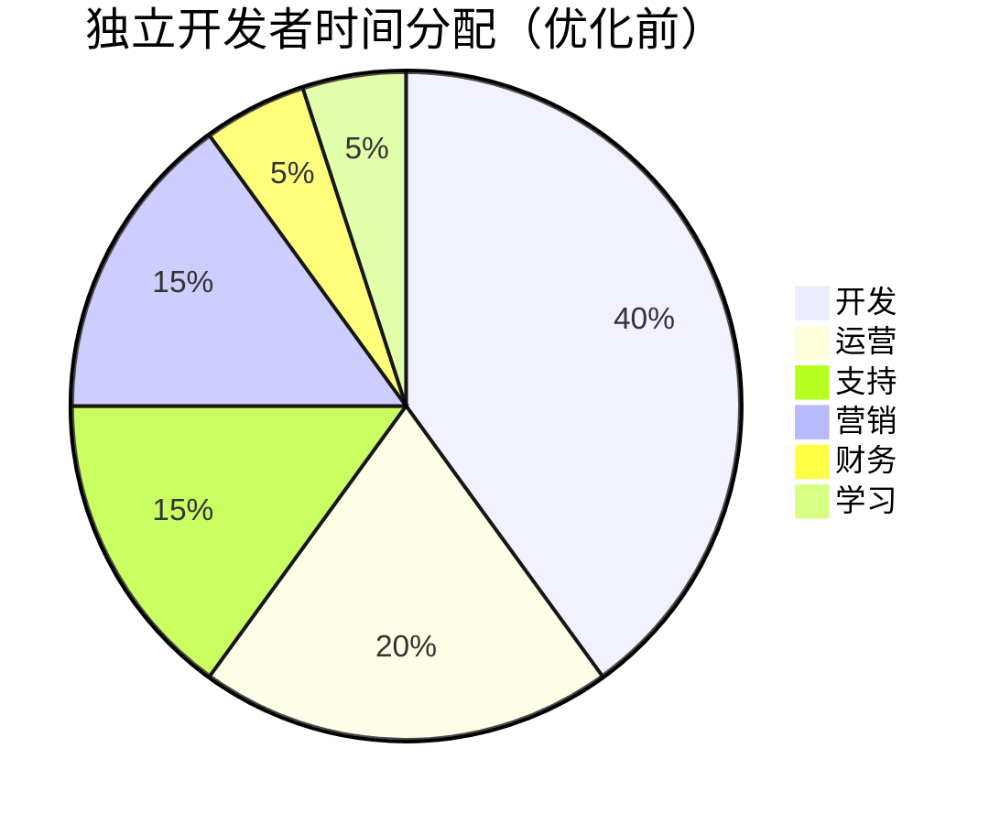
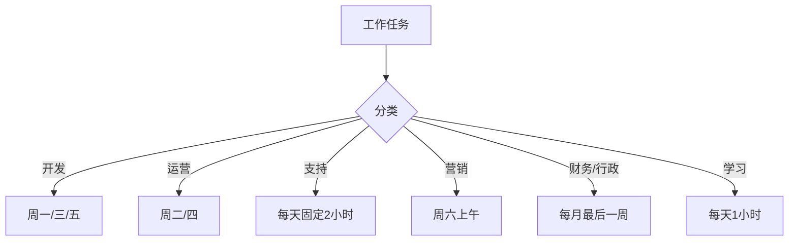
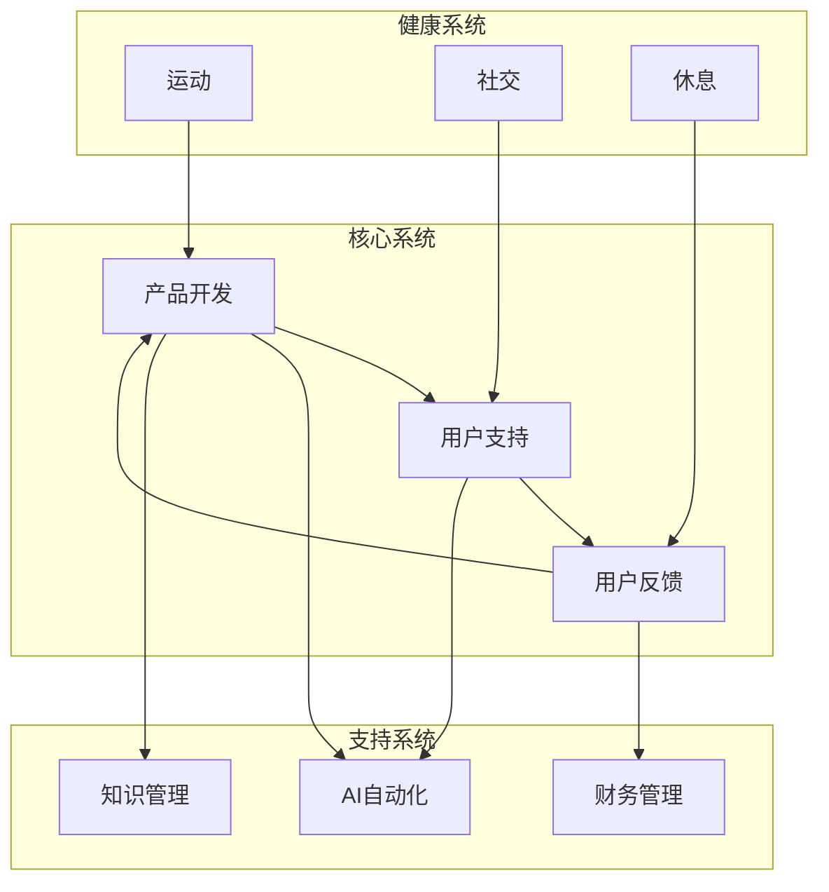

# 时间与精力管理：独立开发者的一人公司运营

## 你最大的资源不是技术，而是注意力和精力

> [!key] 核心洞察
> 独立开发者同时是CEO、CTO、CMO、客服和财务。你只有24小时，但AI可以给你"额外的8小时"。**关键不在于做更多的事，而在于做正确的事——并且让AI帮你做剩下的事。**

---

## 精力管理的核心原则

### 1. 识别你的"黄金时间"

每个人的精力高峰不同。独立开发者最大的自由是可以在精力最好的时候做最重要的任务。

| 时间类型 | 适合的任务 | 不适合的任务 |
|---------|-----------|------------|
| 黄金时间（精力高峰） | 深度开发、产品决策 | 邮件、会议 |
| 中等时间 | 内容创作、代码审查 | 创新思考 |
| 低谷时间（精力低） | 支持回复、文档、学习 | 重要决策 |

### 2. 番茄工作法 × AI

传统番茄工作法（25分钟工作+5分钟休息）在AI时代可以升级：

> [!example] AI增强番茄工作法
> - **25分钟**：深度工作（关闭所有通知，专注核心任务）
> - **5分钟**：AI处理——检查AI自动生成的代码、回复、分析
> - **每4个番茄钟**：15分钟长休息，AI会自动整理进度

### 3. 任务分批处理

---

## 独立开发者应该"外包"给AI的任务

| 任务类型 | 时间占比 | AI可以替代 | 节省时间 |
|---------|---------|-----------|---------|
| 代码编写 | 40% | 50-70% | 20-28% |
| 用户支持 | 15% | 80% | 12% |
| 内容创作 | 10% | 60% | 6% |
| 数据分析 | 5% | 80% | 4% |
| 项目管理 | 5% | 40% | 2% |

> [!tip] AI外包策略
> 1. **识别可外包的任务**：重复性、标准化的任务优先
> 2. **建立AI工作流**：参考[[01-AI技术/Prompt Engineering深度/05_结构化输出控制：让AI按你的格式输出]]
> 3. **持续优化AI提示**：让AI更懂你的需求
> 4. **定期回顾**：哪些任务AI做得好，哪些需要人工介入

---

## 独立开发者的一天示例

| 时间 | 活动 | 说明 |
|------|------|------|
| 6:00-7:00 | 运动+冥想 | 精力管理的基础 |
| 7:00-8:00 | 学习+规划 | 阅读行业动态，规划当天任务 |
| 8:00-10:00 | **深度开发** | 黄金时间，关闭所有通知 |
| 10:00-10:30 | AI审查 | 检查AI生成的代码和内容 |
| 10:30-12:00 | 产品开发 | 中等复杂度任务 |
| 12:00-13:00 | 午餐+休息 | 离开电脑 |
| 13:00-14:00 | 用户支持 | AI辅助回复 |
| 14:00-15:00 | 市场运营 | 内容发布、社区互动 |
| 15:00-16:00 | 学习/实验 | 新工具、新技术 |
| 16:00-17:00 | 灵活时间 | 未完成的任务或提前结束 |
| 17:00-18:00 | 复盘+规划 | 记录今日进展，规划明日 |

---

## 防止倦怠的系统

独立开发者最危险的敌人是**倦怠**。没有团队支撑，一旦倦怠就可能彻底放弃。

### 倦怠预警信号

> [!warning] 警惕以下信号
> - 早上不想起床面对工作
> - 对产品失去热情
> - 连续多天效率低下
> - 开始质疑自己为什么要做独立开发
> - 身体健康出现问题

### 预防系统

| 维度 | 策略 | 频率 |
|------|------|------|
| 身体 | 每周3次运动 | 每周 |
| 社交 | 参加独立开发者聚会 | 每月 |
| 心理 | 写"复盘日记" | 每日 |
| 工作 | 每季度休息1周 | 每季度 |
| 学习 | 参加行业会议 | 每年 |

---

## 一人公司的"运营系统"

---

## 跨知识库联动

- [[05-产品与开发/独立开发者生存指南/01_独立开发者的心智模型：从副业到主业的转型]] 中的心态管理是时间管理的基础
- [[05-产品与开发/独立开发者生存指南/08_财务与合规：从银行开户到税务申报]] 中的财务系统是运营的一部分
- [[03-HR人事/AI时代领导力与管理/07_人才战略：AI时代如何招聘、培养和留住人才]] 中的"培养自己"的理念适用于独立开发者的自我提升

---

*最后更新: 2026-07-31*