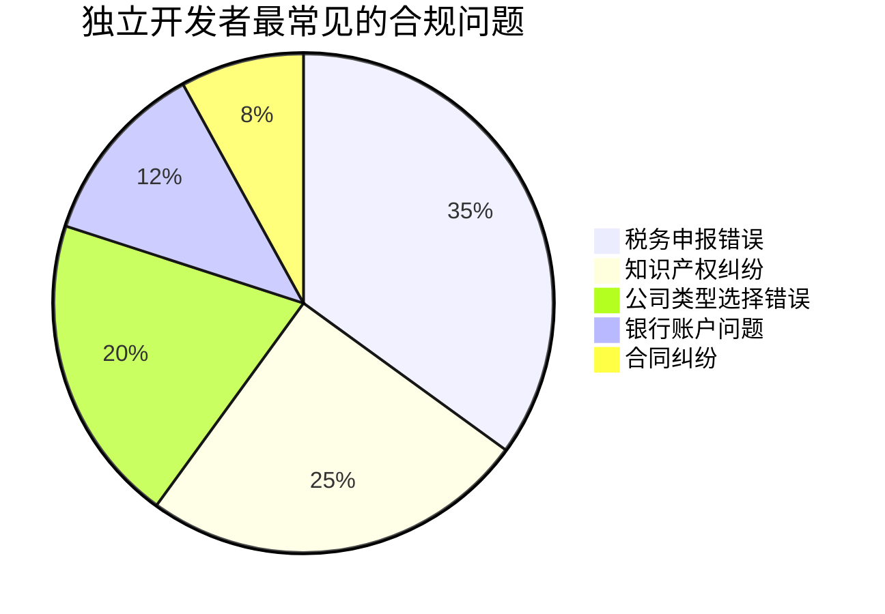
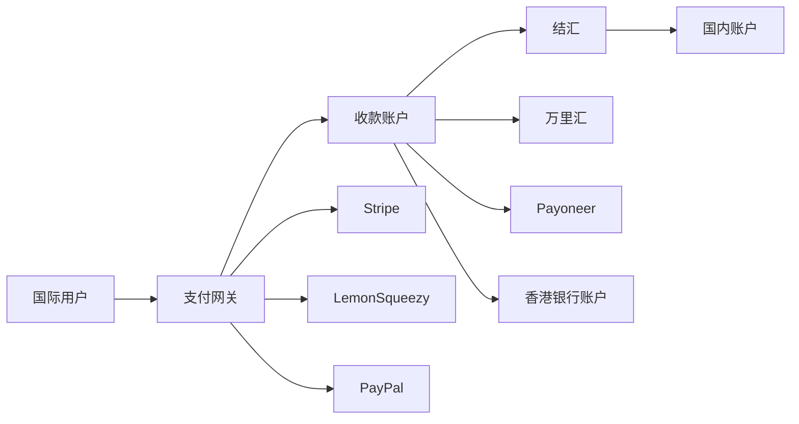

# 财务与合规：从银行开户到税务申报

## 合规是独立开发者的"隐形地基"

> [!key] 核心洞察
> 大多数独立开发者把精力100%放在产品上，直到被税务问题、知识产权纠纷或银行账户冻结击中。**财务和合规不是"以后再说"的事，而是从第一天起就需要建立的基础设施**。好的合规体系不会让你多赚钱，但能让你避免"一夜回到解放前"的灾难。

---

## 公司注册：选择正确的法律实体

### 常见的公司形式对比

| 类型 | 适用场景 | 注册成本 | 税务复杂度 | 个人责任保护 |
|------|---------|---------|-----------|------------|
| 个体工商户 | 个人副业、小规模 | 低 | 低 | 无 |
| 一人有限公司 | 独立开发主力 | 中 | 中 | 有 |
| 有限责任公司 | 有合伙人/团队 | 中 | 中 | 有 |
| 境外公司 | 面向海外市场 | 高 | 高 | 有 |

> [!tip] 选择建议
> - **月收入<1万**：个体工商户（最简单）
> - **月收入1-5万**：一人有限公司（责任保护）
> - **月收入>5万或有合伙人**：有限责任公司
> - **主要面向海外客户**：考虑境外公司（如新加坡、美国）

---

## 税务管理：独立开发者的必修课

### 核心税种

| 税种 | 税率 | 申报频率 | 说明 |
|------|------|---------|------|
| 增值税 | 1%-6% | 季度 | 小规模纳税人1% |
| 企业所得税 | 2.5%-25% | 季度+年度 | 小微企业有优惠 |
| 个人所得税 | 3%-45% | 月度 | 工资薪金个税 |
| 附加税 | 增值税的12% | 季度 | 随增值税申报 |

### 税务优化策略

> [!warning] 税务规划不是逃税
> 合法的税务优化可以显著提高你的实际收入：
> - 合理利用小微企业税收优惠
> - 将个人支出转化为公司支出（设备、软件、办公用品）
> - 利用AI工具（如QuickBooks、金蝶）自动记账报税
> - 每季度预留30%收入用于税务

---

## 知识产权保护

### 独立开发者需要保护什么？

| 知识产权类型 | 保护对象 | 保护方式 | 成本 |
|------------|---------|---------|------|
| 软件著作权 | 源代码 | 著作权登记 | 低 |
| 商标 | 产品名称/Logo | 商标注册 | 中 |
| 专利 | 技术发明 | 专利申请 | 高 |
| 商业秘密 | 核心算法/数据 | 保密协议 | 低 |

### 实际建议

1. **必做**：软件著作权登记（保护源代码，成本低）
2. **建议做**：商标注册（保护品牌，防止被抢注）
3. **视情况**：专利（成本高，除非有颠覆性技术）
4. **时刻注意**：保留开发记录和用户协议

---

## 国际收款与外汇管理

面向全球用户的独立开发者需要处理国际收款：

> [!tip] 国际收款建议
> - **Stripe**：优先选择，费率低，集成好
> - **LemonSqueezy**：适合SaaS产品，处理税务合规
> - **万里汇/Payoneer**：便捷的跨境收款方案
> - **香港银行账户**：适合收入较高的独立开发者

---

## 财务运营系统

### 独立开发者需要建立的财务系统

| 系统 | 工具推荐 | 频率 |
|------|---------|------|
| 记账 | 金蝶/用友/QuickBooks | 每日 |
| 发票管理 | 电子发票平台 | 月度 |
| 现金流预测 | 电子表格 | 每周 |
| 税务申报 | 税务系统 | 季度 |
| 年度审计 | 会计师 | 年度 |

---

## 合规检查清单

> [!example] 月度合规检查清单
> - [ ] 所有收入已入账并记录
> - [ ] 所有支出有发票或收据
> - [ ] 银行账户余额与账目一致
> - [ ] 用户协议和隐私政策已更新
> - [ ] AI使用合规（如涉及[[01-AI技术/Prompt Engineering深度/08_企业级Prompt管理：从个人到团队的规模化]]中的数据安全）
> 
> **季度检查**：
> - [ ] 增值税申报完成
> - [ ] 企业所得税预缴
> - [ ] 现金流状况评估
> - [ ] 知识产权状态检查
> 
> **年度检查**：
> - [ ] 年度税务申报
> - [ ] 工商年报
> - [ ] 财务审计（如有需要）
> - [ ] 公司战略复盘

---

## 跨知识库联动

- [[05-产品与开发/独立开发者生存指南/07_时间与精力管理：独立开发者的一人公司运营]] 提供了运营系统的整体框架
- [[03-HR人事/AI时代领导力与管理/08_组织变革领导力：引领AI转型的路线图]] 中的变革管理框架也适用于财务系统的升级
- [[01-AI技术/Prompt Engineering深度/08_企业级Prompt管理：从个人到团队的规模化]] 中的安全管理原则适用于AI工具的合规使用

---

*最后更新: 2026-07-31*