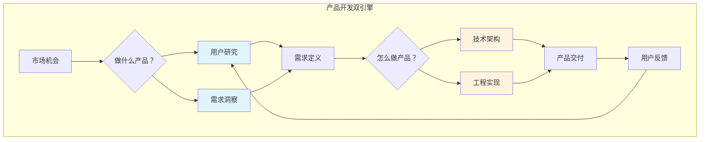
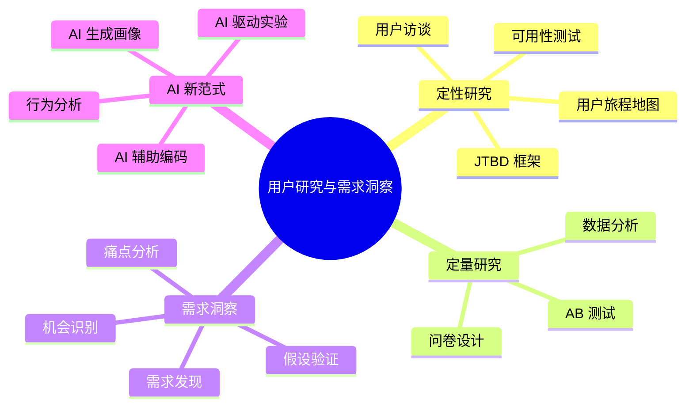
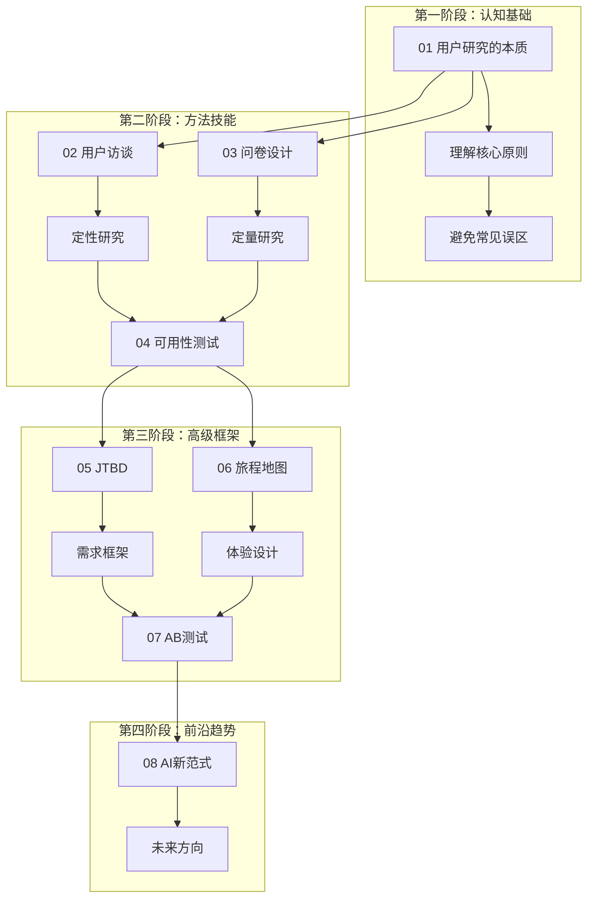
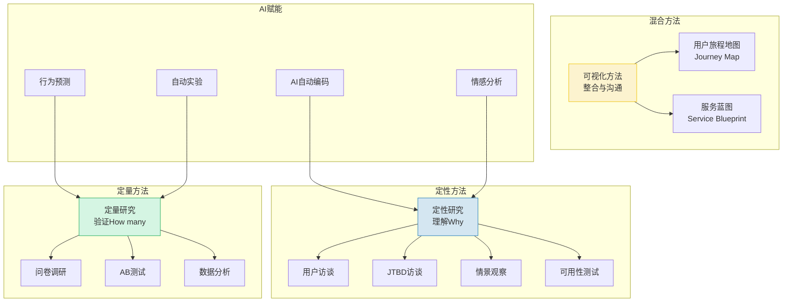
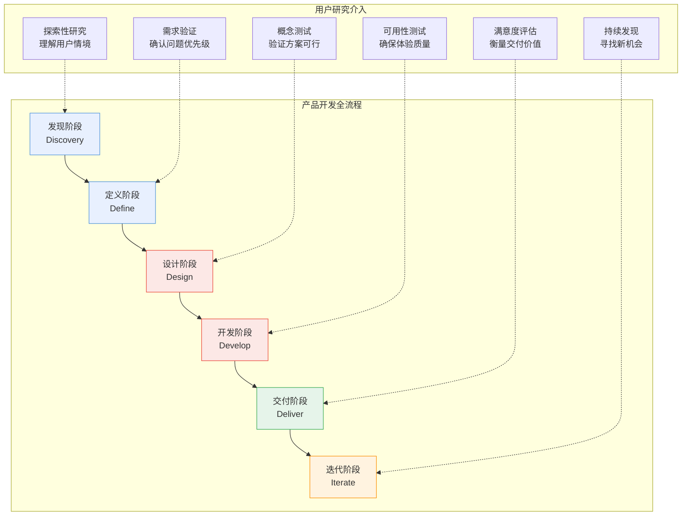
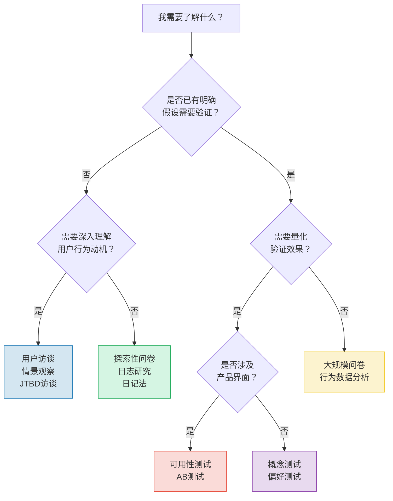
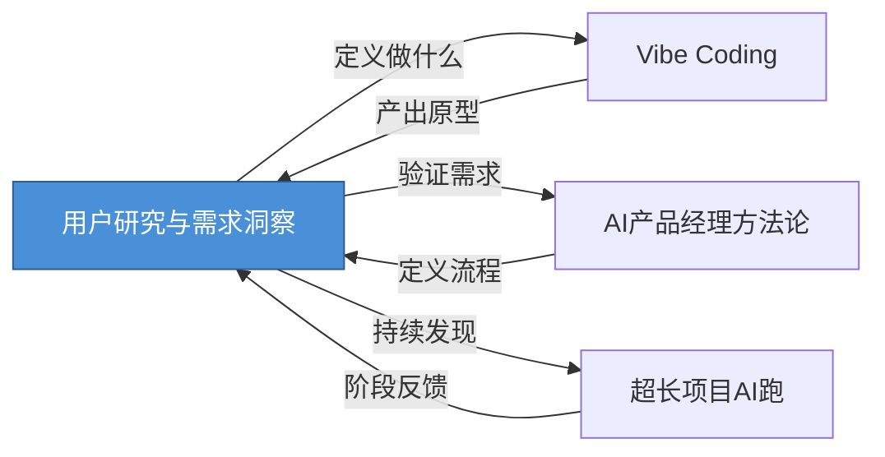

# 用户研究与需求洞察中枢

> [!abstract] 知识库定位
> 本知识库聚焦**用户研究的方法论**：怎么理解用户、怎么发现需求、怎么验证假设。它是产品开发的底层能力，回答"做什么产品"这个根本问题。
> 
> **与关联知识库的分工**：
> - [[05-产品与开发/AI产品经理方法论/00_MOC_AI产品经理方法论中枢]] 讲 "AI PM 角色与工作流"
> - [[05-产品与开发/Vibe Coder/Vibe Coding 软件瘦身指南]] 讲 "怎么用 AI 写代码"
> - [[01-AI技术/超长项目AI跑/超长项目AI跑_知识库建设方案]] 讲 "怎么管理长项目"
> - **本知识库** 讲 "怎么理解用户、发现需求"

---

## 一、为什么需要这个知识库？

### 1.1 产品开发的核心问题

在软件产品开发中，所有方法论最终都指向两个问题：

1. **做什么产品？**（What to build）—— 这是需求洞察的范畴
2. **怎么做产品？**（How to build）—— 这是工程实现的范畴

> [!important] 核心洞察
> 大多数产品失败不是因为"做不出来"，而是因为"做了没人要的东西"。**用户研究解决的问题，比工程问题更根本。**

### 1.2 当前 AI 时代的知识版图

在 AI 辅助开发的时代，我们已经有了大量关于"怎么做"的知识：

| 知识库 | 回答的问题 | 覆盖阶段 |
|--------|-----------|---------|
| [[05-产品与开发/Vibe Coder/Vibe Coding 软件瘦身指南]] | 如何用 AI 高效写代码 | 实现阶段 |
| [[01-AI技术/超长项目AI跑/超长项目AI跑_知识库建设方案]] | 如何管理复杂的长期项目 | 项目管理 |
| [[05-产品与开发/AI产品经理方法论/00_MOC_AI产品经理方法论中枢]] | AI PM 的角色与工作流 | 产品管理 |
| **本知识库** | 如何理解用户与发现需求 | **需求发现** |

> [!warning] 知识缺口
> 在"怎么做产品"的能力被 AI 大幅增强的今天，**"做什么产品"这个问题的价值反而更高了**。因为当实现成本趋近于零时，真正的瓶颈变成了：你知道该做什么吗？

---

## 二、知识库结构总览

### 2.1 内容地图

### 2.2 文档导航

本知识库包含 8 篇核心文档，按照**从理解到验证**的认知逻辑排列：

| 编号 | 文档 | 核心问题 | 方法类型 |
|------|------|---------|---------|
| 01 | [[05-产品与开发/用户研究与需求洞察/01_用户研究的本质]] | 用户研究是什么？为什么重要？ | 认知基础 |
| 02 | [[05-产品与开发/用户研究与需求洞察/02_用户访谈：深度理解用户的方法]] | 如何深度理解用户？ | 定性研究 |
| 03 | [[05-产品与开发/用户研究与需求洞察/03_问卷设计与定量研究]] | 如何量化用户需求？ | 定量研究 |
| 04 | [[05-产品与开发/用户研究与需求洞察/04_可用性测试]] | 如何评估产品体验？ | 定性+定量 |
| 05 | [[05-产品与开发/用户研究与需求洞察/05_JTBD：Jobs to Be Done]] | 用户真正的需求是什么？ | 需求框架 |
| 06 | [[05-产品与开发/用户研究与需求洞察/06_用户旅程地图与体验设计]] | 如何可视化用户体验？ | 体验设计 |
| 07 | [[05-产品与开发/用户研究与需求洞察/07_A_B测试与实验设计]] | 如何科学验证假设？ | 实验验证 |
| 08 | [[05-产品与开发/用户研究与需求洞察/08_AI时代的用户研究新范式]] | AI 如何改变用户研究？ | 前沿趋势 |

### 2.3 学习路径建议

---

## 三、方法论全景图

### 3.1 定性与定量方法矩阵

### 3.2 用户研究在产品开发中的位置

---

## 四、各文档核心要点速览

### 4.1 [[05-产品与开发/用户研究与需求洞察/01_用户研究的本质]]

**核心问题**：为什么我们不能靠"直觉"和"经验"做产品？

- 三大核心原则：观察 > 询问、行为 > 态度、情境 > 抽象
- 常见误区：确认偏误、样本偏差、幸存者偏差、社会期望偏差
- 用户研究的底层逻辑：用户说的 \u2260 用户做的 \u2260 用户需要的

> [!quote] 关键洞察
> "如果你问用户想要什么，他们会说想要一匹更快的马。" —— 亨利·福特

### 4.2 [[05-产品与开发/用户研究与需求洞察/02_用户访谈：深度理解用户的方法]]

**核心问题**：如何通过对话真正理解用户？

- 访谈准备：筛选标准、访谈提纲、场景选择
- 访谈技巧：开放式提问、追问的艺术、沉默的力量
- 分析工具：亲和图法（Affinity Diagram）
- 常见陷阱：引导性问题、过度解释、过早下结论

### 4.3 [[05-产品与开发/用户研究与需求洞察/03_问卷设计与定量研究]]

**核心问题**：如何用数据说话，验证定性发现？

- 问卷设计五原则：清晰、简洁、中立、互斥、穷尽
- 问题类型详解：Likert 量表、语义差异量表、NPS
- 抽样方法：随机抽样、分层抽样、配额抽样
- 数据分析：描述统计、交叉分析、显著性检验

### 4.4 [[05-产品与开发/用户研究与需求洞察/04_可用性测试]]

**核心问题**：如何确保产品真的能被用户顺利使用？

- 测试设计：任务设计、场景设计、指标设计（完成率/时间/错误率/SUS）
- 执行方法：Think Aloud 协议、观察记录、眼动追踪
- 问题分级：catastrophic / serious / minor / cosmetic
- 测试报告：问题清单、严重性矩阵、改进建议

### 4.5 [[05-产品与开发/用户研究与需求洞察/05_JTBD：Jobs to Be Done]]

**核心问题**：用户"雇佣"你的产品，到底是为了完成什么任务？

- JTBD 核心理念：不是用户画像，而是用户要完成的"工作"
- 推-拉-锚框架：Push（推力）、Pull（拉力）、Anxiety（锚定）
- 三种"工作"类型：功能性工作、情感性工作、社会性工作
- 应用案例：奶昔案例、Snapchat 案例

### 4.6 [[05-产品与开发/用户研究与需求洞察/06_用户旅程地图与体验设计]]

**核心问题**：如何可视化用户的完整体验历程？

- 旅程地图五要素：阶段、行为、触点、情绪、痛点/机会
- 服务蓝图：前端体验 + 后台支撑 + 支持流程
- 制图过程：数据收集 \u2192 角色定义 \u2192 旅程映射 \u2192 机会识别
- 应用场景：发现断点、优化体验、创新机会识别

### 4.7 [[05-产品与开发/用户研究与需求洞察/07_A_B测试与实验设计]]

**核心问题**：如何科学地验证"哪个方案更好"？

- 科学原理：假设、变量控制、随机化、统计显著性
- 实验设计：样本量计算、实验周期、多重比较校正
- 常见陷阱：过早停止、新奇效应、网络效应
- AI 产品特殊考量：模型版本对比、Prompt A/B、推荐策略实验

### 4.8 [[05-产品与开发/用户研究与需求洞察/08_AI时代的用户研究新范式]]

**核心问题**：AI 如何改变用户研究的方法和效率？

- AI 辅助编码：自动主题分析、情感分类
- AI 生成画像：从数据自动生成 Persona
- AI 驱动实验：自动化 A/B 测试、多臂老虎机
- 不变的：同理心、情境理解、价值判断

---

## 五、方法论选择指南

### 5.1 何时使用哪种方法？

### 5.2 定性与定量方法的互补

| 维度 | 定性方法 | 定量方法 |
|------|---------|---------|
| 目标 | 理解"为什么" | 验证"有多少" |
| 样本 | 小样本（5-30人） | 大样本（100+） |
| 产出 | 洞察、假设、故事 | 数据、统计、趋势 |
| 时机 | 探索阶段 | 验证阶段 |
| 代表文档 | [[05-产品与开发/用户研究与需求洞察/02_用户访谈：深度理解用户的方法]]、[[05-产品与开发/用户研究与需求洞察/05_JTBD：Jobs to Be Done]] | [[05-产品与开发/用户研究与需求洞察/03_问卷设计与定量研究]]、[[05-产品与开发/用户研究与需求洞察/07_A_B测试与实验设计]] |

> [!important] 黄金法则
> 定性研究告诉你**该做什么**，定量研究告诉你**做得怎么样**。两者缺一不可。先定性探索形成假设，再定量验证确认结论。

---

## 六、与其他知识库的交叉关联

### 6.1 与 [[05-产品与开发/AI产品经理方法论/00_MOC_AI产品经理方法论中枢]] 的关联

- 用户研究是 AI 产品经理的核心能力之一
- AI PM 需要理解用户才能定义 AI 产品解决什么问题
- 本知识库提供了 AI PM 所需的用户研究工具包

### 6.2 与 [[05-产品与开发/Vibe Coder/Vibe Coding 软件瘦身指南]] 的关联

- 在 Vibe Coding 之前，先通过用户研究确认"做什么"
- 用户反馈驱动 Vibe Coding 的迭代方向
- 可用性测试可以验证 Vibe Coding 产出的质量

### 6.3 与 [[01-AI技术/超长项目AI跑/超长项目AI跑_知识库建设方案]] 的关联

- 长项目中需要持续的用户研究来保持方向正确
- 用户旅程地图帮助长项目保持用户视角
- 阶段性用户验证是长项目不跑偏的关键

---

## 七、推荐学习路径

### 7.1 基础入门（第1-2周）

1. 阅读 [[05-产品与开发/用户研究与需求洞察/01_用户研究的本质]] 建立认知基础
2. 阅读 [[05-产品与开发/用户研究与需求洞察/02_用户访谈：深度理解用户的方法]] 掌握最核心的定性方法
3. 实践：找 3 个用户做一次非正式访谈

### 7.2 方法进阶（第3-4周）

4. 阅读 [[05-产品与开发/用户研究与需求洞察/03_问卷设计与定量研究]] 学习定量方法
5. 阅读 [[05-产品与开发/用户研究与需求洞察/04_可用性测试]] 学习评估方法
6. 实践：设计一份问卷或执行一次可用性测试

### 7.3 高级专题（第5-6周）

7. 阅读 [[05-产品与开发/用户研究与需求洞察/05_JTBD：Jobs to Be Done]] 掌握高级框架
8. 阅读 [[05-产品与开发/用户研究与需求洞察/06_用户旅程地图与体验设计]] 学习体验可视化
9. 阅读 [[05-产品与开发/用户研究与需求洞察/07_A_B测试与实验设计]] 学习科学验证

### 7.4 前沿探索（第7-8周）

10. 阅读 [[05-产品与开发/用户研究与需求洞察/08_AI时代的用户研究新范式]] 了解 AI 如何改变用户研究
11. 实践：尝试用 AI 工具辅助一次用户研究

---

## 八、关键概念索引

| 概念 | 定义 | 详细文档 |
|------|------|---------|
| 确认偏误 | 倾向于寻找支持自己假设的证据 | [[05-产品与开发/用户研究与需求洞察/01_用户研究的本质]] |
| 亲和图法 | 将定性数据聚类分组的分析方法 | [[05-产品与开发/用户研究与需求洞察/02_用户访谈：深度理解用户的方法]] |
| Likert 量表 | 度量态度/意见的常用量表 | [[05-产品与开发/用户研究与需求洞察/03_问卷设计与定量研究]] |
| Think Aloud | 用户边操作边说出思考过程的测试方法 | [[05-产品与开发/用户研究与需求洞察/04_可用性测试]] |
| JTBD | 用户"雇佣"产品完成的任务 | [[05-产品与开发/用户研究与需求洞察/05_JTBD：Jobs to Be Done]] |
| 推-拉-锚 | JTBD 中用户决策的三种力量 | [[05-产品与开发/用户研究与需求洞察/05_JTBD：Jobs to Be Done]] |
| 用户旅程地图 | 可视化用户完整体验历程的工具 | [[05-产品与开发/用户研究与需求洞察/06_用户旅程地图与体验设计]] |
| 服务蓝图 | 展示前后台服务如何支撑用户旅程 | [[05-产品与开发/用户研究与需求洞察/06_用户旅程地图与体验设计]] |
| 统计显著性 | 结果是否由随机因素导致的判断 | [[05-产品与开发/用户研究与需求洞察/07_A_B测试与实验设计]] |
| 多臂老虎机 | 自动平衡探索与利用的实验方法 | [[05-产品与开发/用户研究与需求洞察/07_A_B测试与实验设计]] |
| AI 自动编码 | 用 AI 自动对定性数据进行主题分类 | [[05-产品与开发/用户研究与需求洞察/08_AI时代的用户研究新范式]] |

---

## 九、经典书单推荐

> [!note] 推荐阅读
> 以下书籍是本知识库的重要理论来源：

1. **《洞察：精确观察和有效沟通的艺术》** —— 艾美·赫曼
2. **《Don't Make Me Think》** —— Steve Krug（可用性测试经典）
3. **《Interviewing Users》** —— Steve Portigal（用户访谈经典）
4. **《Competing Against Luck》** —— Clayton Christensen（JTBD 理论出处）
5. **《The Mom Test》** —— Rob Fitzpatrick（创业用户访谈指南）
6. **《Measuring the User Experience》** —— Tom Tullis & Bill Albert（定量 UX 研究）
7. **《This is Service Design Doing》** —— Marc Stickdorn（服务设计实践）
8. **《Trustworthy Online Controlled Experiments》** —— Ron Kohavi（A/B 测试权威）

---

## 十、更新日志

| 日期 | 版本 | 更新内容 |
|------|------|---------|
| 2026-07-27 | v1.0 | 初始创建，包含 MOC + 8 篇内容文档 |

---

> [!summary] 一句话总结
> 用户研究不是"问用户想要什么"，而是**理解用户的行为、动机和情境，从而发现真正的需求**。本知识库提供了从定性到定量、从方法到工具的完整体系。

---

*下一篇推荐阅读：[[05-产品与开发/用户研究与需求洞察/01_用户研究的本质]]*