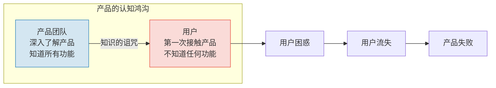
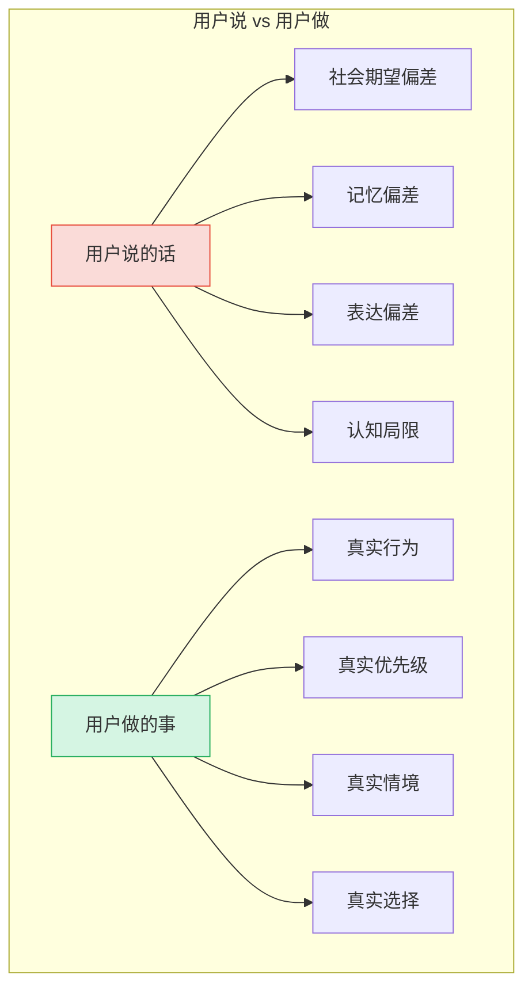
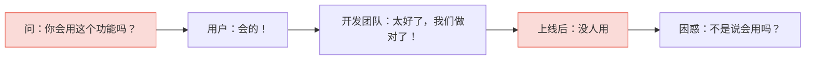
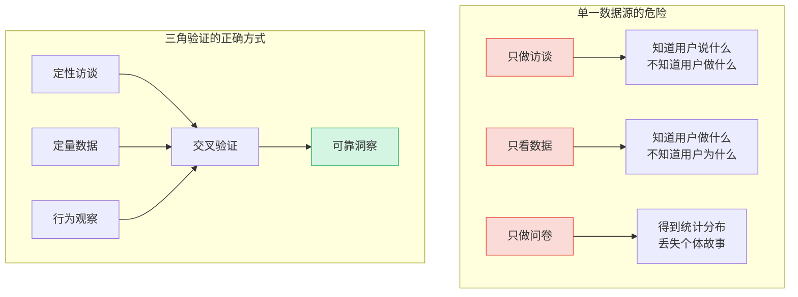
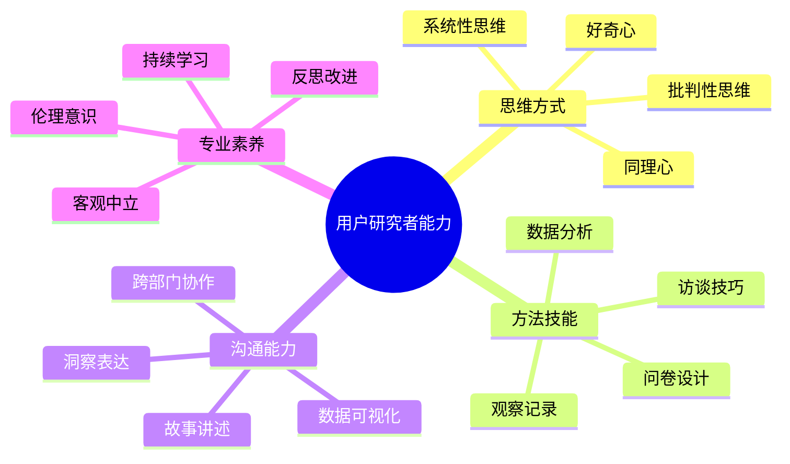

# 用户研究的本质：从"我以为"到"用户要"

> [!abstract] 核心命题
> 用户研究不是"问用户要什么"，而是"理解用户为什么这样做"。它的本质是**从自我中心的假设走向用户中心的认知**，是从"我以为用户需要这个"到"我发现用户确实需要这个"的认知转变。

---

## 一、为什么我们需要用户研究？

### 1.1 知识的诅咒（Curse of Knowledge）

当你一旦知道某件事，就很难想象不知道它是什么感觉。这是产品人最容易犯的错误。



> [!warning] 知识的诅咒
> 你越了解你的产品，就越无法理解用户为什么"不会用"。你设计的每个功能在你看来都是"显而易见"的，但用户可能完全不知道它们的存在。

### 1.2 自我中心的"伪需求"

产品人最常见的失败模式：**因为自己需要，所以觉得别人也需要**。

| 失败模式 | 典型表现 | 后果 |
|---------|---------|------|
| 创始人幻觉 | "我自己就需要这个功能" | 做了一堆没人用的功能 |
| 技术驱动 | "这个技术很酷，用户一定会喜欢" | 技术很炫但解决不了问题 |
| 经验主义 | "我做了十年产品，经验告诉我..." | 市场变化快于经验积累 |
| 竞品盲从 | "竞品在做这个，我们也得做" | 失去差异化，沦为跟随者 |

> [!important] 核心洞察
> 你的需求不一定是用户的需求。你的经验不一定是市场的方向。**用户研究是唯一可以打破"自我中心"的工具。**

---

## 二、用户研究的三大核心原则

### 2.1 原则一：观察 > 询问

> [!quote] 经典论断
> "如果你问用户想要什么，他们会说想要一匹更快的马。" —— 亨利·福特
> 
> "用户不会告诉你他们想要什么，但他们的行为会。" —— Jakob Nielsen

**为什么"问"不够？**



**观察的层次**：

1. **表层观察**：用户做了什么
2. **过程观察**：用户怎么做的（步骤、顺序、犹豫）
3. **情境观察**：在什么环境下做的（时间、地点、设备、情绪）
4. **替代观察**：用户用什么替代方案在解决问题

### 2.2 原则二：行为 > 态度

用户说"我很喜欢这个功能"（态度），但从来不用这个功能（行为）。哪一个更可信？

> [!important] 行为优先原则
> 态度可以提供"为什么"的线索，但**行为是需求真实性的直接证据**。当态度和行为冲突时，相信行为。

**态度 vs 行为的对照表**：

| 维度 | 态度数据 | 行为数据 |
|------|---------|---------|
| 获取方式 | 问卷、访谈、评分 | 日志、埋点、观察 |
| 可靠性 | 中等（受偏差影响） | 高（反映真实选择） |
| 解释力 | 高（知道"为什么"） | 低（只知道"是什么"） |
| 预测力 | 低（态度不预示行为） | 中（行为预示未来行为） |
| 最佳实践 | **结合使用**：先看行为数据发现异常，再用态度数据理解原因 |

### 2.3 原则三：情境 > 抽象

在实验室里问用户"你会用这个功能吗？"和在用户真实的使用场景中观察，得到的是完全不同的答案。

> [!note] 情境的力量
> 用户的需求不是存在于真空中的。**需求 = 用户 + 情境 + 任务**。同样的用户，在不同的情境下，对同一个产品的需求可能完全不同。

**情境的维度**：

- **物理情境**：在哪里使用？（办公室 / 地铁 / 家中 / 户外）
- **时间情境**：什么时候使用？（早上 / 午休 / 深夜 / 紧急时刻）
- **社会情境**：和谁在一起？（独自 / 同事 / 家人 / 陌生人）
- **情绪情境**：什么心情？（焦虑 / 放松 / 专注 / 分心）
- **设备情境**：用什么设备？（手机 / 电脑 / 平板 / 语音）

---

## 三、用户研究的常见误区

### 3.1 误区一：问用户"你会用吗？"



> [!danger] 致命问题
> "你会用吗？"是一个**无效问题**。用户出于礼貌、乐观偏差、或者对"自己"的过度自信，几乎总是回答"会"。正确的问法是：**观察用户实际使用，或者问"你过去遇到过类似的问题吗？当时怎么解决的？"**

### 3.2 误区二：样本偏差

**典型表现**：
- 只访谈了"最活跃的用户"（忽略了沉默的大多数）
- 只调研了"容易接触到的用户"（忽略了边缘用户）
- 只听了"愿意反馈的用户"（幸存者偏差）

> [!warning] 看不见的大多数
> 通常，只有 1% 的用户会主动反馈。你的产品决策如果只基于这 1% 的声音，可能正在为 1% 的用户优化，同时赶走 99% 的用户。

**样本偏差的类型**：

| 偏差类型 | 说明 | 应对策略 |
|---------|------|---------|
| 幸存者偏差 | 只看到留下来的用户 | 主动联系流失用户做退出访谈 |
| 志愿者偏差 | 愿意参与研究的用户有特殊性 | 用激励手段吸引非志愿者 |
| 便利抽样偏差 | 只找容易接触的用户 | 制定筛选标准，主动寻找目标用户 |
| 极端用户偏差 | 只关注最活跃或最不满的用户 | 主动覆盖中间用户群体 |

### 3.3 误区三：确认偏误

**确认偏误（Confirmation Bias）**：人们倾向于寻找、解释和记忆那些支持自己已有信念的信息。

```mermaid
flowchart TD
    A[已有假设：用户需要X功能] --> B{数据收集}
    B --> C[支持假设的数据：关注+记录]
    B --> D[否定假设的数据：忽略+遗忘]
    C --> E[假设得到"证实"]
    D --> F[假设未被挑战]
    E --> G[做出错误决策]
    F --> G

    style C fill:#D5F5E3,stroke:#27AE60
    style D fill:#FADBD8,stroke:#E74C3C
    style G fill:#FADBD8,stroke:#E74C3C
```

**对抗确认偏误的方法**：

1. **明确写下假设**：在研究开始前，写下你的假设，然后试图**证伪**它
2. **逆向提问**：在访谈中，问"有没有哪些情况，你觉得这个方案不适用？"
3. **魔鬼代言人**：指定团队成员扮演"反对者"，专门寻找反面证据
4. **数据驱动**：用行为数据验证态度数据，用定量数据验证定性发现

### 3.4 误区四：社会期望偏差

用户说"我喜欢这个设计"可能是因为：
- 不想让你失望（礼貌偏差）
- 觉得这是"正确答案"（社会期望）
- 想显得自己"有品味"（自我形象维护）

> [!tip] 减少社会期望偏差的技巧
> 1. **降低社交压力**：告诉用户"没有正确答案，我们正在学习"
> 2. **使用间接提问**："你觉得其他用户会怎么想？"而非"你觉得怎么样？"
> 3. **观察而非询问**：让用户操作，观察他们的犹豫和困惑
> 4. **匿名问卷**：对于敏感话题，使用匿名方式收集真实反馈

### 3.5 误区五：过度依赖单个数据源



---

## 四、用户研究的底层逻辑

### 4.1 用户说的 \u2260 用户做的 \u2260 用户需要的

这是用户研究最核心的认知框架：

```
用户说的（态度） \u2192 用户做的（行为） \u2192 用户需要的（真实需求）
    \u2193                   \u2193                    \u2193
   表层                中层                 深层
   容易获取            较难获取             最难获取
   最不可靠            较可靠               最可靠
```

> [!important] 三重鸿沟
> 1. **说-做鸿沟**：用户说的和做的之间存在差距（社会期望、记忆偏差、认知局限）
> 2. **做-需鸿沟**：用户做的和需要的之间存在差距（用户可能用"错误"的方式解决问题）
> 3. **说-需鸿沟**：用户说的和需要的之间的差距最大（用户无法表达自己不知道的需求）

### 4.2 需求层次模型

```mermaid
graph TB
    subgraph "需求层次"
        L1[表层需求<br/>用户说的"我想要..."<br/>最容易获取] --> L2[行为需求<br/>用户实际做的<br/>需要观察获取]
        L2 --> L3[情感需求<br/>用户感受的<br/>需要共情获取]
        L3 --> L4[根本需求<br/>用户真正需要的<br/>需要深度分析获取]
    end

    style L1 fill:#EBF5FB,stroke:#2980B9
    style L2 fill:#D4E6F1,stroke:#2980B9
    style L3 fill:#A9CCE3,stroke:#2980B9
    style L4 fill:#7FB3D8,stroke:#2980B9,color:#fff
```

**案例：音乐播放器**

| 需求层次 | 用户表述 | 实际含义 |
|---------|---------|---------|
| 表层需求 | "我想要一个播放列表功能" | 功能的直接表述 |
| 行为需求 | 用户经常手动切换歌曲 | 行为模式揭示的线索 |
| 情感需求 | 用户希望在不同场景下听到合适的音乐 | 情感层面的渴望 |
| 根本需求 | 用户需要"用音乐调节情绪" | 真正的底层需求 |

### 4.3 用户研究的价值公式

> [!note] 用户研究的价值
> 用户研究的价值 = 避免的错误决策成本 + 发现的正确机会价值 - 研究成本

**典型的 ROI 数据**：
- 修复一个上线后的需求问题，成本是需求阶段的 **10-100 倍**
- 一次充分的用户研究（5-8 人），成本约 5000-20000 元
- 一个错误的产品方向，损失可能是**数十万到数千万**

---

## 五、成为一个好的用户研究者

### 5.1 核心能力模型



### 5.2 从"我以为"到"用户要"的思维转变

| 旧思维 | 新思维 |
|--------|--------|
| "我知道用户需要什么" | "我需要去了解用户需要什么" |
| "用户说他们想要X" | "用户为什么想要X？他们真正需要的是什么？" |
| "这个功能没人用，用户不懂" | "这个功能没人用，说明我们没有理解用户" |
| "竞品在做什么，我们也得做" | "用户真正的问题是什么？我们如何更好地解决？" |
| "数据说明一切" | "数据告诉我们发生了什么，但我们需要理解为什么" |

### 5.3 初学者常见问题与建议

> [!tip] 给初学者的建议
> 1. **从观察开始**：先学会观察，再学会提问。观察比提问更基础。
> 2. **保持好奇心**：不要假设你已经知道答案。每次研究都是一次学习。
> 3. **接受不确定性**：用户研究不会给你100%确定的答案，但它会大幅降低不确定性。
> 4. **快速行动**：不需要完美的研究。一次不完美的研究远胜于不做研究。
> 5. **持续迭代**：用户研究不是一次性活动，而是持续的过程。

---

## 六、方法工具箱

本知识库提供了完整的方法工具箱，从定性到定量：

| 方法 | 适用阶段 | 核心价值 | 详细文档 |
|------|---------|---------|---------|
| 用户访谈 | 探索阶段 | 深度理解"为什么" | [[05-产品与开发/用户研究与需求洞察/02_用户访谈：深度理解用户的方法]] |
| 问卷调研 | 验证阶段 | 量化"有多少" | [[05-产品与开发/用户研究与需求洞察/03_问卷设计与定量研究]] |
| 可用性测试 | 设计阶段 | 确保"能用" | [[05-产品与开发/用户研究与需求洞察/04_可用性测试]] |
| JTBD | 需求定义 | 发现"真正任务" | [[05-产品与开发/用户研究与需求洞察/05_JTBD：Jobs to Be Done]] |
| 旅程地图 | 体验优化 | 可视化"完整体验" | [[05-产品与开发/用户研究与需求洞察/06_用户旅程地图与体验设计]] |
| A/B测试 | 迭代验证 | 科学"比较" | [[05-产品与开发/用户研究与需求洞察/07_A_B测试与实验设计]] |
| AI辅助 | 全流程 | 效率"提升" | [[05-产品与开发/用户研究与需求洞察/08_AI时代的用户研究新范式]] |

---

## 七、与其他知识库的关联

- [[05-产品与开发/AI产品经理方法论/00_MOC_AI产品经理方法论中枢]]：用户研究是 AI PM 的核心能力，本知识库提供了方法论基础
- [[05-产品与开发/Vibe Coder/Vibe Coding 软件瘦身指南]]：在 Vibe Coding 之前，先通过用户研究确认方向
- [[01-AI技术/超长项目AI跑/超长项目AI跑_知识库建设方案]]：长项目中需要持续的用户研究来保持方向正确
- [[05-产品与开发/用户研究与需求洞察/00_MOC_用户研究与需求洞察中枢]]：返回知识库中枢

---

> [!summary] 本章核心
> 1. 用户研究的本质是**从自我中心走向用户中心**
> 2. 三大原则：**观察>询问、行为>态度、情境>抽象**
> 3. 用户说的 \u2260 用户做的 \u2260 用户需要的
> 4. 警惕五大误区：问"你会用吗"、样本偏差、确认偏误、社会期望偏差、过度依赖单一数据源
> 5. 用户研究不需要完美，但需要**持续、诚实、有方法**

---

*上一篇：[[05-产品与开发/用户研究与需求洞察/00_MOC_用户研究与需求洞察中枢]] | 下一篇：[[05-产品与开发/用户研究与需求洞察/02_用户访谈：深度理解用户的方法]]*