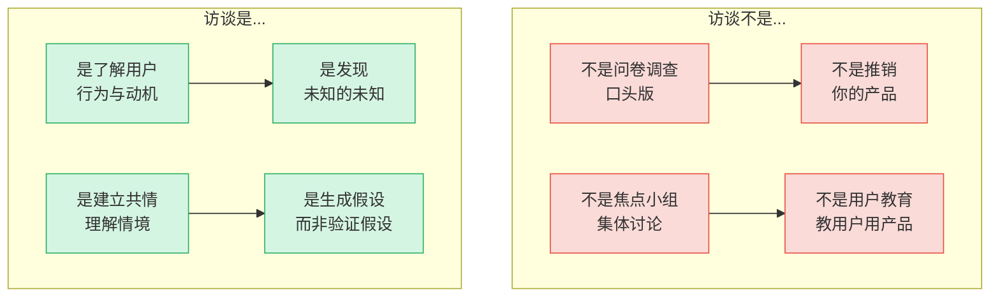
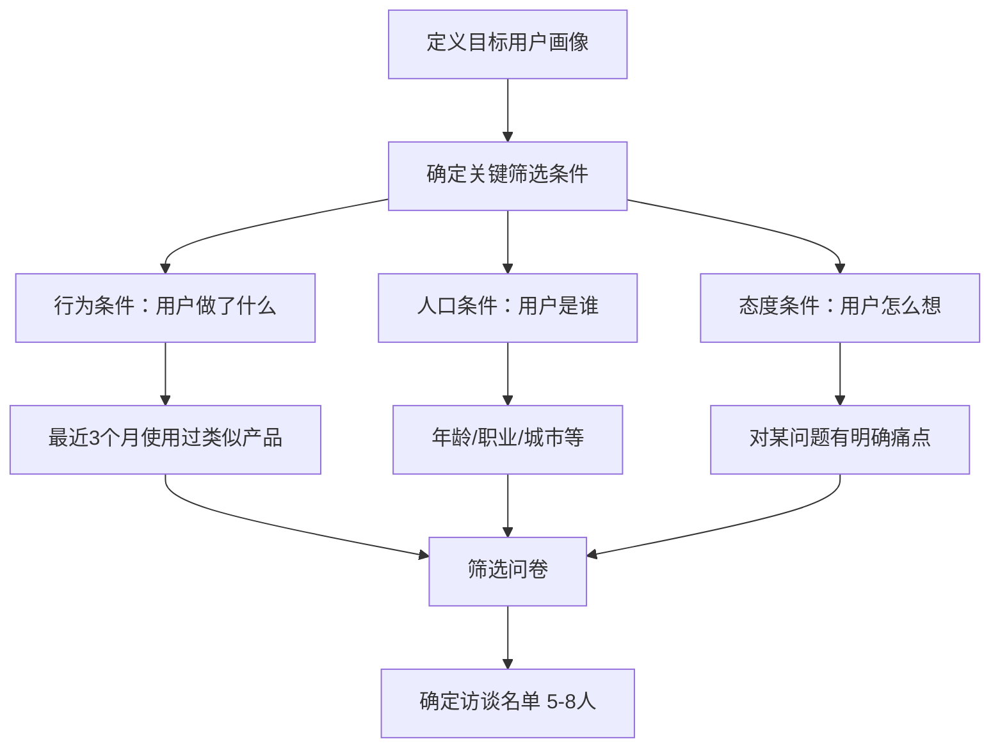
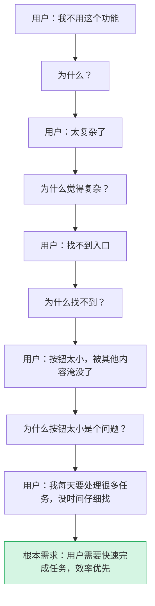
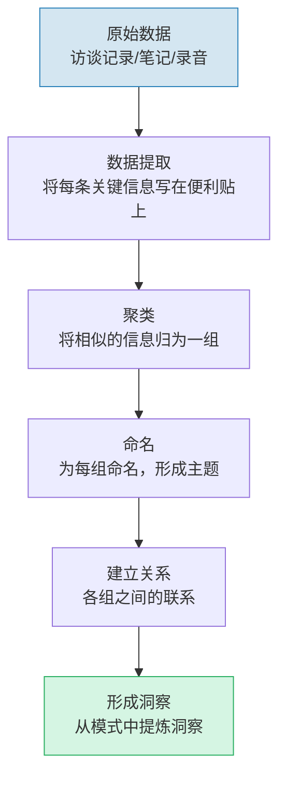
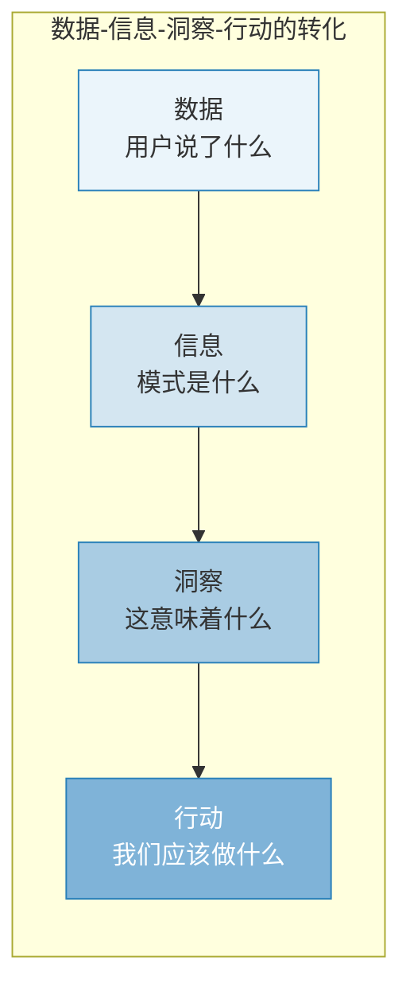

# 用户访谈：深度理解用户的方法

> [!abstract] 核心问题
> 如何通过对话真正理解用户？用户访谈是定性研究中最核心的方法，目的是**发现用户行为背后的动机、情境和思维模式**，而不是验证你已经有的假设。

---

## 一、用户访谈的定位

### 1.1 访谈不是什么



> [!important] 访谈的本质
> 用户访谈是**学习**，不是**验证**。如果你带着"证明我是对的"的心态进入访谈，你只会听到你想听到的。

### 1.2 访谈的独特价值

| 对比维度 | 用户访谈 | 问卷调研 | 行为数据 |
|---------|---------|---------|---------|
| 深度 | 最深 | 较浅 | 最浅 |
| 广度 | 窄（5-15人） | 广（100+） | 最广（全量） |
| 发现"为什么" | 强 | 弱 | 无 |
| 发现未知问题 | 强 | 弱 | 中 |
| 时间成本 | 高 | 中 | 低 |
| 分析成本 | 高 | 中 | 低 |

---

## 二、访谈前的准备

### 2.1 明确研究目标

在开始访谈前，必须回答三个问题：

1. **我们想知道什么？**（研究目标）
2. **为什么现在需要知道？**（紧迫性和背景）
3. **知道了会做什么决策？**（行动导向）

> [!warning] 目标不清是访谈的最大浪费
> 如果你不知道"访谈结束后会做什么决策"，就不要开始访谈。无目标的访谈 = 浪费时间。

### 2.2 筛选招募对象

**筛选标准（Screener）的设计原则**：



**招募数量建议**：

| 研究类型 | 建议人数 | 理由 |
|---------|---------|------|
| 探索性研究 | 5-8 人 | Nielsen 经典研究：5人可发现85%的问题 |
| 用户画像构建 | 10-15 人/画像 | 需要更多数据来形成模式 |
| JTBD 访谈 | 8-12 人 | 需要覆盖不同"雇佣"情境 |
| 概念测试 | 8-10 人 | 需要足够反馈来迭代概念 |

### 2.3 设计访谈提纲

> [!tip] 访谈提纲设计原则
> 1. **漏斗结构**：从宽到窄，从一般到具体
> 2. **时间分配**：80% 时间听用户讲，20% 时间追问
> 3. **灵活调整**：提纲是地图，不是轨道。允许偏离

**推荐的访谈提纲结构**：

```
1. 热身（5分钟）
   - 自我介绍，说明目的
   - 告知录音/记录（获取同意）
   - 强调"没有正确答案"
   - 让用户轻松开始

2. 背景了解（10分钟）
   - 用户的角色/工作/生活
   - 相关领域的经验
   - 日常中的典型一天

3. 核心探索（25分钟）
   - 最近一次相关经历
   - 当时的做法和感受
   - 遇到的困难和解决办法
   - 对现状的满意/不满意

4. 深度追问（10分钟）
   - 对关键点的追问
   - "为什么"的连续追问
   - 假设性问题

5. 收尾（5分钟）
   - 总结确认关键发现
   - 询问是否有补充
   - 感谢和后续安排
```

---

## 三、访谈技巧

### 3.1 开放式提问

> [!important] 黄金法则
> 好的访谈 = 80% 开放式问题 + 20% 追问

**封闭式 vs 开放式问题**：

| 封闭式（避免） | 开放式（推荐） |
|-------------|-------------|
| "你喜欢这个功能吗？" | "说说你上次使用这个功能的经历？" |
| "这个好用吗？" | "你在使用过程中遇到了什么困难？" |
| "你会购买吗？" | "如果这个产品明天消失了，你会怎么办？" |
| "这个设计好看吗？" | "这个设计给你的第一印象是什么？" |

### 3.2 追问的艺术

**五层"为什么"（5 Whys）**：



**追问的技巧**：

1. **"能多说一点吗？"** — 最强大的追问
2. **"能给我一个具体的例子吗？"** — 从抽象到具体
3. **"当时你是怎么想的？"** — 回到情境
4. **"和之前相比有什么不同？"** — 对比发现差异
5. **沉默** — 最有效的追问方式（见下文）

### 3.3 沉默的力量

> [!quote] 访谈中的沉默
> "初学者的最大错误是害怕沉默。当你停止说话，用户会开始思考，然后说出更深层的东西。"

**沉默的作用**：

- 给用户思考时间（不是每个人都能即兴回答）
- 暗示用户"继续说下去"
- 让用户感受到"你在认真听"
- 往往会引出用户原本不打算说的内容

**实践建议**：在用户说完一句话后，默数 3 秒再回应。很多时候，用户会在这 3 秒内补充更有价值的信息。

### 3.4 积极倾听

| 技巧 | 做法 | 效果 |
|------|------|------|
| 复述 | "所以你的意思是..." | 确认理解，让用户感到被听见 |
| 总结 | "我听到你说了三个关键点..." | 帮助用户整理思路 |
| 情感反映 | "听起来你对这个很沮丧" | 建立共情，鼓励深入表达 |
| 非语言反馈 | 点头、眼神接触、身体前倾 | 表示关注和鼓励 |

---

## 四、访谈后的分析与整理

### 4.1 亲和图法（Affinity Diagram）

亲和图法是定性数据分析中最经典的方法。



**操作步骤详解**：

1. **数据提取（每轮访谈后立即做）**
   - 将录音/笔记中的关键信息逐条写在便利贴（或数字工具）上
   - 每条信息只包含一个观点
   - 使用用户的原话，不要过早解释
   - 每轮访谈通常产生 50-100 条信息

2. **初始聚类（研究团队一起做）**
   - 所有人一起将便利贴分组
   - 不需要预设类别，让类别自然涌现
   - 这个过程通常需要 1-2 小时

3. **精细化（迭代进行）**
   - 检查每组内部的一致性
   - 拆分过大或过杂的组
   - 合并过于接近的组
   - 最终形成 5-10 个核心主题

4. **洞察提炼**
   - 每个主题回答：这告诉我们什么？
   - 识别主题之间的矛盾和张力
   - 形成"洞察陈述"：用户 + 情境 + 需求 + 洞察

### 4.2 从数据到洞察



**洞察陈述的模板**：

> 我们发现 [哪类用户] 在 [什么情境] 下，[做什么行为] 因为 [什么原因] ，但他们 [遇到什么困难] 。这告诉我们 [洞察] ，因此我们应该 [行动建议] 。

---

## 五、用户访谈的常见陷阱

### 5.1 引导性问题

| 引导性问题 | 更好的问法 |
|-----------|-----------|
| "你是不是觉得这个按钮太小了？" | "你注意到这个按钮了吗？对这个按钮有什么感受？" |
| "这个功能很有用吧？" | "这个功能在你的日常中扮演什么角色？" |
| "你不觉得这个设计很漂亮吗？" | "你对这个设计的整体感觉是什么？" |

> [!danger] 引导性问题的危害
> 引导性问题会**创造虚假的验证**。你问"这个功能很好用吧？"，用户出于礼貌说"是"，然后你就以为用户真的需要这个功能。实际上用户可能根本不在乎。

### 5.2 过早下结论

- **陷阱**：在第一轮访谈后就得出结论
- **后果**：后续访谈变成"找证据支持结论"
- **对策**：至少在完成 3 轮访谈后再开始分析，保持开放心态

### 5.3 过度解释

- **陷阱**：用自己的理解去解释用户的话
- **后果**：把用户的表达扭曲成你想听到的
- **对策**：使用用户的原话；分析时区分"用户说的"和"我的理解"

### 5.4 只记"好听的"

- **陷阱**：选择性记录，只记下支持自己假设的内容
- **后果**：确认偏误，虚假的验证
- **对策**：录音/录像，事后完整回顾；让多个团队成员一起分析

### 5.5 访谈者效应

- **陷阱**：你的身份、穿着、态度会影响用户的回答
- **后果**：用户可能因为你"看起来像专家"而不敢说真话
- **对策**：穿得随意一些；用"我们正在学习"的姿态；强调"你不是在考试"

---

## 六、访谈工具与模板

### 6.1 访谈提纲模板

```markdown
## 访谈信息
- 日期：
- 访谈者：
- 受访者代号：
- 访谈方式：面对面 / 视频 / 电话

## 热身（5分钟）
- 自我介绍，说明研究目的
- 强调"没有对错"
- 确认录音同意

## 背景了解（10分钟）
- 请简单介绍一下你的工作/日常
- 在XX领域，你有哪些经验？
- 典型的一天是怎样的？

## 核心探索（25分钟）
- 请回忆最近一次你做XX的经历
- 当时你是怎么做的？（逐步追问）
- 过程中遇到了什么困难？
- 你当时是怎么解决这些困难的？
- 你对目前的解决方案满意吗？为什么？

## 深度追问（10分钟）
- [针对关键点追问]
- 如果有一个产品可以帮你，你希望它做什么？
- 目前的方式中，最让你困扰的是什么？

## 收尾（5分钟）
- 总结我今天听到的关键点...
- 我有没有遗漏什么？
- 还有什么想补充的吗？
```

### 6.2 访谈记录模板

| 访谈编号 | 时间 | 受访者 | 关键引用 | 关键行为 | 情绪 | 洞察 |
|---------|------|--------|---------|---------|------|------|
| INT-01 | 10:00 | 用户A | "我每天花2小时手动整理" | 反复打开多个窗口 | 沮丧 | 效率是核心痛点 |
| INT-02 | 11:00 | 用户B | "我其实已经习惯了" | 熟练操作但步骤繁琐 | 无奈 | 习惯不等于满意 |

---

## 七、与其他知识库的关联

- [[05-产品与开发/AI产品经理方法论/00_MOC_AI产品经理方法论中枢]]：用户访谈是 AI PM 的基础技能
- [[05-产品与开发/用户研究与需求洞察/01_用户研究的本质]]：用户访谈如何实践"观察>询问"原则
- [[05-产品与开发/用户研究与需求洞察/05_JTBD：Jobs to Be Done]]：JTBD 访谈是用户访谈的特定形式
- [[05-产品与开发/用户研究与需求洞察/03_问卷设计与定量研究]]：访谈发现需要用问卷来量化验证
- [[05-产品与开发/用户研究与需求洞察/00_MOC_用户研究与需求洞察中枢]]：返回知识库中枢

---

> [!summary] 本章核心
> 1. 用户访谈是**学习**，不是验证。带着好奇心进入，而不是带着答案。
> 2. 访谈准备：明确目标、筛选用户、设计漏斗式提纲
> 3. 核心技巧：开放式提问、追问、沉默、积极倾听
> 4. 分析工具：亲和图法是经典的定性数据分析方法
> 5. 警惕陷阱：引导性问题、过早下结论、过度解释、确认偏误

---

*上一篇：[[05-产品与开发/用户研究与需求洞察/01_用户研究的本质]] | 下一篇：[[05-产品与开发/用户研究与需求洞察/03_问卷设计与定量研究]]*