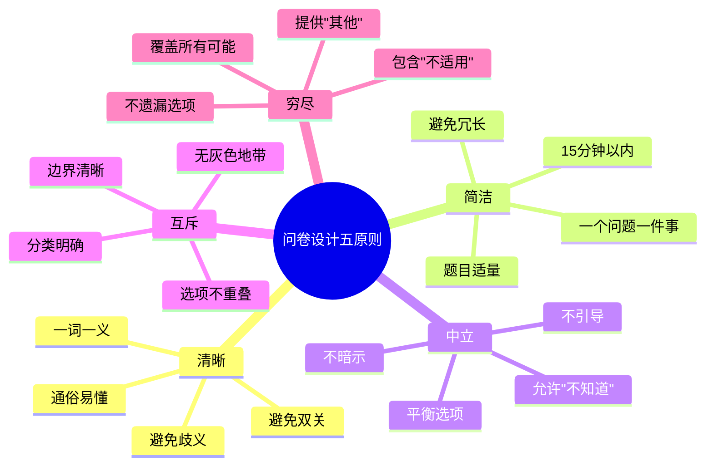
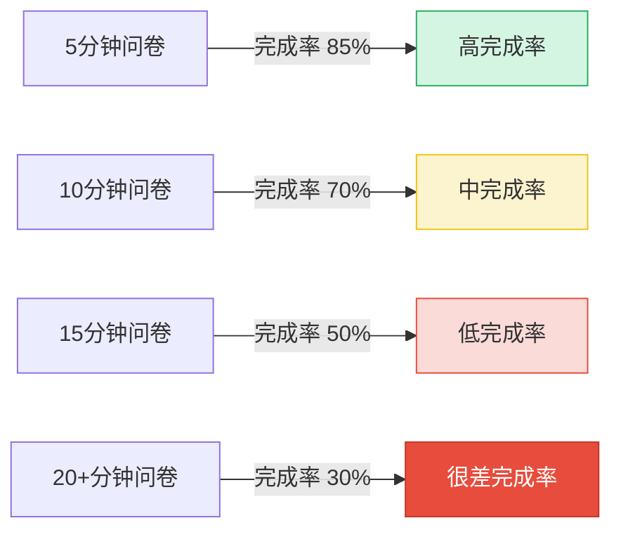
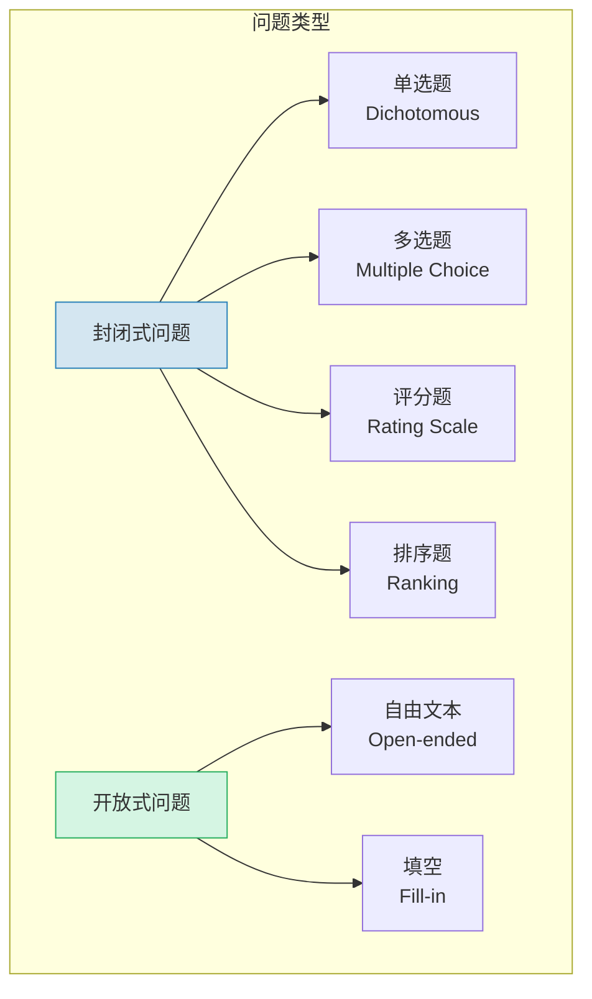
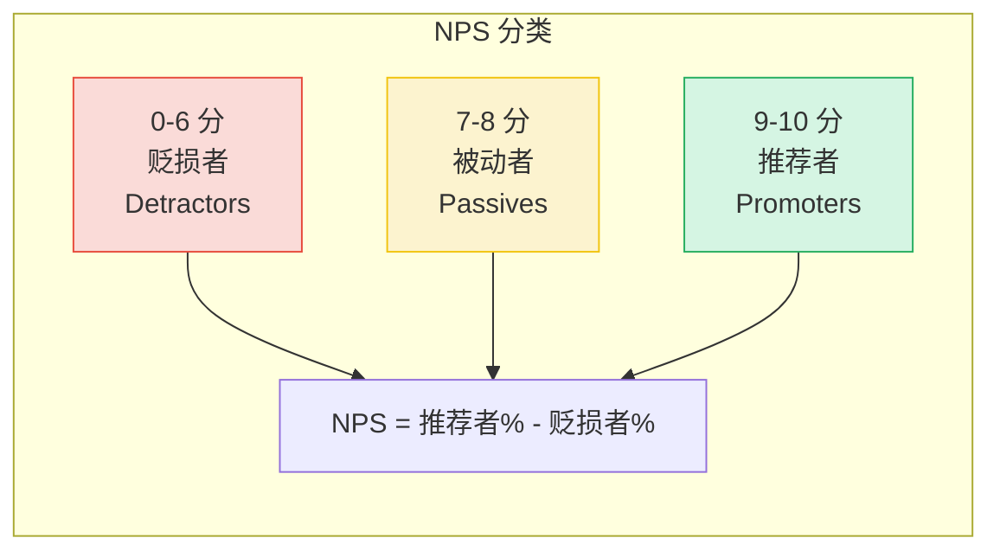
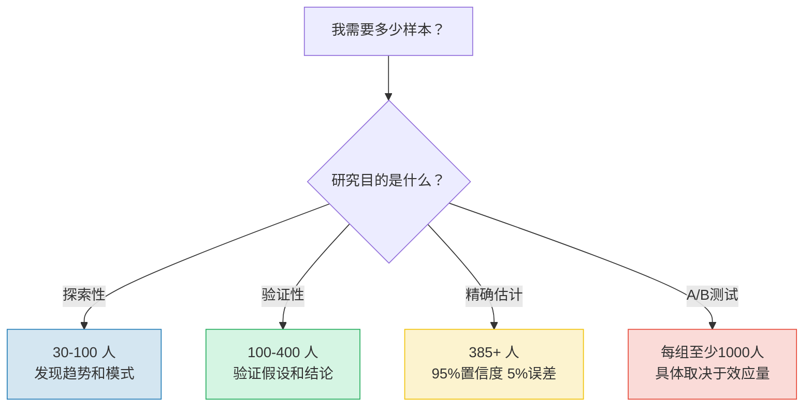
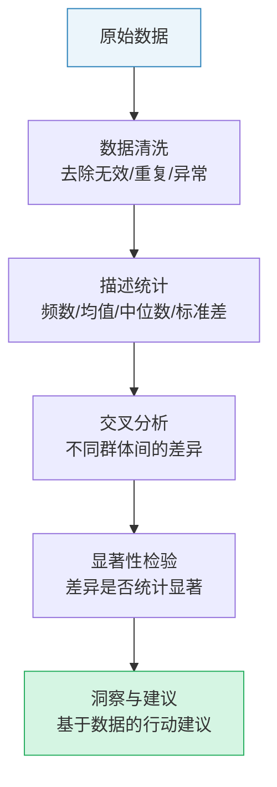

# 问卷设计与定量研究

> [!abstract] 核心问题
> 如何用数据说话，验证定性发现？问卷是将用户的态度、行为和特征转化为可量化数据的关键工具。定量研究回答"有多少"的问题，为产品决策提供统计依据。

---

## 一、问卷设计的原则

### 1.1 五原则框架

### 1.2 原则一：清晰（Clarity）

> [!danger] 模糊问题的危害
> 一个模糊的问题，得到 100 个模糊的答案，无法得出任何可靠的结论。

| 模糊问题 | 清晰问题 |
|---------|---------|
| "你经常使用我们的产品吗？" | "在过去7天里，你使用我们的产品几次？" |
| "你觉得产品好用吗？" | "你在完成XX任务时，遇到过什么困难？" |
| "你对我们的服务满意吗？" | "你会向朋友推荐我们的服务吗？（0-10分）" |

**清晰性检查清单**：
- [ ] 每个词是否只有一个明确的含义？
- [ ] 目标用户是否能理解所有词汇？
- [ ] 是否避免了双重否定？
- [ ] 是否避免了行话和缩写？

### 1.3 原则二：简洁（Brevity）

问卷长度与完成率的关系：

> [!tip] 控制问卷长度
> 1. 每个问题都要问自己：这个问题的答案会影响什么决策？如果不能回答，删掉。
> 2. 一次只问一件事。不要在一个问题中塞入多个概念。
> 3. 目标：15 分钟以内完成。超过 15 分钟，完成率急剧下降。

### 1.4 原则三：中立（Neutrality）

**引导性问题 vs 中立问题**：

| 引导性（错误） | 中立（正确） |
|-------------|-----------|
| "我们的新功能是不是很棒？" | "你如何评价新功能？" |
| "大多数用户都觉得这个很有用，你呢？" | "这个功能对你的日常有多大帮助？" |
| "你不觉得这个价格很合理吗？" | "你对这个价格的感觉是？" |

**中立性检查清单**：
- [ ] 是否避免了"情感词汇"（"很棒"、"令人兴奋"等）？
- [ ] 是否避免了"社会压力"（"大多数人认为..."）？
- [ ] 是否提供了平衡的选项（正面/负面/中立）？
- [ ] 是否避免了"权威暗示"（"专家推荐..."）？

### 1.5 原则四：互斥（Mutually Exclusive）

选项之间不能有重叠。

> [!example] 互斥性原则示例
> 
> **错误**（选项重叠）：
> - 18-25 岁
> - 25-35 岁
> - 35-45 岁
> 
> （25 岁的人该选哪个？35 岁的人该选哪个？）
> 
> **正确**（选项互斥）：
> - 18-24 岁
> - 25-34 岁
> - 35-44 岁

### 1.6 原则五：穷尽（Exhaustive）

选项必须覆盖所有可能的情况。

> [!example] 穷尽性原则示例
> 
> **错误**（不穷尽）：
> - 你的职业是？
>   1. 工程师
>   2. 设计师
>   3. 产品经理
> 
> （老师、医生、销售等无法选择）
> 
> **正确**（穷尽）：
> - 你的职业是？
>   1. 技术/研发
>   2. 设计/创意
>   3. 产品/运营
>   4. 市场/销售
>   5. 管理/行政
>   6. 其他（请注明：______）

---

## 二、问题类型详解

### 2.1 问题类型总览

### 2.2 Likert 量表

Likert 量表是度量态度和意见最常用的工具。

**标准 5 点 Likert 量表**：

| 1 | 2 | 3 | 4 | 5 |
|---|---|---|---|---|
| 非常不同意 | 不同意 | 一般 | 同意 | 非常同意 |

**7 点 Likert 量表**（更细粒度）：

| 1 | 2 | 3 | 4 | 5 | 6 | 7 |
|---|---|---|---|---|---|---|
| 非常不同意 | 不同意 | 有点不同意 | 一般 | 有点同意 | 同意 | 非常同意 |

> [!tip] Likert 量表使用建议
> 1. **5 点或 7 点**：5 点适合大多数场景，7 点适合需要更精细区分时
> 2. **标签一致**：所有选项都应该有文字标签，不要只有数字
> 3. **中点**：提供"一般/中立"选项，不要强迫用户选边
> 4. **反向题**：穿插反向题来检测用户是否认真作答

### 2.3 NPS（Net Promoter Score）

NPS 是衡量用户忠诚度的核心指标。

> [!note] NPS 的标准问题
> "你有多大可能向朋友或同事推荐我们的产品？"（0-10分）

**NPS 计算**：

### 2.4 语义差异量表（Semantic Differential）

用于测量用户对产品/品牌的情感态度。

> [!example] 语义差异量表示例
> 
> 请用以下维度评价我们的产品：
> 
> 难用的 \_\_\_\_\_\_\_\_\_\_ 好用的
> 丑陋的 \_\_\_\_\_\_\_\_\_\_ 美观的
> 复杂的 \_\_\_\_\_\_\_\_\_\_ 简单的
> 不可靠的 \_\_\_\_\_\_\_\_\_\_ 可靠的

---

## 三、样本量与抽样方法

### 3.1 样本量决策

**样本量粗略估计**：

| 总体规模 | 95%置信度 5%误差 | 95%置信度 10%误差 |
|---------|-----------------|-----------------|
| 1,000 | 278 | 88 |
| 10,000 | 370 | 96 |
| 100,000 | 383 | 96 |
| 1,000,000+ | 385 | 97 |

> [!important] 关键原则
> 样本的**代表性**比样本的**大小**更重要。100 个有代表性的样本远胜于 1000 个有偏差的样本。

### 3.2 抽样方法对比

| 抽样方法 | 做法 | 优点 | 缺点 | 适用场景 |
|---------|------|------|------|---------|
| 简单随机抽样 | 从总体中随机抽取 | 最简单，无偏差 | 需要完整名单 | 有完整用户列表时 |
| 分层抽样 | 按特征分层后每层随机抽 | 保证各层代表性 | 需要知道分层信息 | 关注不同用户群差异 |
| 配额抽样 | 按比例分配各层名额 | 操作简单 | 非随机，可能有偏差 | 快速调研 |
| 便利抽样 | 方便获取的样本 | 最快最便宜 | 偏差最大 | 探索性研究 |
| 滚雪球抽样 | 通过受访者找更多受访者 | 适合难找群体 | 样本同质化 | 小众/专业群体 |

---

## 四、问卷数据的分析方法

### 4.1 分析流程

### 4.2 描述统计

| 统计量 | 含义 | 适用数据类型 | 示例 |
|--------|------|------------|------|
| 频数/频率 | 每个选项的计数和百分比 | 所有类型 | 65%的用户选择了A |
| 均值 | 所有值的平均数 | 连续/评分数据 | 满意度均值 4.2/5 |
| 中位数 | 排序后中间的值 | 序数/评分数据 | 年龄中位数 32 |
| 标准差 | 数据的离散程度 | 连续/评分数据 | 评分标准差 0.8 |
| 众数 | 出现最多的值 | 所有类型 | 最常选的选项是B |

### 4.3 交叉分析

> [!tip] 交叉分析是最有价值的分析
> 单独看"70%的用户满意"没有太大意义。但如果你发现"90后用户满意度 60%，80后用户满意度 80%"，这就有了行动方向。

**交叉分析常见维度**：
- 年龄 x 满意度
- 使用频率 x 功能需求
- 设备类型 x 使用场景
- 地域 x 付费意愿
- 职业 x 痛点优先级

### 4.4 显著性检验基础

> [!note] 什么是统计显著性？
> 统计显著性回答的是：**观察到的差异是真实的，还是只是随机波动？**

**常用检验方法**：

| 检验方法 | 适用场景 | 示例 |
|---------|---------|------|
| t 检验 | 比较两组均值 | 男性 vs 女性满意度 |
| 卡方检验 | 比较分类变量 | 不同年龄段的功能偏好 |
| ANOVA | 比较三组及以上 | 四个版本的评分对比 |
| 相关分析 | 两个变量的关系 | 使用频率与满意度关系 |

---

## 五、问卷分发与回收

### 5.1 分发渠道

| 渠道 | 优点 | 缺点 | 典型回收率 |
|------|------|------|-----------|
| 产品内推送 | 触达真实用户 | 只能触达活跃用户 | 5-15% |
| 邮件邀请 | 可定向发送 | 打开率低 | 3-10% |
| 社交媒体 | 传播快 | 样本偏差大 | 0.5-3% |
| 第三方面板 | 样本可控 | 成本高 | 视平台而定 |
| 线下拦截 | 面对面 | 效率低 | 20-40% |

### 5.2 提高回收率的技巧

1. **明确价值**：告知用户"你的反馈将帮助我们改进产品"
2. **合理激励**：小额激励（红包、优惠券、抽奖）
3. **预估时间**：如实告知完成时间，建立信任
4. **进度条**：显示填写进度，减少焦虑
5. **移动优化**：确保在手机上体验良好

---

## 六、与其他知识库的关联

- [[05-产品与开发/用户研究与需求洞察/02_用户访谈：深度理解用户的方法]]：先定性访谈形成假设，再定量问卷验证
- [[05-产品与开发/用户研究与需求洞察/07_A_B测试与实验设计]]：问卷和 A/B 测试都是定量验证工具
- [[05-产品与开发/用户研究与需求洞察/01_用户研究的本质]]：问卷设计如何避免"行为>态度"原则的陷阱
- [[05-产品与开发/AI产品经理方法论/00_MOC_AI产品经理方法论中枢]]：如何用数据驱动产品决策
- [[05-产品与开发/用户研究与需求洞察/00_MOC_用户研究与需求洞察中枢]]：返回知识库中枢

---

> [!summary] 本章核心
> 1. 问卷设计五原则：**清晰、简洁、中立、互斥、穷尽**
> 2. 问题类型选择：Likert量表、NPS、语义差异量表各有适用场景
> 3. 样本量：探索性 30-100人，验证性 100-400人，精确估计 385人+
> 4. 分析三部曲：描述统计 -> 交叉分析 -> 显著性检验
> 5. 样本的代表性比样本大小更重要

---

*上一篇：[[05-产品与开发/用户研究与需求洞察/02_用户访谈：深度理解用户的方法]] | 下一篇：[[05-产品与开发/用户研究与需求洞察/04_可用性测试]]*