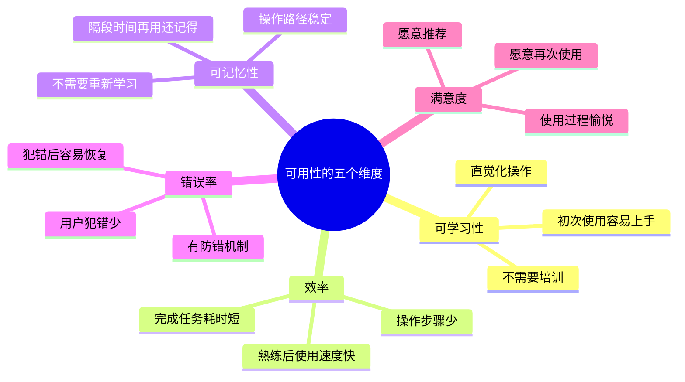
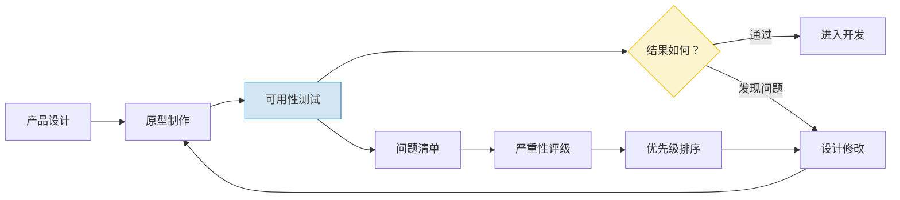
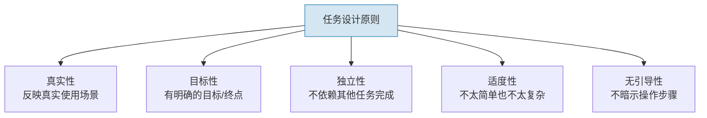
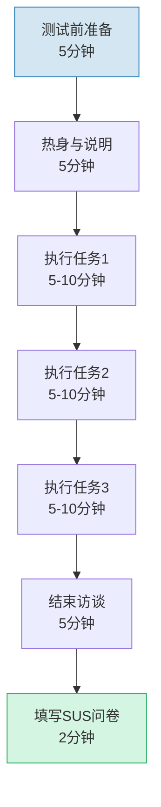
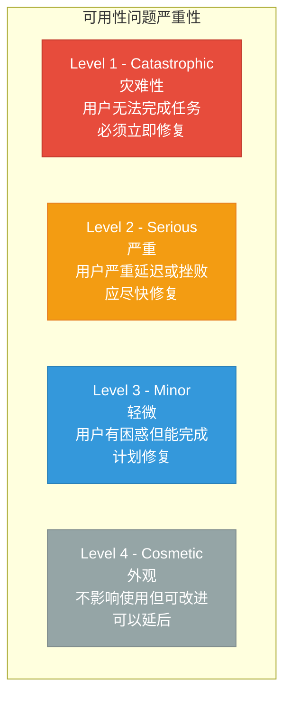

# 可用性测试：让产品从"能用"到"好用"

> [!abstract] 核心问题
> 如何确保产品真的能被用户顺利使用？可用性测试是通过观察用户使用产品完成特定任务的过程，来发现产品中阻碍用户达成目标的"摩擦点"。它回答的是"产品能用吗？好用吗？"这两个问题。

---

## 一、可用性测试的定位

### 1.1 可用性是什么？



### 1.2 可用性测试在产品开发中的位置



> [!important] 越早测试，成本越低
> 在纸面原型阶段修复一个可用性问题，成本是 1。在开发完成后修复，成本是 10。在上线后修复，成本是 100。

---

## 二、可用性测试的设计

### 2.1 任务设计

任务是可用性测试的核心。一个好的任务：



> [!tip] 任务设计示例
> 
> **差的任务**：
> "请点击右上角的设置按钮，然后进入账户管理页面，修改你的个人信息。"
> （太具体，告诉了用户每一步怎么操作）
> 
> **好的任务**：
> "你最近搬家了，需要更新收货地址。请完成这个操作。"
> （有场景、有目标，但不告诉用户怎么操作）

**任务设计的要点**：

| 要素 | 说明 | 示例 |
|------|------|------|
| 场景 | 给用户一个真实的情境 | "你准备周末去上海出差..." |
| 目标 | 明确要完成什么 | "...需要预订一晚酒店" |
| 约束 | 如果有特殊条件 | "...预算不超过500元" |
| 成功标准 | 什么算完成 | "完成预订并看到确认页面" |

### 2.2 场景设计

**场景的类型**：

1. **首次使用场景**：用户第一次接触产品
2. **常规使用场景**：用户日常使用的典型任务
3. **边缘场景**：不常见但重要的任务
4. **错误恢复场景**：出错后如何恢复

### 2.3 指标设计

| 指标类型 | 具体指标 | 测量方式 | 好/坏标准 |
|---------|---------|---------|----------|
| 完成率 | 任务成功率 | 完成人数/总人数 | >80% 好，<60% 差 |
| 效率 | 完成任务时间 | 从开始到完成 | 与基准比较 |
| 效率 | 操作步骤数 | 点击次数 | 越少越好 |
| 错误 | 错误次数 | 偏离正确路径 | 关键路径错误=严重 |
| 错误 | 求助次数 | 主动求助 | 每个任务<1次 |
| 满意度 | SUS 量表 | 标准化问卷 | >68 及格，>80 好 |
| 满意度 | 单题难度评分 | 7点量表 | >5 为可接受 |

> [!note] SUS（System Usability Scale）
> SUS 是最广泛使用的可用性标准化量表，包含10个问题，得分范围 0-100。
> 
> - 68 分：及格线
> - 80 分：良好
> - 90 分：优秀

---

## 三、可用性测试的执行

### 3.1 Think Aloud 协议

Think Aloud 是可用性测试中最核心的执行方法。

> [!important] Think Aloud 的核心指令
> "在操作过程中，请把你在想什么说出来。你在看什么、想做什么、预期会发生什么、为什么点击这里——都请说出来。想到什么就说什么，不需要组织语言。"

**Think Aloud 的三种类型**：

| 类型 | 做法 | 优点 | 缺点 |
|------|------|------|------|
| 同步 Think Aloud | 边操作边说 | 最真实，即时反应 | 可能影响操作速度 |
| 回顾 Think Aloud | 操作完回看录像说 | 不影响操作 | 记忆偏差，不够即时 |
| 协同 Think Aloud | 两人一起边说边做 | 对话自然，信息丰富 | 互相影响 |

**执行技巧**：

1. **保持安静**：用户操作时，访谈者保持沉默
2. **适时提醒**：如果用户沉默超过 10 秒，轻声提醒"你在想什么？"
3. **不要帮助**：即使用户遇到困难，也不要主动帮助
4. **不要引导**：不要问"你看到那个按钮了吗？"
5. **记录一切**：录像、录音、屏幕录制、观察笔记

### 3.2 观察记录

**观察的维度**：

| 维度 | 观察什么 | 记录什么 |
|------|---------|---------|
| 路径 | 用户的操作路径 | 是否偏离了预期路径 |
| 犹豫 | 用户在哪里停顿 | 停顿的时间和位置 |
| 错误 | 用户的操作错误 | 错误的类型和原因 |
| 情绪 | 用户的情绪变化 | 沮丧/困惑/惊喜的时刻 |
| 语言 | 用户说了什么 | 关键引用和评论 |
| 身体 | 用户的肢体语言 | 皱眉/叹气/身体前倾 |

### 3.3 测试流程



**各阶段要点**：

1. **测试前准备**：检查设备、录音录像、准备任务卡片
2. **热身**：让用户放松，强调"测试的是产品不是你"
3. **执行任务**：每次一个任务，观察和记录
4. **结束访谈**：询问总体感受，追问关键问题
5. **SUS 问卷**：让用户填写标准化满意度问卷

---

## 四、可用性问题的严重性分级

### 4.1 四级严重性标准



### 4.2 严重性评级矩阵

| 严重性 | 频率 | 影响 | 持续性 | 示例 |
|--------|------|------|--------|------|
| Catastrophic | 几乎所有用户 | 任务完全失败 | 每次都出现 | 支付按钮点击无反应 |
| Serious | 多数用户 | 严重延迟/困惑 | 经常出现 | 找不到关键功能入口 |
| Minor | 部分用户 | 有小困惑 | 偶尔出现 | 按钮位置不够明显 |
| Cosmetic | 少数用户 | 几乎无影响 | 很少出现 | 拼写错误 |

> [!tip] 评级决策
> 如果一个可用性问题影响了 3 个以上用户，且导致了任务失败，那它就是 Catastrophic 级别，需要立即修复。

---

## 五、可用性测试报告

### 5.1 报告结构

```markdown
# 可用性测试报告

## 1. 测试概要
- 测试日期
- 测试对象（产品/版本/功能）
- 测试人数
- 测试方法

## 2. 关键发现
- 最重要的 3-5 个发现
- 每个发现配一个用户引用
- 每个发现配一个视频片段

## 3. 问题清单
| 编号 | 问题描述 | 严重性 | 频率 | 建议方案 | 优先级 |
|------|---------|--------|------|---------|--------|
| U-01 | ... | Serious | 4/5 | ... | 高 |
| U-02 | ... | Minor | 2/5 | ... | 中 |

## 4. 定量数据
- 任务完成率
- 平均任务时间
- 错误次数
- SUS 得分

## 5. 建议与下一步
- 短期修复建议
- 长期改进方向
- 需要进一步研究的问题
```

### 5.2 报告最佳实践

1. **视频 > 文字**：一个 30 秒的视频片段比 1000 字的描述更有说服力
2. **用户原话**：引用用户原话，让团队感受到用户的真实声音
3. **聚焦关键**：不要列出所有问题，聚焦最重要的 3-5 个
4. **行动导向**：每个问题都要有明确的修复建议
5. **可视化**：用热力图、操作路径图等可视化方式展示问题

---

## 六、可用性测试的类型

### 6.1 不同阶段的测试

| 阶段 | 测试类型 | 目标 | 方法 |
|------|---------|------|------|
| 纸面原型 | 概念测试 | 验证概念可行性 | 纸质原型 + 任务演练 |
| 低保真原型 | 信息架构测试 | 导航结构是否合理 | 卡片分类、树形测试 |
| 高保真原型 | 交互测试 | 交互流程是否顺畅 | 可点击原型 + Think Aloud |
| 开发版本 | 功能测试 | 功能是否可用 | 真实产品 + 任务测试 |
| 上线版本 | 基准测试 | 量化可用性水平 | 大规模测试 + SUS |

### 6.2 远程 vs 面对面

| 维度 | 面对面测试 | 远程测试 |
|------|-----------|---------|
| 观察深度 | 更深（肢体语言） | 较浅（仅屏幕+声音） |
| 成本 | 高 | 低 |
| 地域限制 | 有 | 无 |
| 设备环境 | 统一 | 用户的真实环境 |
| 用户招募 | 较难 | 较易 |
| 适合阶段 | 早期探索 | 验证/量化 |

---

## 七、与其他知识库的关联

- [[05-产品与开发/用户研究与需求洞察/02_用户访谈：深度理解用户的方法]]：可用性测试后的访谈环节，借鉴访谈技巧
- [[05-产品与开发/用户研究与需求洞察/06_用户旅程地图与体验设计]]：可用性测试发现的问题，可以标注在旅程地图上
- [[05-产品与开发/用户研究与需求洞察/07_A_B测试与实验设计]]：可用性测试发现的问题，可以用 A/B 测试验证解决方案
- [[05-产品与开发/用户研究与需求洞察/01_用户研究的本质]]：可用性测试如何实践"观察>询问"原则
- [[05-产品与开发/用户研究与需求洞察/00_MOC_用户研究与需求洞察中枢]]：返回知识库中枢

---

> [!summary] 本章核心
> 1. 可用性测试的核心是**观察用户使用**，不是问用户"好不好用"
> 2. 任务设计是测试质量的关键：真实、有目标、无引导
> 3. Think Aloud 是最核心的执行方法
> 4. 问题分级：Catastrophic/Serious/Minor/Cosmetic
> 5. 可用性测试报告：视频>文字，用户原话>主观判断，聚焦关键而非穷尽

---

*上一篇：[[05-产品与开发/用户研究与需求洞察/03_问卷设计与定量研究]] | 下一篇：[[05-产品与开发/用户研究与需求洞察/05_JTBD：Jobs to Be Done]]*