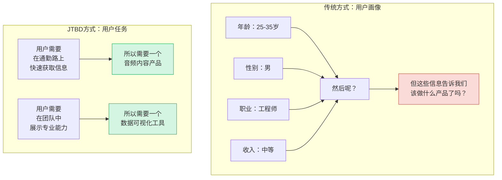
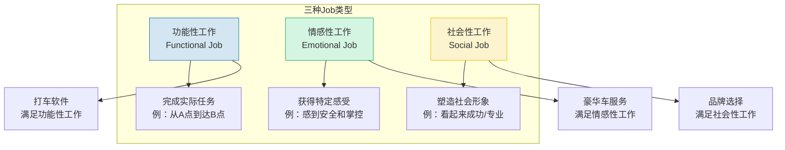
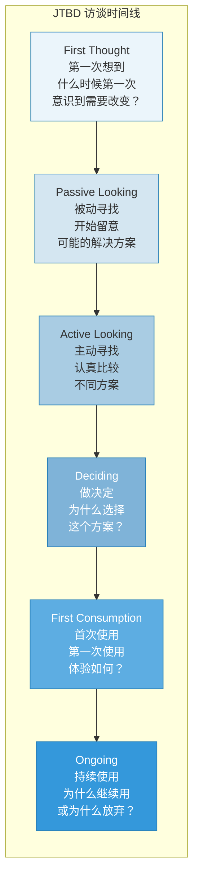
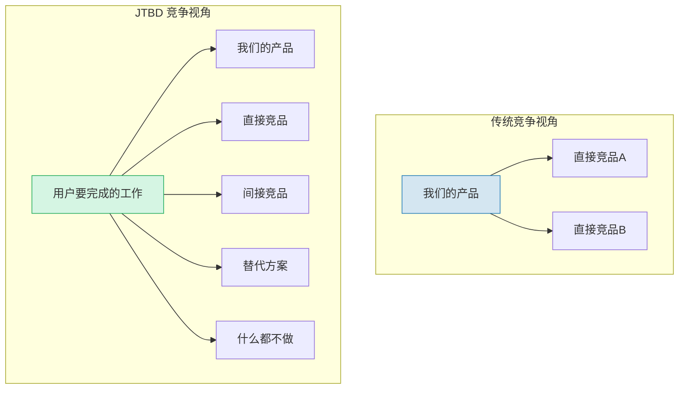
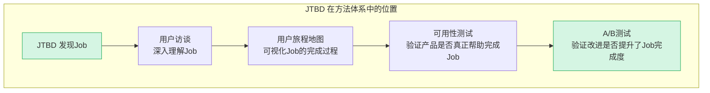

# JTBD：Jobs to Be Done——从"用户是谁"到"用户要完成什么"

> [!abstract] 核心问题
> 用户"雇佣"你的产品，到底是为了完成什么任务？JTBD（Jobs to Be Done）是由 Clayton Christensen 提出的创新框架，它彻底改变了我们理解用户需求的方式：不是"用户是什么样的人"，而是"用户要完成什么工作"。

---

## 一、JTBD 的核心理念

### 1.1 从"用户画像"到"用户任务"



> [!quote] 经典论断
> "人们不想买一个四分之一英寸的钻头，他们想要一个四分之一英寸的洞。" —— Theodore Levitt
> 
> "用户不是购买产品，而是'雇佣'产品来完成某项工作。" —— Clayton Christensen

### 1.2 什么是"Job"？

在 JTBD 框架中，"Job" 不是任务清单上的一个待办事项，而是**用户在特定情境下想要取得的进步（Progress）**。

**Job 的公式**：

> [!important] Job = 用户 + 情境 + 动机 + 期望结果
> 
> Job 不是"我想听音乐"，而是：
> - **当** 我在健身房跑步时（情境）
> - **我想** 保持节奏感并分散疲劳感（动机）
> - **这样我就能** 跑完计划的5公里（期望结果）

---

## 二、三种"工作"类型

### 2.1 功能性工作 \u2192 情感性工作 \u2192 社会性工作



**经典案例：奶昔的"Job"**

> [!example] 奶昔案例（Clayton Christensen 经典案例）
> 一家快餐连锁店想提升奶昔销量。他们按照传统方式做了用户画像，改进了奶昔的浓稠度、口味、温度——销量没有变化。
> 
> 然后他们用 JTBD 视角观察：**用户"雇佣"奶昔来完成什么工作？**
> 
> 发现：大部分奶昔是在早上售出的，购买者是独自开车上班的通勤者。他们"雇佣"奶昔来完成的工作是：
> 1. **功能性工作**：单手可操作，不会弄脏衣服，比食物更耐吃（缓解通勤无聊）
> 2. **情感性工作**：给自己一点"早晨的犒赏"
> 3. **社会性工作**：（不需要）
> 
> 竞争对手不是其他奶昔，而是**香蕉、甜甜圈、早餐吧**——任何可以单手操作、在车上吃的食物。

---

## 三、推-拉-锚框架（Push-Pull-Anxiety）

### 3.1 框架解析

```mermaid
flowchart TD
    subgraph "用户决策的三种力量"
        PUSH[推力 Push<br/>对现状的不满<br/>推动用户离开现状] --> DECISION{用户决策<br/>是否"雇佣"新产品}
        PULL[拉力 Pull<br/>新方案的吸引力<br/>拉用户向新方案] --> DECISION
        ANCHOR[锚定 Anxiety<br/>对新方案的担忧<br/>让用户留在原地] --> DECISION
    end

    DECISION -->|推+拉 > 锚| HIRE[雇佣新产品]
    DECISION -->|锚 > 推+拉| STAY[留在现状]

    style PUSH fill:#FADBD8,stroke:#E74C3C
    style PULL fill:#D5F5E3,stroke:#27AE60
    style ANCHOR fill:#FCF3CF,stroke:#F1C40F
    style HIRE fill:#D5F5E3,stroke:#27AE60
    style STAY fill:#FADBD8,stroke:#E74C3C
```

**三种力量的解析**：

| 力量 | 本质 | 核心问题 | 示例 |
|------|------|---------|------|
| 推力（Push） | 对现状的挫败感 | "现在的方案哪里让我不满意？" | 手动记账太麻烦，老是忘记 |
| 拉力（Pull） | 新方案的吸引力 | "新方案能给我什么更好的？" | 自动记账 App 能自动识别账单 |
| 锚定（Anxiety） | 切换的阻力和担忧 | "换新方案有什么风险？" | 数据迁移会不会丢失？新App靠不靠谱？ |

### 3.2 推-拉-锚的战略意义

> [!important] 产品设计的关键
> 产品经理的工作不只是"增强拉力"（加功能），更重要的是：
> 1. **放大推力**：让用户更清楚地意识到现状的问题
> 2. **增强拉力**：让新方案看起来更有吸引力
> 3. **消除锚定**：降低用户切换的顾虑和风险

**推-拉-锚在产品中的应用**：

| 阶段 | 产品策略 | 具体做法 |
|------|---------|---------|
| 认知阶段 | 放大推力 | 内容营销："你是否也在为XX烦恼？" |
| 考虑阶段 | 增强拉力 | 展示核心差异化价值 |
| 决策阶段 | 消除锚定 | 免费试用、退款保证、数据迁移工具 |
| 使用阶段 | 持续拉力 | 不断提供新价值，防止用户被"推"走 |

---

## 四、JTBD 的访谈方法

### 4.1 JTBD 访谈 vs 传统用户访谈

| 维度 | 传统用户访谈 | JTBD 访谈 |
|------|------------|-----------|
| 焦点 | 用户是谁 | 用户在什么情境下要完成什么 |
| 时间线 | 当前状态 | 从"第一次想到"到"持续使用"的全过程 |
| 关键问题 | "你喜欢什么？" | "你第一次意识到需要解决这个问题是什么时候？" |
| 关注点 | 用户对产品的态度 | 用户"雇佣"和"解雇"产品的过程 |
| 竞争对手 | 竞品 | 任何替代方案（包括"什么都不做"） |

### 4.2 JTBD 访谈的时间线方法



**各阶段的核心问题**：

| 阶段 | 核心问题 |
|------|---------|
| 第一次想到 | "你什么时候第一次意识到需要改变？发生了什么？" |
| 被动寻找 | "你开始留意什么？关注了什么信息？" |
| 主动寻找 | "你考虑了哪些方案？搜索了什么？问过谁？" |
| 做决定 | "为什么最终选择了这个方案？放弃了什么？" |
| 首次使用 | "第一次使用的时候发生了什么？感觉如何？" |
| 持续使用 | "现在还在用吗？为什么？有没有想过换？" |

### 4.3 JTBD 访谈的"力量"问题

**推力问题（Push）**：
- "在开始使用我们的产品之前，你是怎么解决这个问题的？"
- "那个方案有什么让你不满意的地方？"
- "是什么让你终于决定要找一个新的方案？"

**拉力问题（Pull）**：
- "你第一次看到我们的产品时，是什么吸引了你的注意？"
- "和之前用的方案比，最大的不同是什么？"
- "如果我们的产品明天消失了，你最怀念什么？"

**锚定问题（Anxiety）**：
- "在决定使用之前，你有什么顾虑？"
- "有没有什么事情让你差点放弃？"
- "你推荐给别人时，他们有什么顾虑？"

---

## 五、JTBD 的竞争视角

### 5.1 重新定义竞争



> [!important] 竞争 = 任何帮助用户完成同一项"工作"的东西
> 
> 对于"消磨通勤时间"这项工作，竞争对手包括：
> - 播客App（直接竞品）
> - 音乐App（间接竞品）
> - 刷社交媒体（替代方案）
> - 发呆（什么都不做）

### 5.2 发现"非消费"机会

> [!tip] 非消费（Non-consumption）
> 非消费是指用户有"工作"需要完成，但因为没有合适的方案，所以选择"什么都不做"。这是 JTBD 框架中最有价值的创新机会。

**非消费的识别**：
- 用户用"凑合"的方式解决问题
- 用户知道有更好的方式但觉得太麻烦
- 用户压根没意识到这个问题可以被解决
- 用户用"不适合"的工具勉强完成任务

---

## 六、JTBD 的应用案例

### 6.1 案例：Snapchat

> [!example] Snapchat 的 JTBD 分析
> 
> **传统视角**：青少年社交媒体应用，聊天+图片分享
> 
> **JTBD 视角**：
> - **核心 Job**：当我想要和朋友分享当下的瞬间，而不想留下永久记录时，帮我完成"轻松分享，不被评判"的工作
> - **推力**：Facebook 上的内容太"永久"，发什么都怕被评判。父母和老师都在上面。
> - **拉力**：阅后即焚让人感到自由。没有点赞数，没有社交压力。
> - **锚定**：朋友都不在上面怎么办？没有内容可看怎么办？
> 
> **竞争**：不是Instagram，而是"任何让青少年感到社交压力的平台"

### 6.2 案例：Airbnb

> [!example] Airbnb 的 JTBD 分析
> 
> **传统视角**：替代酒店的短租平台
> 
> **JTBD 视角**：
> - **核心 Job**：当我在陌生城市旅行时，帮我"像本地人一样生活，而不只是像一个游客"
> - **功能性工作**：找到住宿
> - **情感性工作**：感到归属感、冒险感
> - **社会性工作**：成为"有品味"的旅行者（不是"跟团游"的游客）
> 
> **竞争**：不仅是酒店，还包括"住在朋友家"、"沙发客"甚至"放弃旅行"

---

## 七、JTBD 与其他方法的结合



---

## 八、与其他知识库的关联

- [[05-产品与开发/用户研究与需求洞察/02_用户访谈：深度理解用户的方法]]：JTBD 访谈是用户访谈的特定形式
- [[05-产品与开发/用户研究与需求洞察/06_用户旅程地图与体验设计]]：JTBD 定义的 Job 是旅程地图的起点
- [[05-产品与开发/用户研究与需求洞察/04_可用性测试]]：验证产品是否帮助用户完成了 Job
- [[05-产品与开发/AI产品经理方法论/00_MOC_AI产品经理方法论中枢]]：JTBD 是 AI PM 定义产品方向的核心框架
- [[05-产品与开发/用户研究与需求洞察/00_MOC_用户研究与需求洞察中枢]]：返回知识库中枢

---

> [!summary] 本章核心
> 1. JTBD 的核心转变：从"用户是谁"到"用户要完成什么工作"
> 2. 三种工作类型：功能性工作、情感性工作、社会性工作
> 3. 推-拉-锚框架：推力（离开现状）、拉力（吸引新方案）、锚定（阻碍切换）
> 4. JTBD 访谈：追踪用户从"第一次想到"到"持续使用"的完整时间线
> 5. 竞争重新定义：任何帮助用户完成同一项"工作"的东西都是竞争对手

---

*上一篇：[[05-产品与开发/用户研究与需求洞察/04_可用性测试]] | 下一篇：[[05-产品与开发/用户研究与需求洞察/06_用户旅程地图与体验设计]]*