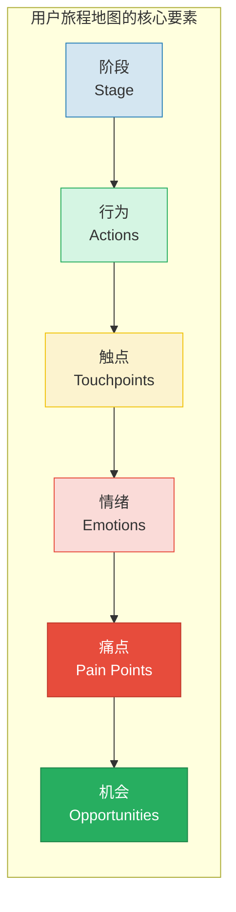
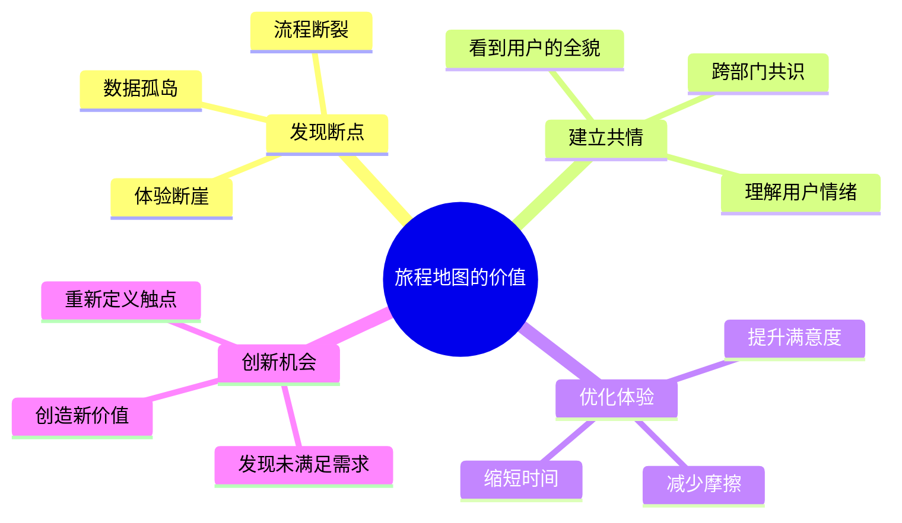
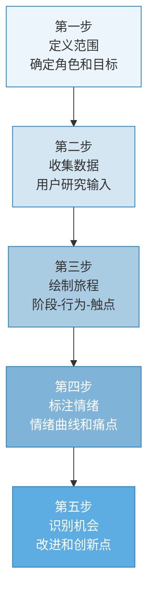
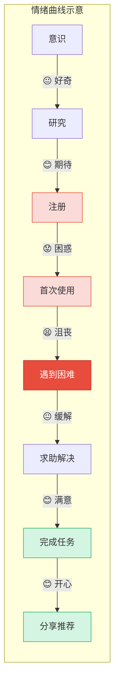
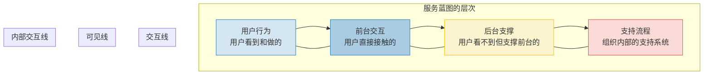
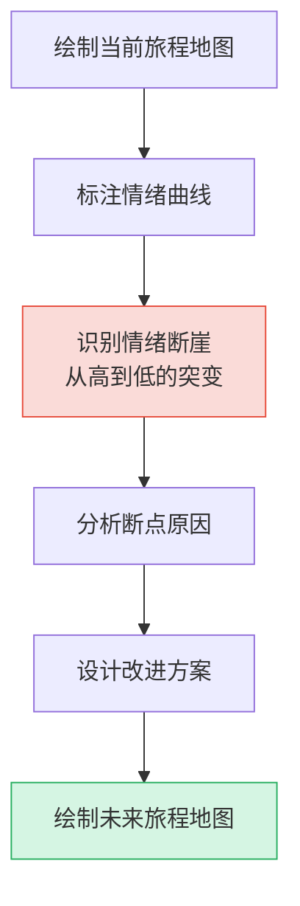

# 用户旅程地图与体验设计

> [!abstract] 核心问题
> 如何可视化用户的完整体验历程？用户旅程地图（Customer Journey Map）和服务蓝图（Service Blueprint）是将用户研究洞察转化为可行动改进方案的桥梁工具。它们让团队"看到"用户的全貌，从而发现断点、优化体验、找到创新机会。

---

## 一、用户旅程地图概述

### 1.1 什么是用户旅程地图？

> [!important] 定义
> 用户旅程地图是**用户为实现某个目标而经历的过程的可视化表达**。它描绘了用户从"意识到需求"到"完成目标"的完整历程，包括用户的行为、触点、情绪和痛点。



### 1.2 旅程地图的价值



---

## 二、用户旅程地图的绘制方法

### 2.1 五步绘制法



### 2.2 第一步：定义范围

| 定义要素 | 核心问题 | 示例 |
|---------|---------|------|
| 用户角色 | 为谁绘制？ | "第一次使用AI编码工具的新手开发者" |
| 旅程范围 | 从哪到哪？ | "从听说产品到第一次成功完成任务" |
| 场景 | 在什么情境下？ | "在工作项目中，需要快速实现一个功能" |
| 目标 | 用户要完成什么？ | "用AI工具快速完成一个登录页面的开发" |

> [!warning] 范围定义不清是最常见的错误
> 如果旅程的起点和终点不清晰，地图就会变成一张"什么都有但什么都看不清"的海报。一个旅程地图只聚焦一段旅程，不要试图覆盖一切。

### 2.3 第二步：收集数据

旅程地图的每一行都应该是**基于数据**的，而不是基于假设的。

| 数据来源 | 提供什么 | 对应方法 |
|---------|---------|---------|
| 用户访谈 | 用户行为、动机、情绪 | [[05-产品与开发/用户研究与需求洞察/02_用户访谈：深度理解用户的方法]] |
| 行为数据 | 用户实际做了什么 | 产品分析工具 |
| 客服记录 | 用户遇到的问题 | 工单分析 |
| 可用性测试 | 交互中的摩擦点 | [[05-产品与开发/用户研究与需求洞察/04_可用性测试]] |
| 社交媒体 | 用户的自发反馈 | 舆情分析 |

> [!tip] 数据质量检查
> 在开始绘制之前，问自己：我的每一个"用户行为"描述，是否有数据支撑？如果没有，标注出来，作为后续研究的方向。

### 2.4 第三步：绘制旅程

**旅程地图的标准结构**：

```
┌─────────────────────────────────────────────────────────┐
│  阶段    │ 意识 │ 研究 │ 决策 │ 使用 │ 反馈 │ 推荐 │
├─────────────────────────────────────────────────────────┤
│  行为    │ ...  │ ...  │ ...  │ ...  │ ...  │ ...  │
├─────────────────────────────────────────────────────────┤
│  触点    │ ...  │ ...  │ ...  │ ...  │ ...  │ ...  │
├─────────────────────────────────────────────────────────┤
│  情绪    │  😊  │  😐  │  😟  │  😊  │  😐  │  😊  │
├─────────────────────────────────────────────────────────┤
│  痛点    │ ...  │ ...  │ ...  │ ...  │ ...  │ ...  │
├─────────────────────────────────────────────────────────┤
│  机会    │ ...  │ ...  │ ...  │ ...  │ ...  │ ...  │
└─────────────────────────────────────────────────────────┘
```

**各行的详细说明**：

| 行 | 描述 | 关键问题 |
|----|------|---------|
| 阶段 | 旅程的主要阶段划分 | 用户经历了哪些主要阶段？ |
| 行为 | 用户在每个阶段做了什么 | 用户的具体行动是什么？ |
| 触点 | 用户与产品/服务的交互点 | 用户在哪里与产品交互？ |
| 情绪 | 用户在每个阶段的情绪状态 | 用户是开心、困惑还是沮丧？ |
| 痛点 | 用户遇到的困难和障碍 | 什么让用户感到困难？ |
| 机会 | 可以改进或创新的点 | 我们可以做什么让体验更好？ |

### 2.5 第四步：标注情绪

情绪曲线是旅程地图最直观的部分。



**情绪标注的关键**：
- 每个阶段标注一个情绪（最高/最低/平均）
- 用实际用户引用来支撑情绪判断
- 特别注意情绪"断崖"（从高到低的突变）
- 情绪曲线是团队建立共情的最有力工具

### 2.6 第五步：识别机会

> [!important] 从痛点到机会
> 每个痛点都是一个机会。好的机会描述 = 痛点 + 用户需求 + 可能的解决方案方向。

**机会识别矩阵**：

| 痛点类型 | 机会类型 | 优先级 |
|---------|---------|--------|
| 任务无法完成 | 必须修复 | 最高 |
| 任务严重延迟 | 流程优化 | 高 |
| 用户困惑 | 信息/引导改进 | 中 |
| 情感不满 | 体验优化 | 中 |
| 有替代方案 | 新功能/新触点 | 视情况 |

---

## 三、服务蓝图（Service Blueprint）

### 3.1 什么是服务蓝图？



> [!note] 旅程地图 vs 服务蓝图
> - **旅程地图**：从用户视角看体验（用户看到什么、感受到什么）
> - **服务蓝图**：从组织视角看体验（组织如何支撑用户看到的体验）
> - 两者结合，才能既理解问题，又知道如何解决

### 3.2 服务蓝图的构成

| 层次 | 包含内容 | 关键问题 |
|------|---------|---------|
| 用户行为 | 用户的行动步骤 | 用户在做什么？ |
| 前台交互 | 用户直接接触的界面/人员 | 用户看到了什么？ |
| 后台支撑 | 支撑前台的系统和流程 | 背后发生了什么？ |
| 支持流程 | 组织内部的支撑 | 组织如何支持这个流程？ |

**三条关键线**：

| 线 | 含义 | 跨越意味着 |
|----|------|-----------|
| 交互线 | 用户与服务的直接交互 | 服务接触点 |
| 可见线 | 用户能看到和看不到的边界 | 透明度边界 |
| 内部交互线 | 组织内部不同职能的边界 | 跨部门协作 |

---

## 四、旅程地图的应用场景

### 4.1 发现体验断点



**常见断点类型**：

| 断点类型 | 表现 | 根本原因 |
|---------|------|---------|
| 信息断点 | 用户不知道该做什么 | 信息架构不清晰 |
| 流程断点 | 用户卡在某个步骤 | 流程设计不合理 |
| 系统断点 | 系统反应慢/出错 | 技术问题 |
| 组织断点 | 需要跨部门协调 | 组织设计问题 |
| 期望断点 | 用户期望与实际不符 | 营销与产品不一致 |

### 4.2 优化体验

> [!tip] 优化原则
> 1. **消除**：能不能去掉这个步骤？
> 2. **简化**：能不能让这个步骤更简单？
> 3. **合并**：能不能把多个步骤合并？
> 4. **自动化**：能不能让系统自动完成？
> 5. **愉悦化**：能不能让这个步骤变得令人愉悦？

### 4.3 创新机会识别

**从旅程地图中发现创新机会**：

1. **放大高光时刻**：用户在哪个阶段最开心？如何让这个时刻更突出？
2. **填补空白触点**：有没有阶段用户需要但没有任何触点？
3. **创造新阶段**：有没有可以缩短或跳过的不必要阶段？
4. **情感设计**：在情绪低谷处，如何提供情感支持？

---

## 五、旅程地图的常见错误

| 错误 | 表现 | 对策 |
|------|------|------|
| 基于假设而非数据 | 地图很美但不可靠 | 用研究数据验证每个格子 |
| 范围过大 | 从出生到死亡 | 聚焦一段具体旅程 |
| 角色模糊 | 多个用户混在一起 | 一个地图对应一个角色 |
| 没有情绪 | 只有行为，没有感受 | 必须标注情绪和用户原话 |
| 没有行动 | 画完就完了 | 每个痛点都要有改进计划 |
| 没有更新 | 地图是一次性的 | 定期更新，反映最新情况 |

---

## 六、与其他知识库的关联

- [[05-产品与开发/用户研究与需求洞察/05_JTBD：Jobs to Be Done]]：JTBD 定义的 Job 是旅程地图的起点
- [[05-产品与开发/用户研究与需求洞察/04_可用性测试]]：可用性测试发现的问题可以标注在旅程地图上
- [[05-产品与开发/用户研究与需求洞察/02_用户访谈：深度理解用户的方法]]：访谈数据是旅程地图的主要输入
- [[05-产品与开发/AI产品经理方法论/00_MOC_AI产品经理方法论中枢]]：旅程地图是 AI PM 对齐团队的核心工具
- [[05-产品与开发/用户研究与需求洞察/00_MOC_用户研究与需求洞察中枢]]：返回知识库中枢

---

> [!summary] 本章核心
> 1. 旅程地图五要素：阶段、行为、触点、情绪、痛点/机会
> 2. 绘制五步：定义范围、收集数据、绘制旅程、标注情绪、识别机会
> 3. 服务蓝图：从组织视角看如何支撑用户旅程
> 4. 情绪曲线是团队建立共情的最有力工具
> 5. 旅程地图不是一次性产出，而是需要持续更新的活文档

---

*上一篇：[[05-产品与开发/用户研究与需求洞察/05_JTBD：Jobs to Be Done]] | 下一篇：[[05-产品与开发/用户研究与需求洞察/07_A_B测试与实验设计]]*