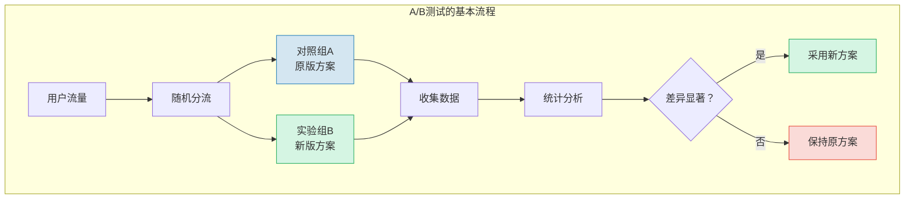
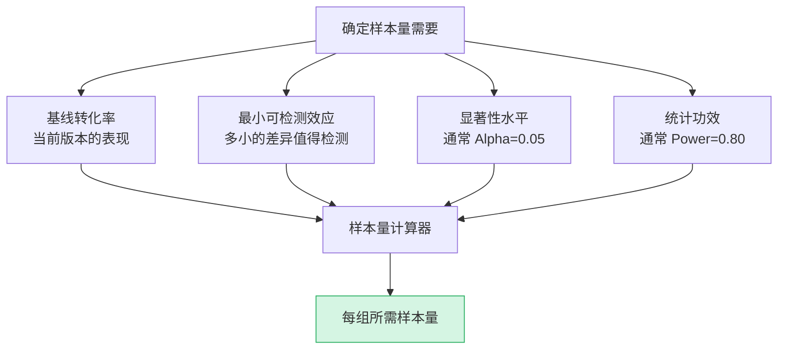
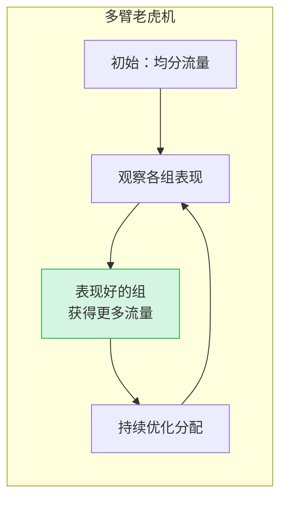

# A/B测试与实验设计

> [!abstract] 核心问题
> 如何科学地验证"哪个方案更好"？A/B测试是将科学实验方法应用于产品决策的实践。它通过随机化、对照和统计检验，帮助产品团队用数据（而非直觉）来决定"改还是不改"。

---

## 一、A/B测试的科学原理

### 1.1 什么是A/B测试？



### 1.2 四个核心要素

| 要素 | 含义 | 为什么重要 |
|------|------|-----------|
| 假设 | 明确的预期："改X会提升Y" | 没有假设的实验是随机试错 |
| 变量控制 | 只改变一个变量 | 否则无法归因 |
| 随机化 | 用户随机分配到各组 | 消除选择偏差 |
| 显著性 | 结果不是偶然的 | 避免假阳性 |

> [!important] 核心公式
> A/B测试 = 可控变量 + 随机分配 + 对照比较 + 统计检验

### 1.3 OEC（Overall Evaluation Criterion）

> [!note] OEC 是实验的"北极星"
> OEC（总体评价标准）是衡量实验成功与否的核心指标。一个好的 OEC 应该是：
> 1. **可衡量**：能被准确追踪
> 2. **与长期目标一致**：短期指标提升不代表长期价值
> 3. **敏感**：能反映实验变化

**常见 OEC 示例**：

| 产品类型 | 好的 OEC | 不好的 OEC |
|---------|---------|-----------|
| 电商 | 人均 GMV | 点击率 |
| 内容 | 用户留存（7天） | 页面浏览量 |
| SaaS | 付费转化率 | 注册量 |
| 社交 | 活跃天数 | DAU |
| AI产品 | 任务完成率 | 使用次数 |

---

## 二、A/B测试的实验设计

### 2.1 样本量计算



**样本量速查表**（基线转化率 10%，Alpha=0.05，Power=0.80）：

| 最小可检测效应 | 每组所需样本量 | 总样本量 |
|-------------|-------------|---------|
| 1%（10% -> 11%） | 14,000 | 28,000 |
| 2%（10% -> 12%） | 3,600 | 7,200 |
| 5%（10% -> 15%） | 600 | 1,200 |
| 10%（10% -> 20%） | 160 | 320 |

> [!warning] 样本量不足是最常见的陷阱
> 如果你的产品每天只有 1000 个用户，你却想检测 1% 的差异，你需要 28 天才能收集足够的样本。在样本量不足时强行下结论，结论几乎一定是错的。

### 2.2 实验周期

| 考虑因素 | 建议 |
|---------|------|
| 最小周期 | 至少 1 个完整周期（如 1 周，覆盖工作日和周末） |
| 新奇效应 | 新方案的初期优势可能是暂时的，需要观察衰减 |
| 学习效应 | 用户需要时间适应新方案，前期数据可能不准确 |
| 外部事件 | 节假日、促销、竞品动作等可能影响数据 |

> [!tip] 实验周期黄金法则
> 至少运行 **1-2 个完整周期**（通常 1-2周），且**不能在达到显著性后立即停止**。

### 2.3 随机化单元

| 随机化单元 | 适用场景 | 注意事项 |
|-----------|---------|---------|
| 用户 | 大多数场景 | 最常用，确保同一用户看到一致体验 |
| 会话 | 短期实验 | 同一用户可能在不同组，体验不一致 |
| 页面 | 页面级改动 | 用户可能在同一产品中看到不同版本 |
| 设备 | 跨设备一致性问题 | 注意用户可能使用多设备 |
| 地域/集群 | 网络效应明显时 | 避免用户间互相影响 |

---

## 三、A/B测试的常见陷阱

### 3.1 陷阱一：过早停止


> [!danger] 过早停止（Peeking）
> 每次检查实验数据，都是一次"查看统计显著性"的机会。检查的次数越多，遇到假阳性的概率越高。如果你每天都检查，假阳性率可以从 5% 飙升到 30%+。

**解决方案**：
- 实验前确定样本量和运行时间，不中途停止
- 使用序贯检验（Sequential Testing）方法
- 如果必须早期停止，使用更严格的显著性阈值

### 3.2 陷阱二：多重比较

**问题**：如果你同时观察 20 个指标，即使实际上没有任何效果，你也有约 64% 的概率在至少一个指标上看到"显著"结果。

```
P(至少一个假阳性) = 1 - (1 - 0.05)^20 = 0.64
```

**解决方案**：
- **预定义 OEC**：实验前确定 1-2 个核心指标
- **Bonferroni 校正**：将显著性阈值除以比较次数
- **分层分析**：核心指标用严格阈值，探索性指标仅供参考

### 3.3 陷阱三：新奇效应与学习效应

| 效应 | 表现 | 对策 |
|------|------|------|
| 新奇效应 | 新方案初期效果好，因为用户觉得新鲜 | 观察长期趋势，怀疑初期的优势 |
| 学习效应 | 新方案初期效果差，因为用户不习惯 | 给用户适应时间，观察后期趋势 |
| 厌恶效应 | 用户不喜欢任何改变，初期效果差 | 区分"不适应"和"真的不好" |

> [!tip] 识别新奇效应
> 绘制实验组与对照组的**日度趋势图**。如果实验组的优势在随时间递减，那很可能是新奇效应。

### 3.4 陷阱四：网络效应

当用户的行为会互相影响时，A/B测试的假设被打破。

**示例**：
- 社交产品的"冷启动"：如果实验组用户的朋友都在对照组，实验组体验更差
- 双边市场：如果实验组给卖家更低的费率，卖家会吸引更多买家，影响对照组
- 协作工具：如果实验组用户有更好的协作功能，但协作者在对照组，功能无法使用

**解决方案**：
- 使用集群随机化（按公司/团队/地域分组）
- 使用网络效应模型进行分析
- 对于强网络效应产品，谨慎使用传统A/B测试

### 3.5 陷阱五：混淆变量

| 混淆来源 | 示例 | 对策 |
|---------|------|------|
| 时间 | 实验组在周末，对照组在工作日 | 同时运行，覆盖完整周期 |
| 渠道 | 实验组来自付费渠道，对照组来自自然流量 | 在每个渠道内随机分配 |
| 设备 | 实验组在iOS，对照组在Android | 在每个平台内随机分配 |
| 新老用户 | 实验组新用户多，对照组老用户多 | 按用户属性分层随机化 |

---

## 四、A/B测试在AI产品中的特殊性

### 4.1 AI产品的独特挑战

```mermaid
graph TB
    subgraph "AI产品A/B测试的独特挑战"
        A[模型版本对比] --> B[模型输出非确定性<br/>同一输入可能不同输出]
        C[Prompt A/B] --> D[效果难以量化<br/>"好"是主观的]
        E[推荐策略] --> F[反馈循环<br/>用户行为改变推荐]
        G[生成式AI] --> H[质量评估<br/>需要人工评判]
    end

    style A fill:#D4E6F1,stroke:#2980B9
    style C fill:#D5F5E3,stroke:#27AE60
    style E fill:#FCF3CF,stroke:#F1C40F
    style G fill:#FADBD8,stroke:#E74C3C
```

### 4.2 AI产品A/B测试的特殊考量

| 考量 | 传统产品 | AI产品 |
|------|---------|--------|
| 输出确定性 | 确定 | 不确定（概率性） |
| 评估标准 | 客观（点击率、转化率） | 部分主观（质量、准确性） |
| 反馈循环 | 弱 | 强（用户行为影响模型） |
| 实验周期 | 1-2周 | 可能需要更长（训练和适应） |
| 评估方法 | 纯定量 | 定量+定性（人工评估） |

### 4.3 AI产品A/B测试的最佳实践

1. **结合人工评估**：对于质量维度，使用人工评估作为补充
2. **考虑延迟指标**：AI产品的价值可能需要更长时间才能体现
3. **注意模型漂移**：模型在实验期间可能自身也在变化
4. **多维度评估**：不只是"好不好"，还要看"安全性"、"公平性"等
5. **使用多臂老虎机**：在需要快速探索多个模型版本时优先考虑

---

## 五、高级实验方法

### 5.1 多臂老虎机（Multi-Armed Bandit）

> [!note] 多臂老虎机 vs A/B测试
> A/B测试：固定分配流量，等实验结束再决策
> 多臂老虎机：动态调整流量分配，表现好的组获得更多流量



**适用场景**：
- 需要快速找到最优方案的探索性实验
- 机会成本高（差的方案导致的损失大）
- 需要持续优化的场景（如推荐算法调参）

### 5.2 分层实验

在大型产品中，同时运行多个实验，需要确保实验之间不互相干扰。

**分层实验的关键**：
- 同一层的实验必须互斥
- 不同层的实验可以正交
- 需要强大的实验平台和基础设施

---

## 六、A/B测试的实践案例

### 6.1 案例：电商按钮颜色测试

> [!example] 一个经典的A/B测试教训
> 某电商平台测试了"加入购物车"按钮的颜色（绿色 vs 红色），发现红色按钮的点击率高了 5%。他们兴奋地宣布"红色按钮效果更好"，并全量上线。
> 
> 但两周后，他们发现虽然点击率提升了，但**最终购买转化率没有变化**。用户只是被红色吸引了注意力，但并没有更想购买。
> 
> **教训**：OEC（核心指标）的选择至关重要。如果只看点击率，你会做出错误的决策。应该看**最终转化率**或**用户终身价值**。

### 6.2 案例：搜索结果的延迟加载

某搜索引擎测试了"无限滚动"（替代传统分页）：
- **实验假设**：无限滚动会让用户看到更多结果，从而提升广告点击
- **实验设计**：5% 流量进入实验组，运行 2 周
- **结果**：广告点击提升了 3%，但用户满意度下降了 8%
- **分析**：用户看到了更多结果，但感到"迷失"在无穷的信息中
- **决策**：采用了折中方案——"加载更多"按钮，既保留分页的掌控感，又减少加载等待

### 6.3 案例：AI 产品中的 Prompt A/B 测试

某 AI 写作助手测试了两个不同的系统 Prompt：

| 维度 | Prompt A（原版） | Prompt B（新版） |
|------|-----------------|-----------------|
| 风格 | 专业严谨 | 友好亲切 |
| 核心指标 | 采纳率 45% | 采纳率 52% |
| 辅助指标 | 满意度 3.8/5 | 满意度 4.2/5 |
| 副作用 | - | 回复长度增加 20% |

**决策过程**：
1. 采纳率提升 7%（显著）
2. 满意度提升 0.4（显著）
3. 但回复长度增加，可能影响用户浏览效率
4. 进一步分析：发现新用户群体满意度提升最大（+0.8），老用户变化不大
5. **决策**：对新用户使用 Prompt B，老用户保持 Prompt A，同时观察长期留存

> [!tip] AI 产品 A/B 测试经验
> 1. AI 产品的"好"是主观的，需要结合人工评估
> 2. 不同用户群体对 AI 风格的偏好差异很大
> 3. 短期指标（采纳率）和长期指标（留存）需要平衡
> 4. 模型输出的不确定性需要更大的样本量

---

## 七、与其他知识库的关联

- [[05-产品与开发/用户研究与需求洞察/03_问卷设计与定量研究]]：问卷和A/B测试都是定量验证工具
- [[05-产品与开发/用户研究与需求洞察/04_可用性测试]]：A/B测试可以验证可用性测试发现的解决方案
- [[05-产品与开发/用户研究与需求洞察/08_AI时代的用户研究新范式]]：AI驱动的自动化实验
- [[05-产品与开发/用户研究与需求洞察/01_用户研究的本质]]：A/B测试如何实践"行为>态度"原则
- [[05-产品与开发/用户研究与需求洞察/00_MOC_用户研究与需求洞察中枢]]：返回知识库中枢

---

> [!summary] 本章核心
> 1. A/B测试四要素：假设、变量控制、随机化、统计显著性
> 2. 样本量计算：基线转化率、最小可检测效应、显著性水平、统计功效
> 3. 五大陷阱：过早停止、多重比较、新奇效应、网络效应、混淆变量
> 4. AI产品特殊性：非确定性输出、主观评估、反馈循环
> 5. 多臂老虎机：动态流量分配，适合快速探索

---

*上一篇：[[05-产品与开发/用户研究与需求洞察/06_用户旅程地图与体验设计]] | 下一篇：[[05-产品与开发/用户研究与需求洞察/08_AI时代的用户研究新范式]]*