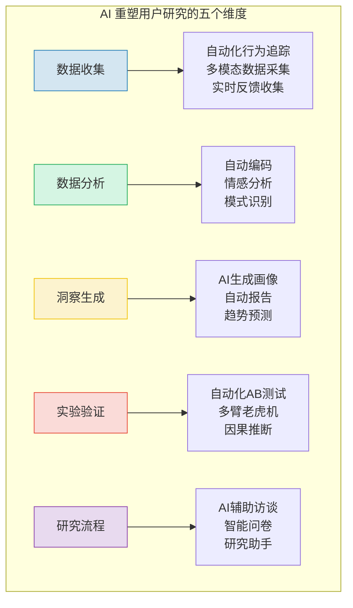
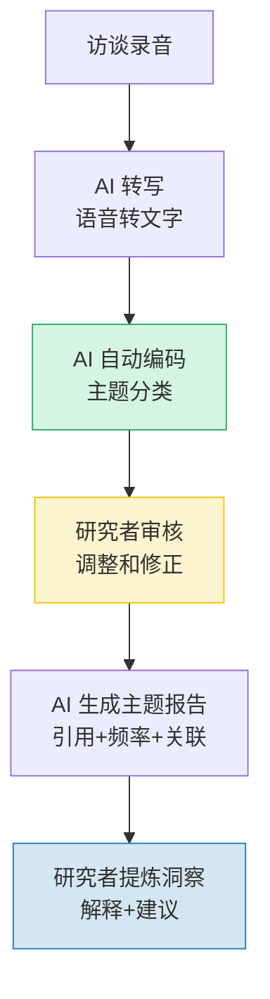
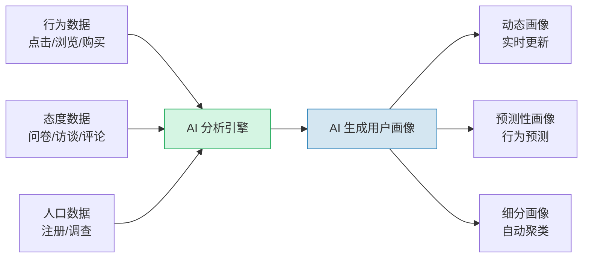
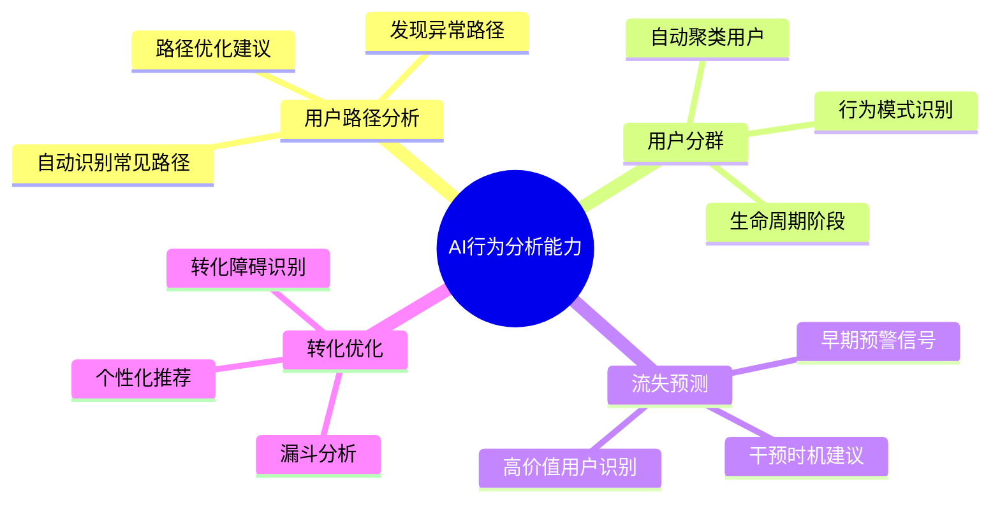
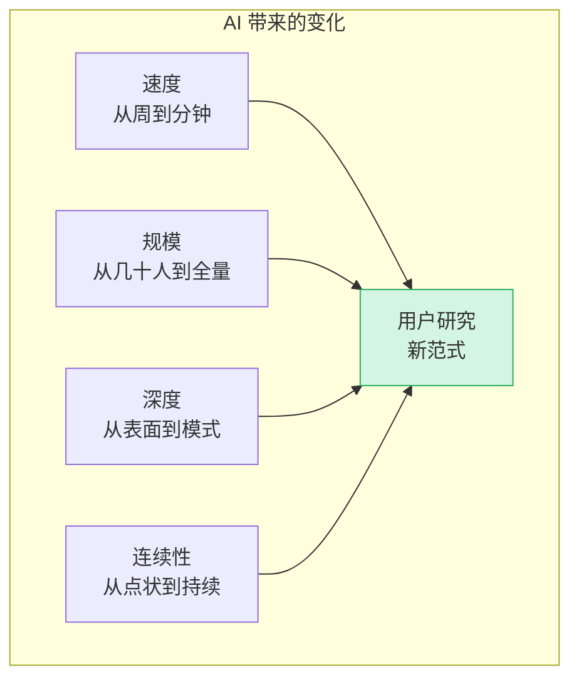
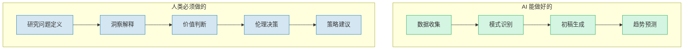

# AI时代的用户研究新范式

> [!abstract] 核心问题
> AI 如何改变用户研究的方法和效率？在大模型时代，用户研究正在经历一场深刻的变革。AI 不仅能加速传统方法的执行，更在创造全新的研究范式。但变化之中，用户研究的核心价值——同理心、情境理解、价值判断——依然不变。

---

## 一、AI 对用户研究的重塑

### 1.1 变革全景

### 1.2 效率革命

| 传统方法 | AI 增强方法 | 效率提升 |
|---------|-----------|---------|
| 手动编码访谈记录（5小时） | AI 自动主题编码（5分钟） | 60x |
| 人工情感分析（1小时/人） | AI 情感分析（实时） | 100x+ |
| 手动绘制用户画像（1天） | AI 生成画像（10分钟） | 50x |
| 人工设计问卷（半天） | AI 辅助设计+预测试（30分钟） | 8x |
| 人工分析开放式问题（1天） | AI 自动分类+主题提取（10分钟） | 50x |

> [!warning] 效率提升不等于质量提升
> AI 可以加速执行，但**研究问题是否正确、解释是否合理、洞察是否有价值**，仍然需要研究者的判断力。

---

## 二、AI 辅助定性研究

### 2.1 AI 自动编码

传统用户研究中最耗时的环节之一，就是对访谈记录进行编码（将原始文本归类为主题）。

**AI 编码的实践建议**：

| 步骤 | AI 的作用 | 研究者的作用 |
|------|----------|------------|
| 转写 | 自动语音转文字 | 检查转写准确性 |
| 初编 | 自动识别主题和模式 | 提供初始编码框架 |
| 聚类 | 自动聚类相似主题 | 审核聚类合理性，调整分组 |
| 报告 | 生成主题摘要和引用 | 审核引用准确性，提炼洞察 |

> [!tip] AI 编码的最佳实践
> 1. **先让 AI 跑一遍**：快速获得初步编码，形成全局视角
> 2. **研究者再审核**：AI 可能漏掉重要的细微差别，需要人工补充
> 3. **迭代优化**：根据研究者的修正，优化 AI 的编码指令
> 4. **保留原话**：AI 提炼的摘要不能替代用户原话，两者结合使用

### 2.2 AI 情感分析

AI 可以自动分析用户表达中的情感，发现人工可能忽略的情感模式。

**情感分析的应用**：

- **大规模文本分析**：分析数千条用户评论中的情感分布
- **实时情感监测**：在产品使用过程中实时检测用户情绪
- **情感变化追踪**：分析用户情感在时间线上的变化趋势
- **情感-行为关联**：关联情感数据与行为数据，发现因果关系

### 2.3 AI 辅助访谈

> [!note] AI 作为访谈助手
> AI 目前还不能完全替代人类访谈者，但可以作为强大的辅助工具：
> - **实时提示**：根据用户回答，实时建议追问方向
> - **自动记录**：实时转写和标注关键信息
> - **偏差检测**：检测访谈者是否使用了引导性问题
> - **事后分析**：快速生成访谈摘要和关键洞察

---

## 三、AI 生成用户画像

### 3.1 从数据到画像

### 3.2 AI 画像 vs 传统画像

| 维度 | 传统画像 | AI 生成的画像 |
|------|---------|-------------|
| 数据来源 | 访谈为主，样本有限 | 全量行为数据 + 定性数据 |
| 更新频率 | 手动更新，通常半年一次 | 实时更新，动态变化 |
| 粒度 | 几个代表性画像 | 数十个细分画像 |
| 验证 | 基于研究者判断 | 基于数据模式验证 |
| 局限性 | 可能过度简化 | 可能过度拟合 |

> [!important] 画像的核心价值不变
> 不管是传统画像还是 AI 画像，它们的核心价值都是**建立共情**和**指导决策**。如果画像不能帮助团队理解用户并做出更好的决策，再精确的画像也没有价值。

---

## 四、AI 驱动的实验与验证

### 4.1 自动化 A/B 测试

详见 [[05-产品与开发/用户研究与需求洞察/07_A_B测试与实验设计]]，AI 在其中的增强作用：

- **自动样本量计算**：根据实时数据动态调整
- **自动异常检测**：识别实验中的异常和作弊行为
- **自动停止规则**：智能判断何时可以结束实验
- **因果推断**：超越相关性，探索因果关系
- **多臂老虎机**：自动平衡探索与利用

### 4.2 AI 驱动的用户行为分析

---

## 五、AI 的新能力：从"分析过去"到"预测未来"

### 5.1 模拟用户行为

AI 的一个新能力是**模拟用户在不同场景下的反应**。通过构建用户行为模型，研究者可以在方案设计阶段就获得"虚拟用户"的反馈。

> [!note] AI 模拟用户
> 使用 LLM 构建模拟用户，可以在产品设计阶段就进行大规模的概念测试。例如：
> - 模拟 1000 个不同类型的用户对新功能的反应
> - 模拟用户在不同情境下的决策过程
> - 模拟用户对新界面设计的理解程度

**AI 模拟的局限**：
- 模拟用户基于训练数据，可能延续偏见
- 模拟无法替代真实用户的创造性和意外行为
- 模拟结果需要真实用户验证

### 5.2 预测性洞察

| 能力 | 传统方法 | AI 方法 |
|------|---------|---------|
| 需求预测 | 基于历史趋势推断 | 基于多维度信号预测 |
| 用户流失 | 人工规则判断 | 机器学习模型预测 |
| 功能优先级 | 投票和直觉 | 基于影响预测排序 |
| 市场趋势 | 二手报告 | 实时信号监测 |

---

## 六、AI 时代用户研究的"不变"与"变"

### 6.1 不变的

> [!important] 用户研究永恒不变的核心
> 1. **同理心**：真正理解用户的感受和需求，AI 无法替代
> 2. **情境理解**：理解用户所处的真实环境，AI 只能近似
> 3. **价值判断**：决定什么是对用户"好"的，这是人类的责任
> 4. **伦理意识**：保护用户隐私，确保研究伦理，AI 需要人类监督
> 5. **洞察提炼**：从数据中提炼有意义的洞察，需要的不仅是算力，更是智慧

### 6.2 变化的

### 6.3 研究者角色的转变

| 传统角色 | AI 时代角色 |
|---------|-----------|
| 数据收集者 | 数据分析师（AI 做收集） |
| 编码执行者 | 编码审核者（AI 做初编） |
| 报告撰写者 | 洞察提炼者（AI 做初稿） |
| 方法执行者 | 方法设计者（AI 做执行） |
| 单一方法专家 | 多方法整合者 |

> [!tip] 给研究者的建议
> 1. **学会使用 AI 工具**：把 AI 当作你的研究助理
> 2. **聚焦高价值工作**：把精力放在问题定义、洞察提炼和策略建议上
> 3. **保持批判性思维**：AI 的输出需要人类审核和判断
> 4. **拥抱变化**：AI 时代的研究者需要不断学习新工具和新方法

---

## 七、实践指南：如何开始 AI 辅助用户研究

### 7.1 入门工具推荐

| 环节 | 工具类型 | 具体应用 |
|------|---------|---------|
| 转写 | 语音转文字 | 访谈录音自动转写 |
| 编码 | LLM 辅助 | 用 prompt 让 AI 做主题编码 |
| 情感分析 | NLP 工具 | 批量分析用户评论情感 |
| 问卷 | AI 问卷设计 | 辅助设计、预测试、反偏差 |
| 画像 | 聚类 + LLM | 从数据自动生成画像描述 |
| 报告 | LLM 辅助 | 自动生成初稿，人工精炼 |

### 7.2 入门路径

1. **第一步**：先用 AI 做一件你已经在做的事（如转写访谈），体验效率提升
2. **第二步**：尝试 AI 编码，对比人工编码的结果，建立信任
3. **第三步**：将 AI 融入日常工作流，形成"AI 初稿 + 人工精炼"的模式
4. **第四步**：探索 AI 的新能力（如用户模拟），拓展研究边界

---

## 八、AI 用户研究的伦理与边界

### 8.1 隐私与数据安全

> [!warning] AI 用户研究的伦理红线
> AI 工具让数据收集和分析变得前所未有的容易，但也带来了前所未有的隐私风险：
> 1. **知情同意**：用户是否知道他们的数据被 AI 分析？
> 2. **数据匿名化**：AI 的数据聚合能力可能让"匿名"数据变得可识别
> 3. **数据使用边界**：研究数据是否会被用于训练 AI 模型？
> 4. **用户控制权**：用户是否有权选择不参与 AI 分析？

**实践建议**：
- 明确告知用户数据将如何使用
- 建立数据最小化原则（只收集必要的数据）
- 定期审计 AI 工具的数据处理流程
- 为用户提供清晰的退出机制

### 8.2 AI 偏见的挑战

AI 模型本身可能带有偏见，这些偏见如果不加控制，会"污染"研究结果。

| 偏见类型 | 表现 | 对用户研究的影响 |
|---------|------|----------------|
| 训练数据偏见 | AI 的训练数据偏向某些群体 | 可能遗漏边缘用户的需求 |
| 算法偏见 | AI 的推荐和分析偏向主流模式 | 可能忽略小众但有价值的洞察 |
| 语言偏见 | AI 对某些语言/方言的理解不足 | 可能误解非主流用户的表达 |
| 确认偏见放大 | AI 倾向于强化已有的模式 | 可能让研究者更难发现反例 |

**应对策略**：
- 不要完全依赖 AI 的分析结果
- 主动寻找"反例"和"异常值"
- 用多元化的数据源交叉验证
- 保持人工审核和判断

### 8.3 人类判断力的不可替代性

> [!important] 核心原则
> AI 让用户研究更快、更广、更高效，但**研究的质量取决于研究者的判断力**。AI 是工具，不是替代品。最好的模式是"AI 执行 + 人类判断"。

---

## 九、与其他知识库的关联

- [[05-产品与开发/用户研究与需求洞察/01_用户研究的本质]]：AI 时代，三大原则（观察>询问、行为>态度、情境>抽象）依然有效
- [[05-产品与开发/用户研究与需求洞察/02_用户访谈：深度理解用户的方法]]：AI 辅助访谈和分析
- [[05-产品与开发/用户研究与需求洞察/07_A_B测试与实验设计]]：AI 驱动的自动化实验
- [[05-产品与开发/用户研究与需求洞察/03_问卷设计与定量研究]]：AI 辅助问卷设计和分析
- [[05-产品与开发/AI产品经理方法论/00_MOC_AI产品经理方法论中枢]]：AI PM 如何利用 AI 工具做用户研究
- [[05-产品与开发/Vibe Coder/Vibe Coding 软件瘦身指南]]：AI 辅助研究 + AI 辅助开发的协同
- [[05-产品与开发/用户研究与需求洞察/00_MOC_用户研究与需求洞察中枢]]：返回知识库中枢

---

> [!summary] 本章核心
> 1. AI 正在重塑用户研究的五个维度：收集、分析、洞察、实验、流程
> 2. AI 辅助编码和情感分析可以大幅提升定性研究效率
> 3. AI 生成画像改变了用户画像的创建和维护方式
> 4. 不变的：同理心、情境理解、价值判断、伦理意识
> 5. 研究者的角色从"执行者"转变为"审核者、设计者、洞察提炼者"

---

*上一篇：[[05-产品与开发/用户研究与需求洞察/07_A_B测试与实验设计]] | 返回中枢：[[05-产品与开发/用户研究与需求洞察/00_MOC_用户研究与需求洞察中枢]]*