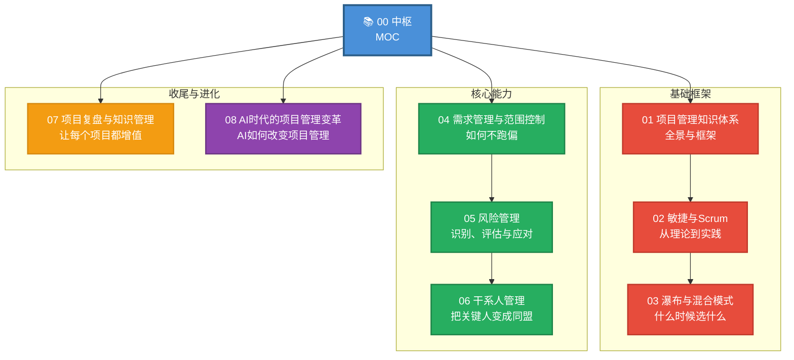
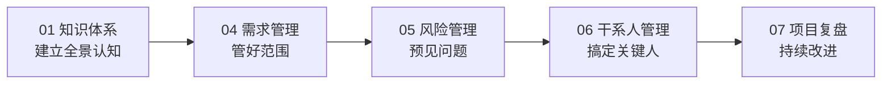
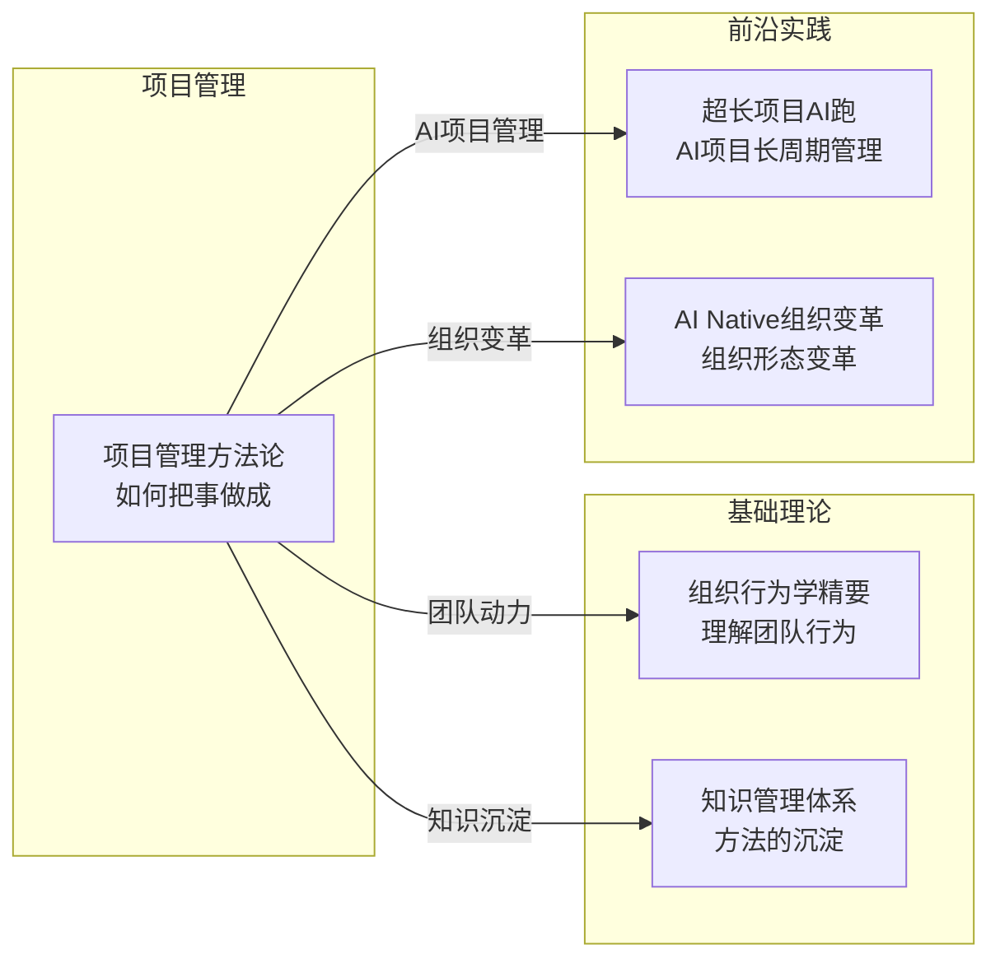

# 项目管理方法论 — 知识库中枢

> [!abstract] 这个知识库解决什么问题？
> 项目管理是"在规定时间内，用有限的资源，完成独特的交付物"的艺术。本知识库覆盖从传统PMBOK到敏捷Scrum、从需求管理到风险控制、从干系人管理到项目复盘的完整知识体系。无论你是项目经理、产品经理还是团队负责人，这些方法论都能帮你**把事做成**。

---

## 全景图：项目管理的核心领域

---

## 文档索引表

| 编号 | 文档标题 | 核心内容 | 领域 | 优先级 |
|------|----------|----------|------|--------|
| 00 | [[05-产品与开发/项目管理方法论/00_MOC_项目管理方法论中枢]] | 知识库中枢，全景图与导航 | -- | -- |
| 01 | [[05-产品与开发/项目管理方法论/01_项目管理知识体系：全景与框架]] | PMBOK五大过程组、十大知识领域 | 基础框架 | P0 |
| 02 | [[05-产品与开发/项目管理方法论/02_敏捷与Scrum：从理论到实践]] | Scrum框架、站会、Sprint、角色定义 | 基础框架 | P0 |
| 03 | [[05-产品与开发/项目管理方法论/03_瀑布与混合模式：什么时候选什么]] | 传统项目管理、敏捷、混合模式的选择 | 基础框架 | P1 |
| 04 | [[05-产品与开发/项目管理方法论/04_需求管理与范围控制：如何不跑偏]] | 需求收集、范围管理、变更控制 | 核心能力 | P0 |
| 05 | [[05-产品与开发/项目管理方法论/05_风险管理：识别、评估与应对]] | 风险登记册、应对策略 | 核心能力 | P0 |
| 06 | [[05-产品与开发/项目管理方法论/06_干系人管理：把关键人变成同盟]] | 干系人识别、影响力策略 | 核心能力 | P0 |
| 07 | [[05-产品与开发/项目管理方法论/07_项目复盘与知识管理：如何让每个项目都增值]] | 复盘方法论、知识沉淀 | 收尾与进化 | P1 |
| 08 | [[05-产品与开发/项目管理方法论/08_AI时代的项目管理变革]] | AI对项目管理的系统性影响 | 前沿议题 | P1 |

---

## 两条阅读路径

### 路径一：新手项目经理（从零到一）

> [!tip] 适合：刚做项目经理，需要快速建立完整知识框架

1. **先读 [[05-产品与开发/项目管理方法论/01_项目管理知识体系：全景与框架]]**：建立PMBOK的基本认知
2. **再读 [[05-产品与开发/项目管理方法论/04_需求管理与范围控制：如何不跑偏]]**：需求是项目管理的起点
3. **接着读 [[05-产品与开发/项目管理方法论/05_风险管理：识别、评估与应对]]**：学会预见问题
4. **接着读 [[05-产品与开发/项目管理方法论/06_干系人管理：把关键人变成同盟]]**：人是项目成功的关键
5. **最后读 [[05-产品与开发/项目管理方法论/07_项目复盘与知识管理：如何让每个项目都增值]]**：学会从经验中学习

### 路径二：敏转型者

| 你遇到的问题 | 去看这篇 | 重点章节 |
|--------------|----------|----------|
| 项目范围不断膨胀 | [[05-产品与开发/项目管理方法论/04_需求管理与范围控制：如何不跑偏]] | 变更控制、范围基线 |
| 团队不知道应该用敏捷还是瀑布 | [[05-产品与开发/项目管理方法论/03_瀑布与混合模式：什么时候选什么]] | 方法论选择矩阵 |
| 项目风险总是被低估 | [[05-产品与开发/项目管理方法论/05_风险管理：识别、评估与应对]] | 风险登记册、应对策略 |
| 关键干系人不支持项目 | [[05-产品与开发/项目管理方法论/06_干系人管理：把关键人变成同盟]] | 干系人分析、影响力策略 |
| 项目做完没有沉淀 | [[05-产品与开发/项目管理方法论/07_项目复盘与知识管理：如何让每个项目都增值]] | 复盘方法论 |
| AI工具如何融入项目管理 | [[05-产品与开发/项目管理方法论/08_AI时代的项目管理变革]] | AI对PM的赋能 |
| 团队动力不足、冲突频发 | [[03-HR人事/组织行为学精要/03_群体行为与团队动力]] | 团队发展阶段 |
| 团队内部谈判困难 | [[03-HR人事/组织行为学精要/07_冲突与谈判：建设性冲突管理]] | 冲突管理策略 |

---

## 核心概念速查

| 概念 | 定义 | 出处 |
|------|------|------|
| **五大过程组** | 启动→规划→执行→监控→收尾 | [[05-产品与开发/项目管理方法论/01_项目管理知识体系：全景与框架]] |
| **Scrum** | 迭代式敏捷开发框架，包含Sprint、站会、评审等事件 | [[05-产品与开发/项目管理方法论/02_敏捷与Scrum：从理论到实践]] |
| **范围蔓延** | 未经正式变更控制的项目范围持续膨胀 | [[05-产品与开发/项目管理方法论/04_需求管理与范围控制：如何不跑偏]] |
| **风险登记册** | 记录已识别风险及其应对策略的结构化文档 | [[05-产品与开发/项目管理方法论/05_风险管理：识别、评估与应对]] |
| **干系人分析** | 识别关键干系人并评估其影响力和利益的过程 | [[05-产品与开发/项目管理方法论/06_干系人管理：把关键人变成同盟]] |
| **复盘** | 项目结束后系统性地回顾成功和失败，提炼经验教训 | [[05-产品与开发/项目管理方法论/07_项目复盘与知识管理：如何让每个项目都增值]] |

---

## 与其他知识库的关联

- **[[03-HR人事/组织行为学精要/00_MOC_组织行为学精要中枢]]**：项目团队管理中的团队动力、冲突解决、领导力等，直接应用组织行为学理论
- **[[07-学习成长/知识管理体系/00_MOC_知识管理体系中枢]]**：项目复盘和知识沉淀的方法论基础
- **[[01-AI技术/超长项目AI跑/00_MOC_超长项目AI跑中枢]]**：AI驱动的超长项目管理的系统方法论，与本知识库的08文档形成互补

---

## 更新日志

| 日期 | 变更内容 |
|------|----------|
| 2026-07-31 | 创建中枢文档，定义知识库框架和全部文档 |

---

> [!quote] 最后一句
> 项目管理不是在项目开始时预测一切，而是在不确定性中持续做出正确决策。**好的项目管理不是"做到完美"，而是"在有限条件下做到最好"。**