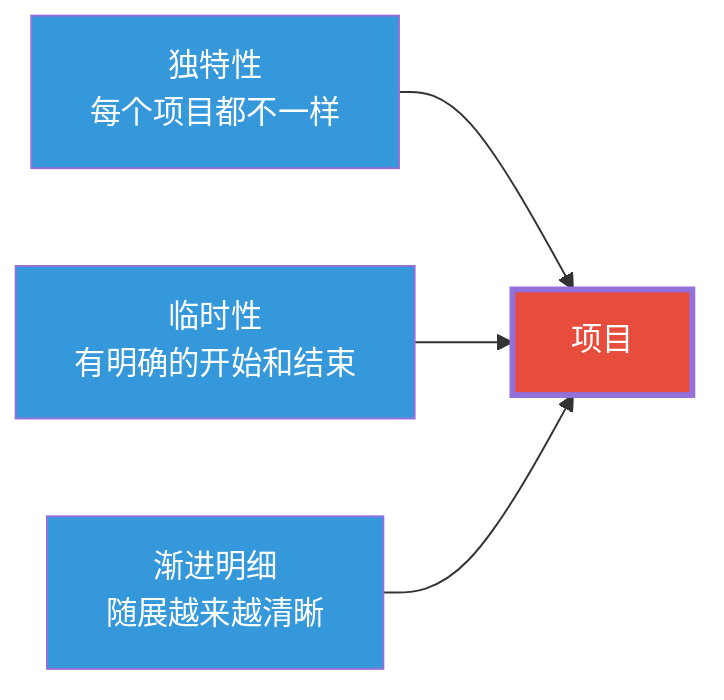
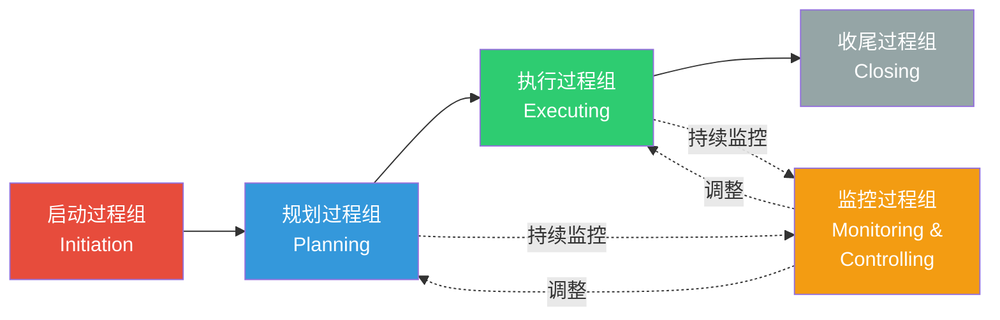
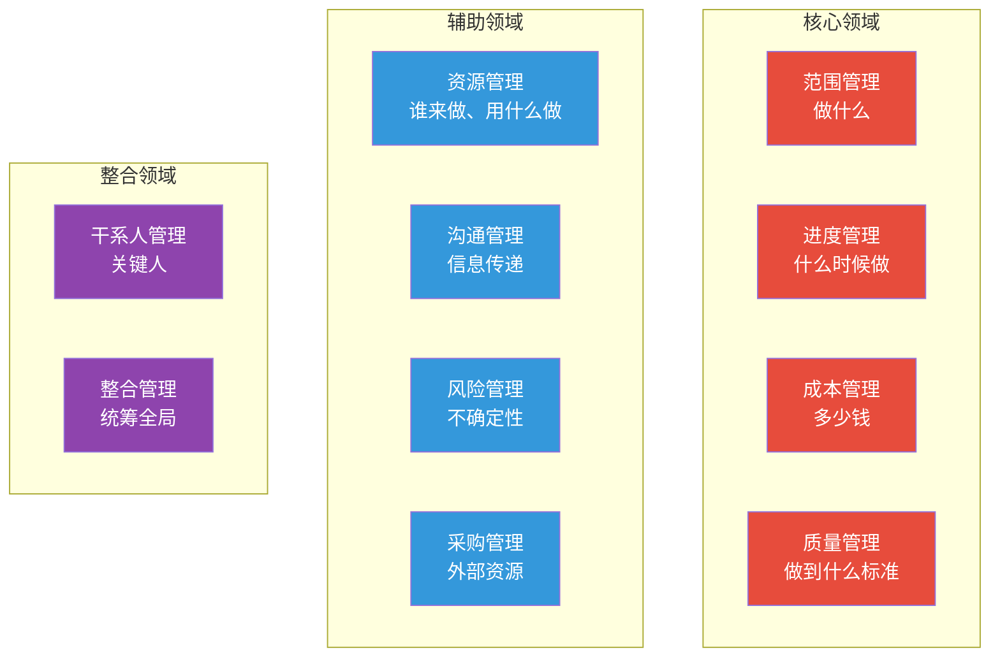

# 项目管理知识体系：全景与框架

> [!abstract] 核心论点
> 项目管理不是"写文档"和"开会"，而是"在约束条件下交付价值"的系统方法论。PMBOK（Project Management Body of Knowledge）提供了行业通用的语言和框架，但真正高效的项目管理不是照搬PMBOK，而是**理解其核心逻辑后，根据项目特征灵活裁剪**。

---

## 一、什么是项目？什么是项目管理？

### 项目的三个核心特征

> [!important] 项目 vs 运营
> - **项目**：独特的、临时性的工作——**有始有终**
> - **运营**：重复的、持续性的工作——**周而复始**
>
> 一个项目结束后，交付物可能进入运营阶段。例如：开发一个App是项目，维护App的日常工作是运营。

---

## 二、PMBOK的五大过程组

PMBOK将项目管理活动分为五个过程组，它们不是阶段，而是**贯穿项目始终的活动**：

### 各过程组详解

| 过程组 | 核心问题 | 关键活动 | 典型输出 |
|--------|---------|---------|----------|
| **启动** | "这个项目值得做吗？" | 制定项目章程、识别干系人 | 项目章程、干系人登记册 |
| **规划** | "怎么做？谁来做？多少钱？" | 制定范围、进度、成本、风险计划 | 项目管理计划、风险登记册 |
| **执行** | "把计划变成现实" | 指导管理项目执行、团队建设、沟通 | 可交付成果、绩效数据 |
| **监控** | "我们偏离目标了吗？" | 整体变更控制、范围/进度/成本监控 | 变更请求、绩效报告 |
| **收尾** | "项目做完了吗？" | 验收交付物、总结教训、释放资源 | 最终验收、经验教训文档 |

---

## 三、PMBOK的十大知识领域

PMBOK将项目管理知识分为十大领域，每个领域对应一套管理活动：

> [!tip] 知识领域的"黄金三角"
> 项目管理中最著名的约束三角：**范围 × 进度 × 成本 = 质量**
>
> 改变任何一个维度，都会影响其他维度。例如：
> - 缩短时间（进度）→ 要么缩减范围，要么增加成本
> - 降低成本 → 要么缩减范围，要么延长进度
> - 增加范围 → 要么延长进度，要么增加成本
>
> **项目经理的核心工作之一就是管理这个三角的平衡。**

---

## 四、项目生命周期：从概念到交付

不同的项目有不同的生命周期模式，最常见的分类：

| 生命周期类型 | 特征 | 适用场景 | 优点 | 缺点 |
|-------------|------|---------|------|------|
| **预测型（瀑布）** | 需求明确，分阶段顺序执行 | 建筑、制造、合规项目 | 可预测性强 | 灵活性差 |
| **迭代型** | 反复循环，逐步完善 | 研发项目 | 可以逐步优化 | 范围容易膨胀 |
| **增量型** | 分批次交付功能 | 产品开发 | 早期即可获得价值 | 需要良好架构 |
| **敏捷型** | 短周期迭代，快速响应变化 | 软件开发、创新项目 | 适应性强 | 难以预测整体进度 |

关于不同生命周期的选择，详见 [[05-产品与开发/项目管理方法论/03_瀑布与混合模式：什么时候选什么]]。

---

## 五、PMBOK的核心价值：不只是"文档"

> [!warning] 对PMBOK的常见误解
> **误解1**："PMBOK就是写文档"——PMBOK的核心是"思考框架"而不是"文档模板"。文档只是思考过程的输出
> **误解2**："PMBOK太死板，不适合敏捷项目"——PMBOK并不排斥敏捷，它提供了"裁剪"的灵活性。事实上，PMBOK第7版已经大幅转向"原则导向"
> **误解3**："项目经理就是按PMBOK办事"——PMBOK是"知识体系"而不是"操作手册"，它告诉你"应该考虑什么"，而不是"必须怎么做"

### PMBOK的实用价值

| 价值 | 说明 |
|------|------|
| **通用语言** | 让不同组织的项目团队可以高效沟通 |
| **检查清单** | 作为项目管理活动的"提醒清单"，避免遗漏 |
| **问题诊断** | 当项目出问题时，用PMBOK框架回溯问题根源 |
| **裁剪起点** | 根据项目特征，从PMBOK中选择适用的实践 |

---

## 六、知识体系的大局观

> [!tip] PMBOK之外的三个关键能力
> 1. **政治敏锐性**：理解组织中的权力结构，知道谁在真正推动或阻碍项目
> 2. **谈判能力**：项目经理通常没有"命令"的权力，需要用影响力替代权力
> 3. **情境判断**：知道什么时候"走流程"，什么时候"灵活处理"
>
> 这些能力在PMBOK中很少被强调，但往往是项目经理成败的关键。详见 [[05-产品与开发/项目管理方法论/06_干系人管理：把关键人变成同盟]] 和 [[03-HR人事/组织行为学精要/06_权力与政治：组织中的影响力游戏]]。

---

## 本文档的关联知识

| 关联知识库 | 具体关联文档 | 关联内容 |
|------------|-------------|----------|
| 项目管理方法论 | [[05-产品与开发/项目管理方法论/02_敏捷与Scrum：从理论到实践]] | 敏捷是PMBOK的重要补充，两者互补 |
| 项目管理方法论 | [[05-产品与开发/项目管理方法论/03_瀑布与混合模式：什么时候选什么]] | 方法论选择是项目规划的核心决策 |
| 项目管理方法论 | [[05-产品与开发/项目管理方法论/04_需求管理与范围控制：如何不跑偏]] | 范围管理是PMBOK十大知识领域之一 |
| 组织行为学精要 | [[03-HR人事/组织行为学精要/03_群体行为与团队动力]] | 项目团队管理需要组织行为学基础 |
| 超长项目AI跑 | [[01-AI技术/超长项目AI跑/00_MOC_超长项目AI跑中枢]] | AI项目的长周期管理方法论 |